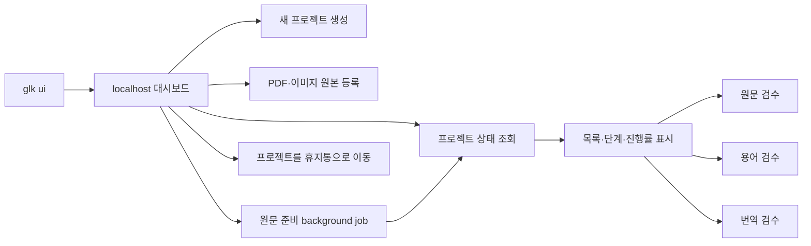

# 로컬 대시보드 설계와 브랜치 작업 이력

이 문서는 `feature/local-dashboard` 브랜치의 임시 설계 기준, 구현 상태와 작업 재개 방법을 함께 기록합니다. 다른 컴퓨터에서 이어서 개발할 때 이 문서를 먼저 확인하고, 브랜치를 `main`에 머지하기 직전에 삭제합니다.

**현재 범위**: 최종 번역 결과 다운로드 구현 — 다음 작업은 프로젝트 내보내기·가져오기 범위 결정

---

## 목표

터미널 명령을 모두 기억하지 않아도 전체 프로젝트와 현재 단계를 한 화면에서 확인하고, 준비된 원문·용어·번역 검수 화면을 바로 열 수 있게 합니다.



### 1단계에서 하는 일

- `glk ui`로 `127.0.0.1` 전용 서버를 실행하고 기본 브라우저를 엽니다.
- 모든 프로젝트의 이름, ID, 원문 종류, 진행 단계와 주의 상태를 표시합니다.
- 검색과 진행 중·완료·확인 필요 필터를 제공합니다.
- 최초 진입과 사용자의 `새로고침` 요청 때 프로젝트 상태를 조회합니다.
- 준비가 끝난 기존 `source`, `glossary`, `translation` 검수 화면으로 현재 탭에서 이동합니다. 검수 후 브라우저 뒤로가기로 대시보드에 돌아옵니다.
- 대시보드가 종료되면 대시보드에서 연 검수 서버도 함께 종료합니다.

### 1단계에서 하지 않는 일

- PDF·이미지 업로드
- 원문 추출, OCR, 번역 같은 장시간 작업 실행
- 검수 내용을 대시보드 카드에서 직접 수정
- 데스크톱 앱 패키징

프로젝트 카드의 상태 표시는 읽기 전용입니다. 프로젝트 생성, 최초 원본 등록과
휴지통 이동만 대시보드에서 workspace를 변경하며, 기존 검수 화면은 편집 기능을
그대로 제공합니다.

### 2.1단계에서 추가한 일

- 프로젝트 목록이 비어 있을 때 표시되는 `+` 버튼에서 `새 프로젝트` 모달을 엽니다.
- 프로젝트가 있으면 목록 마지막의 `새 프로젝트` 카드에서 같은 모달을 엽니다.
- 프로젝트 이름과 영문 소문자·숫자·밑줄로 된 프로젝트 ID를 입력받습니다.
- 기존 `create_project()`를 통해 CLI와 동일한 workspace 구조를 생성합니다.
- 생성 직후 검색·필터를 초기화하고 새 프로젝트 카드를 표시합니다.
- 같은 ID가 이미 있거나 입력이 유효하지 않으면 한글 오류를 표시합니다.
- 프로젝트 카드의 `×` 버튼에서 이름과 ID를 다시 확인한 뒤 프로젝트 폴더 전체를 운영체제 휴지통으로 이동합니다.
- 휴지통 이동 성공 후 페이지를 새로 불러와 카드와 요약을 함께 갱신합니다.

### 2.2단계에서 추가한 일

- 원본이 없는 프로젝트 카드에서 `PDF 또는 이미지 원본 등록` 모달을 엽니다.
- PDF 한 개 또는 PNG·JPG·JPEG·WebP 이미지 여러 장을 선택합니다.
- 등록 파일은 기존 CLI와 같은 application service를 통해 `01_input`에 복사하고 `project.json`을 갱신합니다.
- 이미지 파일은 자연순으로 정렬하며 한 번에 최대 200개, 전체 요청은 256 MiB로 제한합니다.
- 등록 단계에서는 추출·OCR·Gemini 호출을 실행하지 않습니다.
- 원문 추출·OCR 시작 전에는 기존 원본을 삭제하고 새 파일로 교체할 수 있습니다.
- 원문 처리가 시작되면 교체 버튼을 숨기고 서버 API에서도 교체를 거부합니다.
- 이미지 원본 교체 때 프로젝트 공통 `ocr_prompt.txt`는 유지합니다.
- 카드에 PDF 파일명 또는 첫 이미지 파일명과 전체 개수를 표시하고, 이미지가 여러 장이면 전체 파일 목록 모달을 제공합니다.

### 3.1단계에서 추가한 일

- 등록된 PDF 또는 이미지 원본의 준비 작업을 HTTP 요청 thread 밖에서 실행합니다.
- PDF 추출 또는 이미지 OCR 성공 후 검수 block 생성과 로컬 원문 QA까지 이어서 실행합니다.
- 동시에 하나의 원문 준비 작업만 허용해 중복 API 호출과 비용 증가를 막습니다.
- 실행 중에는 해당 프로젝트의 원본 교체, OCR 프롬프트 수정과 삭제를 차단합니다.
- 작업 상태, 모델, 진행 메시지와 실패 결과를 프로젝트 `.glk/state`에 보존합니다.
- 실패·일부 실패·대시보드 중단 뒤에는 같은 버튼으로 재시도하며 검증된 acquisition cache를 재사용합니다.
- provider 호출 중 안전한 중단 계약이 없으므로 실행 중 취소는 이번 범위에서 제공하지 않습니다.

---

## 사용자 실행 방법

저장소 최상위에서 가상환경을 활성화한 뒤 실행합니다.

```bash
glk ui
```

브라우저를 자동으로 열지 않거나 포트를 고정할 수 있습니다.

```bash
glk ui --no-open --port 8765
glk ui --workspace-root 다른/workspaces
```

`Ctrl+C`로 대시보드를 종료합니다.

---

## 코드 구성

| 파일 | 책임 |
|---|---|
| `src/glk/application/dashboard_service.py` | 프로젝트 목록과 상태를 UI용 read model로 조합 |
| `src/glk/application/ai_model_catalog.py` | 패키지 모델 목록 검증과 API용 document 제공 |
| `src/glk/application/ai_settings_service.py` | 저장소 공통 Gemini 키·모델의 안전한 조회와 `.env` 저장 |
| `src/glk/application/dashboard_job_service.py` | 원문 준비 pipeline과 background job 상태·중복 실행·영속화 |
| `src/glk/application/source_registration_service.py` | PDF·이미지 원본 검증, 정렬, 복사와 manifest 등록 |
| `src/glk/data/gemini_models.json` | 드롭다운 Gemini API 모델 ID, 설명과 공식 문서 확인일 |
| `src/glk/infrastructure/dashboard_server.py` | localhost HTTP API, 보안 검사, 검수 서버 수명주기 |
| `src/glk/web/dashboard.html` | 외부 의존성 없는 반응형 HTML/CSS/JavaScript 화면 |
| `src/glk/cli.py` | `glk ui` 인자와 서버 진입점 |
| `tests/test_ai_model_catalog.py` | 모델 ID 중복, 기본 모델과 공식 출처 검증 |
| `tests/test_dashboard_service.py` | 빈 workspace와 프로젝트 상태 view model 검증 |
| `tests/test_dashboard_job_service.py` | job 성공·경합·중단 복구와 원문 준비 단계 연결 검증 |
| `tests/test_ai_settings_service.py` | 키 비노출, `.env` 보존, 모델과 환경변수 우선순위 검증 |
| `tests/test_dashboard_server.py` | 페이지·API 보호와 검수 화면 실행 검증 |

대시보드는 workspace 파일을 직접 해석하거나 수정하지 않습니다. 프로젝트 조회·생성·선택 검증은 `project_service`를 거치고, 원본 등록은 `source_registration_service`, 삭제는 검증된 프로젝트 경로와 `send2trash`를 사용합니다. 검수 화면을 열 때도 기존 `create_*_review_server()`를 재사용합니다.

---

## API 계약

모든 API는 대시보드 HTML에 삽입된 임의 세션 token을 `X-GLK-Token` 헤더로 전달해야 합니다.

### `GET /api/dashboard`

```json
{
  "ok": true,
  "schema_version": 1,
  "workspace_root": "workspaces",
  "summary": {
    "projects": 2,
    "in_progress": 1,
    "completed": 1,
    "needs_attention": 0
  },
  "projects": [
    {
      "project_id": "primal",
      "name": "Primal Rulebook",
      "source_type": "pdf",
      "source_files": ["rulebook.pdf"],
      "stage": "source_review",
      "stage_label": "원문 검수",
      "progress": 25,
      "pipeline": {},
      "reviews": {
        "source": {
          "enabled": true,
          "reason": "원문 검수 화면을 열 수 있습니다."
        }
      }
    }
  ],
  "warnings": []
}
```

`pipeline`에는 `glk status`와 같은 내부 단계 상태가 들어갑니다. `reviews`의 `enabled`와 `reason`은 버튼 활성화와 사용자 설명에 사용합니다.

### `GET|PUT /api/settings/ai`

`GET`은 API 키 설정 여부와 적용 출처, 현재 모델 및 `model_catalog`를
반환합니다. 카탈로그에는 실제 API 모델 ID, 설명, 공식 문서 URL과 확인일이
들어갑니다. API 키 값은 어떤 응답에도 포함하지 않습니다. `PUT`은 다음 JSON을
저장소 최상위 `.env`에 원자적으로 저장합니다.

```json
{
  "api_key": "새 Gemini API 키 또는 빈 문자열",
  "model": "gemini-2.5-flash"
}
```

빈 `api_key`는 기존 `.env` 키를 유지합니다. 기존 `.env`의 주석과 무관한
설정은 보존하고 대상 키의 중복 선언만 정리합니다. 셸 환경변수가 있으면 저장된
`.env`보다 계속 우선하며 응답의 `environment_override`로 UI에 알립니다.

### `GET /api/jobs`

현재 실행 중인 작업과 프로젝트별 최신 원문 준비·용어 후보 생성 작업을
반환합니다. `jobs`에는 원문 준비, `glossary_jobs`에는 용어 후보 생성 기록이
들어갑니다. 응답에는 `queued`, `running`, `succeeded`, `partial`, `failed`,
`interrupted` 상태와 진행 메시지, 처리 개수, 시작·종료 시각이 포함됩니다.

### `POST /api/jobs/source`

```json
{
  "project_id": "primal"
}
```

등록 원본 형식을 서버에서 확인하고 현재 공통 AI 모델로 PDF 추출 또는 이미지
OCR을 시작합니다. acquisition 성공 후 segmentation과 로컬 source QA를 이어서
실행하므로 성공하면 원문 검수 화면을 바로 열 수 있습니다. API 키가 없거나 다른
원문 작업이 실행 중이면 시작을 거부합니다.

### `POST /api/jobs/glossary`

```json
{
  "project_id": "primal"
}
```

현재 승인된 원문을 기준으로 기존 `glossary build` 로컬 규칙을 background
job에서 실행합니다. Gemini API 키와 모델을 사용하지 않습니다. 승인 전,
이미 최신 후보가 있는 경우, 다른 background job이 실행 중인 경우에는 시작을
거부합니다. 기존 TSV가 stale이면 사용자 편집을 보호하기 위해 대시보드에서
덮어쓰지 않습니다.

### `POST /api/review/open`

요청:

```json
{
  "project_id": "primal",
  "review_type": "source"
}
```

`review_type`은 `source`, `glossary`, `translation` 중 하나입니다.

응답:

```json
{
  "ok": true,
  "url": "http://127.0.0.1:54321/"
}
```

동일한 프로젝트·검수 종류의 서버가 이미 실행 중이면 기존 주소를 재사용합니다.

### `POST /api/projects`

요청:

```json
{
  "name": "Primal Rulebook",
  "project_id": "primal"
}
```

대시보드에서는 `project_id`를 필수로 입력하며 영문 소문자, 숫자, 밑줄만
허용합니다. CLI에서 생략하면 영문 프로젝트 이름을 기준으로 자동 생성합니다.

응답:

```json
{
  "ok": true,
  "project": {
    "project_id": "primal",
    "name": "Primal Rulebook",
    "path": "/workspace/workspaces/primal"
  }
}
```

### `POST|PUT /api/projects/{project_id}/source`

`multipart/form-data` 요청으로 `source_type`, `files`와 이미지일 때 선택적인
`ocr_prompt`를 전달합니다.

- `POST`: 원본이 없는 프로젝트에 최초 등록
- `PUT`: 원문 추출·OCR 시작 전 기존 원본 교체

- `source_type=pdf`: `.pdf` 한 개
- `source_type=images`: `.png`, `.jpg`, `.jpeg`, `.webp` 최대 200개
- `ocr_prompt`: 이미지 프로젝트 공통 OCR 지침, UTF-8 기준 최대 64 KiB
- 전체 요청 크기: 최대 256 MiB

응답:

```json
{
  "ok": true,
  "source": {
    "replaced": true,
    "source_type": "images",
    "source_file": "01_input/images",
    "ocr_prompt_updated": true,
    "files": [
      "01_input/images/card-2.png",
      "01_input/images/card-10.png"
    ]
  }
}
```

교체는 기존 PDF 또는 이미지 세트를 삭제하고 새 파일만 남깁니다. 이미지 공통
`ocr_prompt.txt`는 보존하며, 새 파일 등록에 실패하면 기존 입력과 manifest를
복구합니다. 원문 처리 흔적이 있으면 `PUT`을 거부합니다. 등록·교체 성공 후
대시보드는 상태를 다시 조회하지만 추출·OCR은 시작하지 않습니다.

### `PATCH /api/projects/{project_id}/ocr-prompt`

이미지 원본을 유지한 채 프로젝트 공통 OCR 프롬프트만 수정합니다.

```json
{
  "ocr_prompt": "프로젝트별 아이콘과 읽기 순서 지침"
}
```

등록된 이미지 원본이 있고 OCR이 아직 시작되지 않은 프로젝트에서만 허용합니다.
저장 성공 시 `01_input/images/ocr_prompt.txt`만 원자적으로 교체하며 PDF·이미지
원본과 manifest는 변경하지 않습니다.

### `DELETE /api/projects/{project_id}`

프로젝트 ID를 URL 경로에 전달합니다. 서버는 정규화된 ID인지, 대상이 설정된
workspace 바로 아래의 프로젝트인지, `project.json`의 ID와 일치하는지 다시
검증합니다.

응답:

```json
{
  "ok": true,
  "project": {
    "project_id": "primal",
    "name": "Primal Rulebook"
  }
}
```

성공하면 프로젝트 폴더 전체가 운영체제 휴지통으로 이동합니다. 영구 삭제와
휴지통 비우기는 제공하지 않습니다.

---

## 보안과 수명주기

- 대시보드와 하위 검수 서버는 `127.0.0.1`에만 bind합니다.
- API는 임의 세션 token, `Host`, `Origin`을 함께 검사합니다.
- HTML, CSS, JavaScript는 패키지 내부 파일만 사용하며 외부 CDN을 호출하지 않습니다.
- JSON 요청과 multipart 업로드의 크기·형식·파일 개수·확장자를 제한합니다.
- 브라우저에 표시하는 오류는 공통 `code/message/detail` 구조를 사용합니다.
- 대시보드 서버 종료 시 대시보드가 시작한 하위 검수 서버에 `shutdown()`과 `server_close()`를 호출합니다.
- 원문 준비와 용어 후보 생성 job 중 하나만 active 상태로 실행합니다.
- job 실행 중 같은 프로젝트의 원본·프롬프트·삭제 mutation을 차단합니다.
- 용어 후보 생성은 승인 원문만 허용하며 stale TSV 자동 덮어쓰기를 차단합니다.

---

## 다음 단계

### 다음 작업: 프로젝트 내보내기·가져오기 범위 결정

최종 승인된 번역 결과는 대시보드 카드에서 개별 다운로드할 수 있습니다.
다음에는 다른 PC에서도 작업을 이어갈 수 있도록 전체 프로젝트를 하나의
archive로 내보내고 가져오는 기능의 포함 파일, 충돌 처리와 복원 검증 범위를
결정합니다. cooperative cancellation과 AI 설정 연결 테스트는 별도 후속
개선 범위로 유지합니다.

### 프로젝트 삭제에서 유지할 제한

- 프로젝트별 검수 서버를 찾아 자동 종료하는 별도 로직은 추가하지 않았습니다.
- 삭제 후 남은 검수 서버가 문제가 되면 사용자가 `glk ui`를 재시작합니다.
- 휴지통 비우기와 영구 삭제 기능은 제공하지 않습니다.
- 새 프로젝트 생성 카드에는 삭제 버튼을 표시하지 않습니다.

---

## 브랜치 작업 이력

### 2026-07-24 — GUI 1단계

- `v1.1.0`이 반영된 `main`에서 `feature/local-dashboard` 브랜치를 생성하고 원격에 게시했습니다.
- 대시보드 범위를 읽기 전용 프로젝트 목록과 기존 검수 화면 연결로 확정했습니다.
- `dashboard_service.py`에 프로젝트 상태 read model과 검수 가능 조건을 추가했습니다.
- `dashboard_server.py`에 localhost API와 하위 검수 서버 관리 기능을 추가했습니다.
- `dashboard.html`에 요약, 검색, 필터, 단계 카드, 자동 갱신과 검수 버튼을 추가했습니다.
- `glk ui`, `--workspace-root`, `--port`, `--no-open` 옵션을 추가했습니다.
- 대시보드 application·HTTP·CLI 테스트를 추가했습니다.
- Orca 내장 브라우저에서 빈 workspace와 프로젝트 카드, 검색, 진행/완료 필터, 자동 갱신을 확인했습니다.
- Orca가 JavaScript 팝업을 숨은 창으로 처리하는 호환 문제를 확인해 검수 화면은 현재 탭에서 열고 뒤로가기로 복귀하도록 확정했습니다.
- 원문 검수 준비 상태에서 버튼 활성화 → 기존 원문 검수 화면 이동 → 대시보드 복귀를 확인했으며 브라우저 콘솔 오류는 없었습니다.
- 사용자 화면 피드백을 반영해 제목을 `Game Localization Kit Dashboard`로 변경하고 중복 안내 문구와 15초 자동 갱신을 제거했습니다. 상태는 최초 진입과 사용자의 `새로고침` 요청 때만 조회합니다.
- 요약 숫자와 진행률 숫자를 중간 굵기의 산세리프 tabular numeral로 변경했습니다.
- 대문 제목도 나머지 화면과 일관된 산세리프 글꼴로 변경했습니다.

### 2026-07-24 — GUI 2.1 프로젝트 생성

- `POST /api/projects`와 동시 생성 방지 lock을 추가했습니다.
- 빈 프로젝트 화면의 `+` 버튼에서 여는 새 프로젝트 모달을 추가했습니다.
- 이름만 입력하면 ID를 자동 생성하고, 필요하면 ID를 직접 지정할 수 있게 했습니다.
- 생성 성공 후 대시보드를 다시 조회해 새 카드를 즉시 표시합니다.
- 중복 ID와 빈 이름의 HTTP 테스트를 추가했습니다.
- Orca 브라우저에서 모달 입력, 자동 ID 생성, workspace 생성, 카드 즉시 표시를 확인했으며 브라우저 콘솔 오류는 없었습니다.

### 2026-07-24 — GUI 2.1 생성 UX 보완

- 중복되는 헤더의 `+ 새 프로젝트` 버튼을 제거하고 빈 화면의 `+` 버튼을 유지했습니다.
- 프로젝트 생성 후에도 목록 마지막에 `새 프로젝트` 카드를 항상 표시합니다.
- 좁은 화면에서 `새로고침` 버튼이 전체 너비로 늘어나지 않도록 조정했습니다.
- 프로젝트 ID를 필수 입력으로 바꾸고 영문 소문자, 숫자, 밑줄만 허용하도록 UI·HTTP API·도메인 규칙을 통일했습니다.
- 한글 프로젝트 이름은 그대로 허용하고 범용 placeholder와 한글 오류 안내를 적용했습니다.
- Orca 브라우저에서 프로젝트 카드 옆 추가 카드 표시, 모달 열기, 필수 ID 안내와 콘솔 오류가 없음을 확인했습니다.
- `진행 중`에서 `시작 전` 프로젝트를 제외하고, 검색·필터 적용 중에는 프로젝트 생성 카드를 숨겨 결과만 표시하도록 수정했습니다.
- 필터 결과가 없을 때는 생성 `+` 대신 `조건에 맞는 프로젝트가 없습니다` 안내만 표시합니다.
- Orca 브라우저에서 `시작 전` 프로젝트가 진행 중·완료 필터에서 제외되고 생성 카드가 남지 않는 것을 확인했습니다.

### 2026-07-24 — 프로젝트 삭제 계획 확정

- 카드 `×` → 확인 모달 → 운영체제 휴지통 이동 → 대시보드 전체 새로고침 흐름으로 확정했습니다.
- 검수 서버 자동 종료와 영구 삭제는 구현 범위에서 제외했습니다.
- 구현·테스트 기준을 당시 다음 단계의 프로젝트 삭제 항목에 기록했으며 소스 구현은 시작하지 않았습니다.

### 2026-07-24 — GUI 2.1 프로젝트 삭제

- 프로젝트 카드에 접근 가능한 삭제 버튼과 프로젝트 이름·ID를 다시 보여주는 확인 모달을 추가했습니다.
- `DELETE /api/projects/{project_id}`에 기존 token·Host·Origin 검사를 적용했습니다.
- 프로젝트 ID, workspace 바로 아래 경로와 manifest ID를 서버에서 다시 검증합니다.
- 검증을 통과한 프로젝트 폴더만 `send2trash`로 운영체제 휴지통에 이동하고, 성공 후 페이지 전체를 새로 불러옵니다.
- 삭제 실패·존재하지 않는 프로젝트·경로 이탈·중복 요청을 HTTP 테스트로 검증했습니다.
- Safari에서 삭제 모달과 취소 동작을 확인했으며 테스트용 프로젝트 외의 데이터는 건드리지 않았습니다.

### 2026-07-24 — GUI 2.2 PDF·이미지 원본 등록

- AI 작업과 분리된 `source_registration_service.py`를 추가하고 기존 PDF 추출·이미지 OCR의 등록 로직도 이 service를 재사용하도록 변경했습니다.
- 원본이 없는 프로젝트에서 PDF 한 개 또는 이미지 여러 장을 선택하는 등록 모달을 추가했습니다.
- `POST /api/projects/{project_id}/source` multipart API에 기존 token·Host·Origin 검사와 프로젝트 경로 검증을 적용했습니다.
- 파일명, 형식, 개수, 전체 요청 크기, 이미지 출력명 충돌과 중복 등록을 검증합니다.
- 등록 성공 후 원본 종류와 파일 목록을 다시 표시하며 추출·OCR·Gemini 호출은 실행하지 않습니다.
- Orca 내장 브라우저에서 PDF 1개와 이미지 2개를 각각 실제 업로드하고, 등록 후 `PDF`·`IMAGES` 상태와 성공 안내를 확인했습니다.
- 이미지 등록에서는 역순으로 선택한 파일이 `card-2.png` → `card-10.png` 자연순으로 표시·저장되는 것을 확인했습니다.
- Orca 접근성 트리에서도 원본 형식 radio를 직접 선택할 수 있도록 전체 선택 영역을 실제 input에 연결했습니다.

### 2026-07-24 — OCR 기본 prompt 일반화

- Elder Scrolls POC 전용 아이콘 30종 prompt를 새 프로젝트의 자동 생성 기본값에서 제거했습니다.
- `ocr_prompt.txt`는 게임별 아이콘, 읽기 순서와 고유 표기를 사용자가 채우는 게임 중립 템플릿으로 교체했습니다.
- token 작성 형식은 가상 예시이며 실제 OCR 규칙으로 적용하지 말라고 명시했습니다.
- 기존 POC prompt는 `elder_scrolls_ocr_prompt.example.txt`로 분리해 잃지 않고 보존했습니다.
- 프로젝트 생성 테스트에서 중립 템플릿과 POC 예제의 분리를 확인합니다.

### 2026-07-24 — 추출 전 원본 교체

- 원본만 등록되고 추출·OCR이 시작되지 않은 프로젝트 카드에 `원본 교체` 버튼을 추가했습니다.
- `PUT /api/projects/{project_id}/source`가 기존 원본 전체를 새 PDF 또는 이미지 세트로 교체합니다.
- 교체 중 기존 입력 폴더를 임시 백업하고 실패하면 원본과 manifest를 복구합니다.
- 이미지 교체에서도 프로젝트 공통 `ocr_prompt.txt`는 유지하고 기존 이미지별 prompt는 제거합니다.
- 추출·OCR 또는 이후 단계의 파일이 하나라도 생성되면 UI에서 버튼을 숨기고 API도 교체를 거부합니다.
- Orca 내장 브라우저에서 등록된 이미지 프로젝트의 `원본 교체` 버튼, 현재 형식 자동 선택, 삭제·유지 범위 안내와 제출 UI를 확인했으며 실제 사용자 원본은 변경하지 않았습니다.

### 2026-07-24 — 등록 원본 파일명 표시

- PDF 프로젝트 카드에는 등록된 PDF 파일명을 한 줄로 표시합니다.
- 이미지 프로젝트 카드는 `첫 파일명 외 N개`로 요약하고 source badge에 전체 개수를 표시합니다.
- 이미지가 여러 장이면 `파일 목록` 모달에서 입력 폴더 기준 상대 경로를 자연순으로 확인할 수 있습니다.
- 원문 처리 전에는 목록 모달에서 바로 `원본 교체`로 이동하고, 처리 후에는 목록 열람만 허용합니다.
- Orca 내장 브라우저에서 실제 PDF 파일명과 별도 다중 이미지 프로젝트의 badge 개수, 카드 요약, 자연순 파일 목록 모달을 확인했으며 사용자 원본은 변경하지 않았습니다.

### 2026-07-24 — 이미지 OCR 프롬프트 UI 편집

- 이미지 원본을 선택했을 때만 공통 `OCR 프롬프트` 편집 영역을 표시합니다.
- 새 프로젝트는 자동 생성된 범용 템플릿을, 원본 교체는 현재 저장된 내용을 초기값으로 불러옵니다.
- `편집 전 내용으로 되돌리기`로 모달을 열었을 때의 프로젝트 값을 복구할 수 있고 UTF-8 byte 수를 실시간 표시합니다.
- 이미지 등록·교체 요청은 프롬프트를 `01_input/images/ocr_prompt.txt`에 원자적으로 저장합니다.
- PDF 선택 시 프롬프트 영역과 multipart 필드를 모두 제외합니다.
- 서버는 빈 프롬프트, NUL 문자, 64 KiB 초과 입력과 PDF용 프롬프트를 거부합니다.
- Orca 내장 브라우저에서 실제 이미지 프로젝트의 저장값 로드, 복원 버튼, byte 표시와 PDF 전환 시 완전한 숨김을 확인했으며 원본과 프롬프트를 제출·변경하지 않았습니다.

### 2026-07-24 — OCR 프롬프트 단독 수정

- 이미지 프로젝트 카드에 원본 교체와 분리된 `OCR 프롬프트 수정` 버튼을 추가했습니다.
- 전용 모달은 현재 저장값, 복원 버튼과 UTF-8 byte 수를 제공하며 원본 파일 입력은 요구하지 않습니다.
- `PATCH /api/projects/{project_id}/ocr-prompt`는 프롬프트 파일만 원자적으로 저장합니다.
- 이미지 원본이 없거나 PDF 프로젝트인 경우와 OCR 시작 후에는 UI와 API 모두 수정을 허용하지 않습니다.
- 테스트에서 프롬프트 저장 전후의 등록 이미지 bytes와 manifest가 바뀌지 않는 것을 확인합니다.
- Orca 내장 브라우저에서 실제 이미지 프로젝트의 전용 버튼, 저장값·복원·byte 표시와 파일 입력이 없는 모달을 확인했으며 사용자 프롬프트는 제출하지 않았습니다.

### 2026-07-24 — 공통 AI 키와 모델 설정

- 대시보드 헤더에 프로젝트와 무관한 공통 `AI 설정` 버튼을 추가했습니다.
- Gemini API 키는 비밀번호 입력으로 새 값만 받고, 빈 입력은 기존 `.env` 키를 유지합니다.
- API는 키 값을 반환하지 않고 설정 여부와 `.env`·셸 환경변수 중 적용 출처만 반환합니다.
- `AI 설정` 버튼은 녹색 강조색을 사용하고, 키 상태와 모델 ID를 두 줄로 분리했습니다.
- 키 상태는 `API 키 설정 완료` 또는 `API 키 미설정` 문구로 명확하게 표시합니다.
- 드롭다운은 호환되는 3.x 안정 모델 `gemini-3.5-flash`, `gemini-3.1-flash-lite`와 2.5 안정 모델 및 직접 입력을 지원합니다.
- 모델 목록은 `src/glk/data/gemini_models.json` 한 파일에서 관리하고 공식 문서 URL과 확인일을 함께 기록합니다.
- 기존 `.env` 주석과 다른 변수를 보존하고 POSIX에서는 저장 권한을 `0600`으로 제한합니다.
- 셸 환경변수가 있으면 `.env`보다 우선한다는 안내를 설정 모달에 표시합니다.
- Orca 내장 브라우저에서 녹색 강조 버튼, 키·모델 두 줄 상태, 비밀번호 입력과 실제 API 모델 ID 세 개 및 설명을 확인했으며 실제 키나 설정은 저장하지 않았습니다.

### 2026-07-24 — 원문 준비 background job

- `dashboard_job_service`에 단일 active job, 프로젝트별 최신 상태와 daemon worker를 추가했습니다.
- 등록된 PDF 추출 또는 이미지 OCR 뒤 segmentation과 로컬 source QA를 자동으로 연결합니다.
- `GET /api/jobs`, `POST /api/jobs/source`를 추가하고 API 키·프로젝트·중복 실행을 검증합니다.
- 카드에 키 설정 안내, 실행 확인 모달, 진행 상태·모델·실패 메시지와 재시도 버튼을 추가했습니다.
- 실행 중에는 원본 교체, OCR 프롬프트 수정과 프로젝트 삭제를 UI와 API에서 차단합니다.
- 최신 상태를 `.glk/state/dashboard_source_job.json`에 저장하고 이전 실행 중 상태는 재시작 때 `interrupted`로 복구합니다.
- 취소는 provider cooperative cancellation 지원 뒤 추가하기로 하고 이번 범위에서는 제외했습니다.
- Orca 내장 브라우저에서 시작 버튼, 비용 안내 모달, 실행 진행 상태와 원본 교체 숨김·삭제 잠금을 브라우저 전용 fixture로 확인했으며 API 호출이나 사용자 파일 변경은 하지 않았습니다.
- 저장된 API 키와 `gemini-3.1-flash-lite`를 사용해 임시 이미지 1장의 실제 OCR smoke test를 완료했습니다. 원문 6개 block을 정확히 추출했고 segmentation과 source QA까지 성공했으며 QA issue는 0건이었습니다. 임시 프로젝트는 테스트 후 workspace에서 제거했습니다.
- 실제 존재하지 않는 모델 테스트에서 확인한 generic `partial` 문구를 개선했습니다. 일부 원본 실패와 전체 실패를 구분하고 모델 없음, API 키, 권한, 사용량 한도, 네트워크와 응답 검증 오류를 안전한 사용자 안내로 표시합니다.
- 이전 버전에서 저장한 generic `partial` job도 대시보드 시작 시 acquisition 결과를 기준으로 자동 보정해 재호출 없이 새 오류 문구를 표시합니다.
- 실행 직후 acquisition의 `tuple` 실패 목록과 JSON에서 복원한 `list` 실패 목록을 모두 분류하도록 보완해, 재시작 전후 오류 안내가 동일하게 유지됩니다.

검증 결과:

```text
python -m unittest discover -s tests
→ 170 tests OK

python -m compileall -q src tests
→ OK

Python 3.10 feature grammar parse
→ src/tests 70 files OK

python -m mypy
→ dashboard·background job·AI 설정·모델 카탈로그 포함 14 files, no issues

python -m pip check
→ no broken requirements

web HTML JavaScript compile check
→ OK

git diff --check
→ OK
```

### 2026-07-25 — 원문 승인 완료와 대시보드 복귀

- 원문 `최종 승인` 성공 뒤 다음 단계를 설명하는 완료 모달을 추가했습니다.
- 완료 모달에서 `대시보드로 돌아가기` 또는 `이 화면에 머물기`를 선택할 수 있습니다.
- 대시보드가 연 원문 검수 서버에만 로컬 dashboard return URL을 주입하며 외부·HTTPS URL은 거부합니다.
- 대시보드 복귀는 명시적인 URL 이동으로 처리해 프로젝트 승인 상태를 서버에서 다시 읽습니다.
- CLI에서 직접 연 원문 검수 화면은 return URL이 없으므로 대시보드 복귀 버튼을 숨깁니다.
- Orca 내장 브라우저에서 실제 승인 완료 프로젝트의 검수 화면을 열고, 브라우저에서 완료 모달만 표시해 `이 화면에 머물기`와 `대시보드로 돌아가기` 동작을 확인했습니다. 최종 승인 API는 다시 호출하지 않아 사용자 프로젝트 파일은 변경하지 않았습니다.

### 2026-07-25 — 승인 원문 기반 용어 후보 생성

- 최종 승인 원문이 있고 아직 용어 후보가 없는 프로젝트에 `용어 후보 생성 시작` 버튼을 추가했습니다.
- 실행 전 모달에서 로컬 규칙 작업이며 Gemini API 호출과 비용이 없다는 점을 안내합니다.
- 기존 `glossary_service`를 단일 active background job 정책으로 실행하고 상태를 `.glk/state/dashboard_glossary_job.json`에 저장합니다.
- 생성 진행·실패 상태를 프로젝트 카드에 표시하고 완료 뒤 대시보드를 새로 읽어 `용어 검수` 버튼을 활성화합니다.
- 승인 전·이미 최신 후보가 있는 상태·다른 background job 실행 중에는 서버에서도 시작을 거부합니다.
- 기존 용어 TSV가 stale이면 사용자 편집을 보호하기 위해 대시보드에서 자동으로 덮어쓰지 않습니다.
- Orca 내장 브라우저에서 실제 프로젝트의 임시 복제본으로 후보 22개 생성, 단계 40%→55% 전환, 완료 toast, `용어 검수` 버튼 활성화와 기존 검수 화면 진입까지 확인했습니다. 원본 프로젝트는 변경하지 않았고 임시 복제본은 검증 후 삭제했습니다.

### 2026-07-25 — 용어 검수 표 정렬

- 용어 검수 toolbar에 추천 순서, 첫 등장 위치, 출현 횟수 오름·내림차순, 원문 용어와 상태 정렬을 추가했습니다.
- PDF의 `p1`, `p2`, `p10`과 이미지 파일명을 자연 정렬하고, 위치·출현 정보가 없는 수동 용어는 뒤에 표시합니다.
- 정렬은 화면에 표시되는 행에만 적용하며 `glossary_review.tsv`의 저장 순서는 변경하지 않습니다.
- Orca 내장 브라우저에서 22개 후보가 있는 임시 복제본으로 정렬 메뉴 노출, 출현 횟수 오름차순의 `1회` 우선 표시, 첫 등장 위치의 `p1` 우선 표시와 콘솔 오류가 없음을 확인했습니다. TSV 저장은 실행하지 않았습니다.

### 2026-07-25 — 용어집 생성 완료와 대시보드 복귀

- 용어 검수의 `검증 및 termbase 생성`이 성공한 뒤 다음 단계를 설명하는 완료 모달을 추가했습니다.
- 완료 모달에서 `대시보드로 돌아가기` 또는 `이 화면에 머물기`를 선택할 수 있습니다.
- 대시보드가 연 용어 검수 서버에만 로컬 dashboard return URL을 주입하며 외부·HTTPS URL은 거부합니다.
- CLI에서 직접 연 용어 검수 화면은 return URL이 없으므로 대시보드 복귀 버튼을 숨깁니다.
- Orca 내장 브라우저에서 임시 복제본의 후보 22개를 일괄 제외하고 실제 termbase를 생성했습니다. 완료 모달의 두 동작과 대시보드 복귀 뒤 `번역 준비 완료` 70% 전환을 확인했으며 콘솔 오류는 없었습니다. 원본 프로젝트는 변경하지 않았고 임시 복제본은 검증 후 삭제했습니다.

### 2026-07-25 — 초벌 번역 background job

- current 승인 원문과 termbase가 있는 프로젝트에 `초벌 번역 시작` 버튼을 추가했습니다.
- 실행 모달에서 Gemini 모델, 청크별 비용 발생 가능성과 프로젝트 번역 지침을 확인·편집할 수 있습니다.
- 기존 `translation_service`를 단일 active background job 정책으로 실행하고 상태를 `.glk/state/dashboard_translation_job.json`에 저장합니다.
- 청크 진행·실패·재시도 상태를 카드에 표시하고 성공 뒤 대시보드를 다시 읽어 `번역 검수` 버튼을 활성화합니다.
- partial 번역은 저장된 청크부터 resume하며 입력 hash 보호를 위해 기존 번역 지침을 고정합니다.
- stale 번역은 사람의 검수 내용을 보호하기 위해 대시보드에서 자동 덮어쓰지 않습니다.
- Orca 내장 브라우저에서 임시 프로젝트의 번역 지침 편집, 3개 블록 초벌 번역 생성, 단계 70%→88% 전환과 기존 번역 검수 화면 진입을 확인했습니다. 결정론적 테스트 provider를 사용해 Gemini API 비용과 사용자 프로젝트 변경은 없었고 콘솔 오류도 없었습니다.

### 2026-07-25 — 최종 번역 승인과 대시보드 복귀

- 번역 검수의 `최종 승인` 성공 뒤 출력 파일 생성을 안내하는 완료 모달을 추가했습니다.
- 완료 모달에서 `대시보드로 돌아가기` 또는 `이 화면에 머물기`를 선택할 수 있습니다.
- 대시보드가 연 번역 검수 서버에만 로컬 dashboard return URL을 주입하며 외부·HTTPS URL은 거부합니다.
- CLI에서 직접 연 번역 검수 화면은 return URL이 없으므로 대시보드 복귀 버튼을 숨깁니다.
- Orca 내장 브라우저에서 임시 프로젝트의 실제 최종 승인을 실행해 출력 TXT 생성, 완료 모달의 두 동작, 대시보드 복귀 뒤 `최종 번역 완료` 100% 전환을 확인했습니다. 콘솔 오류는 없었고 Gemini API와 사용자 프로젝트는 사용하지 않았습니다.

### 2026-07-25 — 전체 GUI 워크플로우 통합 검증

- 빈 임시 workspace에서 Orca 내장 브라우저로 프로젝트 생성과 2페이지 PDF 등록부터 시작했습니다.
- 원문 준비의 AI 호출만 결정론적 로컬 runner로 대체하고 실제 background job, 원문 검수·최종 승인과 대시보드 복귀를 실행했습니다.
- 승인 원문에서 용어 후보 2개를 생성하고 `Combat → 전투`, `Hunter → 사냥꾼`을 실제 UI에서 승인해 termbase를 생성했습니다.
- 번역 지침을 수정하고 초벌 번역 background job을 실행한 뒤 번역 검수에서 최종 승인했습니다.
- 카드 단계가 `0% → 25% → 40% → 55% → 70% → 88% → 100%`로 전환되고 최종 상태가 `최종 번역 완료`로 표시되는 것을 확인했습니다.
- `glk status`에서 원문·termbase·번역·최종 출력 승인이 모두 current로 확인됐고 번역 QA 오류는 0개였습니다.
- 최종 TXT의 페이지 경계, 번역문, 숫자와 `{HP}` token 보존을 확인했으며 브라우저 콘솔 오류는 없었습니다.
- Gemini API와 사용자 workspace·설정은 사용하지 않았고, 테스트 뒤 임시 서버와 workspace를 제거했습니다.

### 2026-07-25 — 최종 번역 결과 다운로드

- 최종 번역이 current인 프로젝트 카드에 승인된 결과 파일명과 크기를 표시하고 다운로드 버튼을 추가했습니다.
- PDF 프로젝트는 최종 TXT 한 개를, 이미지 프로젝트는 이미지별 TXT와 `combined_kor.txt`를 제공합니다.
- 다운로드 API는 대시보드 session token을 요구하고 workspace 바로 아래 프로젝트, 승인된 `05_output` 경로와 SHA-256을 다시 검증합니다.
- 파일을 읽은 직후 hash를 한 번 더 비교해 검증과 전송 사이에 파일이 바뀐 경우도 차단합니다.
- 전체 173 tests, Python 3.10 문법 70 files, 설정된 14개 Python 파일 mypy, 4개 HTML의 inline JavaScript 문법과 의존성 검사를 통과했습니다.
- Orca 내장 브라우저에서 이미지 프로젝트의 3개 결과와 PDF 프로젝트의 단일 결과 표시, 다운로드 성공 안내, 응답 파일명과 실제 한글 본문을 확인했으며 브라우저 콘솔 오류는 없었습니다.

---

## 다른 컴퓨터에서 작업 재개

```bash
git fetch origin
git switch feature/local-dashboard
python -m venv .venv
```

가상환경 활성화 후 개발 의존성을 설치합니다.

```bash
# macOS / Linux
source .venv/bin/activate
pip install -e ".[dev]"

# Windows PowerShell
.\.venv\Scripts\Activate.ps1
pip install -e ".[dev]"
```

현재 상태를 확인합니다.

```bash
git status
python -m unittest discover -s tests
glk ui --no-open
```

### 작업 재개 체크리스트

- [x] 대시보드 read model
- [x] localhost 대시보드 서버와 API
- [x] 프로젝트 카드 UI와 수동 갱신
- [x] 기존 세 검수 화면 실행
- [x] `glk ui` CLI
- [x] 단위·HTTP 테스트
- [x] 전체 테스트와 Python 3.10 문법 검증 최종 기록
- [x] 실제 Orca 브라우저 시각·동작 검증 최종 기록
- [x] GUI 1단계 커밋과 push
- [x] GUI 2.1 프로젝트 생성
- [x] 프로젝트 삭제 범위와 제외 사항 확정
- [x] 프로젝트 삭제 UI·API 구현
- [x] GUI 2.2 PDF·이미지 등록 범위 확정
- [x] GUI 2.2 PDF·이미지 등록 UI·API 구현
- [x] GUI 2.3 공통 AI 키·모델 설정 UI·API 구현
- [x] GUI 3 background job 범위와 상태 모델 확정
- [x] GUI 3.1 원문 준비 background job UI·API 구현
- [x] 원문 최종 승인 완료 모달과 대시보드 복귀 구현
- [ ] 후속 개선: AI 설정 연결 테스트 추가
  - Gemini API 최소 요청 1회와 비용 발생 가능성을 버튼 주변에 명시
  - API 키·선택 모델·호출 권한·사용량 한도·결제 설정을 순서대로 진단
  - 실제 호출 없이 수행하는 로컬 형식 검사와 구분
- [x] 승인 원문 기반 용어 후보 생성 UI 구현
- [x] 용어 검수 표 문맥·출현 횟수 정렬 구현
- [x] 용어 검수 완료 모달과 대시보드 복귀 구현
- [x] 승인 원문·termbase 기반 초벌 번역 background job UI 구현
- [x] 번역 최종 승인 완료 모달과 대시보드 복귀 구현
- [x] 전체 GUI 워크플로우 통합 검증
- [x] 전체 GUI 워크플로우 변경 커밋
- [x] 최종 번역 결과 목록과 다운로드 UI 구현
- [ ] 프로젝트 내보내기·가져오기 범위 결정

다음 작업자는 이 체크리스트와 `git status`, 최신 커밋을 함께 확인하고 이어서 작업합니다. 구현 범위나 API가 바뀌면 코드와 같은 커밋에서 이 문서의 설계·이력·체크리스트도 갱신합니다.
