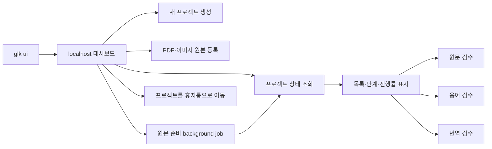

# 로컬 대시보드 설계와 브랜치 작업 이력

> 이 문서는 로컬 대시보드를 구현해 온 과정과 당시의 판단을 보존하는 과거
> 기록입니다. 일부 테스트 수, 미구현 목록과 화면 설명은 현재 상태와 다를 수
> 있으므로 현재 사용법이나 구현 계약의 기준으로 사용하지 않습니다.

현재 문서 기준:

- 설치와 빠른 시작: [README](README.md)
- 대시보드와 검수 화면: [GUI 사용 가이드](docs/GUI.md)
- CLI·파일·상태 규칙: [전체 작업 흐름](docs/WORKFLOW.md)
- 코드와 보안 경계: [아키텍처](docs/ARCHITECTURE.md)
- 개선 우선순위와 완료 상태: [개선 작업 추적](docs/IMPROVEMENTS.md)

이 파일은 다른 컴퓨터나 새 세션에서 과거 결정의 맥락을 확인할 때만
참고합니다. 새 작업의 완료 상태와 검증 결과는 `docs/IMPROVEMENTS.md`에
기록합니다.

---

## 목표

터미널 명령을 모두 기억하지 않아도 전체 프로젝트와 현재 단계를 한 화면에서 확인하고, 준비된 원문·용어·번역 검수 화면을 바로 열 수 있게 합니다.



### 1단계에서 하는 일

- `glk ui`로 `127.0.0.1` 전용 서버를 실행하고 기본 브라우저를 엽니다.
- 모든 프로젝트의 이름, ID, 원문 종류, 진행 단계와 주의 상태를 표시합니다.
- 검색과 진행 중·완료·확인 필요 필터를 제공합니다.
- 최초 진입과 사용자의 `새로고침` 요청 때 프로젝트 상태를 조회합니다.
- 준비가 끝난 기존 `source`, `glossary`, `translation` 검수 화면으로 현재 탭에서 이동합니다. 검수 후 브라우저 뒤로가기로 대시보드에 돌아옵니다.
- 대시보드가 종료되면 대시보드에서 연 검수 서버도 함께 종료합니다.

### 1단계에서 하지 않는 일

- PDF·이미지 업로드
- 원문 추출, OCR, 번역 같은 장시간 작업 실행
- 검수 내용을 대시보드 카드에서 직접 수정
- 데스크톱 앱 패키징

프로젝트 카드의 상태 표시는 읽기 전용입니다. 프로젝트 생성, 최초 원본 등록과
휴지통 이동만 대시보드에서 workspace를 변경하며, 기존 검수 화면은 편집 기능을
그대로 제공합니다.

### 2.1단계에서 추가한 일

- 프로젝트 목록이 비어 있을 때 표시되는 `+` 버튼에서 `새 프로젝트` 모달을 엽니다.
- 프로젝트가 있으면 목록 마지막의 `새 프로젝트` 카드에서 같은 모달을 엽니다.
- 프로젝트 이름과 영문 소문자·숫자·밑줄로 된 프로젝트 ID를 입력받습니다.
- 기존 `create_project()`를 통해 CLI와 동일한 workspace 구조를 생성합니다.
- 생성 직후 검색·필터를 초기화하고 새 프로젝트 카드를 표시합니다.
- 같은 ID가 이미 있거나 입력이 유효하지 않으면 한글 오류를 표시합니다.
- 프로젝트 카드의 `×` 버튼에서 이름과 ID를 다시 확인한 뒤 프로젝트 폴더 전체를 운영체제 휴지통으로 이동합니다.
- 휴지통 이동 성공 후 페이지를 새로 불러와 카드와 요약을 함께 갱신합니다.

### 2.2단계에서 추가한 일

- 원본이 없는 프로젝트 카드에서 `PDF 또는 이미지 원본 등록` 모달을 엽니다.
- PDF 한 개 또는 PNG·JPG·JPEG·WebP 이미지 여러 장을 선택합니다.
- 등록 파일은 기존 CLI와 같은 application service를 통해 `01_input`에 복사하고 `project.json`을 갱신합니다.
- 이미지 파일은 자연순으로 정렬하며 한 번에 최대 200개, 전체 요청은 256 MiB로 제한합니다.
- 등록 단계에서는 추출·OCR·Gemini 호출을 실행하지 않습니다.
- 원문 추출·OCR 시작 전에는 기존 원본을 삭제하고 새 파일로 교체할 수 있습니다.
- 원문 처리가 시작되면 교체 버튼을 숨기고 서버 API에서도 교체를 거부합니다.
- 이미지 원본 교체 때 프로젝트 공통 `ocr_prompt.txt`는 유지합니다.
- 카드에 PDF 파일명 또는 첫 이미지 파일명과 전체 개수를 표시하고, 이미지가 여러 장이면 전체 파일 목록 모달을 제공합니다.

### 3.1단계에서 추가한 일

- 등록된 PDF 또는 이미지 원본의 준비 작업을 HTTP 요청 thread 밖에서 실행합니다.
- PDF 추출 또는 이미지 OCR 성공 후 검수 block 생성과 로컬 원문 QA까지 이어서 실행합니다.
- 동시에 하나의 원문 준비 작업만 허용해 중복 API 호출과 비용 증가를 막습니다.
- 실행 중에는 해당 프로젝트의 원본 교체, OCR 프롬프트 수정과 삭제를 차단합니다.
- 작업 상태, 모델, 진행 메시지와 실패 결과를 프로젝트 `.glk/state`에 보존합니다.
- 실패·일부 실패·대시보드 중단 뒤에는 같은 버튼으로 재시도하며 검증된 acquisition cache를 재사용합니다.
- provider 호출 중 안전한 중단 계약이 없으므로 실행 중 취소는 이번 범위에서 제공하지 않습니다.

---

## 사용자 실행 방법

저장소 최상위에서 가상환경을 활성화한 뒤 실행합니다.

```bash
glk ui
```

브라우저를 자동으로 열지 않거나 포트를 고정할 수 있습니다.

```bash
glk ui --no-open --port 8765
glk ui --workspace-root 다른/workspaces
```

`Ctrl+C`로 대시보드를 종료합니다.

---

## 코드 구성

| 파일 | 책임 |
|---|---|
| `src/glk/application/dashboard_service.py` | 프로젝트 목록과 상태를 UI용 read model로 조합 |
| `src/glk/application/ai_model_catalog.py` | 패키지 모델 목록 검증과 API용 document 제공 |
| `src/glk/application/ai_settings_service.py` | 저장소 공통 Gemini 키·모델의 안전한 조회와 `.env` 저장 |
| `src/glk/application/dashboard_job_service.py` | 원문 준비 pipeline과 background job 상태·중복 실행·영속화 |
| `src/glk/application/source_registration_service.py` | PDF·이미지 원본 검증, 정렬, 복사와 manifest 등록 |
| `src/glk/data/gemini_models.json` | 드롭다운 Gemini API 모델 ID, 설명과 공식 문서 확인일 |
| `src/glk/infrastructure/dashboard_server.py` | localhost HTTP API, 보안 검사, 검수 서버 수명주기 |
| `src/glk/web/dashboard.html` | 외부 의존성 없는 반응형 HTML/CSS/JavaScript 화면 |
| `src/glk/cli.py` | `glk ui` 인자와 서버 진입점 |
| `tests/test_ai_model_catalog.py` | 모델 ID 중복, 기본 모델과 공식 출처 검증 |
| `tests/test_dashboard_service.py` | 빈 workspace와 프로젝트 상태 view model 검증 |
| `tests/test_dashboard_job_service.py` | job 성공·경합·중단 복구와 원문 준비 단계 연결 검증 |
| `tests/test_ai_settings_service.py` | 키 비노출, `.env` 보존, 모델과 환경변수 우선순위 검증 |
| `tests/test_dashboard_server.py` | 페이지·API 보호와 검수 화면 실행 검증 |

대시보드는 workspace 파일을 직접 해석하거나 수정하지 않습니다. 프로젝트 조회·생성·선택 검증은 `project_service`를 거치고, 원본 등록은 `source_registration_service`, 삭제는 검증된 프로젝트 경로와 `send2trash`를 사용합니다. 검수 화면을 열 때도 기존 `create_*_review_server()`를 재사용합니다.

---

## API 계약

모든 API는 대시보드 HTML에 삽입된 임의 세션 token을 `X-GLK-Token` 헤더로 전달해야 합니다.

### `GET /api/dashboard`

```json
{
  "ok": true,
  "schema_version": 1,
  "workspace_root": "workspaces",
  "summary": {
    "projects": 2,
    "in_progress": 1,
    "completed": 1,
    "needs_attention": 0
  },
  "projects": [
    {
      "project_id": "primal",
      "name": "Primal Rulebook",
      "source_type": "pdf",
      "source_files": ["rulebook.pdf"],
      "stage": "source_review",
      "stage_label": "원문 검수",
      "progress": 25,
      "pipeline": {},
      "reviews": {
        "source": {
          "enabled": true,
          "reason": "원문 검수 화면을 열 수 있습니다."
        }
      }
    }
  ],
  "warnings": []
}
```

`pipeline`에는 `glk status`와 같은 내부 단계 상태가 들어갑니다. `reviews`의 `enabled`와 `reason`은 버튼 활성화와 사용자 설명에 사용합니다.

### `GET|PUT /api/settings/ai`

`GET`은 API 키 설정 여부와 적용 출처, 현재 모델 및 `model_catalog`를
반환합니다. 카탈로그에는 실제 API 모델 ID, 설명, 공식 문서 URL과 확인일이
들어갑니다. API 키 값은 어떤 응답에도 포함하지 않습니다. `PUT`은 다음 JSON을
저장소 최상위 `.env`에 원자적으로 저장합니다.

```json
{
  "api_key": "새 Gemini API 키 또는 빈 문자열",
  "model": "gemini-2.5-flash"
}
```

빈 `api_key`는 기존 `.env` 키를 유지합니다. 기존 `.env`의 주석과 무관한
설정은 보존하고 대상 키의 중복 선언만 정리합니다. 셸 환경변수가 있으면 저장된
`.env`보다 계속 우선하며 응답의 `environment_override`로 UI에 알립니다.

### `GET /api/jobs`

현재 실행 중인 작업과 프로젝트별 최신 원문 준비·용어 후보 생성 작업을
반환합니다. `jobs`에는 원문 준비, `glossary_jobs`에는 용어 후보 생성 기록이
들어갑니다. 응답에는 `queued`, `running`, `succeeded`, `partial`, `failed`,
`interrupted` 상태와 진행 메시지, 처리 개수, 시작·종료 시각이 포함됩니다.

### `POST /api/jobs/source`

```json
{
  "project_id": "primal"
}
```

등록 원본 형식을 서버에서 확인하고 현재 공통 AI 모델로 PDF 추출 또는 이미지
OCR을 시작합니다. acquisition 성공 후 segmentation과 로컬 source QA를 이어서
실행하므로 성공하면 원문 검수 화면을 바로 열 수 있습니다. API 키가 없거나 다른
원문 작업이 실행 중이면 시작을 거부합니다.

### `POST /api/jobs/glossary`

```json
{
  "project_id": "primal"
}
```

현재 승인된 원문을 기준으로 기존 `glossary build` 로컬 규칙을 background
job에서 실행합니다. Gemini API 키와 모델을 사용하지 않습니다. 승인 전,
이미 최신 후보가 있는 경우, 다른 background job이 실행 중인 경우에는 시작을
거부합니다. 기존 TSV가 stale이면 사용자 편집을 보호하기 위해 대시보드에서
덮어쓰지 않습니다.

### `POST /api/review/open`

요청:

```json
{
  "project_id": "primal",
  "review_type": "source"
}
```

`review_type`은 `source`, `glossary`, `translation` 중 하나입니다.

응답:

```json
{
  "ok": true,
  "url": "http://127.0.0.1:54321/"
}
```

동일한 프로젝트·검수 종류의 서버가 이미 실행 중이면 기존 주소를 재사용합니다.

### `POST /api/projects`

요청:

```json
{
  "name": "Primal Rulebook",
  "project_id": "primal"
}
```

대시보드에서는 `project_id`를 필수로 입력하며 영문 소문자, 숫자, 밑줄만
허용합니다. CLI에서 생략하면 영문 프로젝트 이름을 기준으로 자동 생성합니다.

응답:

```json
{
  "ok": true,
  "project": {
    "project_id": "primal",
    "name": "Primal Rulebook",
    "path": "/workspace/workspaces/primal"
  }
}
```

### `POST|PUT /api/projects/{project_id}/source`

`multipart/form-data` 요청으로 `source_type`, `files`와 이미지일 때 선택적인
`ocr_prompt`를 전달합니다.

- `POST`: 원본이 없는 프로젝트에 최초 등록
- `PUT`: 원문 추출·OCR 시작 전 기존 원본 교체

- `source_type=pdf`: `.pdf` 한 개
- `source_type=images`: `.png`, `.jpg`, `.jpeg`, `.webp` 최대 200개
- `ocr_prompt`: 이미지 프로젝트 공통 OCR 지침, UTF-8 기준 최대 64 KiB
- 전체 요청 크기: 최대 256 MiB

응답:

```json
{
  "ok": true,
  "source": {
    "replaced": true,
    "source_type": "images",
    "source_file": "01_input/images",
    "ocr_prompt_updated": true,
    "files": [
      "01_input/images/card-2.png",
      "01_input/images/card-10.png"
    ]
  }
}
```

교체는 기존 PDF 또는 이미지 세트를 삭제하고 새 파일만 남깁니다. 이미지 공통
`ocr_prompt.txt`는 보존하며, 새 파일 등록에 실패하면 기존 입력과 manifest를
복구합니다. 원문 처리 흔적이 있으면 `PUT`을 거부합니다. 등록·교체 성공 후
대시보드는 상태를 다시 조회하지만 추출·OCR은 시작하지 않습니다.

### `PATCH /api/projects/{project_id}/ocr-prompt`

이미지 원본을 유지한 채 프로젝트 공통 OCR 프롬프트만 수정합니다.

```json
{
  "ocr_prompt": "프로젝트별 아이콘과 읽기 순서 지침"
}
```

등록된 이미지 원본이 있고 OCR이 아직 시작되지 않은 프로젝트에서만 허용합니다.
저장 성공 시 `01_input/images/ocr_prompt.txt`만 원자적으로 교체하며 PDF·이미지
원본과 manifest는 변경하지 않습니다.

### `DELETE /api/projects/{project_id}`

프로젝트 ID를 URL 경로에 전달합니다. 서버는 정규화된 ID인지, 대상이 설정된
workspace 바로 아래의 프로젝트인지, `project.json`의 ID와 일치하는지 다시
검증합니다.

응답:

```json
{
  "ok": true,
  "project": {
    "project_id": "primal",
    "name": "Primal Rulebook"
  }
}
```

성공하면 프로젝트 폴더 전체가 운영체제 휴지통으로 이동합니다. 영구 삭제와
휴지통 비우기는 제공하지 않습니다.

---

## 보안과 수명주기

- 대시보드와 하위 검수 서버는 `127.0.0.1`에만 bind합니다.
- API는 임의 세션 token, `Host`, `Origin`을 함께 검사합니다.
- HTML, CSS, JavaScript는 패키지 내부 파일만 사용하며 외부 CDN을 호출하지 않습니다.
- JSON 요청과 multipart 업로드의 크기·형식·파일 개수·확장자를 제한합니다.
- 브라우저에 표시하는 오류는 공통 `code/message/detail` 구조를 사용합니다.
- 대시보드 서버 종료 시 대시보드가 시작한 하위 검수 서버에 `shutdown()`과 `server_close()`를 호출합니다.
- 원문 준비와 용어 후보 생성 job 중 하나만 active 상태로 실행합니다.
- job 실행 중 같은 프로젝트의 원본·프롬프트·삭제 mutation을 차단합니다.
- 용어 후보 생성은 승인 원문만 허용하며 stale TSV 자동 덮어쓰기를 차단합니다.

---

## 다음 단계

### 다음 작업: 프로젝트 내보내기·가져오기 범위 결정

최종 승인된 번역 결과는 대시보드 카드에서 개별 다운로드할 수 있습니다.
다음에는 다른 PC에서도 작업을 이어갈 수 있도록 전체 프로젝트를 하나의
archive로 내보내고 가져오는 기능의 포함 파일, 충돌 처리와 복원 검증 범위를
결정합니다. cooperative cancellation과 AI 설정 연결 테스트는 별도 후속
개선 범위로 유지합니다.

### 후속 개선: 원문 검수 선택 영역 OCR 재인식

원문 검수에서 누락된 문단 영역을 이미지 위에서 지정하면 현재는 빈 수동
블록이 생성되어 사람이 직접 입력해야 합니다. 후속 개선에서는 사용자가
명시적으로 요청한 선택 영역만 잘라 OCR·AI로 다시 인식하고, 결과를 새 블록
입력창에 자동으로 채웁니다. 자동 호출은 하지 않으며 실행 전 API 비용 발생
가능성을 안내하고, 인식 결과는 최종 승인 전에 사람이 수정·검수하는 현재
규칙을 유지합니다.

### 프로젝트 삭제에서 유지할 제한

- 프로젝트별 검수 서버를 찾아 자동 종료하는 별도 로직은 추가하지 않았습니다.
- 삭제 후 남은 검수 서버가 문제가 되면 사용자가 `glk ui`를 재시작합니다.
- 휴지통 비우기와 영구 삭제 기능은 제공하지 않습니다.
- 새 프로젝트 생성 카드에는 삭제 버튼을 표시하지 않습니다.

---

## 브랜치 작업 이력

### 2026-07-24 — GUI 1단계

- `v1.1.0`이 반영된 `main`에서 `feature/local-dashboard` 브랜치를 생성하고 원격에 게시했습니다.
- 대시보드 범위를 읽기 전용 프로젝트 목록과 기존 검수 화면 연결로 확정했습니다.
- `dashboard_service.py`에 프로젝트 상태 read model과 검수 가능 조건을 추가했습니다.
- `dashboard_server.py`에 localhost API와 하위 검수 서버 관리 기능을 추가했습니다.
- `dashboard.html`에 요약, 검색, 필터, 단계 카드, 자동 갱신과 검수 버튼을 추가했습니다.
- `glk ui`, `--workspace-root`, `--port`, `--no-open` 옵션을 추가했습니다.
- 대시보드 application·HTTP·CLI 테스트를 추가했습니다.
- Orca 내장 브라우저에서 빈 workspace와 프로젝트 카드, 검색, 진행/완료 필터, 자동 갱신을 확인했습니다.
- Orca가 JavaScript 팝업을 숨은 창으로 처리하는 호환 문제를 확인해 검수 화면은 현재 탭에서 열고 뒤로가기로 복귀하도록 확정했습니다.
- 원문 검수 준비 상태에서 버튼 활성화 → 기존 원문 검수 화면 이동 → 대시보드 복귀를 확인했으며 브라우저 콘솔 오류는 없었습니다.
- 사용자 화면 피드백을 반영해 제목을 `Game Localization Kit Dashboard`로 변경하고 중복 안내 문구와 15초 자동 갱신을 제거했습니다. 상태는 최초 진입과 사용자의 `새로고침` 요청 때만 조회합니다.
- 요약 숫자와 진행률 숫자를 중간 굵기의 산세리프 tabular numeral로 변경했습니다.
- 대문 제목도 나머지 화면과 일관된 산세리프 글꼴로 변경했습니다.

### 2026-07-24 — GUI 2.1 프로젝트 생성

- `POST /api/projects`와 동시 생성 방지 lock을 추가했습니다.
- 빈 프로젝트 화면의 `+` 버튼에서 여는 새 프로젝트 모달을 추가했습니다.
- 이름만 입력하면 ID를 자동 생성하고, 필요하면 ID를 직접 지정할 수 있게 했습니다.
- 생성 성공 후 대시보드를 다시 조회해 새 카드를 즉시 표시합니다.
- 중복 ID와 빈 이름의 HTTP 테스트를 추가했습니다.
- Orca 브라우저에서 모달 입력, 자동 ID 생성, workspace 생성, 카드 즉시 표시를 확인했으며 브라우저 콘솔 오류는 없었습니다.

### 2026-07-24 — GUI 2.1 생성 UX 보완

- 중복되는 헤더의 `+ 새 프로젝트` 버튼을 제거하고 빈 화면의 `+` 버튼을 유지했습니다.
- 프로젝트 생성 후에도 목록 마지막에 `새 프로젝트` 카드를 항상 표시합니다.
- 좁은 화면에서 `새로고침` 버튼이 전체 너비로 늘어나지 않도록 조정했습니다.
- 프로젝트 ID를 필수 입력으로 바꾸고 영문 소문자, 숫자, 밑줄만 허용하도록 UI·HTTP API·도메인 규칙을 통일했습니다.
- 한글 프로젝트 이름은 그대로 허용하고 범용 placeholder와 한글 오류 안내를 적용했습니다.
- Orca 브라우저에서 프로젝트 카드 옆 추가 카드 표시, 모달 열기, 필수 ID 안내와 콘솔 오류가 없음을 확인했습니다.
- `진행 중`에서 `시작 전` 프로젝트를 제외하고, 검색·필터 적용 중에는 프로젝트 생성 카드를 숨겨 결과만 표시하도록 수정했습니다.
- 필터 결과가 없을 때는 생성 `+` 대신 `조건에 맞는 프로젝트가 없습니다` 안내만 표시합니다.
- Orca 브라우저에서 `시작 전` 프로젝트가 진행 중·완료 필터에서 제외되고 생성 카드가 남지 않는 것을 확인했습니다.

### 2026-07-24 — 프로젝트 삭제 계획 확정

- 카드 `×` → 확인 모달 → 운영체제 휴지통 이동 → 대시보드 전체 새로고침 흐름으로 확정했습니다.
- 검수 서버 자동 종료와 영구 삭제는 구현 범위에서 제외했습니다.
- 구현·테스트 기준을 당시 다음 단계의 프로젝트 삭제 항목에 기록했으며 소스 구현은 시작하지 않았습니다.

### 2026-07-24 — GUI 2.1 프로젝트 삭제

- 프로젝트 카드에 접근 가능한 삭제 버튼과 프로젝트 이름·ID를 다시 보여주는 확인 모달을 추가했습니다.
- `DELETE /api/projects/{project_id}`에 기존 token·Host·Origin 검사를 적용했습니다.
- 프로젝트 ID, workspace 바로 아래 경로와 manifest ID를 서버에서 다시 검증합니다.
- 검증을 통과한 프로젝트 폴더만 `send2trash`로 운영체제 휴지통에 이동하고, 성공 후 페이지 전체를 새로 불러옵니다.
- 삭제 실패·존재하지 않는 프로젝트·경로 이탈·중복 요청을 HTTP 테스트로 검증했습니다.
- Safari에서 삭제 모달과 취소 동작을 확인했으며 테스트용 프로젝트 외의 데이터는 건드리지 않았습니다.

### 2026-07-24 — GUI 2.2 PDF·이미지 원본 등록

- AI 작업과 분리된 `source_registration_service.py`를 추가하고 기존 PDF 추출·이미지 OCR의 등록 로직도 이 service를 재사용하도록 변경했습니다.
- 원본이 없는 프로젝트에서 PDF 한 개 또는 이미지 여러 장을 선택하는 등록 모달을 추가했습니다.
- `POST /api/projects/{project_id}/source` multipart API에 기존 token·Host·Origin 검사와 프로젝트 경로 검증을 적용했습니다.
- 파일명, 형식, 개수, 전체 요청 크기, 이미지 출력명 충돌과 중복 등록을 검증합니다.
- 등록 성공 후 원본 종류와 파일 목록을 다시 표시하며 추출·OCR·Gemini 호출은 실행하지 않습니다.
- Orca 내장 브라우저에서 PDF 1개와 이미지 2개를 각각 실제 업로드하고, 등록 후 `PDF`·`IMAGES` 상태와 성공 안내를 확인했습니다.
- 이미지 등록에서는 역순으로 선택한 파일이 `card-2.png` → `card-10.png` 자연순으로 표시·저장되는 것을 확인했습니다.
- Orca 접근성 트리에서도 원본 형식 radio를 직접 선택할 수 있도록 전체 선택 영역을 실제 input에 연결했습니다.

### 2026-07-24 — OCR 기본 prompt 일반화

- Elder Scrolls POC 전용 아이콘 30종 prompt를 새 프로젝트의 자동 생성 기본값에서 제거했습니다.
- `ocr_prompt.txt`는 게임별 아이콘, 읽기 순서와 고유 표기를 사용자가 채우는 게임 중립 템플릿으로 교체했습니다.
- token 작성 형식은 가상 예시이며 실제 OCR 규칙으로 적용하지 말라고 명시했습니다.
- 기존 POC prompt는 `elder_scrolls_ocr_prompt.example.txt`로 분리해 잃지 않고 보존했습니다.
- 프로젝트 생성 테스트에서 중립 템플릿과 POC 예제의 분리를 확인합니다.

### 2026-07-24 — 추출 전 원본 교체

- 원본만 등록되고 추출·OCR이 시작되지 않은 프로젝트 카드에 `원본 교체` 버튼을 추가했습니다.
- `PUT /api/projects/{project_id}/source`가 기존 원본 전체를 새 PDF 또는 이미지 세트로 교체합니다.
- 교체 중 기존 입력 폴더를 임시 백업하고 실패하면 원본과 manifest를 복구합니다.
- 이미지 교체에서도 프로젝트 공통 `ocr_prompt.txt`는 유지하고 기존 이미지별 prompt는 제거합니다.
- 추출·OCR 또는 이후 단계의 파일이 하나라도 생성되면 UI에서 버튼을 숨기고 API도 교체를 거부합니다.
- Orca 내장 브라우저에서 등록된 이미지 프로젝트의 `원본 교체` 버튼, 현재 형식 자동 선택, 삭제·유지 범위 안내와 제출 UI를 확인했으며 실제 사용자 원본은 변경하지 않았습니다.

### 2026-07-24 — 등록 원본 파일명 표시

- PDF 프로젝트 카드에는 등록된 PDF 파일명을 한 줄로 표시합니다.
- 이미지 프로젝트 카드는 `첫 파일명 외 N개`로 요약하고 source badge에 전체 개수를 표시합니다.
- 이미지가 여러 장이면 `파일 목록` 모달에서 입력 폴더 기준 상대 경로를 자연순으로 확인할 수 있습니다.
- 원문 처리 전에는 목록 모달에서 바로 `원본 교체`로 이동하고, 처리 후에는 목록 열람만 허용합니다.
- Orca 내장 브라우저에서 실제 PDF 파일명과 별도 다중 이미지 프로젝트의 badge 개수, 카드 요약, 자연순 파일 목록 모달을 확인했으며 사용자 원본은 변경하지 않았습니다.

### 2026-07-24 — 이미지 OCR 프롬프트 UI 편집

- 이미지 원본을 선택했을 때만 공통 `OCR 프롬프트` 편집 영역을 표시합니다.
- 새 프로젝트는 자동 생성된 범용 템플릿을, 원본 교체는 현재 저장된 내용을 초기값으로 불러옵니다.
- `편집 전 내용으로 되돌리기`로 모달을 열었을 때의 프로젝트 값을 복구할 수 있고 UTF-8 byte 수를 실시간 표시합니다.
- 이미지 등록·교체 요청은 프롬프트를 `01_input/images/ocr_prompt.txt`에 원자적으로 저장합니다.
- PDF 선택 시 프롬프트 영역과 multipart 필드를 모두 제외합니다.
- 서버는 빈 프롬프트, NUL 문자, 64 KiB 초과 입력과 PDF용 프롬프트를 거부합니다.
- Orca 내장 브라우저에서 실제 이미지 프로젝트의 저장값 로드, 복원 버튼, byte 표시와 PDF 전환 시 완전한 숨김을 확인했으며 원본과 프롬프트를 제출·변경하지 않았습니다.

### 2026-07-24 — OCR 프롬프트 단독 수정

- 이미지 프로젝트 카드에 원본 교체와 분리된 `OCR 프롬프트 수정` 버튼을 추가했습니다.
- 전용 모달은 현재 저장값, 복원 버튼과 UTF-8 byte 수를 제공하며 원본 파일 입력은 요구하지 않습니다.
- `PATCH /api/projects/{project_id}/ocr-prompt`는 프롬프트 파일만 원자적으로 저장합니다.
- 이미지 원본이 없거나 PDF 프로젝트인 경우와 OCR 시작 후에는 UI와 API 모두 수정을 허용하지 않습니다.
- 테스트에서 프롬프트 저장 전후의 등록 이미지 bytes와 manifest가 바뀌지 않는 것을 확인합니다.
- Orca 내장 브라우저에서 실제 이미지 프로젝트의 전용 버튼, 저장값·복원·byte 표시와 파일 입력이 없는 모달을 확인했으며 사용자 프롬프트는 제출하지 않았습니다.

### 2026-07-24 — 공통 AI 키와 모델 설정

- 대시보드 헤더에 프로젝트와 무관한 공통 `AI 설정` 버튼을 추가했습니다.
- Gemini API 키는 비밀번호 입력으로 새 값만 받고, 빈 입력은 기존 `.env` 키를 유지합니다.
- API는 키 값을 반환하지 않고 설정 여부와 `.env`·셸 환경변수 중 적용 출처만 반환합니다.
- `AI 설정` 버튼은 녹색 강조색을 사용하고, 키 상태와 모델 ID를 두 줄로 분리했습니다.
- 키 상태는 `API 키 설정 완료` 또는 `API 키 미설정` 문구로 명확하게 표시합니다.
- 드롭다운은 호환되는 3.x 안정 모델 `gemini-3.5-flash`, `gemini-3.1-flash-lite`와 2.5 안정 모델 및 직접 입력을 지원합니다.
- 모델 목록은 `src/glk/data/gemini_models.json` 한 파일에서 관리하고 공식 문서 URL과 확인일을 함께 기록합니다.
- 기존 `.env` 주석과 다른 변수를 보존하고 POSIX에서는 저장 권한을 `0600`으로 제한합니다.
- 셸 환경변수가 있으면 `.env`보다 우선한다는 안내를 설정 모달에 표시합니다.
- Orca 내장 브라우저에서 녹색 강조 버튼, 키·모델 두 줄 상태, 비밀번호 입력과 실제 API 모델 ID 세 개 및 설명을 확인했으며 실제 키나 설정은 저장하지 않았습니다.

### 2026-07-24 — 원문 준비 background job

- `dashboard_job_service`에 단일 active job, 프로젝트별 최신 상태와 daemon worker를 추가했습니다.
- 등록된 PDF 추출 또는 이미지 OCR 뒤 segmentation과 로컬 source QA를 자동으로 연결합니다.
- `GET /api/jobs`, `POST /api/jobs/source`를 추가하고 API 키·프로젝트·중복 실행을 검증합니다.
- 카드에 키 설정 안내, 실행 확인 모달, 진행 상태·모델·실패 메시지와 재시도 버튼을 추가했습니다.
- 실행 중에는 원본 교체, OCR 프롬프트 수정과 프로젝트 삭제를 UI와 API에서 차단합니다.
- 최신 상태를 `.glk/state/dashboard_source_job.json`에 저장하고 이전 실행 중 상태는 재시작 때 `interrupted`로 복구합니다.
- 취소는 provider cooperative cancellation 지원 뒤 추가하기로 하고 이번 범위에서는 제외했습니다.
- Orca 내장 브라우저에서 시작 버튼, 비용 안내 모달, 실행 진행 상태와 원본 교체 숨김·삭제 잠금을 브라우저 전용 fixture로 확인했으며 API 호출이나 사용자 파일 변경은 하지 않았습니다.
- 저장된 API 키와 `gemini-3.1-flash-lite`를 사용해 임시 이미지 1장의 실제 OCR smoke test를 완료했습니다. 원문 6개 block을 정확히 추출했고 segmentation과 source QA까지 성공했으며 QA issue는 0건이었습니다. 임시 프로젝트는 테스트 후 workspace에서 제거했습니다.
- 실제 존재하지 않는 모델 테스트에서 확인한 generic `partial` 문구를 개선했습니다. 일부 원본 실패와 전체 실패를 구분하고 모델 없음, API 키, 권한, 사용량 한도, 네트워크와 응답 검증 오류를 안전한 사용자 안내로 표시합니다.
- 이전 버전에서 저장한 generic `partial` job도 대시보드 시작 시 acquisition 결과를 기준으로 자동 보정해 재호출 없이 새 오류 문구를 표시합니다.
- 실행 직후 acquisition의 `tuple` 실패 목록과 JSON에서 복원한 `list` 실패 목록을 모두 분류하도록 보완해, 재시작 전후 오류 안내가 동일하게 유지됩니다.

검증 결과:

```text
python -m unittest discover -s tests
→ 170 tests OK

python -m compileall -q src tests
→ OK

Python 3.10 feature grammar parse
→ src/tests 70 files OK

python -m mypy
→ dashboard·background job·AI 설정·모델 카탈로그 포함 14 files, no issues

python -m pip check
→ no broken requirements

web HTML JavaScript compile check
→ OK

git diff --check
→ OK
```

### 2026-07-25 — 원문 승인 완료와 대시보드 복귀

- 원문 `최종 승인` 성공 뒤 다음 단계를 설명하는 완료 모달을 추가했습니다.
- 완료 모달에서 `대시보드로 돌아가기` 또는 `이 화면에 머물기`를 선택할 수 있습니다.
- 대시보드가 연 원문 검수 서버에만 로컬 dashboard return URL을 주입하며 외부·HTTPS URL은 거부합니다.
- 대시보드 복귀는 명시적인 URL 이동으로 처리해 프로젝트 승인 상태를 서버에서 다시 읽습니다.
- CLI에서 직접 연 원문 검수 화면은 return URL이 없으므로 대시보드 복귀 버튼을 숨깁니다.
- Orca 내장 브라우저에서 실제 승인 완료 프로젝트의 검수 화면을 열고, 브라우저에서 완료 모달만 표시해 `이 화면에 머물기`와 `대시보드로 돌아가기` 동작을 확인했습니다. 최종 승인 API는 다시 호출하지 않아 사용자 프로젝트 파일은 변경하지 않았습니다.

### 2026-07-25 — 승인 원문 기반 용어 후보 생성

- 최종 승인 원문이 있고 아직 용어 후보가 없는 프로젝트에 `용어 후보 생성 시작` 버튼을 추가했습니다.
- 실행 전 모달에서 로컬 규칙 작업이며 Gemini API 호출과 비용이 없다는 점을 안내합니다.
- 기존 `glossary_service`를 단일 active background job 정책으로 실행하고 상태를 `.glk/state/dashboard_glossary_job.json`에 저장합니다.
- 생성 진행·실패 상태를 프로젝트 카드에 표시하고 완료 뒤 대시보드를 새로 읽어 `용어 검수` 버튼을 활성화합니다.
- 승인 전·이미 최신 후보가 있는 상태·다른 background job 실행 중에는 서버에서도 시작을 거부합니다.
- 기존 용어 TSV가 stale이면 사용자 편집을 보호하기 위해 대시보드에서 자동으로 덮어쓰지 않습니다.
- Orca 내장 브라우저에서 실제 프로젝트의 임시 복제본으로 후보 22개 생성, 단계 40%→55% 전환, 완료 toast, `용어 검수` 버튼 활성화와 기존 검수 화면 진입까지 확인했습니다. 원본 프로젝트는 변경하지 않았고 임시 복제본은 검증 후 삭제했습니다.

### 2026-07-25 — 용어 검수 표 정렬

- 용어 검수 toolbar에 추천 순서, 첫 등장 위치, 출현 횟수 오름·내림차순, 원문 용어와 상태 정렬을 추가했습니다.
- PDF의 `p1`, `p2`, `p10`과 이미지 파일명을 자연 정렬하고, 위치·출현 정보가 없는 수동 용어는 뒤에 표시합니다.
- 정렬은 화면에 표시되는 행에만 적용하며 `glossary_review.tsv`의 저장 순서는 변경하지 않습니다.
- Orca 내장 브라우저에서 22개 후보가 있는 임시 복제본으로 정렬 메뉴 노출, 출현 횟수 오름차순의 `1회` 우선 표시, 첫 등장 위치의 `p1` 우선 표시와 콘솔 오류가 없음을 확인했습니다. TSV 저장은 실행하지 않았습니다.

### 2026-07-25 — 용어집 생성 완료와 대시보드 복귀

- 용어 검수의 `검증 및 termbase 생성`이 성공한 뒤 다음 단계를 설명하는 완료 모달을 추가했습니다.
- 완료 모달에서 `대시보드로 돌아가기` 또는 `이 화면에 머물기`를 선택할 수 있습니다.
- 대시보드가 연 용어 검수 서버에만 로컬 dashboard return URL을 주입하며 외부·HTTPS URL은 거부합니다.
- CLI에서 직접 연 용어 검수 화면은 return URL이 없으므로 대시보드 복귀 버튼을 숨깁니다.
- Orca 내장 브라우저에서 임시 복제본의 후보 22개를 일괄 제외하고 실제 termbase를 생성했습니다. 완료 모달의 두 동작과 대시보드 복귀 뒤 `번역 준비 완료` 70% 전환을 확인했으며 콘솔 오류는 없었습니다. 원본 프로젝트는 변경하지 않았고 임시 복제본은 검증 후 삭제했습니다.

### 2026-07-25 — 초벌 번역 background job

- current 승인 원문과 termbase가 있는 프로젝트에 `초벌 번역 시작` 버튼을 추가했습니다.
- 실행 모달에서 Gemini 모델, 청크별 비용 발생 가능성과 프로젝트 번역 지침을 확인·편집할 수 있습니다.
- 기존 `translation_service`를 단일 active background job 정책으로 실행하고 상태를 `.glk/state/dashboard_translation_job.json`에 저장합니다.
- 청크 진행·실패·재시도 상태를 카드에 표시하고 성공 뒤 대시보드를 다시 읽어 `번역 검수` 버튼을 활성화합니다.
- partial 번역은 저장된 청크부터 resume하며 입력 hash 보호를 위해 기존 번역 지침을 고정합니다.
- stale 번역은 사람의 검수 내용을 보호하기 위해 대시보드에서 자동 덮어쓰지 않습니다.
- Orca 내장 브라우저에서 임시 프로젝트의 번역 지침 편집, 3개 블록 초벌 번역 생성, 단계 70%→88% 전환과 기존 번역 검수 화면 진입을 확인했습니다. 결정론적 테스트 provider를 사용해 Gemini API 비용과 사용자 프로젝트 변경은 없었고 콘솔 오류도 없었습니다.

### 2026-07-25 — 최종 번역 승인과 대시보드 복귀

- 번역 검수의 `최종 승인` 성공 뒤 출력 파일 생성을 안내하는 완료 모달을 추가했습니다.
- 완료 모달에서 `대시보드로 돌아가기` 또는 `이 화면에 머물기`를 선택할 수 있습니다.
- 대시보드가 연 번역 검수 서버에만 로컬 dashboard return URL을 주입하며 외부·HTTPS URL은 거부합니다.
- CLI에서 직접 연 번역 검수 화면은 return URL이 없으므로 대시보드 복귀 버튼을 숨깁니다.
- Orca 내장 브라우저에서 임시 프로젝트의 실제 최종 승인을 실행해 출력 TXT 생성, 완료 모달의 두 동작, 대시보드 복귀 뒤 `최종 번역 완료` 100% 전환을 확인했습니다. 콘솔 오류는 없었고 Gemini API와 사용자 프로젝트는 사용하지 않았습니다.

### 2026-07-25 — 전체 GUI 워크플로우 통합 검증

- 빈 임시 workspace에서 Orca 내장 브라우저로 프로젝트 생성과 2페이지 PDF 등록부터 시작했습니다.
- 원문 준비의 AI 호출만 결정론적 로컬 runner로 대체하고 실제 background job, 원문 검수·최종 승인과 대시보드 복귀를 실행했습니다.
- 승인 원문에서 용어 후보 2개를 생성하고 `Combat → 전투`, `Hunter → 사냥꾼`을 실제 UI에서 승인해 termbase를 생성했습니다.
- 번역 지침을 수정하고 초벌 번역 background job을 실행한 뒤 번역 검수에서 최종 승인했습니다.
- 카드 단계가 `0% → 25% → 40% → 55% → 70% → 88% → 100%`로 전환되고 최종 상태가 `최종 번역 완료`로 표시되는 것을 확인했습니다.
- `glk status`에서 원문·termbase·번역·최종 출력 승인이 모두 current로 확인됐고 번역 QA 오류는 0개였습니다.
- 최종 TXT의 페이지 경계, 번역문, 숫자와 `{HP}` token 보존을 확인했으며 브라우저 콘솔 오류는 없었습니다.
- Gemini API와 사용자 workspace·설정은 사용하지 않았고, 테스트 뒤 임시 서버와 workspace를 제거했습니다.

### 2026-07-25 — 최종 번역 결과 다운로드

- 최종 번역이 current인 프로젝트 카드에 승인된 결과 파일명과 크기를 표시하고 다운로드 버튼을 추가했습니다.
- PDF 프로젝트는 최종 TXT 한 개를, 이미지 프로젝트는 이미지별 TXT와 `combined_kor.txt`를 제공합니다.
- 다운로드 API는 대시보드 session token을 요구하고 workspace 바로 아래 프로젝트, 승인된 `05_output` 경로와 SHA-256을 다시 검증합니다.
- 파일을 읽은 직후 hash를 한 번 더 비교해 검증과 전송 사이에 파일이 바뀐 경우도 차단합니다.
- 전체 173 tests, Python 3.10 문법 70 files, 설정된 14개 Python 파일 mypy, 4개 HTML의 inline JavaScript 문법과 의존성 검사를 통과했습니다.
- Orca 내장 브라우저에서 이미지 프로젝트의 3개 결과와 PDF 프로젝트의 단일 결과 표시, 다운로드 성공 안내, 응답 파일명과 실제 한글 본문을 확인했으며 브라우저 콘솔 오류는 없었습니다.

### 2026-07-25 — 번역 프롬프트 독립 저장과 전체 재번역

- 프로젝트 카드에 Gemini를 호출하지 않는 `번역 프롬프트 설정`을 추가하고 `04_translation/prompt.txt`에 별도로 저장합니다.
- 현재 prompt SHA-256을 요구해 다른 화면에서 먼저 저장한 내용을 덮어쓰지 않으며 background job 중에는 변경을 차단합니다.
- 초벌 번역 뒤 prompt를 변경하면 기존 결과를 stale로 표시하고 `변경된 프롬프트로 전체 재번역`을 명시적으로 선택할 수 있습니다.
- 전체 재번역 전 prompt·translation JSONL·draft·review·QA·승인 state·최종 출력을 `04_translation/revisions/translation_restart_*/`에 보관합니다.
- prompt 변경 전·후 내용과 hash는 `translation_prompt_change_*.json`에 기록하며 재번역 성공 뒤에만 새 draft로 검수본을 초기화합니다.
- 전체 177 tests, Python 3.10 문법 73 files, 설정된 16개 Python 파일 mypy, 4개 HTML의 inline JavaScript 문법과 의존성 검사를 통과했습니다.
- Orca 내장 브라우저에서 번역 완료 임시 프로젝트의 prompt를 저장해 stale 전환과 완료 안내를 확인하고, 전체 재번역 확인창에 저장 prompt·모델·revisions 보관 및 검수 초기화 안내가 표시되는 것을 검증했습니다. Gemini API와 사용자 프로젝트는 사용하지 않았고 브라우저 콘솔 오류는 없었습니다.
- Windows Python 3.14에서 background job 상태 파일을 저장 도중 직접 읽던 테스트의 파일 잠금 경쟁을 수정했습니다. 관리자에서 terminal 상태와 원자적 저장 완료를 확인한 뒤 상태 파일을 검증하며, 관련 테스트 100회 반복과 전체 177 tests를 통과했습니다.

### 2026-07-25 — 번역에서 제외 용어를 원문 유지로 처리하던 오류 수정

- termbase 이력에는 `rejected` 용어도 남지만 Gemini 번역 프롬프트에는 `approved`와 `keep` 용어만 전달하도록 수정했습니다.
- 번역 자동 검증도 `approved`는 지정 번역어를, `keep`은 원문 표기를 검사하고 `rejected`에는 용어 규칙을 적용하지 않습니다.
- `rejected cards`는 자연스럽게 번역하면서 `keep player`는 계속 원문을 요구하는 회귀 테스트를 추가했습니다.
- 전체 178 tests, 설정된 16개 Python 파일 mypy, Python bytecode 컴파일과 의존성 검사를 통과했습니다.

### 2026-07-25 — 용어 검수 검색 범위 분리

- 용어 검색의 기본 범위를 원문 용어와 표기 변형으로 제한하고 `번역어`, `출현 문맥`, `전체 항목` 범위를 따로 선택할 수 있게 했습니다.
- 검색 범위는 기존 상태·분류 필터 및 정렬과 함께 적용되며 선택한 범위에 맞춰 검색창 안내 문구도 바뀝니다.
- 툴바 첫 줄에는 상태·분류·정렬을 먼저 놓고 간격 뒤에 검색 범위·검색창을 배치했습니다. 둘째 줄에는 선택 개수·상태 일괄 변경·적용·수동 용어 추가를 나란히 배치했습니다.
- 메모 검색과 표의 메모 편집 열은 제거했지만 기존 TSV의 note 값은 화면 저장 시에도 그대로 보존합니다.
- Orca 내장 브라우저에서 `five cards`가 기본 원문 검색에서는 나오지 않고 출현 문맥 검색에서는 `DRAW`, `cards`, `player` 3개만 표시되는 것을 확인했으며 사용자 TSV는 변경하지 않았습니다.
- Safari에서도 select와 검색창 높이가 맞도록 36px 높이와 WebKit 검색창 스타일 초기화를 적용했습니다.
- Orca 화면 좌표에서 첫 줄 제어가 모두 36px 높이로 정렬되고 정렬과 검색 사이에 32px 간격이 생기며, 수동 용어 버튼이 적용 버튼 바로 옆에 배치된 것을 확인했습니다. 브라우저 콘솔 오류는 없었습니다.
- 전체 178 tests, inline JavaScript 문법, 설정된 16개 Python 파일 mypy와 의존성 검사를 통과했습니다.

### 2026-07-25 — 초벌 번역 validation 반복 실패 수정

- `keep` 용어를 Gemini 프롬프트의 원문에서 `{GLK_KEEP_####}` 고정 토큰으로 보호하고 응답 검증 전에 실제 원문 표기로 복원하도록 변경했습니다.
- 프롬프트 지시만으로 `player`, `players`, `deck` 같은 원문 유지 용어를 보존하던 불안정한 경로를 결정적 치환·복원 방식으로 보강했습니다.
- 원문에 있던 숫자가 누락되거나 변경되는 경우는 계속 오류로 처리하되, `five cards → 카드 5장`이나 단수 명사의 한국어 수량 표현처럼 번역문에 자연스럽게 추가되는 숫자는 허용합니다.
- 완료 블록이 0개인 partial 작업은 번역 보호 규칙 버전이 변경되어도 새 규칙으로 안전하게 다시 시작할 수 있게 했습니다.
- 번역 검증 실패 사유를 translation 상태와 대시보드 오류에 보존해 실패한 블록과 규칙을 화면에서 확인할 수 있게 했습니다.
- Orca에서 `gemini-3.1-flash-lite`로 기존 실패 프로젝트를 실제 재시도해 21개 블록·1개 청크 완료와 `draft.txt`·`review.txt` 생성을 확인했습니다.
- 생성 결과에서 `IMPORTANT`, `player`/`players`, `deck`이 원문 표기로 유지되고 숫자 표현이 정상 통과한 것을 확인했습니다.
- 전체 181 tests, 설정된 16개 Python 파일 mypy, Python bytecode 컴파일과 `git diff --check`를 통과했습니다.

### 2026-07-25 — 번역 생성 실패와 내용 QA 오류 분리

- Gemini 응답의 JSON 형식, 블록 ID 누락·중복·순서 변경, 빈 번역처럼 검수 파일을 안전하게 만들 수 없는 구조 오류만 번역 작업 실패로 처리합니다.
- 숫자·토큰·태그·확정 용어·원문 유지 용어 위반은 한 번 자동 재시도하고, 계속 남아도 구조가 정상인 번역 결과를 폐기하지 않고 검수 파일에 저장합니다.
- 내용 오류가 남은 번역은 background job을 성공으로 종료한 뒤 번역 QA를 자동 실행해 프로젝트를 `번역 QA 확인 필요` 단계로 전환합니다.
- 대시보드 카드에 `초벌 번역 완료 · N개 오류` 안내와 번역 검수에서 수정하라는 설명을 표시하며 번역 검수 버튼은 계속 사용할 수 있습니다.
- 번역 상태에는 내용 검증 오류 수와 오류가 발생한 블록 수를 저장합니다.
- 최종 번역 승인은 기존과 동일하게 번역 QA 오류가 모두 해결된 경우에만 허용합니다.
- 전체 184 tests와 관련 Python 구문 검사를 통과했습니다.

### 2026-07-25 — 번역 검수 용어집 연계

- 번역 검수 API가 활성 용어집 전체와 블록별로 실제 원문에 등장하는 관련 용어를 함께 제공합니다.
- 각 번역 블록에서 적용 용어의 상태, 원문 용어와 확정 번역어 또는 원문 유지 규칙을 바로 확인할 수 있습니다.
- 관련 용어를 누르면 원문의 해당 표기를 강조하고 번역문에 적용된 표기를 선택해 빠르게 대조할 수 있습니다.
- 상단 `용어집`에서 활성 용어 전체를 검색하고 확정 번역·원문 유지 상태로 필터링할 수 있습니다. 표기 변형도 검색 대상에 포함합니다.
- 블록의 영문이 전부 `keep` 용어로 설명되는 경우 기존 미번역 경고 대신 `원문 유지 적용` 정보로 표시합니다. 문장에 유지 용어 외 영문이 남아 있으면 기존 경고를 유지합니다.
- Orca 브라우저에서 블록별 용어 표시, 원문 강조·번역문 선택, 전체 용어집과 표기 변형 검색을 확인했습니다.
- 전체 186개 테스트, 설정된 16개 Python 파일 mypy, 번역 검수 JavaScript 문법과 `git diff --check`를 통과했습니다.

### 2026-07-25 — 원본 복구 보존과 project mutation 경합 제거

- 원본 교체 전에 이동한 기존 PDF·이미지는 rollback이 완전히 끝날 때까지 독립 백업으로 유지합니다.
- rollback 중 파일 복사가 실패하면 백업을 삭제하지 않고 `.glk/source-replacement-*`에 원본을 보존하며 오류 응답에 절대 백업 경로를 안내합니다.
- 정상 교체와 정상 rollback이 끝난 경우에만 임시 백업을 정리합니다.
- 원본 등록·교체, OCR·번역 프롬프트 수정과 프로젝트 삭제는 `mutation_lock`을 얻은 직후 활성 background job을 다시 검사합니다.
- 최초 검사 뒤 job이 시작되어도 실제 workspace 변경 직전의 재검사에서 409로 차단합니다.
- PDF·이미지 복구 실패와 네 project mutation 경합 회귀 테스트를 추가했습니다.
- Orca에서 최신 서버의 대시보드와 원본 등록 모달이 정상적으로 열리고 브라우저 콘솔 오류가 없음을 확인했습니다.
- 전체 190개 테스트, 설정된 16개 Python 파일 mypy, Python bytecode 컴파일과 `git diff --check`를 통과했습니다.

### 2026-07-25 — partial 번역 단계와 페이지 범위 경계 수정

- 번역 상태가 `partial`이면 남아 있는 번역 검수 상태보다 우선해 대시보드 단계를 `번역 진행 중`으로 표시합니다.
- 오래된 review 상태가 `stale` 또는 `qa_failed`여도 partial 번역이 검수 완료 단계로 가려지지 않습니다.
- PDF 페이지 선택은 단일 페이지와 범위 양 끝을 문서 페이지 수와 먼저 대조한 뒤에만 set과 `range()`에 추가합니다.
- `1-99999999` 같은 잘못된 입력을 대규모 정수 집합으로 전개하지 않고 즉시 거부합니다.
- `parse_page_selection` 전용 테스트 모듈을 추가했습니다.
- Orca에서 partial 번역 카드가 `번역 진행 중`, `78%`와 같은 너비의 진행 막대로 렌더링되고 브라우저 콘솔 오류가 없음을 확인했습니다.
- 전체 195개 테스트, 설정된 16개 Python 파일 mypy, Python bytecode 컴파일과 `git diff --check`를 통과했습니다.

### 2026-07-25 — Gemini timeout·상태 코드·429 재시도 정책 통합

- layout, 이미지 OCR과 번역 provider가 공통 `gemini_common.py`의 timeout·재시도 정책을 사용합니다.
- 모든 Gemini 요청에 180초 timeout을 적용하고 SDK 자체 재시도는 1회 시도로 비활성화해 애플리케이션 정책과 중복되지 않게 했습니다.
- 재시도 여부는 예외 문자열이 아니라 SDK `APIError.code`로 판정합니다. 400·401·403·404 등 영구 4xx는 즉시 종료하고 408·429·5xx는 제한된 횟수로 재시도합니다.
- 429와 서버가 제공한 `Retry-After`를 우선 적용하고, 헤더가 없으면 최소 60초, 모든 대기는 최대 300초로 제한합니다.
- 빈 응답·JSON 검증과 transport timeout 같은 비 API 오류는 기존처럼 최대 3회 안에서 재시도합니다.
- source·glossary runner 예외는 background job 상태에 절대 경로나 SDK 내부 내용을 저장하지 않고 안전한 한글 메시지로 변환합니다.
- 공통 정책, 세 provider client 설정과 job 오류 정제 테스트를 추가했습니다.
- 전체 204개 테스트, 설정된 16개 Python 파일 mypy, Python bytecode 컴파일과 `git diff --check`를 통과했습니다.
- Orca에서 실패한 원문 작업의 안전한 한글 오류가 카드에 표시되고, 내부 절대 경로 노출과 브라우저 콘솔 오류가 없음을 확인했습니다.

### 2026-07-25 — OCR 결과 보존·파일명 충돌·캐시 오류 분류

- 이미지 OCR 강제 재실행이 실패해도 이전에 성공한 개별 TXT와 `combined.txt`를 덮어쓰지 않습니다.
- 실패 상태와 재사용 가능한 기존 텍스트는 `combined.partial.txt`와 `image_ocr.json`에 별도로 기록합니다.
- 이미지 원본 상대 경로와 파생 TXT 경로를 `casefold()` 기준으로 비교해, 운영체제에 따라 달라지는 대소문자 충돌을 복사 전에 차단합니다.
- CLI와 대시보드가 모두 원본 등록 서비스의 동일한 충돌 검사를 사용합니다.
- 선택적 JSON 캐시는 파일이 없을 때만 정상 미스로 처리하고, 손상된 UTF-8·JSON·객체 형식과 권한·디스크 읽기 오류를 서로 다른 예외로 보고합니다.
- PDF layout, 이미지 OCR, segmentation, source QA, glossary, translation과 대시보드 단계 상태에 공통 캐시 판정을 적용했습니다.
- 손상된 OCR 캐시는 AI를 조용히 다시 호출하지 않고 실패 사유를 기록하며, 기존 성공 TXT를 보존합니다.
- 전체 212개 테스트, 설정된 16개 Python 파일 mypy, Python bytecode 컴파일과 `git diff --check`를 통과했습니다.
- Orca에서 최신 서버의 완료 프로젝트 카드와 다운로드·검수 버튼이 정상적으로 표시되고 브라우저 콘솔 오류가 없음을 확인했습니다.

### 2026-07-25 — 오류 코드·job 상태·AI 설정 경로·텍스트 해시 안정화

- 명시적으로 전달한 오류 코드의 기본 한글 메시지가 detail 문자열 추론보다 우선하며, 코드가 없는 기존 review API는 구체적인 복구 안내를 유지합니다.
- detail 기반 안내가 필요한 기존 dashboard 경계는 메시지를 명시적으로 전달하도록 바꿔 현재 HTTP 코드와 한글 문구 계약을 보존했습니다.
- source·glossary·translation background job 상태에 schema version을 기록하고, 복원 전에 필수·미지 필드, 상태, 진행률, 결과, 오류, timestamp와 job별 필드를 검증합니다.
- 저장된 `project_id`는 신뢰하지 않고 상태 파일 상위의 canonical 프로젝트 폴더 ID를 사용합니다.
- AI 설정 경로는 `--settings-root`, `GLK_SETTINGS_ROOT`, 검증된 editable checkout, OS별 사용자 설정 디렉터리 순서로 결정합니다.
- dashboard의 AI 설정 저장과 세 Gemini provider가 같은 `.env`를 사용하며, 일반 설치에서는 패키지 상위 디렉터리를 설정 경로로 오인하지 않습니다.
- 사용자 프롬프트는 개행을 LF로 정규화한 UTF-8 text hash를 사용하고, byte 단위 동시성 검사가 필요한 검수 파일은 기존 byte hash를 유지합니다.
- LF·CRLF 차이만으로 이미지 OCR, source QA와 번역 캐시가 무효화되거나 번역 상태가 stale로 바뀌지 않습니다.
- 전체 222개 테스트, 설정된 16개 Python 파일 mypy, Python bytecode 컴파일과 `git diff --check`를 통과했습니다.
- Orca에서 기존 `.env`의 API 키·모델이 그대로 복원되고 새 설정 경로 안내가 표시되며 브라우저 콘솔 오류가 없음을 확인했습니다.

### 2026-07-25 — 번역 검수 오류 재번역 background job

- 검수 화면의 `오류만 재번역`은 현재 편집을 저장한 뒤 `202 Accepted`로 즉시 반환하고 Gemini 호출을 별도 worker에서 실행합니다.
- 재번역 중에도 검수 조회 API가 응답하며 긴 provider 호출 동안 HTTP 요청과 `mutation_lock`을 점유하지 않습니다.
- 검수 화면에 대기·진행·완료·실패 상태, 블록 진행률과 실패 사유를 표시합니다.
- 실행 중에는 편집과 중복 재번역을 차단하고, 실패하면 기존 검수 내용을 유지한 채 같은 버튼으로 다시 시도할 수 있습니다.
- worker의 최종 저장은 시작 시점 review hash를 다시 검증해 작업 중 발생한 외부 변경을 덮어쓰지 않습니다.
- 요청 즉시 반환, 진행률 갱신, 검수 조회 응답, 중복 실행 409, 성공 결과와 실패 후 재시작 회귀 테스트를 추가했습니다.
- 전체 223개 테스트, 설정된 17개 Python 파일 mypy, Python bytecode 컴파일과 `git diff --check`를 통과했습니다.
- Orca에서 진행 상태·블록 진행률·입력 잠금과 실패 사유·재시도 버튼을 확인했으며 브라우저 콘솔 오류가 없었습니다.

### 2026-07-25 — 대시보드·용어·번역 성능과 중단 복구

- 대시보드 snapshot은 프로젝트별 `inspect_project()`를 한 번만 실행하고 목록 요약과 카드가 같은 결과를 사용합니다.
- `FileHashCache`가 한 snapshot 안의 동일 파일 byte·정규화 text hash를 재사용하며 최종 출력 확인도 같은 cache를 공유합니다.
- 용어 import는 각 행마다 승인 원문 전체를 다시 순회하지 않고 한 번 생성한 occurrence index에서 evidence를 찾습니다.
- 24개 단일 block 청크 실측에서 번역 JSONL 쓰기량은 최종 15,501 bytes 대비 209,061 bytes, 13.49배였습니다.
- 누적 전체 재작성 대신 durable append와 byte 길이·SHA-256 checkpoint를 적용해 같은 실측의 쓰기량을 15,501 bytes, 1.00배로 줄였습니다.
- state commit 전에 중단된 append 꼬리는 resume 때 마지막 checkpoint로 되돌리고, 모든 청크 뒤 draft·review 기록이 중단된 경우 Gemini 재호출 없이 완성합니다.
- 용어 후보 생성은 `writing/failed` state와 예상 출력 hash로 출력 뒤 state commit 중단을 복구하며, hash가 다른 사용자 편집은 덮어쓰지 않습니다.
- atomic replace와 새 append 파일은 지원 운영체제에서 부모 디렉터리까지 fsync합니다.
- 전체 231개 테스트, 설정된 17개 Python 파일 mypy, Python bytecode 컴파일과 `git diff --check`를 통과했습니다.

### 2026-07-25 — Gemini provider 공통 기반 통합

- `GeminiProviderBase`가 API 키 검증, 모델 선택, SDK client·timeout 구성,
  `from_environment`와 재시도 실행을 공통 관리합니다.
- layout, 이미지 OCR, translation provider에는 작업별 prompt·schema·응답 변환만
  남겨 환경 로딩과 생성자 골격의 3중 복제를 제거했습니다.
- 내부 서비스·CLI·검수 서버도 설정 오류와 기본 모델을 `gemini_common.py`에서
  가져오도록 기준 import를 통일했습니다.
- 공통 환경 생성, API 키 누락과 세 provider timeout 회귀 테스트를 보강했습니다.
- 전체 233개 테스트, 설정된 21개 Python 파일 mypy, Python bytecode 컴파일과
  `git diff --check`를 통과했습니다.

### 2026-07-25 — 로컬 서버 세션 토큰 상수 시간 비교

- dashboard, source, glossary, translation API의 `X-GLK-Token` 비교를
  `secrets.compare_digest`로 변경했습니다.
- source 검수 이미지 asset URL의 query token도 같은 방식으로 비교합니다.
- 누락된 token은 기존처럼 403으로 거부하고, 네 handler와 asset 인증이 모두
  상수 시간 비교를 호출하는 회귀 테스트를 추가했습니다.
- 전체 235개 테스트, 설정된 21개 Python 파일 mypy, Python bytecode 컴파일과
  `git diff --check`를 통과했습니다.

### 2026-07-25 — localhost HTTP 서버 공통 기반 통합

- dashboard, source, glossary, translation 서버가 공통 `LocalHttpServer`와
  `LocalHttpRequestHandler`를 사용하도록 변경했습니다.
- localhost bind·origin·session token·mutation lock과 Host·Origin·token 인증,
  보안 헤더, JSON 응답·오류·요청 파싱의 4중 복제를 제거했습니다.
- 세 검수 서버의 localhost 복귀 URL 검증과 네 server factory의 port 검증을
  공통화했으며, 누락돼 있던 source server의 port 검증도 적용했습니다.
- source 검수의 blob 이미지 CSP만 명시적 변형으로 유지하고 다른 보안 헤더는
  모든 로컬 화면이 같은 정의를 사용합니다.
- 기존 네 서버 통합 테스트와 공통 상속·CSP·port·복귀 URL·JSON parser 단위
  테스트를 통과했습니다.
- 전체 241개 테스트, 설정된 22개 Python 파일 mypy, Python bytecode 컴파일과
  `git diff --check`를 통과했습니다.

### 2026-07-25 — dashboard background job 골격 통합

- source, glossary, translation job의 공통 상태 필드를 `DashboardJobRecord`로
  통합했습니다.
- `_JobStore`가 종류별 state 경로와 parser를 받아 저장·복원·실행 중 상태의
  interrupted 전환·최신 목록 정렬을 공통 처리합니다.
- manager의 `_queue_job`과 `_execute_job`이 single-active 검사, thread 시작,
  running 전환, 진행률 저장, runner 호출과 terminal 결과 저장을 담당합니다.
- job별 코드에는 runner 인자와 허용 terminal 상태, 오류 정제와 사용자 진행
  문구만 남겼습니다.
- translation 실행 중 state의 재시작 복원 회귀 테스트를 추가해 source·glossary와
  동일하게 interrupted 상태로 보존되는 것을 확인했습니다.
- 전체 242개 테스트, 설정된 22개 Python 파일 mypy, Python bytecode 컴파일과
  `git diff --check`를 통과했습니다.

---

## 다른 컴퓨터에서 작업 재개

```bash
git fetch origin
git switch feature/local-dashboard
python -m venv .venv
```

가상환경 활성화 후 개발 의존성을 설치합니다.

```bash
# macOS / Linux
source .venv/bin/activate
pip install -e ".[dev]"

# Windows PowerShell
.\.venv\Scripts\Activate.ps1
pip install -e ".[dev]"
```

현재 상태를 확인합니다.

```bash
git status
python -m unittest discover -s tests
glk ui --no-open
```

### 작업 재개 체크리스트

- [x] 대시보드 read model
- [x] localhost 대시보드 서버와 API
- [x] 프로젝트 카드 UI와 수동 갱신
- [x] 기존 세 검수 화면 실행
- [x] `glk ui` CLI
- [x] 단위·HTTP 테스트
- [x] 전체 테스트와 Python 3.10 문법 검증 최종 기록
- [x] 실제 Orca 브라우저 시각·동작 검증 최종 기록
- [x] GUI 1단계 커밋과 push
- [x] GUI 2.1 프로젝트 생성
- [x] 프로젝트 삭제 범위와 제외 사항 확정
- [x] 프로젝트 삭제 UI·API 구현
- [x] GUI 2.2 PDF·이미지 등록 범위 확정
- [x] GUI 2.2 PDF·이미지 등록 UI·API 구현
- [x] GUI 2.3 공통 AI 키·모델 설정 UI·API 구현
- [x] GUI 3 background job 범위와 상태 모델 확정
- [x] GUI 3.1 원문 준비 background job UI·API 구현
- [x] 원문 최종 승인 완료 모달과 대시보드 복귀 구현
- [ ] 후속 개선: AI 설정 연결 테스트 추가
  - Gemini API 최소 요청 1회와 비용 발생 가능성을 버튼 주변에 명시
  - API 키·선택 모델·호출 권한·사용량 한도·결제 설정을 순서대로 진단
  - 실제 호출 없이 수행하는 로컬 형식 검사와 구분
- [x] 승인 원문 기반 용어 후보 생성 UI 구현
- [x] 용어 검수 표 문맥·출현 횟수 정렬 구현
- [x] 용어 검수 검색 범위를 원문·번역어·문맥·전체 항목으로 분리하고 메모 UI 제거
- [x] 용어 검수 완료 모달과 대시보드 복귀 구현
- [x] 승인 원문·termbase 기반 초벌 번역 background job UI 구현
- [x] 번역 최종 승인 완료 모달과 대시보드 복귀 구현
- [x] 전체 GUI 워크플로우 통합 검증
- [x] 전체 GUI 워크플로우 변경 커밋
- [x] 최종 번역 결과 목록과 다운로드 UI 구현
- [x] 번역 프롬프트 독립 저장·수정 UI와 API 구현
- [x] prompt 변경 뒤 revisions 보관과 전체 재번역 구현
- [x] 번역 프롬프트·검증에서 rejected 용어 제외
- [ ] 후속 개선: 원문 검수 선택 영역 OCR 재인식과 입력창 자동 채움
- [ ] 프로젝트 내보내기·가져오기 범위 결정

다음 작업자는 이 체크리스트와 `git status`, 최신 커밋을 함께 확인하고 이어서 작업합니다. 구현 범위나 API가 바뀌면 코드와 같은 커밋에서 이 문서의 설계·이력·체크리스트도 갱신합니다.

### 개선 작업 관리

- 실제 개선 우선순위와 완료 상태는 `docs/IMPROVEMENTS.md`를 단일 기준으로 사용합니다.
- 아래 정적 분석 부록은 최초 분석 원본으로 동결하며 상태를 직접 갱신하지 않습니다.
- 각 개선 커밋에서는 `docs/IMPROVEMENTS.md`의 관련 항목과 검증 결과만 함께 갱신합니다.
- P0·P1과 진행하기로 한 P2 작업이 끝나면 README·아키텍처·워크플로우·작업 히스토리를 한 번에 정리합니다.

---

## 부록: 전체 코드베이스 정적 분석 (2026-07-25)

이 부록은 `feature/local-dashboard` 브랜치 시점의 최초 정적 분석 기록입니다.
현재 우선순위와 상태는 [`docs/IMPROVEMENTS.md`](docs/IMPROVEMENTS.md)를 따르며,
이하 내용과 줄 번호는 최신 코드와 다를 수 있습니다.

### 검증 방법과 한계

작업 머신에 Python 3.10+가 없어(시스템 Python 3.9.6, `dataclass(slots=True)` 미지원) **코드를 실행하지 못했습니다.** 아래는 전부 소스를 직접 읽은 정적 분석이며 각 항목에 파일:줄을 명시했습니다. 테스트 통과 여부, 실제 런타임 동작, 성능 수치는 확인하지 못했습니다. "O(n^2)" 같은 표현은 코드 구조상의 복잡도이며 실측값이 아닙니다.

분석 대상: `src` 15,478줄 / HTML 5,730줄 / `tests` 8,021줄(테스트 함수 178개).

---

### 1. Critical - 데이터 손실 가능

#### 1.1 원본 교체 실패 시 사용자 원본이 삭제됨

`src/glk/application/source_registration_service.py:216-232`

```python
except Exception:
    shutil.rmtree(paths.input_pdf_dir, ignore_errors=True)
    shutil.rmtree(paths.input_images_dir, ignore_errors=True)
    if backup_pdf.exists():
        backup_pdf.rename(paths.input_pdf_dir)   # 여기서 예외가 나면
    ...
    raise
finally:
    if backup_root.exists():
        shutil.rmtree(backup_root)               # 백업이 그대로 삭제됨
```

복구 경로의 `rename`이 실패하면 예외가 `finally`로 흘러가고, `finally`는 조건 없이 백업 트리를 `rmtree`합니다. 이 시점에서 `input_pdf_dir`/`input_images_dir`는 이미 위에서 `rmtree`된 상태입니다. **사용자의 유일한 원본 PDF·이미지가 소실됩니다.**

`rename`이 실패하는 현실적 조건: Windows에서 다른 프로세스가 파일 핸들을 잡고 있는 경우(미리보기, 백신, 클라우드 동기화), 권한 문제, 대상 경로에 잔여물이 있는 경우. 커밋 `e6cc8bf`가 "Windows background job 테스트 파일 잠금 경쟁 해결"이므로 Windows 파일 잠금은 이 프로젝트에서 이미 관측된 현상입니다.

수정 방향: 복구가 완전히 성공했을 때만 백업을 삭제하고, 실패 시에는 백업 경로를 보존한 채 사용자에게 위치를 알립니다.

```python
restored = False
try:
    ...
except Exception:
    try:
        # 복구 시도
        restored = True
    except Exception:
        raise SourceRegistrationError(
            f"원본 복구에 실패했습니다. 백업이 {backup_root}에 보존되어 있습니다."
        )
    raise
finally:
    if restored and backup_root.exists():
        shutil.rmtree(backup_root)
```

---

### 2. High

#### 2.1 원문 준비 작업 실패 시 내부 오류 원문이 UI로 노출

`src/glk/application/dashboard_job_service.py` - `_execute_source`, `_execute_glossary`

```python
except Exception as caught:
    status = "failed"
    error = str(caught) or caught.__class__.__name__   # 원문 그대로
```

같은 파일의 `_execute_translation`은 동일한 위치에서 `_safe_translation_error(caught, job.model)`로 정제합니다. 이 파일에는 정제 전용 함수 `_safe_provider_error`(146행, 91줄)가 있는데 원문 준비 job의 예외 경로에서는 쓰이지 않습니다. `_safe_provider_error`는 acquisition **실패 결과** 경로에서만 호출됩니다.

결과적으로 SDK 예외 문자열, 절대 경로, 스택 유래 정보가 브라우저 토스트에 그대로 표시됩니다. 세 job이 같은 패턴을 공유해야 하는데 하나만 정제되어 있는 비대칭입니다.

#### 2.2 오류 분류를 사람이 읽는 메시지 문자열 매칭으로 수행

프로젝트 전반에서 반복되는 가장 큰 설계 리스크입니다. 확인된 지점:

| 위치 | 내용 |
|---|---|
| `error_response.py:78-140` | `_message_for_detail` - 영어 예외 문구 30여 개를 `in` 검사해 한글 메시지 결정 |
| `error_response.py:160-180` | `make_http_error_response` - 문구로 HTTP 코드 결정 |
| `dashboard_job_service.py:146-236` | `_safe_provider_error` - provider 오류 문구 30여 개 매칭 |
| `translation_review_server.py:268-272` | `"changed after this page was loaded" in str(error)` -> 409 결정 |
| `gemini_layout.py:51`, `gemini_ocr.py:30`, `gemini_translation.py:50` | `_is_retryable_error` - 재시도 여부를 문구로 결정 |

예외 문구는 API 계약이 아닙니다. Google SDK가 문구를 바꾸거나 번역하면 분류가 조용히 무너지고, 사용자는 "요청을 처리하지 못했습니다" 같은 일반 메시지를 받게 됩니다. 테스트는 현재 문구를 하드코딩하므로 이 회귀를 잡지 못합니다.

특히 `error_response.py:145-150`의 우선순위가 위험합니다.

```python
localized = (
    message
    or (_message_for_detail(detail_text) if detail_text else None)  # 문구 추론이
    or _CODE_MESSAGES.get(code)                                     # 명시적 코드보다 우선
    ...
)
```

`PROJECT_INIT_FAILED`의 detail에 우연히 `stale`이 들어가면 "다른 곳에서 검수 내용이 변경되었습니다"가 표시됩니다. 명시적으로 전달된 `code`가 문구 추론에 밀리는 구조입니다.

수정 방향: 예외 클래스에 안정적인 `code` 속성을 부여하고 문구 매칭을 제거합니다. Gemini 오류는 `google.genai.errors.APIError`의 타입·상태 코드 속성을 사용합니다.

#### 2.3 `_is_retryable_error`의 상태 코드 오탐

`gemini_layout.py:51-62` (3개 파일에 동일 복제)

```python
_NON_RETRYABLE_STATUS_CODES = {400, 401, 403, 404}

def _is_retryable_error(error):
    message = str(error).lower()
    if any(str(code) in message for code in _NON_RETRYABLE_STATUS_CODES):
        return False
```

`"400"`을 메시지 **어디서든** 부분 문자열로 찾습니다. 요청 ID, 타임스탬프, 토큰 수, 바이트 크기에 `400`/`401`/`403`/`404`가 포함된 일시적 500 오류는 재시도 불가로 분류되어 즉시 실패합니다. 예: `"503 Service Unavailable ... tokens: 12404"`.

`"not found"` 매칭도 같은 문제입니다. 모델 미존재는 맞지만 다른 문맥의 "not found"도 재시도를 차단합니다.

#### 2.4 Gemini 호출에 타임아웃이 없음

`gemini_layout.py`, `gemini_ocr.py`, `gemini_translation.py` 세 provider 모두 `types.GenerateContentConfig`에 타임아웃을 설정하지 않고 `genai.Client(api_key=...)`에도 `http_options`를 주지 않습니다.

이 시스템은 백그라운드 job을 **전역 1개만** 허용하고(`dashboard_job_service.py` `_active_job`) 취소 수단이 없습니다(`close()`는 `_closed = True`만 설정). 따라서 한 요청이 응답 없이 매달리면 대시보드의 모든 job 기능이 무기한 잠기고, 사용자는 프로세스를 강제 종료하는 수밖에 없습니다.

#### 2.5 무료 티어 rate limit에 사실상 대응 불가

재시도는 `max_retries=3`, `base_delay=2`, 지수 백오프입니다. 대기 시간은 2초 -> 4초로 **총 6초 남짓**이며 `Retry-After`를 읽지 않습니다.

Gemini 무료 티어의 한도는 분당 요청 수 기준입니다. README와 `docs/COSTS.md`는 무료 티어 사용을 전면에 내세우는데, 분당 한도에 걸린 경우 6초 백오프로는 3번 모두 실패합니다. 429 계열은 별도의 긴 백오프(최소 30~60초)로 분리해야 합니다.

#### 2.6 대시보드 문서 생성 시 전체 파이프라인 검사가 2배 실행

`dashboard_service.py:326-341`

```python
listed = list_projects(workspace_root)      # 내부에서 프로젝트마다 inspect_project() 호출
for summary in listed.projects:
    status = inspect_project(summary.path)  # 같은 작업을 다시 호출
```

`list_projects`(`project_service.py:334`)는 이미 프로젝트마다 `inspect_project`를 부릅니다. `get_dashboard_document`가 이를 또 부르므로 프로젝트당 정확히 2회 실행됩니다.

`inspect_project` 1회의 비용은 `_inspect_pipeline_status`(212줄) 안에서:

- `_sha256_file` 호출 약 18회. 같은 파일을 **여러 번** 해싱합니다. `termbase_path` 3회, `translation_draft_path` 2회, `translation_path` 2회 - 메모이제이션이 없습니다.
- `source_processing_started`(`project_service.py:230`)가 `02_source`, `03_terminology`, `.glk/cache`, `.glk/segments`, `.glk/state`, `.glk/reports`, `05_output`, `04_translation` 8개 트리를 `rglob("*")`로 전수 순회합니다. `.glk/cache/pdf/pages`에는 페이지별 렌더 PNG가 쌓이므로 100페이지 룰북이면 수백 개 파일을 훑습니다.

즉 대시보드 새로고침 1회가 (전 프로젝트 캐시 파일 전수 순회 + 중복 해싱) x 2입니다. 다행히 폴링은 `/api/jobs`만 1초 간격으로 치고(`dashboard.html:2302`) `/api/dashboard`는 job 완료 시에만 재조회하므로 상시 부하는 아닙니다.

#### 2.7 청크마다 전체 결과 파일을 다시 쓰는 O(n^2) 쓰기

`translation_service.py:660-700` - 청크 루프 안에서 매 반복마다

```python
current_data = _serialize_segments(list(completed.values()))  # 누적 전체 직렬화
_write_bytes_atomic(output_path, current_data)                # 전체 재작성 + fsync
_write_json_atomic(state_path, {...})                         # 상태 재작성 + fsync
```

N개 청크 처리 시 누적 쓰기량이 O(N^2)입니다. 청크당 fsync 2회도 함께 발생합니다. 중단 복구를 위한 의도적 설계이지만, JSONL은 append-only 특성을 살릴 수 있고 상태 파일만 원자적으로 갱신하면 동일한 안전성을 O(N)으로 얻을 수 있습니다.

#### 2.8 다중 파일 커밋의 원자성 부재

`_io.py`는 **파일 1개** 단위 원자성만 제공합니다. 여러 파일과 그 파일들을 기술하는 상태 파일을 함께 갱신하는 지점에는 커밋 포인트가 없습니다.

| 위치 | 순차 기록 대상 |
|---|---|
| `glossary_service.py:1052-1063` | 정규화 TSV -> termbase.json -> import 상태 |
| `translation_review_service.py:1034-1062` | approved JSONL -> 최종 TXT N개 -> 리뷰 상태 |
| `source_review_service.py:613-639` | review TXT -> 리뷰 상태 |
| `translation_service.py:690-745` | 결과 JSONL -> draft -> review -> 상태 |

중간에 프로세스가 죽으면 데이터 파일과 해시 상태가 영구히 어긋납니다. 프로젝트의 stale 판정이 전부 해시 비교라서, 이 경우 사용자는 원인 설명 없이 "stale"만 보게 되고 자동 회복 경로가 없습니다.

또한 `_io.py`의 어떤 writer도 `os.replace` 후 **부모 디렉터리를 fsync하지 않습니다.** `os.replace`는 가시성 측면에서 원자적이지만 디렉터리 엔트리의 내구성은 별개입니다. `docs/ARCHITECTURE.md`가 "flush/fsync -> os.replace"를 내구성 보장으로 설명하는데 실제로는 전원 손실 시 교체가 유실될 수 있습니다.

#### 2.9 OCR 실패가 기존 성공 결과물을 빈 파일로 덮어씀

`image_ocr_service.py:310-315`

```python
except Exception as error:
    failures.append(ImageOcrFailure(relative_name, str(error)))
    _write_text_atomic(individual_path, "")        # 이전 성공 텍스트를 비움
    combined_items.append((text_relative.as_posix(), ""))
```

일시적 네트워크 오류로 재실행이 실패하면 이전 실행에서 정상 생성된 `02_source/ocr/individual/<파일>.txt`가 빈 파일이 됩니다. `.glk/cache/ocr/results`의 검증된 JSON은 남으므로 재시도로 복원되긴 하지만, 그 사이 사용자에게는 결과가 사라진 것으로 보입니다. 실패 시에는 기존 파일을 건드리지 않는 편이 맞습니다.

#### 2.10 파일명 대소문자 충돌 미검사

`source_registration_service.py:278-292`의 중복 검사가 대소문자를 구분합니다. macOS(기본 APFS 대소문자 무시)와 Windows에서 `Card.png`와 `card.PNG`는 같은 파일입니다.

업로드 경로(`dashboard_server.py:381`)는 `name_key = safe_name.casefold()`로 정규화해 검사하므로 안전하지만, `01_input/images/`에 직접 파일을 넣는 CLI 경로는 걸러지지 않습니다. 이후 OCR 개별 출력과 최종 번역 TXT까지 같은 이름으로 생성되어 조용한 last-write-wins가 발생합니다.

---

### 3. Medium

#### 3.1 job 상태 파일을 검증 없이 dataclass에 splat

`dashboard_job_service.py:604-706`

```python
value = json.loads(state_path.read_text(encoding="utf-8"))
source_job = DashboardSourceJob(**value)
```

키 누락·초과는 `TypeError`로 걸러지지만 **타입은 검증되지 않습니다.** `status`가 숫자여도 통과하고 이후 `status in ACTIVE_JOB_STATUSES` 비교가 조용히 False가 됩니다. 도메인 모델은 `validate()`로 철저히 검증하는데 job 상태만 예외인 비일관성입니다.

더 실질적인 문제: 루프는 `workspace_root.glob("*/.glk/state/dashboard_source_job.json")`로 파일을 찾으면서 **프로젝트 ID를 파일 내용에서** 읽습니다(`job.project_id`). 사용자가 프로젝트 폴더 이름을 바꾸면 job 상태가 존재하지 않는 ID로 등록되고 `is_project_active()`가 무관한 프로젝트를 차단할 수 있습니다. ID는 경로에서 유도해야 합니다.

#### 3.2 삭제·교체와 job 시작 사이의 TOCTOU

`dashboard_server.py` - `do_DELETE`, `_handle_source_upload`, `do_PATCH`가 모두 동일 패턴입니다.

```python
if self.server.job_manager.is_project_active(project_id):   # 락 밖에서 검사
    ... 409 반환
try:
    with self.server.mutation_lock:                          # 그 다음에 락 획득
        send2trash(str(location.path))
```

`is_project_active` 검사와 실제 변경 사이에 다른 요청이 `mutation_lock`을 먼저 잡고 job을 시작할 수 있습니다(`start_source_job`도 같은 락 사용). 그러면 **실행 중인 job의 프로젝트 폴더가 휴지통으로 이동**합니다. 활성 검사를 락 안으로 옮기면 해결됩니다.

`ThreadingHTTPServer`이므로 동시 요청은 실제로 가능합니다. 다만 단일 사용자 로컬 도구라 발생 확률은 낮습니다.

#### 3.3 세션 토큰 비교가 상수 시간이 아님

4개 서버 전부 `==` 비교이고 `secrets.compare_digest`는 코드베이스에 **한 번도 등장하지 않습니다.**

```
dashboard_server.py:238            X-GLK-Token") == self.server.auth_token
source_review_server.py:116        X-GLK-Token") == self.server.auth_token
translation_review_server.py:111   X-GLK-Token") != self.server.auth_token
glossary_review_server.py:107      X-GLK-Token") != self.server.auth_token
```

localhost 전용 + `token_urlsafe(32)`(256비트)라 실질적 위험은 낮습니다. 다만 프로젝트가 보안 경계를 명시적으로 다루는 만큼 일관성 차원에서 `compare_digest`가 맞습니다.

#### 3.4 업로드 본문 256 MiB를 전량 메모리에 적재

`dashboard_server.py:299-317`

```python
envelope = (...).encode("ascii") + self.rfile.read(length)   # 최대 256 MiB
message = BytesParser(policy=policy.default).parsebytes(envelope)
```

원본 바이트 + 파서 사본 + 디코딩된 파트별 payload가 동시에 존재합니다. 한도치 업로드 시 실사용 메모리는 수백 MB에 이릅니다. 이후 파트별로 임시 디렉터리에 쓰므로 스트리밍 파싱으로 바꾸면 상수 메모리로 처리할 수 있습니다.

#### 3.5 `parse_page_selection`이 범위 검사 전에 집합을 전개

`extraction/layout.py:65-89`

```python
start, end = int(start_raw), int(end_raw)
if start > end:
    raise ValueError(...)
selected.update(range(start - 1, end))    # 먼저 전개
...
invalid = sorted(...)                     # 나중에 범위 검사
```

`glk run --pages 1-99999999` 같은 오타 하나로 1억 개 정수 집합을 만들어 수 GB를 소모합니다. CLI 전용 경로라 심각도는 낮지만 검사 순서를 뒤집으면 그만입니다.

#### 3.6 `ok` 필드의 절반이 상수

`ok` 프로퍼티 15개 중 **10개가 `return True` 하드코딩**입니다.

| 의미 있음 | 상수 True |
|---|---|
| `extraction_service.py:71` (`not self.failures`) | `glossary_service.py:206, 232` |
| `image_ocr_service.py:77` (`not self.failures`) | `project_service.py:88` |
| `translation_retry_service.py:56` | `segmentation_service.py:46` |
| `translation_review_service.py:109` (`self.passed`) | `source_qa_service.py:54` |
| `translation_review_service.py:140` (`self.valid`) | `source_registration_service.py:87` |
| | `source_review_service.py:56, 77` |
| | `translation_review_service.py:83` |
| | `translation_service.py:79` |

`to_dict()`가 이 값을 `ok`로 발행하므로 `glk ... --json` 소비자와 브라우저는 어떤 응답의 `ok`가 실제 성공을 의미하는지 알 수 없습니다. 특히 `translation_service.py:79`는 부분 완료 결과에서도 `ok: true`를 반환합니다.

#### 3.7 캐시 로더 5곳이 오류와 캐시 미스를 구분하지 못함

`project_service.py:398`, `translation_service.py:96` 등이 동일 패턴입니다.

```python
except (OSError, json.JSONDecodeError):
    return None
```

디스크 오류, 권한 문제, 손상된 JSON이 모두 "상태 없음"으로 처리됩니다. `_hashing.py:22`의 `sha256_file_if_exists`도 `except OSError: return None`이라 읽기 실패가 "파일 없음"과 같아집니다. 결과적으로 파이프라인이 조용히 "not_run"이나 "stale"로 후퇴하고 사용자는 진짜 원인을 알 수 없습니다.

#### 3.8 프롬프트 파일에 개행 정규화가 없음

프롬프트·리뷰 텍스트를 `read_text(encoding="utf-8")`로 읽으며 `newline=` 처리와 `errors=` 지정이 없습니다. `docs/ARCHITECTURE.md`는 프롬프트 해시를 캐시 무효화 기준으로 삼는데, Windows에서 편집기가 CRLF로 저장하면 해시가 달라져 **전체 번역 캐시가 무효화되고 API 비용이 다시 발생**합니다. Windows/macOS 양쪽을 지원하는 도구에서 실제로 부딪힐 문제입니다.

#### 3.9 단계 판정 순서 때문에 partial 상태가 가려짐

`project_service.py:257-273` `_project_stage`

```python
if pipeline["translation_review"] in {"pending", "stale", "qa_passed"}:
    return "translation_review"          # 먼저 검사
if pipeline["translation_status"] == "partial":
    return "translation_partial"         # 나중에 검사
```

번역이 partial이면 `translation_review`는 "stale"이 되므로(`translation_status != "current"` 분기) 위 조건에 먼저 걸립니다. 리뷰 파일이 남아 있는 partial 프로젝트는 "번역 진행 중"이 아니라 "번역 검수"로 표시됩니다.

#### 3.10 `.env` 저장 위치가 CWD

`dashboard_server.py:1177` - `settings_root=Path.cwd() if settings_root is None else settings_root`

README는 "저장소 최상위 `.env`"라고 안내하지만 실제 기준은 현재 작업 디렉터리입니다. 사용자가 다른 폴더에서 `glk ui`를 실행하면 API 키가 그 폴더의 `.env`에 저장되고, 다음에 저장소에서 실행할 때 키가 사라진 것처럼 보입니다.

관련해서 `ai_settings_service.py:180-190`의 `save()`는 `os.environ`을 프로세스 전역으로 변경합니다. HTTP 요청 처리 중 전역 상태를 바꾸는 부수 효과이며, 생성자에서 스냅샷한 `_environment_api_key`는 갱신되지 않아 이후 `status()`의 `api_key_source` 보고가 실제 환경과 어긋날 수 있습니다.

#### 3.11 비편집 설치에서 `.env` 탐색 경로가 깨짐

`gemini_layout.py:33-39`

```python
project_env = Path(__file__).resolve().parents[3] / ".env"
```

`src/glk/infrastructure/gemini_layout.py` 기준으로 `parents[3]`은 편집 설치(`pip install -e .`)에서는 저장소 루트가 맞습니다. 하지만 일반 설치에서는 `site-packages/glk/infrastructure/` -> `parents[3]`이 `lib/python3.x/` 부근을 가리켜 무관한 `.env`를 읽거나 아무것도 못 읽습니다. `pyproject.toml`이 일반 설치를 막지 않으므로 잠재 버그입니다.

#### 3.12 termbase 증거 수집이 행마다 전체 코퍼스 재스캔

`glossary_service.py:938` -> `:766` `_term_evidence`가 TSV 행마다 `_collect_occurrences(blocks, ...)`를 새로 호출합니다. 메모이제이션이 없어 import 비용이 O(행 수 x 코퍼스 크기)입니다. 용어 300개 x 승인 블록 수천 개 조합에서 체감 지연이 예상됩니다.

#### 3.13 검수 서버의 Gemini 재번역이 요청 스레드에서 동기 실행

`translation_review_server.py:225-238` - `/api/retry`가 `mutation_lock`을 잡은 채 `retry_failed_translations`를 호출하고 이 함수가 Gemini를 부릅니다. 타임아웃이 없으므로(2.4) 브라우저 요청이 무기한 대기하고 그동안 저장·QA·최종 승인이 모두 잠깁니다. 대시보드는 이런 작업을 백그라운드 job으로 분리했는데 검수 서버는 그렇지 않은 비일관성입니다.

---

### 4. Low

- `dashboard_job_service.py:1` - 모듈 docstring 누락. 다른 49개 모듈은 모두 있습니다.
- `project_service.py:196-199` - `try: normalized_id = normalize_project_id(...) except ProjectValidationError: raise`는 의미 없는 no-op입니다.
- `translation_service.py:315` - `_load_segments`에서 `line_number`가 0으로 초기화되어 `read_text` 자체가 실패하면 "at line 0"이라는 오해를 부르는 메시지가 나옵니다.
- `extraction_service.py:161` - 도달 불가한 `RuntimeError`.
- `dashboard_server.py` - `do_OPTIONS`/`do_HEAD`가 없어 기본 501 응답이 나가며 이 경로는 `_SECURITY_HEADERS`를 타지 않습니다. `server_version`도 재정의하지 않아 Python 버전이 노출됩니다.
- 커밋 메시지 접두 공백이 불규칙합니다(`  수정:`, ` 기능:`, `기능:`, `feat:`).

---

### 5. 구조적 문제

#### 5.1 검수 서버 4개의 대규모 중복

`dashboard_server.py`, `source_review_server.py`, `glossary_review_server.py`, `translation_review_server.py`가 다음을 **각각 독립적으로** 구현합니다.

```
_SECURITY_HEADERS      4곳 (dashboard:93, translation:31, glossary:30, source:31)
def server_bind        4곳
def _host_is_local     4곳
def _api_authorized    4곳
def _send_bytes        4곳
def _send_json         4곳
def _send_error_json   4곳
def _read_request_json 4곳
origin 프로퍼티        4곳
포트 검증              4곳
serve_* 진입 함수      4곳
```

CSP 문자열이 4곳에 복제되어 있어 보안 헤더 하나를 바꾸려면 4개 파일을 고쳐야 하고 한 곳을 놓치면 조용히 불일치합니다. 공통 `LocalReviewHttpServer` 기반 클래스 하나로 약 400~500줄을 줄일 수 있습니다.

#### 5.2 Gemini provider 3개의 중복

`_is_retryable_error` 전체, `_NON_RETRYABLE_STATUS_CODES`, 재시도 루프(지수 백오프 + jitter), `from_environment`, `__init__` 시그니처가 `gemini_layout.py`·`gemini_ocr.py`·`gemini_translation.py`에 동일하게 복제되어 있습니다. 2.3과 2.4 같은 결함을 고칠 때 3곳을 모두 손대야 합니다.

`gemini_ocr.py:69`와 `gemini_translation.py:96`은 `from_environment` 안에서 `import os`를 지역 임포트하는데 `gemini_layout.py`는 모듈 최상단에서 임포트합니다. 같은 패턴의 세 번째 불일치입니다.

#### 5.3 job 관리자의 3중 복제

`dashboard_job_service.py`(1,259줄)는 source/glossary/translation 세 job 타입에 대해 거의 동일한 코드를 3세트 유지합니다.

- `_state_path` / `_glossary_state_path` / `_translation_state_path`
- `_persist` / `_persist_glossary` / `_persist_translation`
- `list_jobs` / `list_glossary_jobs` / `list_translation_jobs`
- `_load_records` 안의 40줄 블록 x 3 (102줄 함수)
- `_execute_source` / `_execute_glossary` / `_execute_translation` - 각 80줄, 구조 동일
- 세 dataclass - `source_type`, `resume`/`force` 필드만 다름

job 타입을 파라미터화하면 이 파일은 절반 이하로 줄어듭니다.

#### 5.4 God function

AST로 측정한 80줄 이상 함수:

| 줄 수 | 함수 | 파일 |
|---:|---|---|
| 386 | `build_parser` | `cli.py:1033` |
| 368 | `translate_project` | `translation_service.py:392` |
| 291 | `import_project_glossary` | `glossary_service.py:796` |
| 212 | `_inspect_pipeline_status` | `project_service.py:410` |
| 186 | `save_project_source_review` | `source_review_service.py:457` |
| 182 | `_run_pipeline` | `cli.py:424` |
| 166 | `do_POST` | `dashboard_server.py:755` |
| 148 | `do_GET` | `dashboard_server.py:606` |
| 127 | `do_PATCH` | `dashboard_server.py:972` |
| 127 | `start_translation_job` | `dashboard_job_service.py:896` |
| 119 | `_read_source_upload` | `dashboard_server.py:299` |
| 108 | `run_registered_source_pipeline` | `dashboard_job_service.py:285` |
| 107 | `_parse_review_text` | `translation_review_service.py:322` |
| 103 | `finalize_project_translation_review` | `translation_review_service.py:975` |
| 102 | `_load_records` | `dashboard_job_service.py:604` |
| 91 | `_safe_provider_error` | `dashboard_job_service.py:146` |
| 87 | `_analyze_review` | `translation_review_service.py:517` |
| 80 | `_execute_translation` | `dashboard_job_service.py:1176` |

`translate_project`는 캐시 판정, 상태 검증, provider 생성, 청크 루프, 부분 저장, 최종 저장, 리뷰 생성을 한 함수에서 처리합니다. `do_POST`/`do_GET`/`do_PATCH`는 라우팅 테이블 없이 `if path == ...` 체인으로 구성되어 있습니다.

#### 5.5 라우팅이 문자열 비교 체인

`dashboard_server.py`의 4개 HTTP 메서드 핸들러가 경로를 `if path == "..."` / `startswith` / `endswith`로 직접 검사합니다. `_source_upload_project_id`, `_ocr_prompt_project_id`, `_translation_prompt_project_id` 세 함수는 접두·접미만 다른 동일 로직입니다. 엔드포인트가 늘어날 때마다 인증 검사를 각 분기에 다시 써야 하고 실제로 인증 검사 코드가 핸들러마다 반복되어 있습니다. 한 곳을 빠뜨리면 인증 없는 엔드포인트가 생깁니다.

---

### 6. 도구·프로세스 격차

| 항목 | 상태 |
|---|---|
| 린터 | 없음 (ruff/flake8 설정 파일 부재) |
| 포매터 | 없음 (black/ruff-format 부재) |
| pre-commit | 없음 |
| `.editorconfig` | 없음 |
| 커버리지 측정 | 없음 (coverage.py 미통합) |
| LICENSE | **없음** |
| mypy 적용률 | **50개 파일 중 16개 (32%)** |

#### mypy 설정이 보이는 것보다 훨씬 약함

`pyproject.toml:41`

```toml
follow_imports = "skip"
```

이 설정은 검사 대상 파일이 임포트하는 모든 심볼을 `Any`로 만듭니다. 즉 16개 파일을 검사하더라도 **모듈 경계를 넘는 타입 오류는 전혀 잡히지 않습니다.** `strict` 계열 옵션(`disallow_untyped_defs` 등)도 없어 타입 없는 함수가 통과합니다.

미포함 파일에 정작 중요한 것들이 있습니다.

- **도메인 계층 전체** - `source_block.py`, `translation_segment.py`, `project.py`, `translation_qa.py`, `approved_translation.py`, `workspace.py`. 불변식이 가장 많이 모여 있는 계층입니다.
- `translation_service.py` (759줄, 최대 복잡도)
- `glossary_service.py` (1,086줄)
- `cli.py` (1,428줄)
- Gemini provider 3개 전부

#### 테스트 커버리지의 비대칭

테스트 함수 178개는 충실한 편입니다. 다만 전용 테스트 모듈이 없는 코드가 있습니다.

- `domain/translation_qa.py` - 번역 QA의 결정적 규칙(토큰·숫자·용어 보존). 이 프로젝트의 품질 보증 핵심인데 `domain/source_block.py`에는 전용 테스트가 있고 이쪽은 없습니다.
- `domain/approved_translation.py`, `domain/workspace.py`, `domain/translation_segment.py`
- `application/translation_review_service.py` (1,077줄), `translation_retry_service.py`, `translation_restart_service.py`, `glossary_review_service.py`
- `extraction/layout.py` - `join_fragment_texts`, `parse_page_selection` 같은 순수 함수가 있어 테스트하기 가장 쉬운 대상입니다.

일부는 서버 테스트를 통해 간접 검증되지만 순수 함수 단위 테스트가 없어 3.5 같은 결함이 남아 있습니다.

#### 저장소에 임시 파일이 커밋되어 있음

```
tmp_ocr_image_01.png
tmp_ocr_image_02.png
tmp_pdf_2pages.pdf
```

`git ls-files`로 확인한 추적 상태입니다. `.gitignore`의 `*.tmp` 패턴은 `tmp_` 접두사를 잡지 못합니다. `docs/COSTS.md`의 실측 샘플로 보이므로 `docs/samples/`로 옮기거나 제거가 필요합니다.

`venv/`는 `include/` 하위 폴더만 있는 빈 껍데기이며 `.gitignore`에 있어 추적되지는 않습니다.

---

### 7. 도메인 로직 관찰

#### 하이픈 결합 휴리스틱

`extraction/layout.py:214-216`

```python
if result.endswith("-") and next_text[:1].islower():
    result = result[:-1] + next_text
```

PDF 줄바꿈 하이픈을 제거하는 처리로 일반적으로는 올바릅니다. 다만 보드게임 룰북에는 `re-roll`, `re-draw`, `non-combat`처럼 정당한 하이픈 복합어가 많습니다. 이 단어가 줄 끝에서 잘려 fragment 경계와 겹치면 `reroll`로 결합됩니다. 발생 조건이 좁긴 해도(하이픈이 fragment 끝에 와야 함) 이 도메인에서는 실제로 마주칠 수 있습니다.

단어 사전이나 "하이픈 앞이 2글자 이하면 보존" 같은 보수적 규칙, 혹은 결합 시 경고를 남겨 원문 검수 화면에서 확인하게 하는 방법을 고려할 만합니다. 사람이 원문을 검수하는 단계가 있으니 경고 기반 접근이 이 프로젝트의 설계 철학에 맞습니다.

#### 확인 결과 문제가 아닌 항목

`glossary_service.py:702-720` `_resolve_review_tsv`가 절대 경로를 제한 없이 받아들이는 것은 사실입니다. 다만 `glossary_review_server.py:229`가 `file="03_terminology/glossary_review.tsv"`로 **하드코딩**해 호출하므로 웹 경로에서는 임의 경로를 넘길 수 없습니다. CLI `glk glossary import --file <경로>`에서만 임의 경로가 쓰이며 이는 사용자가 자기 파일을 지정하는 정상 기능입니다. **보안 취약점이 아닙니다.**

#### 잘 만들어진 부분

객관적으로 견고한 지점도 명시해 둡니다.

- `extraction/layout.py`의 `validate_layout`과 `extraction/image_ocr.py`의 `validate_ocr_result`는 LLM 응답을 다루는 신뢰 경계 검증기로서 제대로 작성되어 있습니다.
- `domain/source_block.py`의 `validate()`는 bbox 정규화 범위, 좌표 역전, `bool`을 `int`로 오인하는 케이스(`isinstance(value, bool)` 배제)까지 잡습니다. `bool` 배제는 흔히 놓치는 부분입니다.
- `translation_segment.py`가 `source_text`/`translated_text`와 각 SHA-256의 일치를 실제로 재계산해 검증합니다.
- `dashboard.html`의 XSS 방어가 일관됩니다. `escapeHtml`이 `& < > " '`를 모두 처리하고 `projectCard`에서 `pathTitle`을 정의 시점에 이스케이프하며 사용자 제어 값(프로젝트 이름, 파일명, 경로)이 전부 통과합니다. 검토한 템플릿 보간에서 누락을 찾지 못했습니다.
- 커스텀 헤더(`X-GLK-Token`)를 요구하고 `do_OPTIONS`를 구현하지 않으므로 외부 사이트의 preflight가 실패해 CSRF가 차단됩니다. `Host` 헤더 검사로 DNS rebinding도 막습니다.
- `_read_request_json`이 `Content-Type: application/json`을 강제하는 것도 CSRF 방어에 기여합니다.
- `list_projects`가 프로젝트별로 예외를 잡아 손상된 하나가 전체 스캔을 무너뜨리지 않게 한 설계는 적절합니다.
- `mkstemp` 기반 임시 파일이 0600으로 생성되므로 `.env`가 처음부터 안전한 권한을 갖습니다. 뒤따르는 `chmod(0o600)`은 중복이지만 무해합니다.

---

### 8. 우선순위 정리

**즉시**

- [ ] `source_registration_service.py:216-232` 백업 삭제 로직 수정 (1.1) - 유일한 데이터 손실 경로
- [ ] `_execute_source`/`_execute_glossary`에 `_safe_provider_error` 적용 (2.1)
- [ ] Gemini 3개 provider에 타임아웃 추가 (2.4)
- [ ] `is_project_active` 검사를 `mutation_lock` 안으로 이동 (3.2)

**단기**

- [ ] `_is_retryable_error`를 SDK 예외 타입 기반으로 교체 + 429 전용 백오프 (2.3, 2.5)
- [ ] `get_dashboard_document`의 중복 `inspect_project` 제거, 파일 해시 메모이제이션 (2.6)
- [ ] OCR 실패 시 기존 결과물 보존 (2.9)
- [ ] `_io.py`에 부모 디렉터리 fsync 추가 (2.8)
- [ ] 프롬프트·리뷰 텍스트 읽기에 개행 정규화 (3.8)
- [ ] `.env` 위치를 CWD가 아닌 명시적 기준으로 (3.10)

**구조 개선**

- [ ] `LocalReviewHttpServer` 공통 기반 클래스 추출 (5.1) - 4곳 중복 제거, 보안 헤더 단일 정의
- [ ] Gemini provider 공통 기반 클래스 (5.2)
- [ ] 오류 코드를 예외 클래스 속성으로 이동, 문구 매칭 제거 (2.2)
- [ ] `dashboard_job_service.py` job 타입 파라미터화 (5.3)
- [ ] `ok` 프로퍼티 정리 - 의미 없으면 제거 (3.6)

**도구**

- [ ] `ruff` 도입 (린트 + 포맷)
- [ ] mypy에서 `follow_imports = "skip"` 제거하고 도메인 계층부터 편입 (6)
- [ ] `LICENSE` 추가
- [ ] `tmp_*` 파일 정리 또는 `docs/samples/`로 이동
- [ ] `domain/translation_qa.py`, `extraction/layout.py` 단위 테스트 추가

---

### 9. 총평

계층 분리, 불변 도메인 모델, 해시 기반 무결성, 사람 검증 게이트는 일관되게 잘 설계되어 있고 LLM 응답 검증과 XSS·CSRF 방어는 실제로 견고합니다.

다만 이번 정적 분석에서 드러난 약점은 뚜렷한 패턴을 보입니다.

**첫째, 오류를 문자열로 다룹니다.** 5개 지점에서 예외 메시지 부분 문자열로 재시도 여부, HTTP 상태 코드, 사용자 메시지를 결정합니다. 이 프로젝트가 데이터에는 스키마 버전과 SHA-256을 붙여 엄격히 관리하는 것과 대비되는, 가장 일관성 없는 부분입니다.

**둘째, 검증과 사용이 분리되어 경합이 남습니다.** 락 밖 검사 후 락 안 변경 패턴이 3개 핸들러에 반복되고 백업 복구와 정리가 뒤엉켜 데이터 손실 경로를 만듭니다.

**셋째, 같은 코드가 3~4벌씩 존재합니다.** 서버 4개, provider 3개, job 타입 3개. 위 결함들이 대부분 "여러 곳 중 한 곳만 고쳐져 있는" 형태로 나타나는 근본 원인입니다. 2.1의 정제 누락, `import os` 위치 불일치가 그 예입니다.

가장 시급한 것은 1.1 하나입니다. 나머지는 품질 개선이지만 이건 사용자가 번역하려던 원본 파일을 잃을 수 있는 경로입니다.
