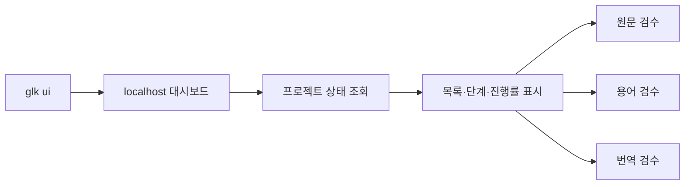

# 로컬 대시보드 설계와 브랜치 작업 이력

이 문서는 `feature/local-dashboard` 브랜치의 임시 설계 기준, 구현 상태와 작업 재개 방법을 함께 기록합니다. 다른 컴퓨터에서 이어서 개발할 때 이 문서를 먼저 확인하고, 브랜치를 `main`에 머지하기 직전에 삭제합니다.

**현재 범위**: GUI 1단계 — 프로젝트 상태를 읽고 기존 검수 화면을 여는 localhost 대시보드

---

## 목표

터미널 명령을 모두 기억하지 않아도 전체 프로젝트와 현재 단계를 한 화면에서 확인하고, 준비된 원문·용어·번역 검수 화면을 바로 열 수 있게 합니다.



### 1단계에서 하는 일

- `glk ui`로 `127.0.0.1` 전용 서버를 실행하고 기본 브라우저를 엽니다.
- 모든 프로젝트의 이름, ID, 원문 종류, 진행 단계와 주의 상태를 표시합니다.
- 검색과 진행 중·완료·확인 필요 필터를 제공합니다.
- 15초마다 API만 다시 조회해 페이지 전체 새로고침 없이 상태를 갱신합니다.
- 준비가 끝난 기존 `source`, `glossary`, `translation` 검수 화면으로 현재 탭에서 이동합니다. 검수 후 브라우저 뒤로가기로 대시보드에 돌아옵니다.
- 대시보드가 종료되면 대시보드에서 연 검수 서버도 함께 종료합니다.

### 1단계에서 하지 않는 일

- 프로젝트 생성과 삭제
- PDF·이미지 업로드
- 원문 추출, OCR, 번역 같은 장시간 작업 실행
- 검수 내용을 대시보드 카드에서 직접 수정
- 데스크톱 앱 패키징

기존 검수 화면은 편집 기능을 그대로 제공하지만, 대시보드 화면 자체는 읽기 전용입니다.

---

## 사용자 실행 방법

저장소 최상위에서 가상환경을 활성화한 뒤 실행합니다.

```bash
glk ui
```

브라우저를 자동으로 열지 않거나 포트를 고정할 수 있습니다.

```bash
glk ui --no-open --port 8765
glk ui --workspace-root 다른/workspaces
```

`Ctrl+C`로 대시보드를 종료합니다.

---

## 코드 구성

| 파일 | 책임 |
|---|---|
| `src/glk/application/dashboard_service.py` | 프로젝트 목록과 상태를 UI용 read model로 조합 |
| `src/glk/infrastructure/dashboard_server.py` | localhost HTTP API, 보안 검사, 검수 서버 수명주기 |
| `src/glk/web/dashboard.html` | 외부 의존성 없는 반응형 HTML/CSS/JavaScript 화면 |
| `src/glk/cli.py` | `glk ui` 인자와 서버 진입점 |
| `tests/test_dashboard_service.py` | 빈 workspace와 프로젝트 상태 view model 검증 |
| `tests/test_dashboard_server.py` | 페이지·API 보호와 검수 화면 실행 검증 |

대시보드는 workspace 파일을 직접 해석하거나 수정하지 않습니다. `project_service`의 `list_projects()`와 `inspect_project()`를 통해 상태를 읽고, 검수 화면을 열 때도 기존 `create_*_review_server()`를 재사용합니다.

---

## API 계약

모든 API는 대시보드 HTML에 삽입된 임의 세션 token을 `X-GLK-Token` 헤더로 전달해야 합니다.

### `GET /api/dashboard`

```json
{
  "ok": true,
  "schema_version": 1,
  "workspace_root": "workspaces",
  "summary": {
    "projects": 2,
    "in_progress": 1,
    "completed": 1,
    "needs_attention": 0
  },
  "projects": [
    {
      "project_id": "primal",
      "name": "Primal Rulebook",
      "source_type": "pdf",
      "stage": "source_review",
      "stage_label": "원문 검수",
      "progress": 25,
      "pipeline": {},
      "reviews": {
        "source": {
          "enabled": true,
          "reason": "원문 검수 화면을 열 수 있습니다."
        }
      }
    }
  ],
  "warnings": []
}
```

`pipeline`에는 `glk status`와 같은 내부 단계 상태가 들어갑니다. `reviews`의 `enabled`와 `reason`은 버튼 활성화와 사용자 설명에 사용합니다.

### `POST /api/review/open`

요청:

```json
{
  "project_id": "primal",
  "review_type": "source"
}
```

`review_type`은 `source`, `glossary`, `translation` 중 하나입니다.

응답:

```json
{
  "ok": true,
  "url": "http://127.0.0.1:54321/"
}
```

동일한 프로젝트·검수 종류의 서버가 이미 실행 중이면 기존 주소를 재사용합니다.

---

## 보안과 수명주기

- 대시보드와 하위 검수 서버는 `127.0.0.1`에만 bind합니다.
- API는 임의 세션 token, `Host`, `Origin`을 함께 검사합니다.
- HTML, CSS, JavaScript는 패키지 내부 파일만 사용하며 외부 CDN을 호출하지 않습니다.
- 요청 크기를 제한하고 JSON object 형식만 허용합니다.
- 브라우저에 표시하는 오류는 공통 `code/message/detail` 구조를 사용합니다.
- 대시보드 서버 종료 시 대시보드가 시작한 하위 검수 서버에 `shutdown()`과 `server_close()`를 호출합니다.

---

## 다음 단계 후보

2단계에서는 아래 항목을 한 묶음으로 검토합니다.

1. 대시보드에서 프로젝트 생성
2. PDF 한 개 또는 이미지 폴더 등록
3. 원문 입력 종류와 모델·prompt 설정

3단계에서는 추출·OCR·번역 같은 장시간 작업을 background job으로 실행하고 진행률과 로그를 표시합니다. 브라우저 요청 thread에서 LLM 작업을 직접 실행하지 않으며, 취소·재시도·중복 실행 방지 정책을 먼저 정해야 합니다.

---

## 브랜치 작업 이력

### 2026-07-24 — GUI 1단계

- `v1.1.0`이 반영된 `main`에서 `feature/local-dashboard` 브랜치를 생성하고 원격에 게시했습니다.
- 대시보드 범위를 읽기 전용 프로젝트 목록과 기존 검수 화면 연결로 확정했습니다.
- `dashboard_service.py`에 프로젝트 상태 read model과 검수 가능 조건을 추가했습니다.
- `dashboard_server.py`에 localhost API와 하위 검수 서버 관리 기능을 추가했습니다.
- `dashboard.html`에 요약, 검색, 필터, 단계 카드, 자동 갱신과 검수 버튼을 추가했습니다.
- `glk ui`, `--workspace-root`, `--port`, `--no-open` 옵션을 추가했습니다.
- 대시보드 application·HTTP·CLI 테스트를 추가했습니다.
- Orca 내장 브라우저에서 빈 workspace와 프로젝트 카드, 검색, 진행/완료 필터, 자동 갱신을 확인했습니다.
- Orca가 JavaScript 팝업을 숨은 창으로 처리하는 호환 문제를 확인해 검수 화면은 현재 탭에서 열고 뒤로가기로 복귀하도록 확정했습니다.
- 원문 검수 준비 상태에서 버튼 활성화 → 기존 원문 검수 화면 이동 → 대시보드 복귀를 확인했으며 브라우저 콘솔 오류는 없었습니다.
- 사용자 화면 피드백을 반영해 제목을 `Game Localization Kit Dashboard`로 변경하고 중복 안내 문구와 15초 자동 갱신을 제거했습니다. 상태는 최초 진입과 사용자의 `새로고침` 요청 때만 조회합니다.
- 요약 숫자와 진행률 숫자를 중간 굵기의 산세리프 tabular numeral로 변경했습니다.
- 대문 제목도 나머지 화면과 일관된 산세리프 글꼴로 변경했습니다.

검증 결과:

```text
python -m unittest discover -s tests
→ 116 tests OK

python -m compileall -q src tests
→ OK

Python 3.10 feature grammar parse
→ src/tests 61 files OK

python -m mypy
→ dashboard 포함 10 files, no issues

python -m pip check
→ no broken requirements

dashboard.html JavaScript compile check
→ OK

git diff --check
→ OK
```

---

## 다른 컴퓨터에서 작업 재개

```bash
git fetch origin
git switch feature/local-dashboard
python -m venv .venv
```

가상환경 활성화 후 개발 의존성을 설치합니다.

```bash
# macOS / Linux
source .venv/bin/activate
pip install -e ".[dev]"

# Windows PowerShell
.\.venv\Scripts\Activate.ps1
pip install -e ".[dev]"
```

현재 상태를 확인합니다.

```bash
git status
python -m unittest discover -s tests
glk ui --no-open
```

### 작업 재개 체크리스트

- [x] 대시보드 read model
- [x] localhost 대시보드 서버와 API
- [x] 프로젝트 카드 UI와 자동 갱신
- [x] 기존 세 검수 화면 실행
- [x] `glk ui` CLI
- [x] 단위·HTTP 테스트
- [x] 전체 테스트와 Python 3.10 문법 검증 최종 기록
- [x] 실제 Orca 브라우저 시각·동작 검증 최종 기록
- [ ] GUI 1단계 커밋과 push
- [ ] GUI 2단계 범위 확정

다음 작업자는 이 체크리스트와 `git status`, 최신 커밋을 함께 확인하고 이어서 작업합니다. 구현 범위나 API가 바뀌면 코드와 같은 커밋에서 이 문서의 설계·이력·체크리스트도 갱신합니다.
