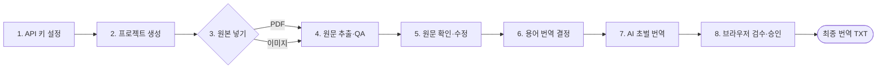

# Game Localization Kit

[](https://github.com/JJUN777/game-localization-kit/actions/workflows/ci.yml)

보드게임 영어 룰북과 이미지를 한국어로 번역하는 CLI 도구입니다.

PDF에서 원문을 읽고, AI가 초벌 번역을 만들고, 사람이 원문과 번역을 각각 확인한 뒤 최종 한국어 TXT를 완성합니다. Windows와 macOS에서 같은 `glk` 명령을 사용합니다.

## 이 도구가 하는 일

1. PDF 룰북의 읽기 순서를 복원하거나, 이미지에서 글자를 인식합니다.
2. 사람이 원본과 비교해 잘못 읽힌 부분을 수정합니다.
3. 반복되는 게임 용어의 한국어 번역을 정합니다.
4. 정해진 용어를 반영해 AI가 초벌 번역을 만듭니다.
5. 사람이 번역을 검수하고 최종 승인합니다.

AI가 읽은 원문과 초벌 번역을 그대로 최종 결과로 사용하지 않습니다. 원문을 한 번, 번역을 한 번 사람이 확인하도록 구성되어 있습니다.

> 아래 8단계를 시작하기 전에 [설치](#설치)를 먼저 완료하세요.

## 빠른 시작: 8단계



### 1. Gemini API 키 설정

[Google AI Studio](https://aistudio.google.com/apikey)에서 API 키를 발급받고
`glk ui`의 `AI 설정`에서 저장합니다. source checkout에서는 저장소 최상위
`.env`를 사용하고, 일반 설치에서는 macOS
`~/Library/Application Support/game-localization-kit`, Linux
`${XDG_CONFIG_HOME:-~/.config}/game-localization-kit`, Windows
`%APPDATA%\game-localization-kit` 아래의 `.env`를 사용합니다.

```dotenv
GEMINI_API_KEY=발급받은_API_키
GEMINI_MODEL=gemini-2.5-flash
```

경로를 직접 정하려면 `GLK_SETTINGS_ROOT` 환경변수 또는
`glk ui --settings-root <디렉터리>`를 사용합니다. API 키는 저장 여부만
표시하고 저장된 값은 브라우저로 다시 보내지 않습니다.

### 2. 프로젝트 생성

```bash
glk init "Primal Rulebook" --project-id primal
```

프로젝트 이름에는 한글을 사용할 수 있습니다. 실제 폴더명이 되는 프로젝트 ID는
운영체제 간 호환성을 위해 영문 소문자, 숫자, 밑줄(`_`)만 사용합니다.

### 3. PDF 또는 이미지 넣기

```text
workspaces/primal/01_input/pdf/      # PDF 한 개
workspaces/primal/01_input/images/   # OCR할 이미지
```

### 4. 원문 추출과 QA 준비

```bash
glk run --project primal
```

대시보드에서는 원본 등록 후 카드의 `PDF 원문 준비 시작` 또는
`이미지 OCR 및 원문 준비 시작`으로 같은 흐름을 background job으로 실행합니다.
동시에 하나만 실행하며 실패하면 완료된 cache를 유지한 채 재시도할 수 있습니다.

### 5. 원문 확인과 승인

원본 페이지·이미지와 추출문을 나란히 보며 수정한 뒤 화면에서 승인합니다.

```bash
glk review source --project primal
```

### 6. 용어 번역 결정

```bash
glk glossary build --project primal
glk review glossary --project primal
```

브라우저 표에서 각 용어의 상태와 번역어를 정한 뒤 `검증 및 termbase 생성`을 누릅니다. `review` 상태가 남아 있으면 다음 단계로 넘어갈 수 없으므로 모든 용어를 `approved`, `keep`, `rejected` 중 하나로 결정합니다.

### 7. AI 초벌 번역

```bash
glk translate --project primal
```

### 8. 브라우저에서 번역 검수와 최종 승인

```bash
glk review translation --project primal
```

번역을 수정하고 QA와 최종 승인을 마치면 다음 파일이 완성됩니다.

```text
PDF:    workspaces/primal/05_output/<PDF 파일명>_kor.txt
이미지: workspaces/primal/05_output/<이미지 파일명>_kor.txt
        workspaces/primal/05_output/combined_kor.txt
```

`glk ui`를 사용하면 최종 번역이 승인된 프로젝트 카드에서 위 결과 파일을
바로 다운로드할 수 있습니다. 이미지 프로젝트는 이미지별 TXT와 통합본을
각각 표시합니다.

처음에는 위 8단계만 따라가면 됩니다. 각 단계의 세부 옵션과 내부 파일 규칙은 아래 상세 설명에서 확인합니다.

---

## 준비물

- Python 3.10 이상
- Gemini API 키 ([발급 방법](https://aistudio.google.com/apikey))
- 번역할 PDF 하나 또는 OCR할 이미지 폴더
- 웹 브라우저 (검수 화면용)

지원하는 이미지 형식: PNG, JPG, JPEG, WebP

## 설치

```text
game-localization-kit/
├── README.md
├── pyproject.toml
├── src/                  # GLK 프로그램 코드
├── tests/                # 자동 테스트
├── docs/                 # 상세 문서
└── workspaces/           # 프로젝트 작업 공간 (Git 제외)
```

### macOS / Linux

```bash
cd game-localization-kit
python3 -m venv .venv
source .venv/bin/activate
pip install --upgrade pip    # 의존성 호환을 위해 pip을 최신으로
pip install -e .
```

### Windows PowerShell

```powershell
cd game-localization-kit
py -m venv .venv
.venv\Scripts\Activate.ps1
python -m pip install --upgrade pip
pip install -e .
```

### 설치 확인

```bash
glk --help
glk version
```

`glk 1.1.0`과 명령 목록이 표시되면 정상입니다.

### `glk: command not found`가 나오면

가상환경이 활성화되지 않은 경우가 대부분입니다.

```bash
# macOS/Linux
source .venv/bin/activate

# Windows PowerShell
.\.venv\Scripts\Activate.ps1
```

그래도 안 되면 저장소 최상위에서 `pip install -e .`을 다시 실행합니다.

---

## 비용 요약

GLK는 원문 읽기 순서 복원, 이미지 OCR, 초벌 번역에만 Gemini API를 사용합니다. 원문 QA, 용어집, 번역 QA, 검수 화면은 모두 로컬 처리이므로 비용이 없습니다.

```text
보통 영어 룰북 1페이지 (약 1,000~1,500자)
├── PDF 읽기 순서 복원: 약 10~20원
├── 초벌 한국어 번역:   약  5~15원
└── 합계:               약 15~35원/페이지

이미지 OCR 1장:         약  3~15원
```

위 금액은 `gemini-2.5-flash`, 1달러=1,550원, 무료 할당량 미적용 기준입니다. Gemini 무료 티어 범위 안에서 사용하면 비용은 0원입니다. 자세한 계산은 [LLM 사용량과 비용](docs/COSTS.md)을 참고합니다.

---

## 현재 제한사항

- 한국어 번역 전용 (다른 언어 지원은 아직 없음)
- Gemini API만 지원 (다른 LLM provider 미지원)
- 프로젝트당 PDF 1개 (여러 PDF는 프로젝트를 나눠야 함)
- 설치형 실행 파일과 데스크톱 GUI 없음
- 스캔 PDF는 이미지로 변환 후 이미지 OCR 흐름 사용

---

## 프로그램과 사용자가 나누어 하는 일


| 단계      | 프로그램이 하는 일                 | 사용자가 하는 일           |
| ------- | -------------------------- | ------------------- |
| 프로젝트 준비 | 전용 폴더 생성                   | 프로젝트 이름 지정          |
| 원문 읽기   | PDF 순서 정리 또는 이미지 글자 인식     | PDF 또는 이미지 폴더 선택    |
| 원문 확인   | 의심되는 숫자·아이콘·글자 위치 표시       | 원본과 비교해 잘못 읽힌 문장 수정 |
| 용어 정리   | 반복되는 이름과 게임 용어 후보 수집       | 사용할 한국어 번역어 결정      |
| 초벌 번역   | 정해진 용어를 반영해 AI 번역 생성       | 번역 문체 지침이 필요하면 작성   |
| 번역 확인   | 숫자·아이콘·용어 검사와 오류 문장 선택 재번역 | 브라우저에서 번역 수정        |
| 완료      | 검사를 통과한 최종 TXT 생성          | 최종 승인               |


사용자가 직접 판단해야 하는 핵심은 세 가지입니다.

1. 프로그램이 원문을 제대로 읽었는지 확인합니다.
2. 게임 용어를 어떤 한국어로 번역할지 정합니다.
3. AI 초벌 번역을 읽고 자연스럽게 수정합니다.

---

## 상세 가이드

위 8단계를 따라가다가 옵션이나 세부 동작이 궁금할 때 아래를 참고합니다.

### API 키와 모델 설정

`game-localization-kit/.env`에 키와 기본 모델을 넣습니다.

```dotenv
GEMINI_API_KEY=your_api_key_here
GEMINI_MODEL=gemini-2.5-flash
```

`GEMINI_MODEL`을 생략하면 프로그램 기본값인 `gemini-2.5-flash`를 사용합니다. 셸이나 CI에 이미 설정한 환경변수가 `.env`보다 우선합니다.
대시보드의 `AI 설정`에서는 Flash·Pro 프리셋 또는 직접 입력한 모델을 선택할
수 있습니다. 키 입력칸을 비우고 저장하면 기존 키를 유지합니다. 드롭다운
목록과 갱신 방법은 [Gemini 모델 목록 관리](docs/GEMINI_MODELS.md)에 정리되어
있습니다.

API 키를 넣으면 안 되는 곳:

- JSON 설정 파일, README, prompt 파일, 로그, Git에 추적되는 파일

`.env`는 `.gitignore`에 포함되어 Git에서 제외됩니다. 키가 공개 저장소에 노출됐다면 파일에서 지우는 것만으로 부족하고 해당 키를 폐기하고 새로 발급해야 합니다.

#### 실행별 모델 변경

```bash
glk run --project primal --model gemini-2.5-flash
glk translate --project primal --model gemini-2.5-pro
```

모델 결정 우선순위: `--model` &gt; 환경변수/`.env` &gt; 프로그램 기본값

모델을 바꾸면 이전 캐시와 달라져 관련 단계를 다시 실행하거나 `stale`로 표시될 수 있습니다.

### LLM을 사용하는 작업과 전송 범위


| 작업        | Gemini가 하는 일                | 전송되는 주요 데이터                                |
| --------- | --------------------------- | ------------------------------------------ |
| PDF 원문 획득 | fragment 읽기 순서와 block 묶음 판정 | 현재 PDF 페이지 이미지, fragment ID·텍스트·좌표         |
| 이미지 OCR   | 이미지 한 장의 원문과 아이콘 token 인식   | OCR 대상 이미지 한 장, 공통·개별 OCR prompt           |
| 초벌 번역     | 승인된 원문 block을 한국어로 번역       | 현재 source block, 관련 termbase 항목, 번역 prompt |
| 오류 선택 재번역 | QA ERROR가 있는 block만 다시 번역   | 해당 ERROR block과 관련 용어·번역 지침                |


프로젝트 workspace 전체를 한 번에 전송하지 않습니다. 이미지 OCR은 요청마다 대상 이미지 한 장만 보내고, 번역은 현재 처리할 block과 관련 용어만 보냅니다.

검수 브라우저는 `127.0.0.1`에서만 동작하며 외부 CDN이나 script를 불러오지 않습니다. `오류만 재번역`을 실행할 때만 로컬 서버가 대상 ERROR block을 Gemini API로 전송합니다. 재번역은 background job으로 실행되며 검수 화면에서 진행률과 실패 사유를 확인하고 실패 뒤 다시 시도할 수 있습니다.

---

### 프로젝트 만들기

```bash
glk init "Primal Rulebook" --project-id primal
```

- `Primal Rulebook`: 화면과 manifest에 표시되는 프로젝트 이름
- `primal`: 폴더명과 CLI에서 계속 사용하는 고정 ID

프로젝트 ID를 생략하면 영문 프로젝트 이름에서 자동 생성합니다. 프로젝트 이름이
한글이면 `--project-id`에 영문 소문자, 숫자, 밑줄(`_`)로 된 ID를 지정해야 합니다.

```bash
glk init "Primal Rulebook"
```

생성 결과:

```text
workspaces/primal/
├── 01_input/
│   ├── pdf/       # PDF 한 개
│   └── images/    # OCR할 이미지와 선택적 prompt
└── project.json
```

---

### 번역할 원본 넣기

#### PDF를 번역하는 경우

프로젝트당 PDF 한 개만 처리합니다. `01_input/pdf/`에 넣습니다.

```text
workspaces/primal/01_input/pdf/rulebook.pdf
```

여러 PDF를 넣으면 프로그램이 임의로 선택하지 않고 실행을 중단합니다. 본판·확장 룰북이 따로 있으면 프로젝트를 각각 만듭니다.

#### 이미지를 번역하는 경우

이미지를 `01_input/images/`에 넣습니다. 하위 폴더도 그대로 사용할 수 있습니다.

```text
workspaces/cards/01_input/images/
├── ocr_prompt.txt            # 모든 이미지에 적용할 OCR 지침
├── characters/
│   ├── card-001.jpg
│   └── card-001.jpg.prompt.txt  # 이 이미지에만 추가할 지침
└── items/
    └── card-002.png
```

`ocr_prompt.txt`는 `glk init`에서 게임 중립적인 편집 템플릿으로 자동 생성됩니다.
프로젝트에서 실제로 사용하는 아이콘과 고정 읽기 순서가 있을 때만 내용을
추가합니다. 이미지 원본을 대시보드에서 등록하거나 교체할 때는 현재 내용을
UI에서 바로 확인·수정할 수 있습니다. OCR 시작 전에는 프로젝트 카드의
`OCR 프롬프트 수정`으로 원본 파일을 교체하지 않고 이 파일만 저장할 수도
있습니다. Elder Scrolls POC에서 사용한 상세 prompt는
`src/glk/templates/elder_scrolls_ocr_prompt.example.txt`에 예제로 보존합니다.

아이콘은 참조 이미지를 매 요청마다 보내지 않고 prompt에 시각적 특징과 출력 token을 설명합니다.

```text
- {DEFENSE}: 속이 빈 방패 외곽선. 중앙에는 다른 문양이 없음.
- {HEALTH}: 위쪽이 두 갈래로 둥글고 아래쪽이 뾰족한 하트 실루엣.
정의하지 않은 아이콘은 [ICON: concise visible description]으로 표시한다.
```

#### PDF 유형에 따른 입력 방법


| PDF 유형     | 확인 방법                  | 권장 입력                        |
| ---------- | ---------------------- | ---------------------------- |
| 일반 PDF     | 글자를 마우스로 선택·복사할 수 있음   | PDF 파일 그대로 사용                |
| 스캔 PDF     | 페이지가 통째로 이미지, 글자 선택 불가 | 페이지를 번호 붙은 이미지로 변환 후 이미지 폴더로 |
| Hybrid PDF | 선택 가능한 페이지와 스캔 페이지 혼재  | 전체를 이미지로 변환 후 이미지 폴더로        |


---

### 원문 가져오기

#### 대화형 실행

```bash
glk run --project primal
```

`01_input/`에 한쪽에만 원본이 있으면 자동 감지합니다. 양쪽에 모두 있으면 선택을 요청합니다.

#### PDF 옵션

```bash
# 전체 페이지
glk run --project primal --input-type pdf

# 특정 페이지만
glk run --project primal --input-type pdf --pages 1,3-8,12

# 프로젝트 밖의 PDF를 지정 (01_input/pdf/로 한 번 복사 후 등록)
glk run --project primal --input-type pdf --file /다른/위치/rulebook.pdf
```

PDF 처리 방식:

1. PDF 텍스트 레이어에서 원문 fragment와 좌표를 추출합니다.
2. Gemini에 페이지 이미지와 fragment 정보를 전달해 읽기 순서를 판정합니다.
3. 원래 fragment를 이용해 문단과 문장을 재조립합니다.
4. fragment 누락·중복이 있으면 해당 페이지를 최대 3회 요청합니다 (최초 1회 + 재시도 2회).
5. 세 번 모두 실패하면 해당 페이지를 실패로 남깁니다.

#### 이미지 OCR 옵션

```bash
glk run --project cards --input-type images

# 외부 이미지 폴더를 지정 (01_input/images/로 한 번 등록)
glk run --project cards --input-type images --folder card_images/
```

각 요청에는 이미지 한 장만 전달되며, 결과는 이미지별 TXT와 통합 TXT로 생성됩니다.

#### `glk run`이 자동으로 수행하는 작업

1. PDF 추출·레이아웃 복원 또는 이미지 OCR
2. PDF와 이미지 결과를 같은 SourceBlock 구조로 정규화
3. 자동 기준본과 사람 검토본 생성
4. LLM을 호출하지 않는 로컬 원문 QA

한 단계만 다시 실행하거나 문제를 진단할 때는 `extract`, `ocr`, `segment`, `qa` 명령을 개별 사용할 수 있습니다.

---

### 원문 QA와 사람 검수

`glk run`이 완료되면 다음 파일을 확인합니다.


| 파일                     | 역할                       | 수정      |
| ---------------------- | ------------------------ | -------: |
| `02_source/draft.txt`  | 자동 추출 결과의 비교 기준          | 수정하지 않음 |
| `02_source/review.txt` | 사람이 PDF·이미지와 비교해 고치는 작업본 | 본문만 수정  |
| `02_source/qa.md`      | 의심 위치, block ID와 검사 근거   | 읽기 전용   |


로컬 QA가 찾는 항목:

- `[ILLEGIBLE]`과 미확정 `[ICON: ...]`
- 손상되거나 허용되지 않은 `{TOKEN}`
- 숫자 주변의 `O/0`, `I/l/1` OCR 혼동 후보
- block ID 중복과 source hash 불일치
- OCR provider가 남긴 판독 경고

QA는 문제 위치만 알려주며 원문을 자동 수정하지 않습니다.

#### 브라우저 검수 화면 (권장)

```bash
glk review source --project primal
```

화면에서 할 수 있는 작업:

- 원본 PDF 페이지 또는 OCR 이미지와 추출 block 나란히 비교
- 기존 block 본문 수정
- 같은 페이지·이미지 안에서 block 순서 변경
- 잘못 추출된 block 제외
- 원본 위에서 빠진 영역을 드래그하고 새 block 추가
- 저장, 검사와 최종 승인

서버는 localhost에서만 열리며 `Ctrl+C`로 종료합니다.

#### 텍스트 편집기 검수

브라우저를 사용하지 않으면 `02_source/review.txt`를 직접 수정합니다.

```text
[[GLK_REVIEW version=2]]

[PAGE 7]
[BLOCK pdf-p0007-b0012-xxxxxxxxxx]
Increase your HP by 10.
[[GLK_END pdf-p0007-b0012-xxxxxxxxxx]]
```

`[PAGE]`, `[BLOCK]`, `[[GLK_END]]` marker는 수정하지 않습니다. 본문만 고칩니다.

---

### 최종 원문 승인

브라우저의 `최종 승인` 버튼을 사용하거나, CLI에서 실행합니다.

```bash
glk review finalize --project primal --dry-run   # 파일 생성 없이 검사만
glk review finalize --project primal             # 실제 최종화
```

검사 항목: marker·block 순서, 빈 본문, 미해결 OCR 표시, 보호 token 구조, stale 여부

생성 파일:

- `02_source/final.txt`
- `.glk/segments/approved_source.jsonl`

후속 단계는 현재 hash가 유효한 `approved_source.jsonl`만 사용합니다.

---

### 용어집 만들기

승인된 원문에서 용어 후보를 수집합니다. Gemini를 호출하지 않습니다.

```bash
glk glossary build --project primal
```

생성 파일: `03_terminology/glossary_review.tsv`

#### 브라우저에서 용어 검토 (권장)

```bash
glk review glossary --project primal
```

HTML 표에서 원문 용어와 실제 문맥을 보면서 상태·번역어·분류·메모를 수정합니다.

| status | 의미 |
|---|---|
| `review` | 아직 검토하지 않음 |
| `approved` | 지정한 번역어를 일관되게 사용 |
| `keep` | 번역하지 않고 원문 표기를 유지 |
| `rejected` | 용어집에서 제외 |

모든 용어를 `review` 외의 상태로 결정해야 다음 단계로 넘어갈 수 있습니다. `approved`에는 번역어가 필수입니다.

자동 후보에 없는 용어는 `+ 수동 용어` 버튼이나 TSV 마지막에 직접 추가합니다. `검증 및 termbase 생성`을 누르면 TSV 저장과 import를 연속 실행합니다.

#### CLI로 termbase 생성

TSV를 스프레드시트로 직접 편집한 경우:

```bash
glk glossary import \
  --project primal \
  --file 03_terminology/glossary_review.tsv
```

생성 파일: `03_terminology/termbase.json`

기존 TSV가 있을 때 `glk glossary build`를 다시 실행해도 사람의 편집을 덮어쓰지 않습니다. `--force`는 기존 편집을 초기화하므로 백업 후에만 사용합니다.

---

### 초벌 번역

승인 원문과 termbase가 모두 현재 상태일 때 번역할 수 있습니다.

```bash
glk translate --project primal --dry-run   # API 없이 계획 확인
glk translate --project primal             # 실제 번역
```

게임별 문체 규칙을 지정하려면 UTF-8 prompt 파일을 사용합니다.

```bash
glk translate --project primal --prompt prompts/primal_translation.txt
```

번역 지침 예시:

```text
한국어 보드게임 룰북 문체로 번역한다.
명령문은 간결한 해요체 대신 설명서 문체를 사용한다.
능력명은 용어집 표기를 우선한다.
불필요한 의역이나 원문에 없는 설명을 추가하지 않는다.
```

최종 prompt 우선순위:

1. ID, 순서, 숫자, token과 HTML 보존 규칙 (변경 불가)
2. termbase의 확정 용어
3. 프로젝트 `04_translation/prompt.txt`
4. 프로그램 기본 문체

프로젝트 prompt와 termbase가 충돌하면 termbase가 우선합니다.

`glk ui`에서는 프로젝트 카드의 `번역 프롬프트 설정`에서 Gemini를 호출하지
않고 지침만 미리 저장·수정할 수 있습니다. 초벌 번역이 생성된 뒤 프롬프트를
바꾸면 기존 결과는 stale이 되며, 카드의 `변경된 프롬프트로 전체 재번역`에서
명시적으로 다시 실행합니다. 재번역 전 기존 prompt·draft·review·QA·최종
출력은 `04_translation/revisions/translation_restart_*`에 보관됩니다.

```bash
glk translate --project primal --resume   # 중단 후 이어서 실행
```

완료 청크는 append와 SHA-256 checkpoint로 보존됩니다. checkpoint 반영 전에
중단된 파일 꼬리는 이어서 실행할 때 자동으로 제거하며, 청크 번역이 끝난 뒤
검수 파일 생성 중 끊긴 경우 Gemini를 다시 호출하지 않고 산출물만 완성합니다.

생성 파일:

| 파일 | 역할 |
|---|---|
| `04_translation/draft.txt` | 자동 번역 기준본 |
| `04_translation/review.txt` | 사람이 수정하는 번역 작업본 |
| `04_translation/prompt.txt` | 프로젝트에 등록된 번역 지침 |

---

### 번역 검수

#### 브라우저 검수 화면 (권장)

```bash
glk review translation --project primal
```

화면에서 할 수 있는 작업:

- block별 원문과 번역 나란히 비교
- 원문·번역·block ID 검색
- 오류·경고·수정된 block 필터
- 번역 본문 수정과 안전 저장
- 로컬 QA 실행
- QA ERROR인 문장만 Gemini로 재번역
- QA 오류가 없는 번역 최종 승인

PASS는 숫자·token·용어 자동 검사 통과를 뜻할 뿐, 문장 품질 승인이나 편집 잠금이 아닙니다. 모든 번역 칸을 수정할 수 있습니다.

서버는 `127.0.0.1`에만 열리고 `Ctrl+C`로 종료합니다. 브라우저를 자동으로 열지 않으려면:

```bash
glk review translation --project primal --no-open --port 8765
```

#### 텍스트 편집기 검수

`04_translation/review.txt`의 `[TRANSLATION]` 본문만 수정합니다.

```text
[BLOCK pdf-p0001-b0001-...]
[ORIGINAL]
Each Hunter gains 2 Stamina.
[TRANSLATION]
각 사냥꾼은 스태미나 2를 얻습니다.
[[GLK_END pdf-p0001-b0001-...]]
```

`[ORIGINAL]` 본문과 marker는 변경하지 않습니다.

#### CLI로 QA와 최종 승인

```bash
glk translation qa --project primal

# ERROR block만 재번역 (선택)
glk retry --failed --project primal

glk translation finalize --project primal --dry-run
glk translation finalize --project primal
```

최종 승인을 차단하는 대표 오류:

- block ID, 순서, marker 또는 원문 변경
- 빈 번역, block 누락·추가
- 숫자, `{TOKEN}`, `[TOKEN]`, HTML 태그 변경
- `approved` 용어 번역 누락, `keep` 용어 변경
- `[ILLEGIBLE]` 같은 미해결 표시

---

### 최종 결과

```text
PDF 프로젝트:    workspaces/<project_id>/05_output/<PDF 파일명>_kor.txt
이미지 프로젝트: workspaces/<project_id>/05_output/<이미지 파일명>_kor.txt
                 workspaces/<project_id>/05_output/combined_kor.txt
```

PDF 최종본에는 `[PAGE n]`과 구분선을 유지합니다. 이미지별 최종본은 번역문만, `combined_kor.txt`에는 `[SOURCE 파일]` 경계와 구분선을 유지합니다. block ID와 GLK marker는 넣지 않습니다.

---

## 프로젝트 workspace 구조

```text
workspaces/<project_id>/
├── project.json
├── 01_input/                          # 유일한 프로젝트 원본
│   ├── pdf/
│   └── images/
├── 02_source/                         # 원문 획득·검수
│   ├── draft.txt, review.txt, final.txt
│   ├── qa.md
│   └── ocr/
├── 03_terminology/                    # 용어 후보 검토·확정
│   ├── glossary_review.tsv
│   └── termbase.json
├── 04_translation/                    # 번역·검수
│   ├── prompt.txt, draft.txt, review.txt
│   ├── qa.md
│   └── revisions/
├── 05_output/                         # 최종 사용자 결과
└── .glk/                              # 프로그램 내부 데이터 (직접 수정하지 않음)
    ├── cache/
    ├── segments/
    ├── state/
    └── reports/
```

### `draft`, `review`, `final`의 차이

| 파일 | 의미 | 사람이 수정 |
|---|---|---:|
| `draft.txt` | 프로그램이 만든 비교 기준본 | 하지 않음 |
| `review.txt` | 사람이 확인하고 수정하는 작업본 | 본문만 수정 |
| `final.txt` / `05_output/*_kor.txt` | 승인을 통과한 최종 결과 | 직접 수정하지 않음 |

최종 파일을 직접 수정하면 hash가 달라져 `stale` 상태가 됩니다. 수정이 필요하면 해당 단계의 `review.txt`에서 고친 뒤 QA와 finalize를 다시 실행합니다.

---

## 상태 확인과 재실행

```bash
glk projects                    # 전체 프로젝트 목록
glk status --project primal     # 특정 프로젝트 상세 상태
```

프로젝트가 여러 개라면 로컬 대시보드에서 전체 진행 상황을 보고 준비된 검수 화면을 바로 열 수도 있습니다.

```bash
glk ui
```

대시보드에서 새 프로젝트를 만들고, PDF 한 개 또는 이미지 여러 장을 등록할 수
있습니다. 원문 추출·OCR을 시작하기 전에는 기존 원본을 새 파일로 교체할 수 있고,
처리가 시작되면 교체 버튼이 사라집니다. 카드에서 PDF 파일명이나 첫 이미지
파일명과 전체 개수를 확인하고, 이미지가 여러 장이면 전체 파일 목록을 열 수
있습니다. 기존 프로젝트의 휴지통 이동, 전체 진행 상황 조회와 준비된 검수 화면
열기도 지원합니다. 원문 준비, 용어 후보 생성, 초벌 번역은 카드에서 background
job으로 실행할 수 있으며 최종 번역 승인 후에는 결과 파일 목록과 다운로드
버튼이 표시됩니다. 번역 프롬프트는 번역 실행과 별도로 미리 저장할 수 있고,
변경된 프롬프트로 전체 재번역할 때는 기존 결과를 revisions에 보관합니다.

### `glk projects`의 진행 단계

`glk projects`는 각 프로젝트가 전체 흐름에서 어디까지 진행했는지를 보여줍니다.

| 단계 | 의미 |
|---|---|
| `not_started` | 원문 획득 전 |
| `source_review` | 원문 검수 중 |
| `glossary` | 용어집 생성 중 |
| `glossary_review` | 용어 검토 중 |
| `ready_to_translate` | termbase 완료, 번역 가능 |
| `translation_partial` | 초벌 번역이 중간에 멈춤 |
| `translation_review` | 번역 검수 또는 최종 승인 대기 |
| `translation_qa_failed` | 번역 QA 오류가 남아 있음 |
| `completed` | 최종 번역 승인 완료 |

### `glk status`의 세부 상태

`glk status --project <id>`는 각 단계의 현재 상태를 표시합니다.

| 상태 | 의미 |
|---|---|
| `not_ready` | 이전 필수 단계가 완료되지 않음 |
| `pending` | 사람 검토 대기 |
| `current` | 현재 입력과 결과 hash가 일치 |
| `stale` | 입력 또는 편집 파일이 기준과 달라짐 |
| `qa_failed` | QA 오류가 남아 있음 |
| `approved` | 최종 승인 완료 |

같은 입력, 모델, prompt로 다시 실행하면 유효한 캐시를 재사용합니다.

`--force` 사용 시 주의: glossary TSV나 review 파일의 사람 편집을 초기화할 수 있습니다. 새 결과로 완전히 다시 생성하려는 경우, 기존 편집을 비교·백업한 경우에만 사용합니다.

---

## 주요 명령 요약

| 명령 | 용도 |
|---|---|
| `glk ui` | 전체 프로젝트 로컬 대시보드 |
| `glk init` | 프로젝트 workspace 생성 |
| `glk run` | 원문 획득부터 원문 QA까지 통합 실행 |
| `glk review source` | 브라우저 원문 검수 화면 |
| `glk review finalize` | 원문 최종 승인 |
| `glk glossary build` | 용어 후보 TSV 생성 |
| `glk review glossary` | 브라우저 용어 검토 화면 |
| `glk glossary import` | TSV 검증 후 termbase 생성 |
| `glk translate` | Gemini 초벌 번역 |
| `glk review translation` | 브라우저 번역 검수 화면 |
| `glk translation qa` | 번역 로컬 QA |
| `glk retry --failed` | ERROR block만 재번역 |
| `glk translation finalize` | 최종 번역 승인 |
| `glk projects` | 전체 프로젝트 목록 |
| `glk status` | 프로젝트 상태 확인 |

각 명령의 전체 옵션: `glk <명령> --help`

---

## 자주 발생하는 문제

### API 키를 찾지 못함

AI 설정 화면에서 키 적용 상태를 확인합니다. source checkout은 저장소 최상위
`.env`, 일반 설치는 OS별 사용자 설정 디렉터리의 `.env`를 사용합니다.
별도 경로를 사용했다면 모든 실행에서 같은 `GLK_SETTINGS_ROOT`를 지정했는지
확인합니다.

### PDF 결과의 일부 문단 순서가 이상함

`02_source/qa.md`와 원본 PDF를 비교하고, `glk review source`에서 순서를 조정합니다. 구조 오류로 실행 자체가 실패했다면:

```bash
glk run --project primal --verbose
```

### 이미지 OCR에서 아이콘이 잘못 표시됨

`ocr_prompt.txt`의 시각적 설명을 더 구체화합니다. 특정 이미지에만 적용할 규칙은 `이미지파일명.prompt.txt`에 작성합니다.

### glossary import가 차단됨

확인할 항목:
- `review` 상태가 남아 있는가
- `approved` 행의 번역어가 비어 있는가
- 자동 생성된 `candidate_id`를 삭제하거나 수정했는가

### 번역이 중간에 실패함

완료된 청크는 보존됩니다.

```bash
glk translate --project primal --resume
```

### `stale` 상태가 표시됨

승인 이후 원문, termbase, prompt, 또는 review 파일이 변경됐다는 뜻입니다. `glk status`로 원인을 확인하고 기존 편집을 바로 삭제하지 않습니다.

### 브라우저 검수 화면이 열리지 않음

```bash
glk review translation --project primal --no-open --port 8765
```

표시된 localhost 주소를 직접 브라우저에 입력합니다.

---

## 문서 안내

| 문서 | 대상 | 용도 |
|---|---|---|
| [전체 작업 흐름](docs/WORKFLOW.md) | 고급 사용자 | 파일 형식, 단계별 세부 규칙, 재실행 정책 |
| [Gemini 모델 목록](docs/GEMINI_MODELS.md) | 개발자 | 드롭다운 모델 ID와 업데이트 절차 |
| [LLM 사용량과 비용](docs/COSTS.md) | 모든 사용자 | API 호출 단계, token 계산, 비용 예시 |
| [용어집 검토 사양](docs/GLOSSARY.md) | 고급 사용자 | TSV 컬럼, status, import 검증 규칙 |
| [아키텍처](docs/ARCHITECTURE.md) | 개발자 | 코드 계층, 데이터 모델, 승인 구조 |
| [릴리즈 노트](docs/RELEASE_NOTES.md) | 모든 사용자 | 버전별 변경사항, 검증 결과, 알려진 제한 |

처음 사용할 때는 이 README만으로 충분합니다. 세부 규칙이 필요할 때만 `docs/` 문서를 확인합니다.
