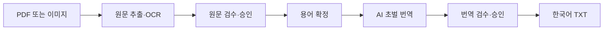

# Game Localization Kit

[](https://github.com/JJUN777/game-localization-kit/actions/workflows/ci.yml)

보드게임 영어 룰북 PDF 또는 이미지를 한국어 TXT로 번역하는 로컬 도구입니다.
브라우저 대시보드와 통합 CLI를 함께 제공하며 Windows와 macOS에서 같은
workspace를 사용합니다.

GLK는 AI 결과를 바로 완성본으로 취급하지 않습니다. PDF 텍스트의 읽기 순서를
Gemini 또는 OpenAI가 재구성하거나 이미지 글자를 OCR한 뒤 사람이 원문을 승인하고, 확정한
용어집으로 초벌 번역을 만든 다음 번역을 다시 검수하도록 설계되어 있습니다.



| 단계 | 프로그램 | 사용자 |
|---|---|---|
| 원문 준비 | PDF 읽기 순서 복원 또는 이미지 OCR | 원본 파일 선택 |
| 원문 검수 | 의심 위치와 로컬 QA 표시 | 실제 파일과 비교해 수정·승인 |
| 용어 정리 | 반복 용어 후보 생성 | 번역, 원문 유지 또는 제외 결정 |
| 초벌 번역 | 용어집과 프롬프트를 반영해 번역 | 문체·표현 지침 확인 |
| 번역 검수 | 숫자·토큰·용어 QA와 오류 선택 재번역 | 자연스러운 문장으로 수정·승인 |
| 완료 | 승인 hash를 확인해 TXT 생성 | PDF 번역본 또는 이미지 통합본·ZIP 저장 |

## 준비물

- Python 3.10 이상
- Gemini API 키 또는 OpenAI API 키
- 텍스트가 포함된 PDF 한 개 또는 PNG/JPG/JPEG/WebP 이미지
- 로컬 웹 브라우저

프로젝트당 PDF는 한 개만 등록할 수 있습니다. 여러 이미지는 한 프로젝트에
함께 등록할 수 있으며 파일명 자연순으로 처리합니다.

## 설치

### macOS / Linux

```bash
git clone https://github.com/JJUN777/game-localization-kit.git
cd game-localization-kit
python3 -m venv .venv
source .venv/bin/activate
python -m pip install --upgrade pip
pip install -e .
```

### Windows PowerShell

```powershell
git clone https://github.com/JJUN777/game-localization-kit.git
cd game-localization-kit
py -m venv .venv
.\.venv\Scripts\Activate.ps1
python -m pip install --upgrade pip
pip install -e .
```

설치 확인:

```bash
glk --version
glk --help
```

> **`glk: command not found`가 나오면?** 가상환경을 다시 활성화한 뒤 저장소
> 최상위에서 `pip install -e .`을 실행하세요.

## GUI 빠른 시작

처음 사용할 때는 로컬 웹 GUI를 권장합니다. 터미널 자동화나 개별 단계 진단이
필요하면 아래 [CLI 빠른 시작](#cli-빠른-시작)을 참고하세요.

대시보드와 세 검수 화면은 공통 디자인 token을 사용하며, 운영체제·브라우저의
설정에 따라 라이트 또는 다크 모드를 자동으로 적용합니다. 앱 내부의 수동 테마
전환 버튼은 제공하지 않습니다.

```bash
glk ui
```

명령을 실행하면 기본 브라우저가 자동으로 열립니다. 브라우저에서는 다음 순서로
진행합니다.

1. 오른쪽 위 `AI 설정`에서 Gemini 또는 OpenAI를 선택하고 API 키와 모델을 저장합니다.
2. `새 프로젝트 만들기`에서 이름과 프로젝트 ID를 정합니다.
3. `PDF 또는 이미지 원본 등록`에서 PDF 한 개 또는 이미지 여러 장을 선택합니다.
4. 프로젝트 카드에서 `PDF 원문 준비 시작` 또는
   `이미지 OCR 및 원문 준비`를 누릅니다.
5. `원문 검수`에서 원본과 추출문을 비교·수정하고 최종 승인합니다.
   PDF 일부 페이지를 처리하지 못하면 원본을 교체하거나 페이지 이미지를 보며
   검수 화면에서 직접 복구할 수 있습니다. `블록 편집`에서는 일괄 선택·제외,
   순서 변경과 `아이콘 검사(AI)`도 사용할 수 있습니다.
   승인 뒤 프로젝트 카드의 `검수 완료 원문 TXT 저장`으로 확정 원문을 저장할 수
   있습니다.
6. `용어 후보 생성 시작` 후 `용어 검수`에서 번역어를 확정합니다. 필요하면
   `후보 1차 정리(AI)`로 아직 검토하지 않은 자동 후보의 추천을 먼저 확인합니다.
7. 필요하면 `번역 프롬프트 설정`을 수정하고 `초벌 번역 시작`을 누릅니다.
8. `번역 검수`에서 QA 항목을 수정하고 최종 승인합니다.
9. 프로젝트 카드의 `최종 번역 결과`에서 PDF 번역본 TXT 또는 이미지 통합본
   TXT·이미지별 결과 ZIP을 저장합니다.

기본 주소는 `http://127.0.0.1:8765/`입니다. 브라우저를 자동으로 열지 않으려면
`glk ui --no-open`을 사용합니다. 8765 포트를 다른 프로그램이 사용 중이면
`glk ui --port 8766`처럼 다른 포트를 지정하세요.

GUI는 `127.0.0.1`에만 열리는 로컬 웹 화면이며 설치형 데스크톱 앱은 아닙니다.
종료하려면 `glk ui`를 실행한 터미널에서 `Ctrl+C`를 누릅니다. 화면별 상세
사용법은 [GUI 사용 가이드](docs/GUI.md)를 참고하세요.

## CLI 빠른 시작

```bash
# 1. 프로젝트 생성
glk init "Sample Rulebook" --project-id sample_rulebook

# 2. workspaces/sample_rulebook/01_input/pdf/에 PDF 한 개를 넣은 뒤 원문 준비
glk run --project sample_rulebook

# 3. 원문 검수와 승인
glk review source --project sample_rulebook

# 4. 용어 후보 생성과 검수
glk glossary build --project sample_rulebook
glk review glossary --project sample_rulebook

# 5. 초벌 번역과 번역 검수
glk translate --project sample_rulebook
glk review translation --project sample_rulebook
```

이미지 프로젝트는 `01_input/images/`에 이미지와 `ocr_prompt.txt`를 넣습니다.
외부 입력 경로와 일부 PDF 페이지 선택은
[전체 작업 흐름 — 명시적 입력 지정](docs/WORKFLOW.md#명시적-입력-지정)을
참고하세요. 중단 뒤 재개와 명시적 초기화 규칙은
[상태와 재실행](docs/WORKFLOW.md#9-상태와-재실행)에 정리되어 있습니다.

## AI 설정과 비용

대시보드의 `AI 설정`에서 Gemini와 OpenAI 중 하나를 선택하고 해당 API 키와
모델을 저장할 수 있습니다. 기존 설치와의 호환을 위해 기본 제공자는 Gemini이며
기본 모델은 `gemini-3.8-flash`입니다. OpenAI의 기본 모델은
`gpt-5.6-terra`입니다. 목록에 없는 실제 API 모델 ID도 직접 입력할 수 있습니다.

API 키는 저장 여부만 브라우저에 표시되며 저장된 값은 다시 보내지 않습니다.
셸의 `GLK_AI_PROVIDER`, 제공자별 API 키와 모델 환경변수가 `.env`보다
우선합니다. CLI에서 OpenAI를 직접 설정하려면 다음 값을 `.env`에 넣습니다.

```dotenv
GLK_AI_PROVIDER="openai"
OPENAI_API_KEY="sk-..."
OPENAI_MODEL="gpt-5.6-terra"
```

Gemini는 기존 `GEMINI_API_KEY`, `GEMINI_MODEL`을 그대로 사용합니다. 제공자를
바꿔도 다른 제공자의 저장된 키와 모델은 삭제하지 않습니다.
설정 위치를 직접 정하려면 `GLK_SETTINGS_ROOT` 또는
`glk ui --settings-root <디렉터리>`를 사용하세요.

선택한 AI API를 사용하는 작업:

- PDF 텍스트의 읽기 순서 복원
- 이미지 OCR
- PDF 원문 검수의 선택 block `아이콘 검사(AI)`
- 용어 검수의 선택 실행 `후보 1차 정리(AI)`
- 초벌 번역과 선택한 오류 문장 재번역

원문·용어·번역의 로컬 QA, 용어 후보 생성과 일반 검수에는 API 비용이 들지
않습니다. 용어 검수에서 AI 정리를 명시적으로 실행하면 API 비용이 발생합니다.
모델별 가격과 예상 사용량은 실행 전에
[LLM 사용량과 비용](docs/COSTS.md)을 확인하세요.

## 주요 workspace 구조

```text
workspaces/<project_id>/
├── project.json
├── 01_input/                 # 등록한 PDF 또는 이미지
├── 02_source/                # 원문 draft, review, QA, 승인본
├── 03_terminology/           # 용어 검수 TSV와 termbase
├── 04_translation/           # 번역 prompt, draft, review, QA, revisions
├── 05_output/                # 최종 승인된 한국어 TXT
└── .glk/                     # cache, segment, state 등 내부 데이터
```

사람이 주로 수정하는 파일은 `02_source/review.txt`,
`03_terminology/glossary_review.tsv`, `04_translation/prompt.txt`,
`04_translation/review.txt`입니다. `.glk/` 내부 파일은 직접 수정하지 마세요.
전체 파일 목록과 `draft`·`review`·`final`의 차이는
[전체 작업 흐름 — 주요 출력 구조](docs/WORKFLOW.md#10-주요-출력-구조)에
있습니다.

## 주요 명령

| 명령 | 용도 |
|---|---|
| `glk ui` | 로컬 대시보드 실행 |
| `glk init` | 프로젝트 생성 |
| `glk run` | 원문 획득부터 source QA까지 통합 실행 |
| `glk extract` / `glk ocr` | PDF 추출 또는 이미지 OCR만 실행 |
| `glk segment` / `glk qa` | 원문 block과 QA 재생성 |
| `glk glossary build` | 용어 후보 생성 |
| `glk translate` | 초벌 번역 |
| `glk review source` | 원문 검수 화면 |
| `glk review glossary` | 용어 검수 화면 |
| `glk review translation` | 번역 검수 화면 |
| `glk retry --failed` | QA 오류 block만 재번역 |
| `glk status` / `glk projects` | 상태 확인 |

각 명령의 옵션은 `glk <명령> --help`로 확인할 수 있습니다.

## 현재 제한사항

- 영어 원문을 한국어로 번역하는 흐름만 지원
- Gemini와 OpenAI Responses API 지원
- 프로젝트당 PDF 한 개
- 스캔 PDF 직접 OCR 미지원: 페이지를 이미지로 변환해 이미지 흐름 사용
- 표·자유 배치 문서의 읽기 순서는 원문 검수에서 사람이 바로잡아야 할 수 있음
- 네이티브 데스크톱 앱과 설치형 실행 파일 없음
- 실행 중인 background job 취소 기능 없음

## 자주 발생하는 문제

### API 키 또는 모델 오류

GUI: `AI 설정`에서 키 설정 여부와 모델 ID를 확인하세요.
CLI: `.env`의 `GLK_AI_PROVIDER`와 선택한 제공자의 키·모델 환경변수 또는 셸
환경변수를 확인하세요.

현재 연결 테스트는 없으며 실제 원문 준비나 번역 요청에서 키·모델·권한·사용량
오류가 확인됩니다.

### 원문 순서나 OCR 문자가 잘못됨

자동 결과를 다시 만드는 대신 `원문 검수`에서 실제 PDF·이미지와 비교해
block 순서와 텍스트를 수정하세요. 이미지 OCR 지침은 처리 시작 전에
`OCR 프롬프트 수정`(GUI) 또는 `01_input/images/ocr_prompt.txt`(CLI)에서
바꿀 수 있습니다. PDF 페이지에 추출 가능한 내장 텍스트가 없으면 부분 실패
카드의 `검수에서 직접 수정`으로 이동해 페이지 이미지를 보며 `[ILLEGIBLE]`
임시 block을 수정하거나 제외하세요.

### 번역이 중간에 실패함

GUI: 프로젝트 카드의 다시 시도 버튼을 사용하세요.
CLI: `glk translate --project <id> --resume`으로 완료된 청크부터 이어서
실행합니다.

완료된 원문 cache와 번역 청크는 가능한 범위에서 재사용됩니다. 대시보드가
작업 중 종료됐다면 재실행 후 `실행 중단` 상태를 확인하고 다시 시도할 수
있습니다.

### `stale` 또는 변경 충돌이 표시됨

사람이 수정한 파일을 자동으로 덮어쓰지 않기 위한 보호 상태입니다.

GUI: 화면의 안내를 따르세요.
CLI: 현재 파일과 새 기준본을 비교한 뒤
[전체 작업 흐름 — 원문 변경 감지와 stale](docs/WORKFLOW.md#원문-변경-감지와-stale)의
명시적 초기화 절차를 따르세요.

## 문서 안내

| 문서 | 내용 |
|---|---|
| [GUI 사용 가이드](docs/GUI.md) | 대시보드와 세 검수 화면의 전체 사용법 |
| [CLI와 workspace 작업 흐름](docs/WORKFLOW.md) | CLI, 파일, 상태 전이와 재실행 규칙 |
| [용어집 검토 사양](docs/GLOSSARY.md) | 용어 상태, 검색·정렬, TSV와 termbase 계약 |
| [아키텍처](docs/ARCHITECTURE.md) | 코드 계층, 데이터 모델, 승인·보안 경계 |
| [LLM 사용량과 비용](docs/COSTS.md) | 전송 데이터, 비용 기준과 측정 한계 |
| [릴리즈 노트](docs/RELEASE_NOTES.md) | 버전별 변경 이력 |

수동 smoke test용 원본은
[`examples/smoke/`](examples/smoke/README.md)에 있습니다. 실제 AI API로
실행하면 사용량과 비용이 발생할 수 있습니다.
