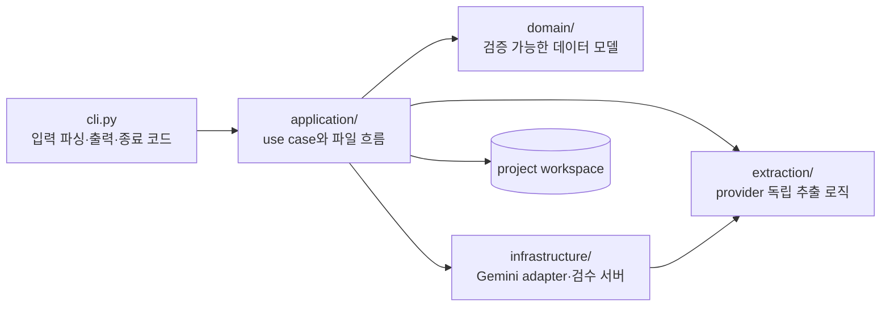

# 아키텍처

이 문서는 GLK의 코드 계층, 핵심 데이터 모델, 캐시와 승인 경계를 설명합니다.

**대상 독자**: GLK 코드를 수정하거나 확장하려는 개발자

일반 사용자는 이 문서를 읽을 필요가 없습니다. 사용 순서는 [README](../README.md), 세부 실행 규칙은 [전체 작업 흐름](WORKFLOW.md)을 참고합니다.

---

## 설계 원칙

1. 번역 전에 사람이 확인한 원문을 확정한다.
2. PDF와 이미지 OCR의 provider별 결과를 같은 source block으로 변환한다.
3. LLM은 OCR, 레이아웃 판정, 초벌 번역에 사용하고, 구조·hash·token 검사는 로컬 코드가 담당한다.
4. 자동 생성 기준본과 사람 작업본을 분리하고 사람의 편집을 자동으로 덮어쓰지 않는다.
5. 모든 후속 데이터는 안정적인 block ID로 원본 파일·페이지·좌표까지 역추적할 수 있어야 한다.
6. 최종 승인 파일과 저장된 hash가 모두 일치할 때만 후속 단계를 실행한다.
7. CLI와 향후 GUI는 같은 application service를 사용한다.
8. Windows와 macOS의 최소·최신 지원 Python 조합을 CI에서 계속 검증한다.

---

## 코드 계층



| 계층 | 책임 | 주요 모듈 |
|---|---|---|
| CLI | 인자, 대화형 입력, 사람이 읽는 출력, 종료 코드 | `cli.py` |
| Application | 프로젝트 단위 use case, 캐시, 원자적 출력, 단계 연결 | 각 `*_service`, `ai_model_catalog`, 공통 `_io`, `_hashing`, `_translation_context`, `translation_types` |
| Domain | 외부 SDK와 파일 포맷에 독립적인 모델·검증 | `project.py`, `source_block.py`, `source_qa.py`, `translation_segment.py`, `translation_qa.py`, `approved_translation.py` |
| Extraction | PDF layout과 이미지 OCR 결과 처리 계약 | `layout.py`, `image_ocr.py` |
| Infrastructure | 외부 모델 adapter와 로컬 대시보드·검수 서버 | `gemini_layout.py`, `gemini_ocr.py`, `gemini_translation.py`, `dashboard_server.py`, `source_review_server.py`, `glossary_review_server.py`, `translation_review_server.py` |

CLI의 통합 명령(`glk run`)과 개별 명령은 application service를 공유합니다. `glk run`은 별도 추출 구현을 갖지 않고 PDF의 `extract_project_pdf()` 또는 이미지의 `ocr_project_images()`를 호출한 뒤 segmentation과 QA service를 연결합니다.

CLI와 localhost 검수 서버에서 사용자에게 반환하는 실패 응답은 `error_response.py`를 공유합니다. 응답은 자동 처리와 검색에 쓰는 안정적인 `code`, 사용자에게 표시하는 한글 `message`, 내부 예외와 경로 같은 진단 정보인 `detail`로 구성합니다. 브라우저는 `message`를 표시하고 `detail`은 문제 진단용으로 보존합니다.

원문·용어·번역 검수 화면에 전달하는 document 구조는 `application/review_types.py`의 `TypedDict` 계약으로 정의합니다. 검증 전 외부 JSON은 계속 `Any`로 받고 service에서 검증한 뒤 typed document로 반환합니다. 이 타입은 IDE와 정적 분석을 위한 것이며 런타임 데이터 검증은 기존 service 규칙이 담당합니다.

`.github/workflows/ci.yml`은 push, pull request, 수동 실행 때 Windows와 macOS에서 Python 3.10·3.14 조합을 검사합니다. 각 작업은 패키지 설치, 의존성 무결성, Python 구문, 전체 unittest, `glk` entry point를 확인하며 Gemini API 키나 실제 모델 호출은 사용하지 않습니다. 별도 typecheck 작업은 Python 3.10을 기준으로 review API 경계 파일을 `mypy`로 검사하며, 적용 범위는 payload가 복잡해지는 service부터 점진적으로 넓힙니다.

---

## 프로젝트 manifest

`workspaces/<project_id>/project.json`은 프로젝트의 고정 식별 정보와 등록된 원문 위치를 보존합니다.

| 필드 | 의미 |
|---|---|
| `schema_version` | workspace 구조 호환성 버전 (현재 `3`) |
| `project_id` | 플랫폼에 안전한 workspace 식별자 |
| `name` | 사람이 읽는 프로젝트 이름 |
| `profile` | 게임별 설정 프로필 |
| `source_language` / `target_language` | 언어 코드 |
| `source_file` | `01_input/pdf/<파일명>.pdf` 또는 `01_input/images` |
| `created_at` | UTC 생성 시각 |

- 외부 절대 경로나 `..`가 포함된 원문 경로는 저장하지 않습니다.
- 원문을 workspace 안으로 등록한 뒤 상대 경로만 기록합니다.
- `01_input/pdf/`와 `01_input/images/`를 함께 만들고 한쪽에만 원본이 있으면 자동 감지합니다.

---

## 공통 SourceBlock

PDF fragment와 이미지 OCR block은 `.glk/segments/source.jsonl`에서 `SourceBlock`으로 통일됩니다.

| 필드 | 역할 |
|---|---|
| `id` | 원본 위치와 block 순서에서 만든 안정적 ID |
| `source_type` | `pdf` 또는 `image` |
| `source_file`, `page` | 원본 파일과 PDF 페이지 |
| `source_order`, `block_order` | 문서와 원본 내부 읽기 순서 |
| `block_type` | heading, paragraph 등 block 유형 |
| `raw_text` | 자동 획득 원문 (이후에도 보존) |
| `corrected_text` | 사람이 고친 경우에만 저장 |
| `bbox` | provider와 무관한 0~1000 정규화 좌표 |
| `legibility`, `warnings` | OCR 판독 상태와 provider 경고 |
| `source_refs` | PDF fragment ID 등 원본 내부 참조 |
| `source_hash` | `raw_text` 변경 감지용 SHA-256 |
| `status` | `raw`, `flagged`, `corrected`, `approved` |

`effective_text`는 `corrected_text`가 있으면 그 값을, 없으면 `raw_text`를 사용합니다. 사람 수정 때문에 block ID가 바뀌지 않으므로 QA, 용어, 번역과 원본 위치를 계속 연결할 수 있습니다.

---

## 검수 파일과 승인 gate

```text
.glk/segments/source.jsonl
├── 02_source/draft.txt       ← 자동 생성 기준본
└── 02_source/review.txt      ← 사람이 수정
        ↑ glk review source
        │ PDF 렌더 이미지·OCR 원본과 비교
        │ 수정·동일 원본 내 순서 변경·제외·수동 block 추가
        ↓ 브라우저 최종 승인 또는 glk review finalize
02_source/final.txt
.glk/segments/approved_source.jsonl
```

review TXT는 `[PAGE]` 또는 `[SOURCE]`, `[BLOCK]`, `[[GLK_END ...]]` marker로 SourceBlock과 연결됩니다. format version 2가 현재 쓰기 형식이며 version 1도 읽습니다.

브라우저 저장 시 `.glk/state/source_review.json`에 원본 block 순서, 제외 ID와 수동 SourceBlock을 기록하고 review TXT를 원자적으로 다시 만듭니다.

최종화가 확인하는 항목:

- 모든 자동 추출 block이 유지되거나 명시적으로 제외되었는가
- block ID와 marker가 유효하고 순서 변경이 같은 페이지·이미지 안에서만 일어났는가
- 본문이 비어 있거나 미해결 OCR 표시가 남았는가
- 보호 token 구조와 개수가 의도치 않게 바뀌었는가
- review가 현재 draft 기준으로 stale하지 않은가

승인된 JSONL은 `raw_text`를 유지하고 실제 변경만 `corrected_text`에 저장합니다.

---

## 로컬 QA

원문 QA는 결정적인 로컬 규칙만 사용하며 모든 issue의 `auto_fixable`은 현재 `false`입니다. issue는 안정적인 ID, block ID, severity, code, evidence, 원본 위치와 bbox를 가집니다.

프로그램용 `.glk/reports/source_qa.json`과 사람용 `02_source/qa.md`를 함께 생성합니다. 의미 판단이 필요한 항목을 임의 수정하지 않고, 사람이 원본을 확인할 위치만 제공합니다.

---

## 캐시와 stale 판정

각 단계는 결과에 영향을 주는 입력과 설정의 hash를 `.glk/state/*.json`에 기록합니다.

| 단계 | 주요 입력 기준 | state 파일 |
|---|---|---|
| PDF 추출 | 원본 PDF, fragment, 페이지, 모델, prompt version | `pdf_acquisition.json` |
| 이미지 OCR | 이미지 bytes, 공통·개별 prompt, 모델, prompt version | `image_ocr.json` |
| Segmentation | 실제 획득 결과 JSON과 schema version | `segmentation.json` |
| 원문 QA | source JSONL, 허용 token prompt, QA version | `source_qa.json` |
| 사람 승인 | draft/review/final/approved 파일 hash | `source_review.json` |
| 용어 후보 | approved JSONL, 후보 생성 파라미터 | `glossary_build.json` |
| Termbase import | approved JSONL, 정규화된 검토 TSV, termbase hash | `glossary_import.json` |
| 초벌 번역 | approved JSONL, termbase, project prompt, 모델, hard rule·청크 설정 | `translation.json` |
| 번역 승인 | translation JSONL, draft/review, termbase, QA/final 파일 hash | `translation_review.json` |

**stale 판정 규칙:**

- 실행 시각, 캐시 적중 건수처럼 내용에 영향을 주지 않는 메타데이터는 hash에서 제외합니다.
- 자동 생성 결과가 stale이면 재생성합니다.
- 사람이 편집한 review와 glossary TSV는 덮어쓰지 않고 stale 표시만 합니다.

**파일 확정:** application service는 `_io.py`의 공통 writer를 사용합니다. 대상과 같은 폴더에 충돌하지 않는 고유 임시 파일을 만든 뒤 `flush`/`fsync` → `os.replace`로 교체하고, 지원 운영체제에서는 부모 디렉터리도 fsync합니다. 실패하면 임시 파일을 정리합니다. 내용 hash는 `_hashing.py`가 담당하며 대시보드의 한 snapshot 안에서는 `FileHashCache`가 같은 파일의 byte·정규화 text hash를 재사용합니다. 번역과 선택 재번역이 공유하는 원문·termbase·prompt 로딩은 `_translation_context.py`가 담당합니다.

**원본 교체:** 원문 추출·OCR이 시작되기 전만 허용합니다. 기존 PDF·이미지 입력
폴더를 프로젝트 내부 임시 위치로 먼저 이동한 뒤 새 원본을 등록하고, 실패하면
입력 폴더와 manifest를 되돌립니다. 이미지 공통 `ocr_prompt.txt`는 새 입력
폴더로 복사해 유지하며, UI에서 수정한 프롬프트가 있으면 이미지 등록과 같은
트랜잭션 안에서 원자적으로 저장합니다. 원문 처리 결과나 state가 하나라도 있으면 교체를
거부하므로 파생 산출물 정리와 사용자 검수 내용 유실은 발생하지 않습니다.

대시보드 read model의 `source_files`는 PDF 파일명 또는 이미지 입력 루트 기준
상대 경로 목록입니다. 이미지 목록은 source 등록과 같은 자연순 정렬을 사용하며,
카드 요약과 전체 파일 목록 모달이 동일한 배열을 소비합니다.
`ocr_prompt`는 프로젝트의 현재 공통 OCR 지침을 제공하며 이미지 등록·교체
모달과 프롬프트 단독 수정 모달의 초기값으로 사용됩니다. `ocr_prompt_edit`는
등록된 이미지 원본과 `source_processing_started`를 기준으로 단독 수정 가능
여부와 사유를 제공합니다.

---

## 외부 모델 사용 경계

| 단계 | Gemini에 요청하는 것 | Gemini가 하지 않는 것 |
|---|---|---|
| PDF | fragment ID의 읽기 순서와 block 묶음 | 원문 재작성 |
| 이미지 OCR | 이미지 한 장의 원문 인식 | 참조 이미지 반복 첨부 |
| 번역 | 승인 block의 한국어 번역 | termbase/hard rule 무시 |
| 원문·번역 QA | 사용하지 않음 | — |
| 용어 후보 | 사용하지 않음 | — |

- PDF: 응답 후 fragment 누락·중복을 검증하고, 검증 실패 시 해당 페이지를 최대 2회 재시도합니다 (최초 포함 총 3회). 세 번 모두 실패하면 임의 보정 없이 실패로 남깁니다.
- LLM 응답이 구조 검증에 실패하면 로컬 추정 결과로 조용히 대체하지 않고 실패 또는 검토 상태를 남깁니다.

호출 단위, 재시도·캐시가 비용에 미치는 영향은 [LLM 사용량과 비용](COSTS.md)에 기록합니다.

---

## Termbase 승인 구조

```text
03_terminology/glossary_review.tsv
        ↕ localhost HTML 표 편집
        ↓ 구조·ID·원문 근거 검증
03_terminology/termbase.json
.glk/state/glossary_import.json
```

`glk glossary import`는 자동 후보를 다시 생성해 TSV의 candidate ID 집합과 비교합니다. 행을 삭제하는 대신 `rejected`로 남겨야 하며, ID가 비어 있는 행만 수동 용어로 판정합니다.

수동 용어는 승인 원문에서 대소문자와 보수적인 단수·복수 변형을 검색해 ID, 빈도, block ID, 위치와 예문을 다시 계산합니다. `--allow-missing-terms` 없이는 근거가 없는 용어를 허용하지 않습니다.

termbase entry는 source term, translation, category, status, note, variants, occurrences, block IDs, locations, example, origin과 source 검증 여부를 보존합니다. `approved`와 `keep`만 번역 prompt의 활성 용어가 되고 `rejected`는 검토 이력으로 유지됩니다.

---

## 번역 segment와 prompt compiler

`TranslationSegment`는 승인 SourceBlock과 번역문을 `source_block_id`로 연결합니다.

```text
approved SourceBlock
        + current termbase
        + project instructions
        ↓ prompt compiler
hard rules → relevant termbase entries → project instructions → input blocks
        ↓ Gemini JSON response
ID·순서·숫자·token·HTML·용어 검증
        ↓
.glk/segments/translation.jsonl
```

- 프로젝트 prompt는 hard rules와 termbase를 대체하지 않고 지정된 영역에만 삽입합니다.
- 전체 termbase 대신 현재 청크의 source term 또는 variants가 발견된 활성 항목만 전달합니다.
- 응답은 요청 ID와 정확히 일대일이어야 합니다.
- 검증 실패 시 한 번 재요청하고, 다시 실패하면 해당 청크를 저장하지 않습니다.
- 완료된 청크는 원자적으로 보존해 `--resume`에서 재사용합니다.

---

## 번역 검수와 승인 gate

```text
.glk/segments/translation.jsonl
├── 04_translation/draft.txt
└── 04_translation/review.txt
        ↑ glk review translation
        │ localhost HTML 편집·저장·ERROR 선택 재번역
        ├── 04_translation/revisions/translation_retry_*.json
        ├── 04_translation/revisions/translation_prompt_change_*.json
        ├── 04_translation/revisions/translation_restart_*/
        ↓ marker·원문·숫자·token·태그·용어 검사
.glk/reports/translation_qa.json
04_translation/qa.md
        ↓ error 0개
.glk/segments/approved_translation.jsonl
05_output/*_kor.txt
```

- 번역 review parser는 draft의 block 순서와 원문을 기준으로 marker를 대조합니다.
- 사람은 번역 본문만 수정할 수 있으며 원문이나 구조가 바뀌면 최종화를 차단합니다.
- `ApprovedTranslationSegment`는 모델의 `draft_translation`을 유지하고 실제 변경이 있을 때만 `corrected_translation`을 저장합니다.
- 최종 번역은 수정본을 우선하는 effective translation입니다.

최종 TXT에서 block·GLK marker는 제거하고 effective translation만 `source_order` 순서로 기록합니다. 승인 state의 `final_files`는 파일 경로·SHA-256을 보존하며, 하나라도 바뀌면 `stale`로 판정합니다.

---

## 로컬 대시보드와 HTML 검수 서버 보안

`glk ui` 대시보드는 `dashboard_service`가 만든 읽기 전용 프로젝트 상태를 표시하고, 준비된 기존 `source`, `glossary`, `translation` 검수 서버를 필요할 때 실행합니다. 프로젝트 생성과 삭제 요청은 application service의 규칙을 재사용합니다. PDF·이미지 최초 등록은 `source_registration_service`가 CLI와 GUI에 같은 복사·manifest 규칙을 제공하며 AI 작업은 실행하지 않습니다. `dashboard_job_service`는 등록 원본의 acquisition·segmentation·source QA, 승인 원문 기반 용어 후보 생성과 termbase 기반 초벌 번역을 HTTP 요청과 분리된 단일 active worker 정책으로 실행합니다. 최신 실행 상태는 각각 `.glk/state/dashboard_source_job.json`, `.glk/state/dashboard_glossary_job.json`, `.glk/state/dashboard_translation_job.json`에 저장하며 schema와 상위 프로젝트 경로를 검증한 뒤 복원합니다. 용어 후보 생성은 기존 `glossary_service`의 로컬 규칙만 재사용하며 Gemini API를 호출하지 않습니다. `translation_prompt_service`는 초벌 번역과 분리해 프로젝트 prompt를 저장하고 개행 정규화 SHA-256으로 동시 편집 충돌을 차단합니다. 초벌 번역은 기존 `translation_service`의 청크 저장과 resume 규칙을 재사용하고, partial 상태에서 prompt가 바뀌면 이어하기 대신 명시적 전체 재번역만 허용합니다. 전체 재번역은 `translation_restart_service`가 기존 번역·검수·승인·최종 출력 snapshot을 먼저 revisions에 보관하고 성공한 경우에만 새 draft로 검수 상태를 초기화합니다. 번역 검수의 오류 문장 선택 재번역은 `translation_retry_job_service`가 검수 HTTP 요청과 분리해 실행합니다. 시작 요청은 현재 편집을 저장한 뒤 즉시 반환하고 검수 화면은 진행 상태를 조회하며, 실행 중 동시 편집은 잠그지 않고 UI에서 차단한 뒤 최종 저장 시 review hash로 변경 충돌을 거부합니다. 최종 번역이 current이면 승인 state의 `final_files`를 다시 검사해 다운로드 가능한 출력 목록을 read model에 포함합니다. `ai_settings_service`와 Gemini provider는 `config.resolve_settings_root`가 선택한 동일한 `.env`를 사용합니다. 명시적 경로, `GLK_SETTINGS_ROOT`, 검증된 editable checkout, OS별 사용자 설정 디렉터리 순으로 해석하며 키와 모델만 원자적으로 갱신하고 다른 항목과 주석을 보존합니다. `ai_model_catalog`는 패키지의 `data/gemini_models.json`을 검증해 드롭다운 모델 ID와 설명을 제공합니다. API 응답에는 키 값이 아니라 설정 여부와 적용 출처만 포함합니다. 삭제할 때는 정규화된 ID, workspace 바로 아래 경로와 manifest ID를 다시 확인한 뒤 검증된 프로젝트 폴더만 `send2trash`로 운영체제 휴지통에 이동합니다. 대시보드에서 연 검수 서버는 같은 프로젝트와 종류에 대해 재사용하며 대시보드 종료 시 함께 종료합니다.

대시보드 snapshot은 프로젝트별 `inspect_project()` 결과를 목록 요약과 카드가 공유하며, 같은 snapshot에서 필요한 파일 hash도 한 번만 계산합니다. 번역 청크 JSONL은 누적 전체를 다시 쓰지 않고 durable append한 뒤 byte 길이와 SHA-256 checkpoint를 state에 기록합니다. state commit 전에 중단되어 파일 끝에 미확정 데이터가 남으면 `--resume`이 마지막 checkpoint까지 되돌리고, 모든 청크 뒤 draft·review 기록이 끊긴 경우에도 저장된 청크를 재호출 없이 다시 완성합니다. 용어 후보 생성은 `writing/failed` state와 예상 출력 hash를 사용해 출력과 state 사이 중단을 복구합니다.

대시보드와 세 검수 서버가 공유하는 보안 경계:

- `127.0.0.1`에만 bind하고 외부 interface 노출 불가
- 요청별 임의 session token과 Host·Origin 검사
- 대시보드가 원문·용어·번역 검수 서버에 전달하는 복귀 URL은 localhost HTTP만 허용
- AI 설정 응답에서 API 키 값을 제외하고 설정 여부만 제공
- `.env`를 Git에서 제외하고 POSIX 저장 권한을 `0600`으로 제한
- 원문 준비·용어 후보 생성·초벌 번역 job 중 하나만 active 상태로 실행하고 중복 시작 차단
- job 실행 중 같은 프로젝트의 원본·OCR prompt·삭제 mutation 차단
- 번역 prompt 저장은 현재 SHA-256을 요구하고 background job 중 변경 차단
- 전체 재번역은 명시적 `force`와 revisions snapshot 완료 후에만 실행
- 용어 후보 생성은 최종 승인된 원문만 허용하고 stale TSV는 자동 덮어쓰기 차단
- 결과 다운로드는 workspace 바로 아래 프로젝트의 승인된 `05_output` 경로만
  허용하고 승인 SHA-256과 전송 직전 파일 hash를 다시 확인
- 일부 원본 실패와 전체 원본 실패를 구분하고 provider 오류는 모델·인증·권한·
  사용량·네트워크 유형별 안전한 사용자 안내로 변환
- 원본 multipart 요청의 전체 크기·파일 개수·파일명·확장자와 이미지 OCR
  프롬프트의 UTF-8·빈 값·64 KiB 제한 검증
- 현재 파일 SHA-256을 요구해 동시 저장 충돌 차단
- API 요청 크기, block ID 집합과 reserved marker 검증
- 외부 CDN, font, script 미사용
- CSP 헤더 적용
- 선택 재번역 때만 서버가 Gemini API 호출

UI는 workspace 파일을 직접 다루지 않고 기존 application service를 호출합니다.
`PATCH /api/projects/{project_id}/ocr-prompt`도 이미지 원본 등록 여부와 OCR
시작 상태를 application service에서 다시 검사한 뒤 `ocr_prompt.txt`만
원자적으로 교체합니다.

---

## 크로스 플랫폼 기준

- 경로 처리는 `pathlib.Path`
- project ID는 Windows 예약 이름과 부적합한 문자를 차단
- workspace에 플랫폼 절대 경로를 저장하지 않음
- review TXT의 Windows CRLF와 UTF-8 입력 처리
- 셸 종속 실행 로직 대신 Python console script `glk`를 진입점으로 사용

---

## 확장 경계

다음 단계도 기존 경계를 유지합니다.

- 의미·문체 QA: 결정적 로컬 QA와 분리된 선택적 LLM 보조 단계
- GUI: workspace 파일을 직접 조작하지 않고 application service 호출. 장시간 작업은 HTTP 요청 thread와 분리된 job 계층을 거쳐 실행

사용자 흐름과 제한사항이 바뀌면 [README](../README.md)와 [전체 작업 흐름](WORKFLOW.md)을 함께 갱신합니다.
