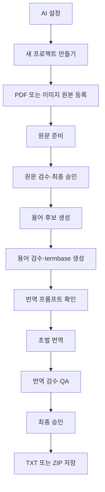

# GUI 사용 가이드

이 문서는 `glk ui`로 실행하는 로컬 웹 대시보드와 원문·용어·번역 검수 화면의
사용법을 설명합니다.

GUI는 별도의 데스크톱 앱이 아니라 현재 컴퓨터의 `127.0.0.1`에서만 열리는
브라우저 화면입니다. CLI와 같은 application service와 workspace를 사용하므로
한쪽에서 만든 프로젝트를 다른 쪽에서도 이어서 작업할 수 있습니다.

CLI 명령과 파일별 내부 규칙은 [전체 작업 흐름](WORKFLOW.md), 코드와 보안 경계는
[아키텍처](ARCHITECTURE.md)를 참고하세요.

## 실행과 종료

```bash
glk ui
```

실행하면 `http://127.0.0.1:8765/`에서 기본 웹 브라우저가 자동으로 열리고
대시보드 화면이 표시됩니다. 브라우저를 열지 않거나 경로·포트를 직접 정할 수
있습니다.

```bash
glk ui --no-open
glk ui --port 8766
glk ui --workspace-root 다른/workspaces
glk ui --settings-root 설정/디렉터리
```

8765 포트를 다른 프로그램이 사용 중일 때만 `--port`로 다른 번호를 지정합니다.
실제 대시보드 주소는 실행한 터미널에 표시됩니다. 종료하려면 해당 터미널에서
`Ctrl+C`를 누릅니다. 대시보드에서 연 원문·용어·번역 검수 서버도 함께
종료됩니다.

## 전체 흐름



대시보드 상단에는 전체 프로젝트, 진행 중, 완료, 확인 필요 개수가 표시됩니다.
프로젝트 이름·ID 검색과 상태 필터를 함께 사용할 수 있습니다. 프로젝트 카드에는
등록 파일, 현재 단계, 진행률, 실행 가능한 다음 작업이 표시됩니다.

## 1. AI 설정

오른쪽 위 `AI 설정`을 누릅니다.

- API 키가 있으면 `API 키 설정 완료`, 없으면 `API 키 미설정`으로 표시합니다.
- 키 입력칸을 비우고 저장하면 기존 키를 유지합니다.
- 저장된 키 값은 이후 브라우저 응답에 포함하지 않습니다.
- 모델 드롭다운에는 실제 Gemini API 모델 ID가 표시됩니다.
- `직접 입력`을 선택하면 목록에 없는 실제 모델 ID를 사용할 수 있습니다.
- 저장은 형식과 설정 파일 기록만 확인합니다. 실제 API 연결은 원문 준비 또는
  번역을 실행할 때 검증됩니다.

기본 모델은 `gemini-2.5-flash`입니다. 드롭다운 목록과 설명은
[`src/glk/data/gemini_models.json`](../src/glk/data/gemini_models.json)에서
관리하며 갱신 절차는
[아키텍처의 모델 목록 절](ARCHITECTURE.md#대시보드-gemini-모델-목록)에 있습니다.

셸의 `GEMINI_API_KEY`, `GEMINI_MODEL`이 설정되어 있으면 GUI에서 저장한
`.env`보다 우선합니다. 화면에 환경변수 우선 적용 안내가 보일 때는 셸 값을
바꾸고 대시보드를 다시 실행해야 `.env` 값이 적용됩니다.

## 2. 프로젝트 만들기와 삭제

`새 프로젝트 만들기`에서 다음 두 값을 입력합니다.

| 항목 | 규칙 |
|---|---|
| 프로젝트 이름 | 대시보드에 표시되는 이름, 한글 사용 가능 |
| 프로젝트 ID | 폴더명과 CLI 식별자, 영문 소문자·숫자·밑줄만 사용 |

카드 오른쪽 위 `×`는 프로젝트 폴더 전체를 운영체제 휴지통으로 이동합니다.
Finder 또는 파일 탐색기에서 복구할 수 있지만 휴지통을 비우면 복구할 수
없습니다. background job 실행 중에는 프로젝트를 삭제할 수 없습니다.

## 3. 원본 등록과 교체

`PDF 또는 이미지 원본 등록`에서 원본 종류를 직접 선택합니다.

| 원본 | 등록 범위 |
|---|---|
| PDF | 한 파일만 등록 |
| 이미지 | PNG, JPG, JPEG, WebP 여러 장 등록 |

이미지는 최대 200개, 한 번의 전체 요청은 256 MiB 미만이어야 합니다. 선택한
파일은 프로젝트 `01_input/`으로 복사되며 등록 단계에서는 Gemini를 호출하지
않습니다.

카드에는 PDF 파일명 또는 첫 이미지 파일명과 나머지 개수가 표시됩니다.
이미지가 여러 장이면 `파일 목록`에서 전체 상대 경로와 처리 순서를 확인할 수
있습니다.

원문 추출·OCR을 시작하기 전에는 `원본 교체`를 사용할 수 있습니다. 교체하면
기존 등록 원본 전체를 제거하고 새로 선택한 파일만 프로젝트에 복사합니다.
교체 도중 실패하면 기존 원본과 manifest를 복구하며, 복구까지 실패한 경우에는
백업 위치를 보존해 안내합니다.

`원본 교체`는 다른 진행 버튼과 혼동하지 않도록 주황색 보조 동작으로 표시하고,
프로젝트 카드의 작업 버튼 중 가장 아래에 배치합니다. 원문 준비처럼 다음 단계로
진행하는 버튼은 초록색으로 표시합니다.

추출·OCR이 한 번이라도 시작된 뒤에는 원본 교체 버튼을 표시하지 않습니다.
다른 원본으로 처음부터 작업하려면 새 프로젝트를 만드는 것이 안전합니다.

### 이미지 OCR 프롬프트

이미지 등록과 교체 창에서는 파일만 선택하며 OCR 프롬프트 입력란을 표시하지
않습니다. 최초 등록은 프로젝트 생성 시 마련된 기본 프롬프트를 사용하고,
이미지 원본을 교체할 때는 현재 프롬프트를 그대로 유지합니다. 프롬프트 확인과
변경은 이미지 등록 뒤 카드에 나타나는 `OCR 프롬프트 수정`에서 별도로
진행합니다. 내용은
`01_input/images/ocr_prompt.txt`에 저장됩니다.

- 게임 이름, 반복되는 아이콘 표기, 고유한 레이아웃 지침을 추가할 수 있습니다.
- 비어 있지 않은 UTF-8 텍스트만 저장할 수 있으며 최대 64 KiB입니다.
- 원본은 유지하고 지침만 바꾸려면 카드의 `OCR 프롬프트 수정`을 사용합니다.
- 원문 처리를 시작한 뒤에는 프롬프트도 수정할 수 없습니다.
- `편집 전 내용으로 되돌리기`는 현재 창을 열었을 때 불러온 값으로 입력란을
  되돌립니다. 과거 버전을 복원하거나 즉시 파일을 저장하는 버튼은 아닙니다.

## 4. 원문 준비

카드의 `PDF 원문 준비 시작` 또는 `이미지 OCR 및 원문 준비 시작`을 누릅니다.

- PDF는 내장 텍스트를 추출한 뒤 Gemini로 읽기 순서를 재구성합니다.
- 이미지는 저장한 OCR 프롬프트와 함께 Gemini로 글자를 인식합니다.
- 이미지 OCR 시작 확인 창에는 이번 작업에 적용할 프롬프트를 읽기 전용으로
  표시합니다. 변경이 필요하면 창을 닫고 카드의 `OCR 프롬프트 수정`을
  사용합니다.
- 이후 공통 source block, 원문 검수본과 로컬 QA를 생성합니다.
- 작업은 background job으로 실행되어 다른 프로젝트 카드를 확인할 수 있습니다.
- 원문 준비·용어 후보 생성·초벌 번역을 합쳐 동시에 한 작업만 실행합니다.
- 현재 provider 계약에는 안전한 취소 기능이 없어 실행 중 취소는 지원하지
  않습니다.

일부 이미지만 실패하면 `일부 처리 실패`, 전부 실패하면 `실행 실패`로
표시합니다. 카드의 다시 실행 버튼으로 재시도하면 완료된 cache를 가능한 범위에서
재사용합니다.

## 5. 원문 검수

준비가 끝나면 `원문 검수`가 활성화됩니다. 원본 페이지와 추출 block을 나란히
보면서 다음 작업을 할 수 있습니다.

- block 선택과 원본 위치 강조
- 추출 텍스트 수정
- 같은 원본 안에서 읽기 순서 이동
- 불필요한 block 제외
- 원본 영역을 지정한 수동 block 추가
- 원문 QA 재검사와 오류 위치 이동

PDF·이미지 자체를 기준으로 추출 결과를 바로잡는 단계입니다. 원본 화면에서
문자를 드래그해 검수 입력란에 자동 복사하는 기능은 아직 없습니다.

`최종 승인`은 구조 검사를 통과한 현재 원문을 후속 단계의 고정 입력으로
만듭니다. 대시보드에서 연 화면은 승인 완료 모달의 `대시보드로 돌아가기`로
복귀할 수 있습니다.

## 6. 용어 후보와 용어 검수

원문 승인 뒤 `용어 후보 생성 시작`을 누릅니다. 승인 원문에서 반복되는 이름과
게임 용어 후보를 로컬 규칙으로 수집하므로 Gemini 호출과 비용이 없습니다.

`용어 검수`에서는 다음 기능을 사용할 수 있습니다.

- 상태, 분류와 추천 순서 정렬
- 원문 용어·번역어·출현 문맥을 구분한 검색
- 체크한 행의 상태 일괄 변경
- `+ 수동 용어`로 누락 용어 추가
- `approved`, `keep`, `rejected` 상태 결정
- `검증 및 termbase 생성`

`keep`은 해당 원문 용어를 번역하지 않고 그대로 유지하라는 뜻입니다.
한국어로 옮길 용어는 `approved`와 번역어를 사용하세요. 미확정 `review`가
하나라도 남거나 `approved` 번역어가 비어 있으면 termbase를 만들 수 없습니다.

상태와 분류의 정확한 의미, TSV 보존 규칙은
[용어집 검토 사양](GLOSSARY.md)을 참고하세요.

## 7. 번역 프롬프트와 초벌 번역

용어 검수를 최종 승인해 termbase가 최신 상태가 된 뒤에만 카드에
`번역 프롬프트 설정`이 나타납니다. 여기에서 프로젝트 공통 문체·표현 지침을
확인합니다. 이 동작 자체는 Gemini를 호출하지 않으며 내용은
`04_translation/prompt.txt`에 저장됩니다.

- 프로그램의 block ID·순서·숫자·토큰 보존 규칙은 변경할 수 없습니다.
- 확정 용어집은 사용자 프롬프트보다 우선합니다.
- `편집 전 내용으로 되돌리기`는 창을 열 때의 저장값으로 입력란만 되돌립니다.
- background job 실행 중에는 프롬프트를 수정할 수 없습니다.

`초벌 번역 시작`을 누르면 적용 모델, 실행 방식과 저장한 프롬프트를 확인한 뒤
background job을 시작합니다. 중간에 실패하면 완료된 청크부터
`초벌 번역 이어서 실행`할 수 있으며, 이때 입력 hash 보호를 위해 프롬프트를
바꿀 수 없습니다.

초벌 번역 뒤 프롬프트를 변경하면 현재 결과는 `stale`이 됩니다.
`변경된 프롬프트로 전체 재번역`을 실행하면 기존 번역·검수·승인·최종 출력은
`04_translation/revisions/`에 먼저 보관됩니다. 새 번역이 성공한 경우에만
검수본을 새 초벌 기준으로 초기화합니다.

번역 구조 검증에서 문제가 발견되어도 생성한 번역을 버리지 않습니다. 대시보드는
`초벌 번역 완료 · N개 오류`로 표시하고 사용자가 번역 검수에서 바로잡을 수 있게
합니다.

## 8. 번역 검수와 최종 승인

`번역 검수`에서는 block별 원문과 번역을 나란히 보고 번역문만 수정합니다.

- 원문·번역·block ID 검색
- 오류·경고·수정됨 필터
- 숫자, 토큰, HTML, 용어집과 구조 QA
- 현재 block에 적용되는 용어와 전체 확정 용어집 확인
- `keep` 용어의 원문 유지 안내
- 오류 block 선택 후 `오류만 재번역`

원문과 번역이 같은 경우나 한글이 없는 경우는 경고이므로 승인 자체를 자동
차단하지 않습니다. 특히 용어집에서 `keep`으로 정한 영문은 의도된 원문 유지일
수 있으므로 적용 용어 표시와 문맥을 함께 확인하세요.

`오류만 재번역`은 현재 편집을 먼저 저장하고 선택 대상만 background job으로
처리합니다. 다른 정상 block과 사용자가 고친 번역은 유지됩니다. 최종 승인에는
구조를 손상시키는 QA 오류가 없어야 합니다.

승인 완료 모달에서 `대시보드로 돌아가기`를 누르면 카드가 완료 상태와
다운로드 목록을 다시 읽습니다.

## 9. 결과 다운로드

최종 승인된 프로젝트 카드에 `최종 번역 결과`가 표시됩니다.

- PDF 프로젝트는 `번역본 저장` 버튼 하나로 `<PDF 파일명>_kor.txt`를 저장합니다.
- 이미지 프로젝트는 다운로드 버튼을 두 개만 표시합니다.
  - `통합본 저장`: 모든 이미지의 번역을 합친 `combined_kor.txt`를 저장합니다.
  - `이미지별 파일 전체 저장`: 통합본을 제외한 이미지별
    `<이미지 파일명>_kor.txt`를 원본의 하위 폴더 구조를 유지한 ZIP으로 한 번에
    저장합니다.
- 이미지가 많더라도 이미지별 다운로드 버튼과 긴 파일 목록은 표시하지 않습니다.

GUI는 `05_output/`에 있는 파일 중 현재 승인 기록의 경로와 SHA-256이 일치하는
파일만 표시하고, 전송 직전 hash를 다시 확인합니다. 승인 뒤 파일을 외부에서
바꾸면 다운로드하지 않고 다시 확인하도록 안내합니다. 이미지별 ZIP은 다운로드
요청 시 생성하며 workspace에는 별도 파일로 남기지 않습니다.

다운로드 버튼을 누르면 지원 브라우저에서는 파일명과 저장 위치를 선택하는 창을
먼저 표시합니다. 선택을 취소하면 오류로 처리하지 않으며 파일을 가져오지
않습니다. Safari처럼 저장 위치 선택 기능을 지원하지 않는 브라우저에서는
브라우저의 기본 다운로드 방식으로 자동 전환합니다.

## 참고: 저장 상태, 새로고침과 재실행

프로젝트 결과와 job 상태는 workspace 파일에 저장됩니다. 브라우저를 새로고침해도
프로젝트 단계와 마지막 완료·실패 상태를 다시 읽습니다.

대시보드 프로세스가 background job 실행 중 종료되면 다음 실행에서 해당 기록을
`실행 중단`으로 바꿉니다. 실제 외부 요청을 자동으로 되살리지는 않으며 카드의
다시 시도 또는 이어서 실행을 사용해야 합니다. 번역은 마지막으로 확정한 청크
checkpoint부터, 다른 단계는 유효한 cache부터 재사용합니다.

화면의 `편집 전 내용으로 되돌리기`는 OCR 또는 번역 프롬프트 입력란에만
적용됩니다. 창을 연 시점의 저장값을 다시 채우는 기능이며 revision 복구 기능은
아닙니다.

## 참고: 안전 범위

- 모든 웹 서버는 `127.0.0.1`에만 bind합니다.
- 요청은 Host, Origin과 임의 session token을 확인합니다.
- 외부 CDN, font, script를 사용하지 않습니다.
- API 키 값은 설정 응답에서 제외합니다.
- 원본 교체와 prompt 저장은 원자적으로 처리하고 동시 변경을 hash로 검사합니다.
- job 실행 중 같은 프로젝트의 원본 교체·prompt 변경·삭제를 차단합니다.
- 프로젝트 삭제는 영구 삭제 대신 운영체제 휴지통을 사용합니다.

대시보드 주소를 다른 사람에게 공개하거나 reverse proxy로 외부에 노출하는
용도로 설계되지 않았습니다.

## 문제 해결

| 화면 상태 | 확인할 내용 |
|---|---|
| `API 키 미설정` | `AI 설정`에서 키 저장, 셸 환경변수 우선 여부 확인 |
| 없는 모델·권한 오류 | 실제 Gemini API 모델 ID와 키 권한 확인 |
| `일부 처리 실패` | 실패한 원본 형식·손상 여부 확인 후 다시 실행 |
| `실행 중단` | 이전 대시보드가 작업 중 종료됨, 다시 시도 |
| 용어 후보 재생성 차단 | 사용자 편집 보호 상태, CLI에서 기존 TSV 비교 후 명시적으로 처리 |
| 번역 `stale` | prompt 또는 입력 변경됨, revision 보관 후 전체 재번역 |
| 다운로드 차단 | 승인 뒤 출력 파일 변경 여부 확인 |
| 검수 저장 충돌 | 다른 탭·편집기 변경분을 확인하고 새로고침 후 다시 편집 |

오류를 진단할 때는 대시보드를 실행한 터미널의 메시지와
`glk status --project <project_id>` 결과도 함께 확인하세요.
