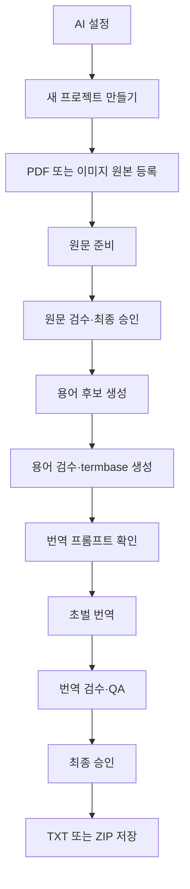

# GUI 사용 가이드

이 문서는 `glk ui`로 실행하는 로컬 웹 대시보드와 원문·용어·번역 검수 화면의
사용법을 설명합니다.

GUI는 별도의 데스크톱 앱이 아니라 현재 컴퓨터의 `127.0.0.1`에서만 열리는
브라우저 화면입니다. CLI와 같은 application service와 workspace를 사용하므로
한쪽에서 만든 프로젝트를 다른 쪽에서도 이어서 작업할 수 있습니다.

CLI 명령과 파일별 내부 규칙은 [전체 작업 흐름](WORKFLOW.md), 코드와 보안 경계는
[아키텍처](ARCHITECTURE.md)를 참고하세요.

## 실행과 종료

```bash
glk ui
```

실행하면 `http://127.0.0.1:8765/`에서 기본 웹 브라우저가 자동으로 열리고
대시보드 화면이 표시됩니다. 브라우저를 열지 않거나 경로·포트를 직접 정할 수
있습니다.

```bash
glk ui --no-open
glk ui --port 8766
glk ui --workspace-root 다른/workspaces
glk ui --settings-root 설정/디렉터리
```

8765 포트를 다른 프로그램이 사용 중일 때만 `--port`로 다른 번호를 지정합니다.
실제 대시보드 주소는 실행한 터미널에 표시됩니다. 종료하려면 해당 터미널에서
`Ctrl+C`를 누릅니다. 대시보드에서 연 원문·용어·번역 검수 서버도 함께
종료됩니다.

## 전체 흐름



대시보드 상단에는 전체 프로젝트, 진행 중, 완료, 확인 필요 개수가 표시됩니다.
프로젝트 이름·ID 검색과 상태 필터를 함께 사용할 수 있습니다. 프로젝트 카드에는
등록 파일, 현재 단계, 진행률과 실행 가능한 다음 작업 하나를 강조해 표시합니다.
완료했거나 현재 열린 원문·용어·번역 검수 단계는 밑줄 친 단계명을 눌러 직접 다시
열 수 있습니다. 현재 번역본·승인 원문·이전 번역본은 카드의 `파일 저장`에
모으고, 원본 교체와 OCR·번역 프롬프트는 `설정` 메뉴에 두어 다음 작업과
구분합니다. 각 단계에는
누적 예상 AI 비용만 바로 표시하고, 비용에 마우스를 올리거나 키보드로 초점을 두면
모델명, 요청 수와 입력·출력 token 상세 정보를 확인할 수 있습니다. 실행 중인
작업의 소요 시간은 화면에서 초 단위로 갱신됩니다.

## 화면 테마

대시보드와 원문·용어·번역 검수 화면은 같은 디자인 token과 컴포넌트 규칙을
사용합니다. 운영체제 또는 브라우저가 다크 모드를 선호하면
`prefers-color-scheme`에 따라 자동으로 다크 팔레트를 적용합니다. 앱 안에서
테마를 직접 바꾸는 전환 버튼은 제공하지 않습니다.

## 1. AI 설정

오른쪽 위 `AI 설정`을 누릅니다.

- API 키가 있으면 `API 키 설정 완료`, 없으면 `API 키 미설정`으로 표시합니다.
- `AI 제공자`에서 Google Gemini 또는 OpenAI를 선택합니다.
- 키 입력칸을 비우고 저장하면 기존 키를 유지합니다.
- 저장된 키 값은 이후 브라우저 응답에 포함하지 않습니다.
- 모델 드롭다운에는 선택한 제공자의 실제 API 모델 ID가 표시됩니다.
- `직접 입력`을 선택하면 목록에 없는 실제 모델 ID를 사용할 수 있습니다.
- 저장은 형식과 설정 파일 기록만 확인합니다. 실제 API 연결은 원문 준비 또는
  번역을 실행할 때 검증됩니다.

기본 제공자는 Gemini이며 기본 모델은 `gemini-3.8-flash`입니다. OpenAI의
기본 모델은 `gpt-5.6-terra`입니다. 드롭다운 목록과 설명은
[`src/glk/data/gemini_models.json`](../src/glk/data/gemini_models.json)과
[`src/glk/data/openai_models.json`](../src/glk/data/openai_models.json)에서
관리하며 갱신 절차는
[아키텍처의 모델 목록 절](ARCHITECTURE.md#대시보드-ai-모델-목록)에 있습니다.

셸의 `GLK_AI_PROVIDER`와 선택한 제공자의 `GEMINI_API_KEY`·`GEMINI_MODEL`
또는 `OPENAI_API_KEY`·`OPENAI_MODEL`이 GUI에서 저장한 `.env`보다
우선합니다. 화면에 환경변수 우선 적용 안내가 보일 때는 셸 값을 바꾸고
대시보드를 다시 실행해야 `.env` 값이 적용됩니다. 제공자를 바꿔 저장해도
다른 제공자의 키와 모델은 삭제하지 않습니다.

## 2. 프로젝트 만들기와 삭제

`새 프로젝트 만들기`에서 다음 두 값을 입력합니다.

| 항목 | 규칙 |
|---|---|
| 프로젝트 이름 | 대시보드에 표시되는 이름, 한글 사용 가능 |
| 프로젝트 ID | 폴더명과 CLI 식별자, 영문 소문자·숫자·밑줄만 사용 |

카드 오른쪽 위 `×`는 프로젝트 폴더 전체를 운영체제 휴지통으로 이동합니다.
Finder 또는 파일 탐색기에서 복구할 수 있지만 휴지통을 비우면 복구할 수
없습니다. background job 실행 중에는 프로젝트를 삭제할 수 없습니다.

## 3. 원본 등록과 교체

`PDF 또는 이미지 원본 등록`에서 원본 종류를 직접 선택합니다.

| 원본 | 등록 범위 |
|---|---|
| PDF | 한 파일만 등록 |
| 이미지 | PNG, JPG, JPEG, WebP 여러 장 등록 |

이미지는 최대 200개, 선택한 파일의 합계는 500 MiB 이하여야 합니다. 선택한
파일은 프로젝트 `01_input/`으로 복사되며 등록 단계에서는 AI API를 호출하지
않습니다.

카드에는 PDF 파일명 또는 첫 이미지 파일명과 나머지 개수가 표시됩니다.
이미지가 여러 장이면 `파일 목록`에서 전체 상대 경로와 처리 순서를 확인할 수
있습니다.

원문 추출·OCR을 시작하기 전에는 `원본 교체`를 사용할 수 있습니다. 교체하면
기존 등록 원본 전체를 제거하고 새로 선택한 파일만 프로젝트에 복사합니다.
교체 도중 실패하면 기존 원본과 manifest를 복구하며, 복구까지 실패한 경우에는
백업 위치를 보존해 안내합니다.

원문 준비가 일부 실패했더라도 아직 원문 검수 block이나 후속 작업물이 없다면
실패 카드에서 `PDF 교체`를 사용할 수 있습니다. 이때 실패한 준비 결과, cache와
job 상태처럼 다시 만들 수 있는 자료만 정리하고 새 원본으로 다시 시작합니다.
검수 block을 만든 뒤이거나 사람이 수정한 결과와 후속 작업물이 있으면 작업을
보호하기 위해 교체를 허용하지 않습니다.

### 이미지 OCR 프롬프트

이미지 등록과 교체 창에서는 파일만 선택하며 OCR 프롬프트 입력란을 표시하지
않습니다. 최초 등록은 프로젝트 생성 시 마련된 기본 프롬프트를 사용하고,
이미지 원본을 교체할 때는 현재 프롬프트를 그대로 유지합니다. 프롬프트 확인과
변경은 이미지 등록 뒤 카드에 나타나는 `OCR 프롬프트 수정`에서 별도로
진행합니다. 내용은
`01_input/images/ocr_prompt.txt`에 저장됩니다.

- 게임 이름, 반복되는 아이콘 표기, 고유한 레이아웃 지침을 추가할 수 있습니다.
- 비어 있지 않은 UTF-8 텍스트만 저장할 수 있으며 최대 64 KiB입니다.
- 원본은 유지하고 지침만 바꾸려면 카드의 `OCR 프롬프트 수정`을 사용합니다.
- 원문 처리를 시작한 뒤에는 프롬프트도 수정할 수 없습니다.
- `편집 전 내용으로 되돌리기`는 현재 창을 열었을 때 불러온 값으로 입력란을
  되돌립니다. 과거 버전을 복원하거나 즉시 파일을 저장하는 버튼은 아닙니다.

## 4. 원문 준비

카드의 `PDF 원문 준비 시작` 또는 `이미지 OCR 및 원문 준비`를 누릅니다.

- PDF는 내장 텍스트를 추출한 뒤 선택한 AI로 읽기 순서를 재구성합니다.
- 이미지는 저장한 OCR 프롬프트와 함께 선택한 AI로 글자를 인식합니다.
- 이미지 OCR 시작 확인 창에는 이번 작업에 적용할 프롬프트를 읽기 전용으로
  표시합니다. 변경이 필요하면 창을 닫고 카드의 `OCR 프롬프트 수정`을
  사용합니다.
- 이후 공통 source block, 원문 검수본과 로컬 QA를 생성합니다.
- 작업은 background job으로 실행되어 다른 프로젝트 카드를 확인할 수 있습니다.
- 원문 준비·용어 후보 생성·초벌 번역을 합쳐 동시에 한 작업만 실행합니다.
- 현재 provider 계약에는 안전한 취소 기능이 없어 실행 중 취소는 지원하지
  않습니다.

일부 PDF 페이지 또는 이미지만 실패하면 `일부 처리 실패`, 전부 실패하면
`실행 실패`로 표시합니다. 카드의 다시 실행 버튼으로 재시도하면 완료된 cache를
가능한 범위에서 재사용합니다.

PDF 페이지에 추출 가능한 내장 텍스트가 없으면 해당 페이지 이미지는 보존하고
부분 실패로 기록합니다. 실패 카드에서는 다음 중 하나를 선택할 수 있습니다.

- `다시 시도`: 현재 원본으로 실패한 처리를 다시 실행합니다.
- `PDF 교체`: 아직 검수 작업물이 없을 때 다른 PDF로 다시 시작합니다.
- `검수에서 직접 수정`: 성공한 페이지와 실패한 페이지 이미지를 검수 화면에
  넘깁니다. 실패한 페이지에는 `[ILLEGIBLE]` 임시 block이 생기며, 원본 이미지를
  보고 내용을 직접 입력하거나 불필요한 페이지라면 block을 제외해야 합니다.

## 5. 원문 검수

준비가 끝나거나 부분 실패 결과를 직접 검수하기로 선택하면 `원문 검수`가
활성화됩니다. 원본 페이지와 추출 block을 나란히 보며 작업하고, 상단은 현재
모드와 도구를 선택하는 첫째 줄, `저장`·`검증`·`최종 승인`을 실행하는 둘째 줄로
구성됩니다.

### 텍스트 편집과 블록 편집

검수 작업은 목적이 다른 두 모드로 나뉩니다.

- `텍스트 편집`: block 본문만 수정합니다. 구조 변경 버튼은 숨깁니다.
- `블록 편집`: 본문은 읽기 전용입니다. 카드·본문·PDF 영역을 눌러 block을
  선택하고 제외, 복원, 순서 변경, 누락 문단 추가와 아이콘 검사를 수행합니다.

`블록 편집`에서는 Shift를 누른 채 카드, 본문, PDF 영역 또는 체크 상자를 누르면
범위를 한꺼번에 선택할 수 있습니다. 화면 아래 고정 작업 막대에서 선택한 block을
일괄 제외하거나 복원하고 선택을 취소합니다. block의 `⠿` 손잡이를 끌어 같은
페이지 안에서 순서를 바꿀 수 있으며, 여러 block을 선택한 상태에서는 선택 묶음의
순서를 유지한 채 함께 이동합니다. 기존 `↑`·`↓` 버튼도 사용할 수 있습니다.

PDF 영역을 누르면 오른쪽의 해당 block 카드가 화면 가운데로 스크롤됩니다. PDF와
카드에 보이는 번호는 내부 ID가 아니라 페이지별 작업 번호이며, 새 페이지마다
1부터 다시 시작합니다. 내부 block ID는 일반 화면에서는 숨기고 도움말에만
표시합니다.

block 하나를 선택한 상태에서 `텍스트 편집`으로 바꾸면 그 block을 유지한 채
카드로 스크롤하고 입력란에 초점을 둡니다. 여러 block 선택은 편집 모드로
넘기지 않습니다. `누락 문단 추가`는 `블록 편집`일 때 상단 오른쪽에 표시됩니다.
원본에서 영역을 그려 block을 만들면 `텍스트 편집`으로 전환해 바로 내용을
입력할 수 있습니다.

PDF·이미지 자체를 기준으로 추출 결과를 바로잡는 단계입니다. 원본 화면에서
문자를 드래그해 검수 입력란에 자동 복사하는 기능은 아직 없습니다.

### 아이콘 검사(AI)

PDF 프로젝트에서는 `블록 편집`의 상단 오른쪽에 있는 `아이콘 검사(AI)`로
검사 모드에 들어갑니다. 제외된 block은 검사 대상에 표시하지 않습니다. 아이콘이
포함된 block을 직접 고르거나 페이지 전체를 선택할 수 있고, 일반 block 선택과
마찬가지로 Shift+클릭 범위 선택을 지원합니다. 한 번에 최대 24개 block을 선택한
뒤 `선택한 블록 검사 (N)`을 실행합니다.

`아이콘 검사 결과` 창에는 원본 crop, 현재 원문과 AI 제안을 나란히 표시합니다.
각 결과의 `적용`을 누르기 전에는 원문을 변경하지 않으며, 마지막에는 `닫기`로
창을 닫습니다. 적용한 내용도 `저장`과 `최종 승인`을 거쳐야 합니다. 결과 창에는
이번 실행의 API 요청 수, 입력·출력 token과 예상 비용도 표시합니다.

검사 결과는 `.glk/state/pdf_icon_audit.json`에 저장됩니다. 원문, block 영역,
렌더링된 페이지 이미지, icon token 정의, AI provider·model, 내부 prompt version이
모두 같으면 저장된 결과를 재사용하고 API를 다시 호출하지 않습니다.

아이콘 검사 prompt와 판정 규칙은 프로그램에 고정되어 있습니다. 프로젝트의
`01_input/images/ocr_prompt.txt`에 `- [TOKEN]: 시각적 특징` 형식으로 정의한
아이콘만 확정 token으로 제안하고, 정의가 없거나 확실하지 않은 아이콘은
`[ICON: visible description]`으로 제안합니다. 선택한 block마다 AI 요청 한 번이
발생합니다. cache를 재사용한 block은 API를 호출하거나 비용을 추가하지 않으며,
새 요청의 사용량은 프로젝트 누적 비용 중 `원문 검수` 단계에 기록됩니다.

`최종 승인`은 구조 검사를 통과한 현재 원문을 후속 단계의 고정 입력으로
만듭니다. 대시보드에서 연 화면은 승인 완료 모달의 `대시보드로 돌아가기`로
복귀할 수 있습니다.

미확정 `[ICON: ...]` 설명은 왼쪽 현황에서 개수를 확인하고 직접 수정할 수
있습니다. 설명을 그대로 보존해도 되는 프로젝트라면 `미확정 아이콘 그대로
승인`으로 다음 단계에 넘길 수 있습니다. 이 예외는 아이콘 설명에만 적용되며,
`[ILLEGIBLE]`이나 깨진 문자는 수정하거나 해당 block을 제외해야 합니다.
`[ICON: 주황 마름모]`를 `[DAMAGE]`처럼 확정 token으로 바꾼 경우에는 상단의
상시 확인란 대신 검증 또는 최종 승인 시 변경 block 수를 보여주는 확인창이
한 번 표시됩니다.

## 6. 용어 후보와 용어 검수

원문 승인 뒤 `용어 후보 생성 시작`을 누릅니다. 승인 원문에서 반복되는 이름과
게임 용어 후보를 로컬 규칙으로 수집하므로 AI API 호출과 비용이 없습니다.

`용어 검수`에서는 다음 기능을 사용할 수 있습니다.

- 상태, 분류와 추천 순서 정렬
- 상태별 개수를 보여주는 필터 버튼
- 원문 용어·번역어·출현 문맥을 구분한 검색
- 체크한 행의 상태 일괄 변경
- `후보 1차 정리(AI)`의 비용 확인, 추천 미리보기와 선택 반영·취소
- `수동 용어 추가`로 누락 용어 추가
- `approved`, `keep`, `rejected` 상태 결정
- `용어집 확정`

`keep`은 해당 원문 용어를 번역하지 않고 그대로 유지하라는 뜻입니다.
한국어로 옮길 용어는 `approved`와 번역어를 사용하세요. 미확정 `review`가
하나라도 남거나 `approved` 번역어가 비어 있으면 termbase를 만들 수 없습니다.

`후보 1차 정리(AI)`는 현재 `review`인 자동 후보만 대상으로 합니다. 실행 전
모델, 대상·캐시·요청 수와 예상 비용을 확인하고, 실행 뒤 상태·번역어·분류·짧은
이유를 미리봅니다. 실행 중에는 현재 단계, 분석한 후보와 API 요청 수, 저장된 결과,
경과 시간을 실시간으로 확인할 수 있습니다. `추천 반영` 전에는 표를 바꾸지 않으며 반영 뒤에도 저장 전까지
`AI 적용 취소`가 가능합니다. 수동 용어, 이미 결정한 상태, 직접 입력한 번역어와
바꾼 분류는 보호합니다. 원문 유지·제외 추천이 직접 입력한 번역어를 지우게 되면
상태도 반영하지 않습니다. 현재 입력과 AI 추천이 다르면 결과에 두 값과 실제로
유지되는 값을 함께 표시합니다. 충돌 행에서 `AI 추천으로 변경`을 선택해야만 기존
입력을 AI 값으로 바꿉니다. 낮은 신뢰도의 후보는 `review`로 남겨 직접 확인하게 합니다.

생성에 실패하면 검수 내용 저장 여부와 함께 실패한 record·용어 및 해결 안내를 화면에
표시합니다. 원문에서 찾을 수 없는 수동 용어가 있으면 확정 시에만 확인 창을
표시합니다. 목록의 철자를 확인하고 `돌아가서 수정`하거나, 의도한 외부 용어라면
`그대로 포함하고 확정`할 수 있습니다.

상태와 분류의 정확한 의미, TSV 보존 규칙은
[용어집 검토 사양](GLOSSARY.md)을 참고하세요.

## 7. 번역 프롬프트와 초벌 번역

용어 검수를 최종 승인해 termbase가 최신 상태가 된 뒤에만 카드에
메인 번역 작업 옆에 작은 `번역 프롬프트 설정` 링크가 나타납니다. 여기에서
프로젝트 공통 문체·표현 지침을 확인합니다. 직접 편집하는 동작은 AI API를
호출하지 않으며 내용은
`04_translation/prompt.txt`에 저장됩니다.
처음에는 격식체, 간결한 제목, 자연스러운 한국어 어순과 표현 일관성을 지시하는
한국어 기본 프롬프트를 제공합니다.

`AI로 초안 만들기`는 프로젝트명과 `보드게임 규칙서` 문맥을 명시하고, 최종 승인
원문의 앞 4페이지를 순서대로 최대 12,000자까지 전달한 뒤 나머지 문서에서 최대
8개의 규칙 문체 표본을 4,000자까지 추가해 편집 가능한 문체 지침을 제안합니다.
규칙 본문은 `합니다체` 설명문으로 쓰고 의무·가능·금지를
구분한다는 기준은 고정하며, AI는 문장 길이와 항목 구성 같은 게임별 세부 지침만
보완합니다. 생성된 프롬프트의 첫 줄에는 원문에서 확인되는 게임 주제를 한 문장으로
요약합니다. 메타 프롬프트는 게임명과 대표 원문으로 게임의 주제와 핵심 플레이
방식을 파악해 `이 게임은 …` 형식으로 번역 프롬프트에 포함하도록 지시합니다.
용어집은 이 요청에 포함하지 않습니다. 버튼을 누르면 같은 창이 AI
초안 화면으로 전환됩니다. 먼저
대표 문장 수, API 요청 수, 예상 입력·출력 token과
비용을 확인하고 `초안 생성`을 눌러 호출합니다. 결과에서는 실제 입력·출력 token과
비용, 제안 근거와 초안을 확인할 수 있습니다. `이 초안 사용`을 눌러도 입력란에만
복사되며, 내용을 검토한 뒤 `프롬프트 저장`을 눌러야 파일에 반영됩니다. 같은 승인
원문·현재 프롬프트·모델·제공자·규칙 버전의 결과는 cache를 재사용해 추가 token이나
비용이 발생하지 않습니다. 저장된 초안이 있으면 AI 화면에서 즉시 미리보기를
보여주며, `새로 만들기`를 선택했을 때만 새 요청의 예상 사용량을 확인하고 cache를
교체합니다.

- 프로그램의 block ID·순서·숫자·토큰 보존 규칙은 변경할 수 없습니다.
- 확정 용어집은 사용자 프롬프트보다 우선합니다.
- `편집 전 내용으로 되돌리기`는 창을 열 때의 저장값으로 입력란만 되돌립니다.
- background job 실행 중에는 프롬프트를 수정할 수 없습니다.

`초벌 번역 시작`을 누르면 적용 모델, 실행 방식과 저장한 프롬프트를 확인한 뒤
background job을 시작합니다. 중간에 실패하면 완료된 청크부터
`초벌 번역 이어서 실행`할 수 있으며, 이때 입력 hash 보호를 위해 프롬프트를
바꿀 수 없습니다.

초벌 번역 뒤 프롬프트를 변경하면 현재 결과는 `stale`이 됩니다.
기존에 최종 승인한 파일이 있으면 프로젝트 카드의 접힌 `이전 번역본`에서
프롬프트 변경 전 승인본을 계속 저장할 수 있습니다.
`변경된 프롬프트로 전체 재번역`을 실행하면 기존 번역·검수·승인·최종 출력은
`04_translation/revisions/`에 먼저 보관됩니다. 새 번역이 성공한 경우에만
검수본을 새 초벌 기준으로 초기화하며, 보관한 승인본은 재번역 뒤에도
`이전 번역본`에 남습니다.

번역 구조 검증에서 문제가 발견되어도 생성한 번역을 버리지 않습니다. 대시보드는
`초벌 번역 완료 · N개 오류`로 표시하고 사용자가 번역 검수에서 바로잡을 수 있게
합니다.

## 8. 번역 검수와 최종 승인

`번역 검수`에서는 block별 원문과 번역을 나란히 보고 번역문만 수정합니다.

- 원문·번역·block ID 검색
- 왼쪽 `검수 현황`에서 전체·오류·경고·수정 block 수 확인과 필터 이동
- 숫자, 토큰, HTML, 용어집과 구조 QA
- 현재 block에 적용되는 용어와 전체 확정 용어집 확인
- `keep` 용어의 원문 유지 안내
- 상단 `더보기` 메뉴에서 오류 block만 AI 재번역
- 숫자·확정 용어처럼 사람이 판단할 수 있는 오류의 사유 기록 후 예외 승인

원문과 번역이 같은 경우나 한글이 없는 경우는 경고이므로 승인 자체를 자동
차단하지 않습니다. 특히 용어집에서 `keep`으로 정한 영문은 의도된 원문 유지일
수 있으므로 적용 용어 표시와 문맥을 함께 확인하세요.

상단에는 자주 참고하는 `용어집`, `저장`과 현재 단계에 필요한 `검증` 또는
`최종 승인` 하나를 표시합니다. 오류 재번역과 예외 승인은 오류가 있을 때만
나타나는 `더보기` 메뉴에서 실행합니다. 번역문을
수정하면 `검증`은 `저장하고 검증`으로 바뀌어 두 작업을 한 번에 처리합니다.

`오류 N개 재번역`은 현재 편집을 먼저 저장하고 오류 대상만 background job으로
처리합니다. 다른 정상 block과 사용자가 고친 번역은 유지됩니다. 숫자 표기나
용어 적용처럼 문맥상 의도된 변경은 모든 오류를 확인하고 사유를 입력한 뒤
`예외로 승인…`으로 최종 승인할 수 있습니다. block 누락·순서, token 또는
HTML 손상처럼 결과 구조를 훼손하는 오류는 예외 승인할 수 없습니다. 예외 승인
사유와 당시 오류·review hash는 `translation_review.json`에 기록됩니다.

승인 완료 모달에서 `대시보드로 돌아가기`를 누르면 카드가 완료 상태와
다운로드 목록을 다시 읽습니다.

## 9. 결과 다운로드

원문 검수를 최종 승인하면 프로젝트 카드의 `파일 저장`에 `승인 원문` 행이
표시됩니다. 이 행의 `저장` 버튼은 승인된 원문 본문을 페이지별로
합치고 검수용 block ID와 marker를 제외한 뒤 `<프로젝트 ID>_source.txt`라는
이름으로 저장합니다. 원문 승인 상태와 SHA-256이 현재 승인 block 파일과 일치할
때만 표시합니다.

번역을 최종 승인하면 같은 `파일 저장` 영역에 현재 번역 결과가 표시됩니다.

- PDF 프로젝트는 `최종 번역본` 행의 `저장` 버튼으로
  `<PDF 파일명>_kor.txt`를 저장합니다.
- 이미지 프로젝트는 다운로드 버튼을 두 개만 표시합니다.
  - `통합 번역본`: 모든 이미지의 번역을 합친 `combined_kor.txt`를 저장합니다.
  - `이미지별 번역본`: 통합본을 제외한 이미지별
    `<이미지 파일명>_kor.txt`를 원본의 하위 폴더 구조를 유지한 ZIP으로 한 번에
    저장합니다.
- 이미지가 많더라도 이미지별 다운로드 버튼과 긴 파일 목록은 표시하지 않습니다.

프롬프트 변경이나 전체 재번역 전에 최종 승인한 결과가 있으면 카드에
`이전 번역본 N개`가 접힌 상태로 표시됩니다. 펼치면 승인 시각별 파일을
`이전본 저장`으로 받을 수 있으며, 저장 파일명에는 승인 시각을
`YYYYMMDD_HHMMSS` 형식으로 붙입니다. 프롬프트만 변경한 직후에는 현재
`05_output/`의 승인본을 사용하고, 전체 재번역을 시작한 뒤에는
`04_translation/revisions/translation_restart_*/`에 보관한 승인본을 사용합니다.

GUI는 현재 또는 재번역 전 승인 기록의 경로와 SHA-256이 일치하는 파일만
표시하고, 전송 직전 hash를 다시 확인합니다. 승인 뒤 파일을 외부에서 바꾸면
다운로드하지 않고 다시 확인하도록 안내합니다. 이미지별 ZIP은 현재 승인본의
다운로드 요청 시 생성하며 workspace에는 별도 파일로 남기지 않습니다.

다운로드 버튼을 누르면 지원 브라우저에서는 파일명과 저장 위치를 선택하는 창을
먼저 표시합니다. 선택을 취소하면 오류로 처리하지 않으며 파일을 가져오지
않습니다. Safari처럼 저장 위치 선택 기능을 지원하지 않는 브라우저에서는
브라우저의 기본 다운로드 방식으로 자동 전환합니다.

## 참고: 저장 상태, 새로고침과 재실행

프로젝트 결과와 job 상태는 workspace 파일에 저장됩니다. 브라우저를 새로고침해도
프로젝트 단계와 마지막 완료·실패 상태를 다시 읽습니다.

대시보드 프로세스가 background job 실행 중 종료되면 다음 실행에서 해당 기록을
`실행 중단`으로 바꿉니다. 실제 외부 요청을 자동으로 되살리지는 않으며 카드의
다시 시도 또는 이어서 실행을 사용해야 합니다. 번역은 마지막으로 확정한 청크
checkpoint부터, 다른 단계는 유효한 cache부터 재사용합니다.

화면의 `편집 전 내용으로 되돌리기`는 OCR 또는 번역 프롬프트 입력란에만
적용됩니다. 창을 연 시점의 저장값을 다시 채우는 기능이며 revision 복구 기능은
아닙니다.

## 참고: 안전 범위

- 모든 웹 서버는 `127.0.0.1`에만 bind합니다.
- 요청은 Host, Origin과 임의 session token을 확인합니다.
- 외부 CDN, font, script를 사용하지 않습니다.
- API 키 값은 설정 응답에서 제외합니다.
- 원본 교체와 prompt 저장은 원자적으로 처리하고 동시 변경을 hash로 검사합니다.
- job 실행 중 같은 프로젝트의 원본 교체·prompt 변경·삭제를 차단합니다.
- 프로젝트 삭제는 영구 삭제 대신 운영체제 휴지통을 사용합니다.

대시보드 주소를 다른 사람에게 공개하거나 reverse proxy로 외부에 노출하는
용도로 설계되지 않았습니다.

## 문제 해결

| 화면 상태 | 확인할 내용 |
|---|---|
| `API 키 미설정` | `AI 설정`에서 키 저장, 셸 환경변수 우선 여부 확인 |
| 없는 모델·권한 오류 | 선택한 제공자의 실제 API 모델 ID와 키·프로젝트 권한 확인 |
| `일부 처리 실패` | 재시도하거나, PDF라면 작업물 생성 전 `PDF 교체` 또는 `검수에서 직접 수정` 선택 |
| `실행 중단` | 이전 대시보드가 작업 중 종료됨, 다시 시도 |
| 용어 후보 재생성 차단 | 사용자 편집 보호 상태, CLI에서 기존 TSV 비교 후 명시적으로 처리 |
| 번역 `stale` | prompt 또는 입력 변경됨, revision 보관 후 전체 재번역 |
| 다운로드 차단 | 승인 뒤 출력 파일 변경 여부 확인 |
| 검수 저장 충돌 | 다른 탭·편집기 변경분을 확인하고 새로고침 후 다시 편집 |

오류를 진단할 때는 대시보드를 실행한 터미널의 메시지와
`glk status --project <project_id>` 결과도 함께 확인하세요.
