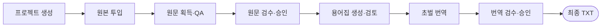

# 전체 작업 흐름

이 문서는 `glk` CLI의 프로젝트 생성부터 최종 번역 승인까지의 실행 순서, 사람의 판단 지점, 주요 출력과 상태 전이를 정리한 단일 기준입니다.

**대상 독자**: README의 8단계를 따라해 본 뒤, 세부 옵션·파일 형식·재실행 정책이 궁금한 사용자와 코드를 수정하는 개발자

처음 사용할 때는 [README](../README.md)만으로 충분합니다. 여기서는 각 단계의 내부 동작과 예외 처리를 다룹니다.

---

## 전체 흐름 요약



## 상세 흐름도

아래 다이어그램은 모든 분기와 재실행 경로를 포함합니다.

```mermaid
flowchart TD
    START([작업 시작]) --> SETUP[CLI 설치<br/>GEMINI_API_KEY 설정]
    SETUP --> INIT[glk init<br/>프로젝트 workspace 생성]
    INIT --> PLACE[01_input/pdf 또는 01_input/images에<br/>번역할 원본 넣기]
    PLACE --> RUN[glk run<br/>입력 자동 감지·통합 실행]
    RUN --> INPUT{원문 입력}

    INPUT -->|PDF| PDF[PDF fragment·좌표 추출<br/>Gemini 읽기 순서 판정<br/>검증 실패 시 최대 2회 재시도]
    INPUT -->|이미지 폴더| IMAGE[이미지별 Gemini OCR<br/>하위 폴더 구조 보존]
    PDF --> NORMALIZE[공통 source block 정규화]
    IMAGE --> NORMALIZE

    NORMALIZE --> BLOCKS[.glk/segments/source.jsonl<br/>검수 전 내부 데이터]
    BLOCKS --> DRAFT[02_source/draft.txt<br/>수정하지 않는 기준본]
    BLOCKS --> REVIEW[02_source/review.txt<br/>사람이 수정하는 작업본]
    BLOCKS --> QA[로컬 규칙 QA]
    QA --> REPORT[02_source/qa.md<br/>사람용 보고서]

    DRAFT -. 기준본 .-> SOURCE_UI[glk review source<br/>원본 이미지·추출 block 비교]
    REVIEW --> SOURCE_UI
    REPORT --> SOURCE_UI
    PLACE -. PDF 페이지·OCR 이미지 .-> SOURCE_UI
    SOURCE_UI --> HUMAN[본문 수정·같은 원본 안에서 순서 변경<br/>제외·영역 지정 수동 block 추가]
    HUMAN --> CHECK[브라우저 검사<br/>또는 glk review finalize --dry-run]
    CHECK -->|오류| SOURCE_UI
    CHECK -->|통과| FINALIZE[브라우저 최종 승인<br/>또는 glk review finalize]

    FINALIZE --> FINAL[02_source/final.txt]
    FINALIZE --> APPROVED[.glk/segments/approved_source.jsonl<br/>최종 공통 원문]
    APPROVED --> BUILD[glk glossary build<br/>로컬 용어 후보 수집]
    BUILD --> TSV[03_terminology/glossary_review.tsv]
    TSV --> GLOSSARY_UI[glk review glossary<br/>표 형식 localhost 검수 화면]
    GLOSSARY_UI --> EDIT[상태·번역어·분류·메모 수정<br/>일괄 처리·누락 용어 추가]
    EDIT --> IMPORT[화면에서 termbase 생성<br/>또는 glk glossary import]
    IMPORT --> TERMBASE[03_terminology/termbase.json]
    TERMBASE --> TRANSLATE[glk translate<br/>ID 기반 Gemini 초벌 번역]
    TRANSLATE --> TRANS_SEG[.glk/segments/translation.jsonl]
    TRANS_SEG --> TRANS_DRAFT[04_translation/draft.txt]
    TRANS_SEG --> TRANS_REVIEW[04_translation/review.txt]
    TRANS_DRAFT -. 비교 .-> TRANS_UI[glk review translation<br/>localhost 검수 화면]
    TRANS_REVIEW --> TRANS_UI
    TRANS_UI --> TRANS_HUMAN[브라우저에서 원문·번역 비교<br/>번역 본문만 수정·저장]
    TRANS_HUMAN --> TRANS_QA[브라우저에서 로컬 QA 실행]
    TRANS_QA -->|오류| TRANS_DECIDE{오류 처리 방법}
    TRANS_DECIDE -->|직접 수정| TRANS_UI
    TRANS_DECIDE -->|ERROR만 Gemini 재번역| TRANS_RETRY[glk retry --failed<br/>또는 UI 오류만 재번역]
    TRANS_RETRY --> REVISION[04_translation/revisions/translation_retry_*.json]
    REVISION --> TRANS_UI
    TRANS_QA -->|통과| TRANS_CHECK[glk translation finalize --dry-run]
    TRANS_CHECK -->|오류| TRANS_HUMAN
    TRANS_CHECK -->|통과| TRANS_FINALIZE[glk translation finalize]
    TRANS_FINALIZE --> APPROVED_TRANS[.glk/segments/approved_translation.jsonl]
    TRANS_FINALIZE --> FINAL_TRANS[05_output/*_kor.txt]
    FINAL_TRANS --> DONE([최종 TXT 완료])

    NORMALIZE -. 원문 변경 감지 .-> STALE{기존 review와<br/>새 draft가 다른가?}
    STALE -->|아니오| KEEP[기존 review 보존]
    STALE -->|예| COMPARE[review stale<br/>사람이 새 draft와 비교]
    COMPARE --> RESET[glk review prepare --force<br/>명시적 초기화]
    RESET --> SOURCE_UI
```



---

## 1. 프로젝트 생성

```bash
glk init "Primal Rulebook" --project-id primal
glk projects
glk status --project primal
```

- 프로젝트 이름은 화면과 manifest에서 읽는 이름입니다.
- `project_id`는 `workspaces/<project_id>/` 경로와 CLI에서 계속 사용하는 식별자입니다.
- `project_id`를 생략하면 이름을 Windows/macOS에서 사용할 수 있는 형태로 정규화합니다.
- 다른 workspace 루트를 쓰면 이후 모든 명령에도 `--workspace-root PATH`를 지정합니다.
- `glk projects`는 workspace 안의 전체 프로젝트와 현재 진행 단계를 보여줍니다.

---

## 2. 번역 원본 넣기와 검수 준비

`glk init`은 프로젝트마다 사용자 입력 전용 폴더를 생성합니다.

```text
workspaces/<project_id>/01_input/
├── pdf/
└── images/
```

- 일반 PDF 프로젝트: `01_input/pdf/`에 PDF 한 개를 넣습니다.
- 이미지 OCR 프로젝트: `01_input/images/`에 이미지와 `ocr_prompt.txt`를 넣습니다.
- 이미지 하위 폴더와 이미지별 `파일명.prompt.txt`도 지원합니다.
- `01_input/`이 프로젝트의 유일한 원본 저장소입니다.

### 통합 명령

가장 간단한 시작 방법은 대화형 통합 명령입니다.

```bash
glk run --project primal
```

한 입력 폴더에만 원본이 있으면 종류와 경로를 자동 감지합니다. 양쪽에 모두 원본이 있으면 선택을 요청합니다. `glk run`은 원문 획득, block 정규화, draft/review 생성과 로컬 QA까지 실행합니다.

### 명시적 입력 지정

스크립트나 CI에서는 입력을 명시합니다.

```bash
# PDF 전체 페이지
glk run --project primal --input-type pdf --file rulebook.pdf

# PDF 일부 페이지만 선택
glk run --project primal --input-type pdf --file rulebook.pdf --pages 1,3-5

# 이미지 루트 폴더와 모든 하위 폴더
glk run --project cards --input-type images --folder card_images/
```

외부 `--file` 또는 `--folder`를 사용하면 해당 원본을 `01_input/`에 한 번 복사해 등록합니다. 이미 `01_input/`에 있는 원본은 복사하지 않으며 이후 실행은 등록된 입력 파일을 직접 참조합니다.

`glk ui` 대시보드에서도 원본이 없는 프로젝트에 PDF 한 개 또는 이미지 여러
장을 등록할 수 있습니다. 이 동작은 파일 복사와 manifest 갱신만 수행하며
추출·OCR은 시작하지 않습니다. 원문 처리를 시작하기 전에는 카드의 `원본 교체`로
기존 원본 전체를 삭제하고 새 파일만 등록할 수 있습니다. 이미지 교체 시 공통
`ocr_prompt.txt`의 현재 내용을 UI에서 확인·수정하며 새 이미지와 함께 저장합니다.
프롬프트를 수정하지 않으면 기존 내용이 유지됩니다. 이미지 원본은 그대로 두고
프롬프트만 바꾸려면 카드의 `OCR 프롬프트 수정`을 사용합니다. 추출·OCR이 시작된 뒤에는 UI와 API 모두 교체와 프롬프트 수정을
허용하지 않습니다. 카드에는 PDF 파일명 또는 첫 이미지 파일명과 전체 개수가
표시되며, 이미지가 여러 장이면 파일 목록 모달에서 모든 상대 경로를 자연순으로
확인할 수 있습니다.

대시보드 오른쪽 위 `AI 설정`에서 Gemini API 키와 공통 모델을 설정할 수
있습니다. 값은 저장소 최상위 `.env`에 저장되며 API 키는 설정 여부만 화면에
표시합니다. 키 입력칸을 비우고 저장하면 기존 키가 유지됩니다. 셸 환경변수가
있으면 `.env`보다 우선하므로 대시보드에 우선 적용 안내를 표시합니다. 모델
드롭다운은 실제 API 모델 ID를 표시하며 목록은
[`src/glk/data/gemini_models.json`](../src/glk/data/gemini_models.json)에서
관리합니다.

원본 등록 뒤 프로젝트 카드에서 원문 준비를 시작하면 PDF 추출 또는 이미지
OCR과 검수 block 생성, 로컬 source QA가 background job으로 실행됩니다. 진행
상태는 카드에서 갱신되고 성공하면 원문 검수 버튼이 활성화됩니다. 동시에 하나만
실행할 수 있으며 실패 시 같은 버튼으로 재시도합니다. 실행 중 취소는 지원하지
않습니다.

원본을 등록한 뒤에는 입력 경로를 생략할 수 있습니다.

```bash
glk run --project primal
```

### 개별 단계 명령

`extract`, `ocr`, `segment`, `qa`는 문제를 진단하거나 한 단계만 다시 실행할 때 사용합니다.

```bash
glk extract --project primal --file rulebook.pdf
glk ocr --project cards --folder card_images/
glk segment --project primal
glk qa --project primal
```

---

## 3. 이미지 OCR prompt

이미지 루트의 `ocr_prompt.txt`를 공통 지침으로 사용합니다. 새 프로젝트에는
게임별 규칙을 채워 넣을 수 있는 중립적인 안내와 가상 작성 예시가 자동 생성됩니다.
가상 token은 실제 규칙이 아니므로 프로젝트에서 사용하는 정의로 교체합니다.
대시보드에서 이미지 원본을 등록·교체할 때도 이 파일의 현재 내용을 불러와
편집합니다. OCR 시작 전에는 원본 교체 없이 프롬프트만 따로 저장할 수 있으며,
64 KiB 이하의 비어 있지 않은 UTF-8 텍스트만 허용합니다.
특정 이미지에만 추가 지침이 필요하면 `파일명.jpg.prompt.txt`를 옆에 둡니다.

```text
card_images/
├── ocr_prompt.txt
├── characters/
│   ├── card-001.jpg
│   └── card-001.jpg.prompt.txt
└── items/
    └── card-002.png
```

아이콘은 참조 이미지를 매 요청마다 보내지 않고 공통 prompt에 시각적 특징과 출력 token을 설명합니다.

```text
- {DEFENSE}: 속이 빈 방패 외곽선. 중앙에는 다른 문양이 없음.
- {HEALTH}: 위쪽이 두 갈래로 둥글고 아래쪽이 뾰족한 하트 실루엣.
정의하지 않은 아이콘은 [ICON: concise visible description]으로 표시한다.
```

각 요청에는 OCR 대상 이미지 한 장만 전달됩니다. 결과는 이미지별 TXT와 통합 TXT로 생성됩니다.

---

## 4. 로컬 QA와 시각 원문 검수

`glk run`이 끝나면 다음 세 파일을 사용합니다.

| 파일 | 역할 | 수정 여부 |
|---|---|---:|
| `02_source/draft.txt` | 자동 추출 결과의 비교 기준 | 수정하지 않음 |
| `02_source/review.txt` | 브라우저 또는 편집기로 고치는 작업본 | 본문 수정 |
| `02_source/qa.md` | 의심 위치, block ID와 근거 | 읽기 전용 |

QA는 LLM을 호출하거나 원문을 자동 수정하지 않습니다. 현재 검사 범위:

- `[ILLEGIBLE]`, 미확정 `[ICON: ...]`, replacement character
- `{HP}` 같은 token의 괄호 손상과 허용되지 않은 token
- 숫자와 같은 문자열에 섞인 `O/0`, `I/l/1` 혼동 후보
- identifier 형식·중복과 source hash 불일치
- OCR provider가 남긴 warning과 불확실한 legibility

### 브라우저 검수 화면

```bash
glk review source --project primal
```

PDF는 추출 단계에서 렌더링한 페이지 이미지가 표시되며, 이미지 OCR 프로젝트는 `01_input/images/`의 실제 이미지가 표시됩니다. 화면에서 다음 작업을 할 수 있습니다.

- 추출문 수정
- 같은 PDF 페이지 또는 같은 이미지 안에서 block 순서 변경
- 불필요하거나 잘못 잡힌 block 제외
- 누락된 영역을 원본 위에서 드래그하고 새 block 추가
- QA 확인, 저장, 검사와 최종 승인

수동 block은 현재 원본의 0~1000 정규화 bbox를 보존합니다. PDF 페이지나 이미지 파일 자체의 순서를 바꾸는 것은 허용하지 않습니다.

### 텍스트 편집기 사용

브라우저를 사용할 수 없으면 `02_source/review.txt`를 직접 수정합니다. marker는 수정하지 않습니다.

```text
[[GLK_REVIEW version=2]]

[PAGE 7]
[BLOCK pdf-p0007-b0012-xxxxxxxxxx]
Increase your HP by 10.
[[GLK_END pdf-p0007-b0012-xxxxxxxxxx]]
```

이미지 block은 `[PAGE]` 대신 `[SOURCE 01_input/images/...]`를 사용합니다. 기존 version 1 파일도 읽을 수 있고, 브라우저에서 처음 저장할 때 version 2로 갱신됩니다.

---

## 5. 최종 원문 승인

브라우저의 `검사`와 `최종 승인` 버튼을 사용하거나, CLI에서 실행합니다.

```bash
glk review finalize --project primal --dry-run   # 파일을 쓰지 않는 검사
glk review finalize --project primal             # 최종화
```

검사 항목: marker, block 순서, 빈 본문, 미해결 OCR 표시, token 구조와 stale 상태

`{HP}` 같은 token 변경을 의도했다면 원본을 확인한 뒤에만 사용합니다.

```bash
glk review finalize --project primal --allow-token-changes
```

최종 결과: `02_source/final.txt`와 `.glk/segments/approved_source.jsonl`

후속 단계는 hash까지 유효한 `approved_source.jsonl`만 입력으로 허용합니다.

### 원문 변경 감지와 stale

원문 획득 결과가 바뀐 상태에서 `glk segment`를 다시 실행하면 새 draft만 만들고 기존 review를 stale로 표시합니다. 비교를 마치고 작업본을 초기화할 때만:

```bash
glk review prepare --project primal --force
```

---

## 6. 용어 후보 검토

최종 원문이 승인된 뒤 후보 TSV를 생성합니다.

```bash
glk glossary build --project primal
```

제목·고유명사, 정의형 label과 반복되는 1~4단어 표현을 로컬 규칙으로 수집합니다. 수량 접두사, 불완전한 대문자 조각, 일반 기능어와 완전히 중첩된 짧은 후보는 제거합니다. 기존 TSV가 있으면 사람의 편집을 보존하고, 승인 원문이나 설정이 달라지면 stale로 표시합니다.

```bash
# 편집 내용을 버리고 새 후보로 초기화 (비교·백업 후에만)
glk glossary build --project primal --force
```

### 브라우저 검토 화면

```bash
glk review glossary --project primal
```

HTML 표에서 모든 자동 후보를 `approved`, `keep`, `rejected` 중 하나로 확정합니다. 검색·필터, 여러 행 선택 후 상태 일괄 변경, 실제 문맥 펼쳐보기와 수동 용어 추가를 지원합니다. 저장은 기존 `glossary_review.tsv`를 갱신합니다. 정확한 컬럼과 상태값은 [용어집 검토 사양](GLOSSARY.md)을 따릅니다.

### Termbase 생성

화면의 `검증 및 termbase 생성`을 누르거나, TSV를 직접 편집했다면:

```bash
glk glossary import \
  --project primal \
  --file 03_terminology/glossary_review.tsv
```

import가 수행하는 작업:

- 고정 컬럼, status, category, 번역어와 중복 검사
- 자동 후보 candidate ID 누락·변조 검사
- 수동 용어의 안정적인 ID 생성
- 승인 원문에서 variants, 빈도, block ID, 위치와 예문 재계산
- 검증된 근거를 `glossary_review.tsv`에 다시 기록
- `03_terminology/termbase.json`과 `.glk/state/glossary_import.json` 원자적 생성

`review` 상태가 하나라도 남거나 자동 후보 행이 삭제되면 import를 차단합니다.

원문에 아직 없는 확장판 용어를 의도적으로 선등록할 때만:

```bash
glk glossary import \
  --project primal \
  --file 03_terminology/glossary_review.tsv \
  --allow-missing-terms
```

이 항목은 `origin: manual`, `source_verified: false`로 기록됩니다.

---

## 7. 초벌 번역

최종 원문과 termbase가 모두 `current`일 때만 번역을 시작합니다.

```bash
glk translate --project primal --dry-run   # API 없이 청크 계획 확인
glk translate --project primal             # 실제 번역
```

처음 실행할 때 기본 지침을 `04_translation/prompt.txt`에 기록합니다. 게임별 지침을 사용하려면:

```bash
glk translate \
  --project primal \
  --prompt prompts/primal_translation.txt \
  --model gemini-2.5-flash
```

### Prompt 우선순위

| 우선순위 | 규칙 | 변경 방법 |
|---:|---|---|
| 1 | block ID, 순서, 숫자, `{TOKEN}`, `[TOKEN]`, HTML 보존 | 변경 불가 |
| 2 | current termbase의 `approved`, `keep` | TSV 검토 후 glossary import |
| 3 | 프로젝트 `04_translation/prompt.txt` | 파일 또는 `--prompt` |
| 4 | 프로그램 기본 문체 | 프로젝트 지침이 없을 때 사용 |

프로젝트 prompt가 termbase와 충돌해도 termbase가 우선합니다.

### 청크와 재개

번역은 source block을 중간에 자르지 않고 순서대로 청크화합니다. 기본 상한은 원문 10,000자입니다.

```bash
glk translate --project primal --max-characters 8000
glk translate --project primal --resume   # 중단 후 완료된 청크부터 이어서
```

승인 원문, termbase, project prompt, 모델, hard rule 버전이나 청크 설정이 달라지면 기존 결과를 stale로 처리합니다.

### 생성 파일

| 파일 | 역할 |
|---|---|
| `.glk/segments/translation.jsonl` | source block ID와 연결된 내부 번역 데이터 |
| `04_translation/draft.txt` | 자동 번역 기준본 |
| `04_translation/review.txt` | 사람이 수정할 작업본 |
| `04_translation/prompt.txt` | 실제 사용한 프로젝트 번역 지침 |

재번역으로 draft가 달라져도 기존 `review.txt`는 덮어쓰지 않고 `stale`로 보존합니다.

---

## 8. 번역문 검수, QA와 최종 승인

### 브라우저 검수 화면

```bash
glk review translation --project primal
```

사용 가능한 localhost 포트를 골라 기본 브라우저를 자동으로 엽니다. 화면 기능:

- block별 원문과 번역을 나란히 비교
- 원문·번역·block ID 검색
- 오류·경고·수정됨 필터와 block 이동
- 번역문만 수정하고 `04_translation/review.txt`에 안전하게 저장
- 저장 후 로컬 QA 실행과 오류 확인
- QA ERROR가 연결된 block만 Gemini로 재번역하고 다시 검수
- 오류가 0개인 결과의 최종 승인

PASS block을 포함한 모든 번역문을 수정할 수 있습니다. PASS는 결정적 QA 규칙을 통과했다는 뜻이며 번역 품질 승인이나 편집 잠금이 아닙니다.

서버는 `127.0.0.1`에만 바인딩됩니다. 터미널에서 `Ctrl+C`로 종료합니다.

```bash
glk review translation --project primal --no-open --port 8765
```

### 텍스트 편집기 사용

`04_translation/review.txt`에서 각 block의 `[TRANSLATION]` 아래 본문만 수정합니다.

```text
[BLOCK pdf-p0001-b0001-...]
[ORIGINAL]
Each Hunter gains 2 Stamina.
[TRANSLATION]
각 사냥꾼은 스태미나 2를 얻습니다.
[[GLK_END pdf-p0001-b0001-...]]
```

`[PAGE]`, `[SOURCE]`, `[BLOCK]`, `[ORIGINAL]`, `[TRANSLATION]`, `[[GLK_END ...]]` marker와 `[ORIGINAL]` 본문은 변경하지 않습니다.

### QA와 재번역

```bash
glk translation qa --project primal
```

최종 승인을 차단하는 오류:

- marker, block ID·순서·위치 또는 `[ORIGINAL]` 본문 변경
- block 누락·추가와 빈 번역
- 숫자, `{TOKEN}`, `[TOKEN]`, HTML/rich-text 태그 변경
- termbase의 `approved` 번역어 누락 또는 `keep` 용어 변경
- Unicode replacement character와 `[ILLEGIBLE]` 잔존

원문과 번역이 완전히 같거나 한국어에 한글이 없는 경우는 warning으로 표시하며 자동으로 승인을 차단하지 않습니다.

QA의 `code`는 영문 식별자로 유지합니다. 사람이 보는 HTML과 보고서의 `message`에는 한글 사유와 실제 차이값을 기록합니다.

```bash
glk retry --failed --project primal --dry-run   # 대상 확인
glk retry --failed --project primal             # ERROR block만 재번역

glk translation finalize --project primal --dry-run
glk translation finalize --project primal
```

`glk retry --failed`는 ERROR block만 한 개씩 재번역합니다. 정상 block과 사람이 수정한 다른 block은 그대로 유지합니다. 교체 전·후 번역은 `04_translation/revisions/translation_retry_*.json`에 기록됩니다.

### 최종 결과 파일

오류가 0개일 때만 생성됩니다.

| 파일 | 역할 |
|---|---|
| `.glk/segments/approved_translation.jsonl` | 초벌 번역과 사람 수정을 분리 보존한 승인 데이터 |
| `05_output/<PDF 파일명>_kor.txt` | page 경계와 구분선을 유지한 PDF 승인 번역본 |
| `05_output/<이미지 파일명>_kor.txt` | 원본 하위 폴더를 보존한 이미지별 승인 번역본 |
| `05_output/combined_kor.txt` | source 경계와 구분선을 유지한 이미지 프로젝트 통합본 |

### Stale 처리

재번역으로 review가 stale이 되면 기존 사람 수정은 자동으로 덮어쓰지 않습니다.

```bash
glk translation prepare --project primal --force   # 새 draft로 초기화
```

---

## 9. 상태와 재실행

```bash
glk status --project primal
```

| 출력 | 의미 |
|---|---|
| `Source acquired` | PDF 또는 이미지 원문 획득 완료 여부 |
| `Review source` | 공통 source block과 검토 TXT 준비 여부 |
| `Source QA` | QA 상태와 issue 수 |
| `Human review` | `pending`, `stale`, `approved` 등의 검토 상태 |
| `Final source` | 현재 hash 기준 최종 승인 유효 여부 |
| `Glossary review` | `not_ready`, `not_built`, `current`, `stale`와 후보 수 |
| `Termbase` | `not_ready`, `not_built`, `current`, `stale`와 entry 수 |
| `Translation` | `not_ready`, `not_run`, `partial`, `current`, `stale`와 block 수 |
| `Translation review` | `not_ready`, `pending`, `stale`, `qa_failed`, `qa_passed`, `approved` |
| `Final translation` | 현재 hash 기준 최종 번역 승인 유효 여부 |

입력, 모델, prompt와 결과 내용이 같으면 단계별 캐시를 재사용합니다. 실행 시간이나 캐시 적중 수처럼 결과에 영향을 주지 않는 메타데이터는 다음 단계의 입력 변경으로 취급하지 않습니다. `--force`는 해당 단계의 결과를 의도적으로 다시 만들 때만 사용합니다.

---

## 10. 주요 출력 구조

```text
workspaces/<project_id>/
├── project.json
├── 01_input/
│   ├── pdf/                          # 유일한 PDF 원본 한 개
│   │   └── rulebook.pdf
│   └── images/                       # 유일한 이미지 원본
│       ├── ocr_prompt.txt
│       └── ...
├── 02_source/
│   ├── ocr/
│   │   ├── individual/
│   │   └── combined.txt
│   ├── extracted.txt
│   ├── draft.txt
│   ├── review.txt
│   ├── qa.md
│   └── final.txt
├── 03_terminology/
│   ├── glossary_review.tsv
│   └── termbase.json
├── 04_translation/
│   ├── prompt.txt
│   ├── draft.txt
│   ├── review.txt
│   ├── qa.md
│   └── revisions/
├── 05_output/
│   ├── rulebook_kor.txt               # PDF 프로젝트
│   ├── combined_kor.txt               # 이미지 프로젝트 통합본
│   └── cards/card-001_kor.txt         # 이미지별 번역본
└── .glk/                             # 직접 수정하지 않는 내부 데이터
    ├── cache/
    ├── segments/
    ├── state/
    └── reports/
```

---

## 용어 기준

| 용어 | 의미 | 대표 파일 |
|---|---|---|
| 원문 획득 결과 | PDF 추출 또는 이미지 OCR 직후의 provider별 결과 | `.glk/cache/` |
| 검수용 중간 원문 | 같은 block 형식으로 정규화한 데이터 | `.glk/segments/source.jsonl` |
| 자동 생성 기준본 | 원문 변경 비교에 사용하는 수정 금지 TXT | `02_source/draft.txt` |
| 검토 작업본 | 사람이 원본과 비교하며 수정하는 TXT | `02_source/review.txt` |
| 최종 원문 TXT | 구조 검증을 통과한 TXT | `02_source/final.txt` |
| 최종 공통 원문 | 후속 단계 기준 데이터 | `.glk/segments/approved_source.jsonl` |
| 초벌 번역 | 모델 출력과 hash를 보존하는 검수 입력 | `.glk/segments/translation.jsonl` |
| 최종 번역 | 초벌과 사람 수정을 분리 보존하는 승인 데이터 | `.glk/segments/approved_translation.jsonl` |

---

## 문서 갱신 규칙

코드와 사용 흐름이 바뀌면 다음 기준으로 문서를 갱신합니다.

| 변경 범위 | 갱신 대상 |
|---|---|
| 사용 순서·명령·출력·사람 판단 지점 | 이 문서와 Mermaid |
| 데이터 모델·계층·hash 정책 | [아키텍처](ARCHITECTURE.md) |
| TSV·termbase 계약 | [용어집 검토 사양](GLOSSARY.md) |
| LLM 호출·재시도·캐시 또는 요금 기준 | [LLM 사용량과 비용](COSTS.md) |
