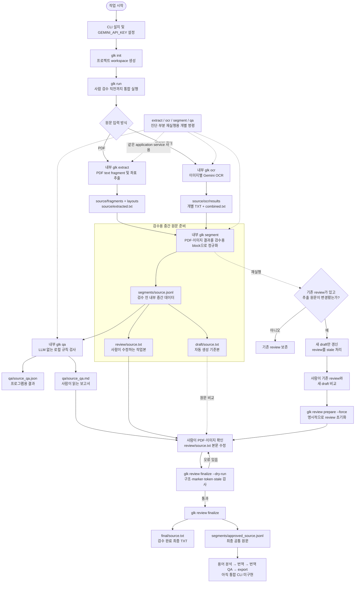

# 전체 작업 흐름도

이 문서는 Game Localization Kit 전체 파이프라인의 단일 기준 흐름도입니다. CLI 단계, 입력 방식, 주요 출력 파일 또는 단계 간 연결이 변경될 때는 코드와 함께 이 문서를 반드시 갱신합니다.

## 현재 구현 흐름

## 용어 기준

| 용어 | 의미 | 대표 파일 |
|---|---|---|
| 원문 획득 결과 | PDF 추출 또는 이미지 OCR 직후의 provider별 결과 | `source/layouts/`, `source/ocr/results/` |
| 검수용 중간 원문 | QA와 사람 검수를 위해 같은 block 형식으로 정규화한 검수 전 데이터 | `segments/source.jsonl` |
| 자동 생성 기준본 | 검수 전 중간 원문을 사람이 읽을 수 있게 만든 수정 금지 TXT | `draft/source.txt` |
| 검토 작업본 | 사람이 원본 PDF·이미지와 비교하며 직접 수정하는 TXT | `review/source.txt` |
| 최종 원문 TXT | 검토 작업본의 구조 검증을 통과한 최종 TXT | `final/source.txt` |
| 최종 공통 원문 | raw text와 corrected text를 함께 보존하는 후속 파이프라인 기준 데이터 | `segments/approved_source.jsonl` |

`segments/source.jsonl`은 최종 공통 원문이 아닙니다. 사람이 검수를 마치고 `glk review finalize`를 통과한 `segments/approved_source.jsonl`만 최종 공통 원문으로 부릅니다.

## 흐름도 갱신 규칙

다음 중 하나라도 변경되면 같은 작업에서 이 문서를 함께 수정합니다.

- CLI 명령 또는 실행 순서
- 입력 방식이나 분기 조건
- 단계별 주요 출력 파일
- 검수·승인 조건
- 캐시, stale 또는 재실행 동작
- 용어 분석, 번역, QA, export 단계의 구현 상태

흐름도를 수정한 뒤에는 [작업 히스토리](WORK_HISTORY.md)의 완료 항목과 다음 작업도 같은 상태인지 확인합니다.

반복 `glk run`에서는 입력·모델·prompt와 실제 획득 결과가 같으면 단계별 캐시를 재사용합니다. 실행 시각과 캐시 적중 목록처럼 결과 내용에 영향을 주지 않는 메타데이터는 검수용 중간 원문의 입력 변경으로 취급하지 않습니다.
