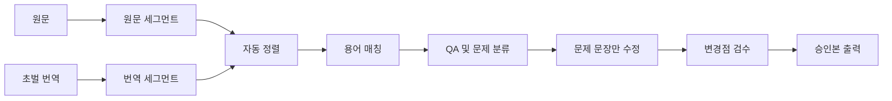

# 번역 자동화 파이프라인 설계 초안

> 상태: 초기 전체 구상을 보존한 설계 기록입니다. 현재 구현 구조는 [아키텍처](../reference/architecture.md), 실제 사용 순서는 [전체 작업 흐름](../guides/workflow.md)을 기준으로 합니다.

현재 구현된 전체 실행 순서와 용어의 단일 기준은 [전체 작업 흐름](../guides/workflow.md)입니다.

> 상태: Draft 0.1  
> 대상: 보드게임 룰북, 카드 텍스트, 앱/스크립트 문자열의 한국어 현지화  
> 우선 인터페이스: Windows/macOS 공통 CLI

## 1. 문서 목적

현재의 단계별 Python 스크립트를 단순히 하나의 명령으로 묶는 데서 끝내지 않고, 실제 번역 작업에서 반복되는 다음 과정을 자동화하는 것이 목적입니다.

- 원문과 기존 초벌 번역 비교
- 문장 및 key 단위 정렬
- 키워드와 번역 후보 매칭
- 용어 사용 빈도 및 불일치 분석
- 규칙·숫자·토큰 보존 검사
- 문제가 있는 문장만 선택적으로 재번역
- 수정 전후 차이 검수 및 승인
- 승인된 번역과 용어의 재사용

이 도구의 목표는 완전 무인 번역이 아닙니다. 기계가 잘할 수 있는 구조 비교와 반복 검사는 자동화하고, 사람은 의미 판단과 최종 승인에 집중하게 만드는 것을 목표로 합니다.

## 2. 핵심 설계 원칙

### 2.1 번역 전에 신뢰할 수 있는 원문을 먼저 확정한다

PDF와 이미지는 곧바로 번역 입력으로 사용하지 않습니다. 페이지별로 내장 텍스트 추출 가능 여부를 판정하고, 필요한 페이지만 OCR한 뒤 원본 이미지와 비교해 원문을 승인합니다. 승인되지 않은 OCR 결과는 번역 단계로 넘기지 않습니다.

### 2.2 초벌 번역을 버리지 않는다

이미 번역된 문장을 전체 재번역하지 않습니다. 기존 번역을 기준으로 문제를 찾고, 문제가 있는 세그먼트만 수정합니다.

### 2.3 원문과 번역은 안정적인 ID로 연결한다

페이지 위치나 단순 줄 번호만 사용하지 않습니다. key, 문서 구조, 원문 해시를 조합한 안정적인 세그먼트 ID를 사용합니다.

### 2.4 구조 검사는 코드가 담당한다

다음 항목은 LLM의 판단에 맡기지 않습니다.

- 숫자
- 식별자
- HTML 및 rich text 태그
- bracket token
- 페이지 마커
- 카드·지도·스크립트 참조
- 문장 누락 및 추가

### 2.5 LLM은 의미와 문체 개선에 집중한다

LLM에는 원문, 기존 번역, 발견된 문제, 승인 용어, 스타일 가이드를 함께 제공합니다. 아무런 근거 없이 전체 문장을 새로 번역하게 하지 않습니다.

### 2.6 모든 자동 수정은 추적 가능해야 한다

수정 전후 내용, 수정 사유, 사용 모델, 프롬프트 버전, 실행 시간을 기록합니다.

### 2.7 CLI와 향후 GUI는 같은 엔진을 사용한다

핵심 로직이 CLI 명령이나 화면 코드에 들어가지 않게 합니다. CLI와 GUI는 동일한 application service를 호출해야 합니다.

## 3. 주요 사용 시나리오

### 3.1 신규 문서 번역

```mermaid
flowchart LR
    A[PDF/이미지/TXT] --> B[입력 판별]
    B --> C[내장 텍스트 추출 또는 OCR]
    C --> D[OCR 원문 QA]
    D --> E[원문 검수·승인]
    E --> F[정제 및 세그먼트 생성]
    F --> G[용어 후보 분석]
    G --> H[샘플 번역]
    H --> I[용어·스타일 승인]
    I --> J[전체 번역]
    J --> K[번역 QA·선택 재번역]
    K --> L[사람 검수 및 최종 출력]
```



### 3.2 기존 초벌 번역 개선



### 3.3 개정판 및 에라타 반영

- 이전 원문과 새 원문을 비교합니다.
- 변경되지 않은 문장은 승인 번역을 그대로 사용합니다.
- 숫자나 일부 표현만 바뀐 문장은 기존 번역을 참고해 수정합니다.
- 새 문장만 신규 번역합니다.
- 삭제된 문장은 결과에서도 제거 후보로 표시합니다.

## 4. 프로젝트 작업 공간

번역 작업 하나를 독립적인 project workspace로 관리합니다.

```text
workspace/
└── elder_scrolls_rulebook/
    ├── project.json
    ├── source/
    │   ├── original.pdf
    │   ├── pages/
    │   │   ├── page_001.png
    │   │   └── page_002.png
    │   ├── document.json
    │   ├── raw_extracted.txt
    │   ├── raw_ocr.txt
    │   ├── extracted.txt
    │   ├── cleaned.txt
    │   └── source_corrections.jsonl
    ├── segments/
    │   ├── source.jsonl
    │   ├── approved_source.jsonl
    │   ├── draft.jsonl
    │   └── aligned.jsonl
    ├── draft/
    │   └── source.txt
    ├── review/
    │   └── source.txt
    ├── final/
    │   └── source.txt
    ├── terminology/
    │   ├── glossary_review.tsv
    │   ├── termbase.json
    │   └── style_guide.json
    ├── qa/
    │   ├── source_qa.json
    │   ├── source_qa.html
    │   ├── latest.json
    │   └── latest.html
    ├── revisions/
    │   └── revision_001.jsonl
    ├── output/
    │   ├── translated.txt
    │   └── formatted.txt
    └── state/
        ├── checkpoints.json
        └── run_history.jsonl
```

사용자 원본은 `source/`에 보존하고, 처리 과정에서 원본을 덮어쓰지 않습니다.

## 5. 핵심 데이터 모델

### 5.1 프로젝트 manifest

```json
{
  "schema_version": 1,
  "project_id": "elder_scrolls_rulebook",
  "name": "The Elder Scrolls Rulebook",
  "profile": "elder_scrolls",
  "source_language": "en",
  "target_language": "ko",
  "source_file": null,
  "created_at": "2026-07-22T00:00:00Z"
}
```

manifest는 파일 이름을 추측하는 대신 각 단계의 입력과 출력을 연결하는 기준이 됩니다. `glk init` 직후 `source_file`은 `null`이며 ingest가 원본을 `source/`에 등록한 뒤 workspace 내부 상대경로로 갱신합니다. 사용자별 절대경로는 manifest에 저장하지 않습니다.

### 5.2 세그먼트

초기 저장 형식은 사람이 확인하기 쉽고 append가 가능한 JSONL을 사용합니다. 데이터 양이 커지거나 검색 성능이 필요해지면 SQLite로 전환할 수 있습니다.

QA와 사람 검수를 진행하기 전에 provider별 PDF layout과 이미지 OCR 결과를 다음 검수용 중간 source block으로 정규화합니다. 이 데이터는 최종 공통 원문이 아닙니다.

```json
{
  "schema_version": 1,
  "id": "image-card-239-b0004-427fc82ddb",
  "source_type": "image",
  "source_file": "source/images/card-239.jpg",
  "page": null,
  "source_order": 4,
  "block_order": 4,
  "block_type": "body",
  "raw_text": "Discard the top card of your deck.",
  "corrected_text": null,
  "bbox": [180.0, 620.0, 820.0, 650.0],
  "legibility": "clear",
  "status": "raw",
  "warnings": [],
  "source_refs": [],
  "source_hash": "sha256:..."
}
```

PDF fragment의 실측 좌표는 페이지 크기를 기준으로 0~1000 범위로 정규화하고, 이미지 OCR bbox는 같은 범위를 그대로 사용합니다. `raw_text`는 불변 원문이며 사람이 수정할 때는 `corrected_text`와 상태만 변경합니다. block ID는 원본 위치와 block 순서로 만들기 때문에 text 교정만으로 바뀌지 않습니다.

```json
{
  "id": "page_012.rule_004",
  "source_order": 184,
  "page": 12,
  "section": "Combat",
  "kind": "rule",
  "source": "Each player may perform one Action.",
  "source_hash": "sha256:...",
  "draft": "각 플레이어는 액션 하나를 수행할 수 있습니다.",
  "translation": "각 플레이어는 행동 하나를 수행할 수 있습니다.",
  "status": "needs_review",
  "locked": false,
  "qa_flags": ["TERM_FORBIDDEN"],
  "context": {
    "previous_id": "page_012.rule_003",
    "next_id": "page_012.rule_005"
  }
}
```

세그먼트에는 원문 근거를 추적할 수 있도록 페이지 번호와 원본 block ID를 반드시 남깁니다. OCR 문장을 수정하더라도 원본 이미지 위치와 최초 OCR 결과는 보존합니다.

권장 상태값:

- `new`: 아직 번역되지 않음
- `draft`: 초벌 번역 존재
- `flagged`: QA 문제 발견
- `revised`: 자동 또는 수동 수정됨
- `needs_review`: 사람 검수 필요
- `approved`: 승인 완료
- `locked`: 이후 자동 수정 금지

### 5.3 용어 항목

```json
{
  "source": "Action",
  "preferred": "행동",
  "forbidden": ["액션", "조치"],
  "status": "approved",
  "category": "game_term",
  "case_sensitive": true,
  "note": "플레이어가 수행하는 기본 행동",
  "examples": ["Perform one Action."]
}
```

용어 상태값:

- `candidate`: 자동 추출됨
- `review`: 사람 판단 필요
- `approved`: 사용 승인
- `keep`: 원문 유지
- `forbidden`: 사용 금지
- `ignored`: 용어집에서 제외

### 5.4 QA 항목

```json
{
  "segment_id": "page_012.rule_004",
  "severity": "warning",
  "code": "TERM_FORBIDDEN",
  "message": "금지 용어 '액션'이 사용되었습니다.",
  "expected": "행동",
  "actual": "액션",
  "auto_fixable": true
}
```

### 5.5 수정 이력

```json
{
  "segment_id": "page_012.rule_004",
  "before": "각 플레이어는 액션 하나를 수행할 수 있습니다.",
  "after": "각 플레이어는 행동 하나를 수행할 수 있습니다.",
  "reason": ["TERM_FORBIDDEN"],
  "actor": "gemini",
  "model": "configured-model",
  "prompt_version": "revision-v1",
  "created_at": "2026-07-22T00:00:00Z"
}
```

## 6. 원문 획득과 OCR

원문 획득은 전체 번역 파이프라인의 첫 번째 품질 관문입니다. 잘못 인식된 숫자나 부정어가 번역 단계로 넘어가면 이후 번역과 QA가 모두 잘못된 원문을 기준으로 동작하므로, 번역보다 먼저 독립적으로 검수합니다.

### 6.1 지원 입력

- 텍스트 레이어가 있는 PDF
- 스캔 이미지로만 구성된 PDF
- 텍스트와 스캔 페이지가 섞인 hybrid PDF
- PNG, JPEG, WebP 등의 단일 이미지
- 여러 장으로 구성된 이미지 폴더
- 이미 추출된 TXT

### 6.2 페이지별 입력 판별

PDF 전체를 한 가지 방식으로 처리하지 않고 페이지별로 판정합니다.

1. 내장 텍스트 존재 여부 확인
2. 추출 문자 수와 정상 문자 비율 계산
3. replacement character와 깨진 glyph 비율 계산
4. 텍스트 block 위치와 페이지 이미지 비교
5. 품질 기준 미달 페이지만 OCR 대상으로 전환

페이지 처리 모드:

- `embedded_text`: PDF 내장 텍스트 사용
- `ocr`: 렌더링 이미지 OCR 사용
- `hybrid`: 내장 텍스트와 OCR 결과를 비교·병합
- `manual`: 자동 판정이 어려워 사람 검수 필요

### 6.3 이미지 전처리

OCR 전에 필요에 따라 다음 작업을 적용합니다.

- EXIF 방향 반영
- 자동 회전
- 기울기 보정
- 여백 및 페이지 경계 탐지
- 대비와 선명도 보정
- 과도한 노이즈 제거
- 작은 글자를 위한 확대

전처리본만 보관하지 않고 원본 이미지도 함께 보존합니다. 전처리로 글자나 기호가 손상될 가능성이 있으므로 언제든 원본과 비교할 수 있어야 합니다.

### 6.4 OCR 결과 구조

OCR 결과를 곧바로 평문 TXT로만 저장하지 않습니다. 페이지와 좌표를 가진 block 단위 데이터가 원본이며, TXT는 이 데이터에서 생성되는 파생 결과로 봅니다.

```json
{
  "page": 12,
  "page_image": "source/pages/page_012.png",
  "mode": "ocr",
  "blocks": [
    {
      "id": "page_012.block_004",
      "type": "paragraph",
      "bbox": [120, 340, 1420, 620],
      "reading_order": 4,
      "raw_text": "Each player may perform one Action.",
      "corrected_text": null,
      "confidence": 0.93,
      "flags": []
    }
  ]
}
```

OCR 제공자가 좌표나 confidence를 반환하지 않는 경우 내부 값은 `null`로 두고, 별도의 heuristic QA 결과를 사용합니다. 제공자별 응답 형식을 domain 모델에 직접 노출하지 않습니다.

### 6.5 읽기 순서 복원

다음 요소가 섞인 페이지에서는 단순 위에서 아래 순서로 텍스트를 합치지 않습니다.

- 다단 편집
- 사이드바
- 표
- 카드 예시
- 그림 캡션
- 반복되는 머리말과 꼬리말
- 페이지 번호

각 block에 `reading_order`와 `type`을 기록하고, 자동 판정이 불확실한 페이지는 검수 대상으로 분류합니다.

초기 구현은 모든 텍스트 레이어 페이지에 LLM 레이아웃 판정을 적용합니다.

1. PDF 내장 텍스트를 줄 단위 좌표와 함께 추출합니다.
2. 페이지 이미지와 fragment ID·원문·좌표를 LLM에 전달합니다.
3. 모델은 원문을 생성하거나 수정하지 않고 기존 fragment ID의 순서, 묶음, block 유형과 본문 포함 여부만 반환합니다.
4. 모든 fragment ID가 정확히 한 번 사용됐는지 코드로 검증합니다.
5. 검증을 통과한 ID를 사용해 코드가 PDF 원문으로 최종 문단을 조립합니다.
6. 실패한 페이지만 재시도하고 성공 결과는 입력·설정 해시와 함께 캐시합니다.
7. 텍스트 레이어가 없거나 품질 기준을 통과하지 못한 페이지만 OCR 단계로 전환합니다.

로컬 recursive XY-cut은 운영 파이프라인의 자동 fallback으로 사용하지 않고 비교·진단·회귀 테스트 기준선으로 유지합니다. LLM 응답이 검증에 실패했을 때 로컬 결과로 조용히 대체하지 않습니다. PoC 실행 결과와 제약은 [PDF 레이아웃 복원 PoC](LAYOUT_RECONSTRUCTION_POC.md)에 기록합니다.

### 6.6 원문 QA

번역 전 원문에서 다음 문제를 탐지합니다.

- OCR confidence가 낮은 block
- 비정상 문자와 replacement character
- 중간에서 끊어진 단어
- 잘못 합쳐진 줄
- 숫자와 알파벳 혼동: `0/O`, `1/I/l`, `5/S`
- 반복되는 머리말·꼬리말
- 누락되거나 중복된 페이지
- 비정상적으로 적거나 많은 문자 수
- 표와 다단 편집의 읽기 순서 의심
- 내장 텍스트와 OCR 결과의 큰 차이

특히 규칙 의미에 영향을 주는 숫자, 부정어, 비교 표현, 카드 번호가 의심될 경우 오류 심각도를 높입니다.

현재 `glk qa`의 첫 구현은 LLM을 사용하지 않는 로컬 결정 규칙만 적용합니다.

- source hash와 raw text 무결성
- OCR `legibility=uncertain`과 provider warning
- `[ILLEGIBLE]`, `[ICON: ...]`, replacement character
- malformed `{TOKEN}`과 OCR prompt에 없는 token
- 아이콘 파일명이 token 대신 평문으로 남은 경우
- 숫자와 같은 문자열에 섞인 `O/0`, `I/l/1` 후보
- identifier의 비정상 공백·문자와 중복
- 과도한 공백과 비정상적으로 긴 block

QA는 프로그램용 `qa/source_qa.json`과 사람이 읽는 `qa/source_qa.md`에 block ID, severity, code, evidence, 원본 파일, 페이지와 bbox를 기록합니다. 원문을 자동 수정하지 않으며 모든 issue의 `auto_fixable`은 현재 `false`입니다. 의미상 숫자가 맞는지 확인하거나 원본 이미지를 LLM으로 재검증하는 2차 단계는 현재 범위에서 제외합니다.

### 6.7 원문 검수 및 승인

`glk segment`는 검수 전 내부 중간 데이터인 `segments/source.jsonl`과 함께 다음 두 TXT를 같은 내용으로 생성합니다.

- `draft/source.txt`: 자동 추출 기준본이며 사람이 수정하지 않음
- `review/source.txt`: PDF 또는 이미지를 보면서 사람이 본문을 직접 수정하는 작업본

TXT에는 `[PAGE ...]` 또는 `[SOURCE ...]`, 안정적인 `[BLOCK ...]` marker가 포함됩니다. `qa/source_qa.md`는 이 위치와 block ID를 사용해 확인할 부분을 알려줍니다. 사용자는 별도 수정 명령 대신 일반 텍스트 편집기에서 review 본문을 수정합니다.

기존 review가 있으면 segmentation을 다시 실행해도 덮어쓰지 않습니다. `draft/source.txt`만 새 원문으로 갱신하고 source hash가 달라진 review는 stale 상태로 만들어 최종화를 차단합니다. 사람이 기존 수정 내용을 비교한 뒤 `glk review prepare --force`를 실행해야만 review를 새 draft로 초기화합니다.

`glk review finalize`는 다음 항목을 로컬에서 검증합니다.

- 모든 block ID와 위치 marker가 원래 순서대로 정확히 한 번 존재함
- 검토 기준 source hash가 현재 `segments/source.jsonl`과 일치함
- 빈 block, `[ILLEGIBLE]`, `[ICON: ...]`, replacement character가 없음
- token 중괄호가 정상이며 OCR prompt에 없는 token이 없음
- `{HP}` 같은 token 개수 변경은 `--allow-token-changes`로 명시적으로 확인함

검증 후 `final/source.txt`와 최종 공통 원문인 `segments/approved_source.jsonl`을 생성합니다. approved JSONL은 `raw_text`를 그대로 유지하고 실제 수정문만 `corrected_text`에 기록하므로 원문과 수정 결과를 계속 비교할 수 있습니다.

원문 block에는 다음 상태를 사용합니다.

- `raw`: 최초 추출 또는 OCR 결과
- `flagged`: 원문 QA 문제 발견
- `corrected`: 사람이 OCR 오류 수정
- `approved`: 번역 입력으로 사용 승인

현재 검수 인터페이스는 별도 웹 화면 대신 편집 가능한 TXT와 Markdown QA 보고서를 사용합니다. bounding box와 원본 위치는 내부 JSONL/JSON에 남아 있으므로 이후 HTML 검수 화면을 추가해도 같은 block ID로 연결할 수 있습니다. 프로젝트 설정에서 명시적으로 허용하지 않는 한 `approved`되지 않은 block은 번역 세그먼트로 만들지 않습니다.

### 6.8 OCR 제공자 추상화

현재 Gemini OCR을 사용할 수 있지만 pipeline은 특정 제공자에 고정하지 않습니다.

```text
ImageOcrProvider
├── GeminiImageOcrProvider
├── LocalOcrProvider
└── FutureOcrProvider
```

현재 `ImageOcrProvider`는 model name, prompt version과 `transcribe(prompt, image)` 계약을 가집니다. 공통 반환값은 순서가 보존된 block 목록, block type, text, 정규화 bbox, legibility, warnings입니다. 제공자를 교체해도 원본 등록, 캐시, 개별·통합 TXT 생성 로직은 바뀌지 않습니다.

Gemini 요청에는 OCR 프롬프트와 현재 처리할 대상 이미지 한 장만 전달합니다. 아이콘 참조 이미지는 이미지마다 반복 전송하지 않습니다. 프로젝트의 `ocr_prompt.txt`에 핵심 실루엣과 `{TOKEN}` 매핑을 글로 기록하며, 일치 여부가 불확실한 아이콘은 임의 토큰 대신 `[ICON: visible description]`으로 남깁니다.

이미지 폴더 OCR 출력 구조는 다음과 같습니다.

```text
workspace/<project_id>/
├── source/
│   ├── images/                    # 등록한 원본 이미지와 개별 prompt sidecar
│   ├── ocr_prompt.txt             # 프로젝트 공통 OCR 프롬프트
│   └── ocr/
│       ├── individual/*.txt       # 이미지별 평문 OCR
│       ├── results/*.json         # block, bbox, warnings, 입력·프롬프트 해시
│       ├── combined.txt           # 파일명 헤더와 구분선을 포함한 통합본
│       └── run_summary.json
└── state/image_ocr.json
```

캐시는 이미지 SHA-256, 공통 프롬프트 SHA-256, 개별 프롬프트 SHA-256, 모델명, 프롬프트 버전이 모두 같을 때만 재사용합니다. 결과 파일은 임시 파일에 기록하고 `fsync()` 후 `os.replace()`로 전환합니다.

### 6.9 원문 획득 CLI

```bash
glk ingest --project elder_scrolls_rulebook --file rulebook.pdf
glk extract --project elder_scrolls_rulebook --file rulebook.pdf --pages 1-10
glk ocr --project card_set --folder card_images/
glk source inspect --project elder_scrolls_rulebook
glk source ocr --project elder_scrolls_rulebook --only flagged
glk source report --project elder_scrolls_rulebook --format html
glk source approve --project elder_scrolls_rulebook
```

`glk ingest` 결과 요약 예시:

```text
Pages:                 84
Embedded text:         61
OCR required:          19
Hybrid comparison:      4
Needs source review:    7
Approved for segment:  77
```

현재 구현된 `glk extract`는 PDF 등록, 페이지 렌더링, 좌표 fragment 추출, 제한된 LLM 레이아웃 판정, ID 무결성 검증과 `source/extracted.txt` 생성을 한 번에 수행합니다. 페이지 캐시는 source SHA-256, fragment SHA-256, 모델명, 프롬프트 버전이 모두 같은 경우에만 재사용합니다. 텍스트 fragment가 없는 페이지는 성공으로 넘기지 않고 OCR 필요 실패로 기록합니다.

현재 구현된 `glk ocr`는 PNG, JPEG, WebP 이미지 폴더를 자연 정렬하고 원본을 `source/images/`에 등록한 뒤 Gemini 구조화 OCR을 수행합니다. 폴더의 `ocr_prompt.txt`와 `이미지파일명.prompt.txt`를 각각 공통·개별 지침으로 합성하며, 개별 TXT와 통합 TXT를 모두 생성합니다. 같은 입력과 프롬프트로 다시 실행하면 검증된 이미지별 캐시를 재사용합니다. 100장의 입력이라도 각 요청에는 참조 아이콘 모음이 아니라 현재 OCR 대상 이미지 한 장만 포함됩니다.

## 7. 원문과 초벌본 정렬

정렬은 한 가지 규칙으로 처리하지 않고 신뢰도가 높은 순서대로 적용합니다.

### 7.1 정렬 우선순위

1. 동일한 identifier/key
2. 동일한 `[PAGE n]` 안의 순서
3. 숫자 및 보호 토큰 조합
4. 문단 위치와 인접 세그먼트
5. 원문과 번역의 줄 수 패턴
6. fuzzy matching 또는 LLM 보조 판정

### 7.2 정렬 신뢰도

- `1.00`: 동일 key로 확정
- `0.90 이상`: 자동 연결
- `0.70~0.89`: 연결하되 검수 대상으로 표시
- `0.70 미만`: 자동 연결하지 않음

낮은 신뢰도의 세그먼트를 억지로 연결하면 이후 용어 분석과 QA 결과까지 잘못되므로 미정렬 상태를 허용합니다.

### 7.3 정렬 결과

```bash
glk align --project elder_scrolls_rulebook --draft draft_ko.txt
```

출력 요약 예시:

```text
Source segments:       1,240
Aligned automatically: 1,182
Needs review:             41
Unmatched source:         12
Unmatched draft:           5
```

## 8. 키워드 및 용어 매칭

### 8.1 후보 추출

- 대문자로 시작하는 고유 용어
- 반복 출현하는 명사구
- 카드, 토큰, 보드, 단계, 상태명
- keep terms와 유사한 표기
- 동일 문서에서 여러 번 다르게 번역된 원문 표현

### 8.2 초벌 번역 통계

```text
Action (99회)
├── 행동: 82회
├── 액션: 14회
└── 조치: 3회
```

사람이 검토하는 TSV에는 다음 컬럼을 둡니다.

```text
status,source_term,translation,category,note,variants,occurrences,locations,example,candidate_id
```

실제 파일은 쉼표가 포함된 예문을 편하게 다루도록 tab으로 구분합니다. 사람이 누락 용어를 추가할 때는 `candidate_id`와 근거 컬럼을 비운 새 행을 작성하고, import가 최종 공통 원문에서 빈도·위치·예문을 다시 계산합니다. 확정 필드와 검증 규칙은 [용어집 검토 사양](../guides/glossary.md)을 따릅니다.

### 8.3 승인 흐름

1. `glk glossary build`로 자동 후보 생성
2. 사용 빈도, 원본 위치와 예문 제공
3. 사람이 `approved`, `keep`, `rejected`를 결정하고 누락 용어를 새 행으로 추가
4. `glk glossary import`가 원문 근거와 파일 구조를 검증
5. `terminology/termbase.json`에 반영
6. 전체 초벌 번역 재검사

## 9. 번역 QA 규칙

### 9.1 오류

최종 출력 전에 반드시 해결해야 합니다.

- `PAGE_MISSING`: 페이지 마커 누락
- `KEY_MISSING`: identifier/key 누락
- `TOKEN_MISSING`: 보호 토큰 누락
- `TOKEN_ADDED`: 원문에 없는 토큰 추가
- `NUMBER_CHANGED`: 숫자 변경
- `SEGMENT_MISSING`: 문장 누락
- `EMPTY_TRANSLATION`: 빈 번역
- `OUTPUT_STRUCTURE_BROKEN`: 출력 구조 손상

### 9.2 경고

사람 검수 또는 자동 수정 후보입니다.

- `TERM_FORBIDDEN`: 금지 용어 사용
- `TERM_INCONSISTENT`: 동일 용어 번역 불일치
- `SAME_SOURCE_DIFFERENT_TARGET`: 같은 원문의 번역 불일치
- `UNTRANSLATED_TEXT`: 번역되지 않은 영문 의심
- `MODALITY_CHANGED`: may/must/can 의미 변경 의심
- `NEGATION_CHANGED`: 부정 의미 변경 의심
- `LENGTH_OUTLIER`: 비정상적인 길이 차이
- `ALIGNMENT_LOW_CONFIDENCE`: 낮은 정렬 신뢰도

### 9.3 정보

- 문체 차이
- 띄어쓰기 후보
- 종결어미 불일치
- glossary에 없는 반복 용어

## 10. 선택 재번역

전체 문서를 다시 번역하지 않고 `flagged` 세그먼트만 처리합니다.

```bash
glk revise --project elder_scrolls_rulebook --only flagged
```

LLM 입력에는 다음 정보만 제공합니다.

```text
[원문]
[기존 번역]
[앞뒤 문맥]
[발견된 QA 문제]
[승인 용어]
[스타일 가이드]
[절대 변경하면 안 되는 토큰]
```

수정 후에는 기존 QA를 다시 실행합니다. 오류가 새로 추가되면 수정 결과를 채택하지 않고 이전 번역을 유지합니다.

자동 수정이 적합한 항목:

- 승인 용어 치환
- 금지 용어 제거
- 명확한 토큰 복구
- 동일 문장 번역 통일

사람 검수가 필요한 항목:

- 규칙 의미 변경 가능성
- 다의어
- 서사 문체
- 낮은 정렬 신뢰도
- 원문 자체의 오류나 모호성

## 11. 검수 결과물

초기에는 별도 GUI 대신 정적 HTML 리포트를 생성합니다.

리포트에 포함할 내용:

- 원문
- 기존 번역
- 수정 번역
- 변경점 강조
- QA 코드와 설명
- 사용된 용어 규칙
- 정렬 신뢰도
- 승인/보류/원문 유지 상태

CLI 환경에서는 CSV와 JSON도 함께 제공합니다.

```bash
glk review --project elder_scrolls_rulebook --format html
```

초기 HTML은 읽기 전용으로 시작합니다. 브라우저에서 승인 결과까지 저장하는 기능은 통합 CLI가 안정된 이후 검토합니다.

## 12. 통합 CLI 초안

`pyproject.toml`의 console script로 `glk`를 설치하고, 운영체제와 무관하게 동일한 명령을 제공합니다. CLI는 인자 파싱과 출력만 담당하며 기존 번호 기반 스크립트를 subprocess로 이어 붙이지 않습니다. 각 스크립트의 핵심 로직을 단계별 application service로 옮기고, 기존 스크립트는 전환 기간 동안 같은 service를 호출하는 호환 wrapper로 유지합니다.

초기 패키지 경로는 `src/glk`로 확정합니다. 구현 순서는 CLI 진입점, project workspace, PDF 추출·LLM 레이아웃 복원, 나머지 정제·용어·번역·QA 단계 순입니다.

### 12.1 프로젝트 관리

```bash
glk init "The Elder Scrolls" --profile elder_scrolls
glk status --project elder_scrolls_rulebook
glk config validate --project elder_scrolls_rulebook
```

기본 workspace root는 명령을 실행한 디렉터리의 `workspaces/`입니다. `--workspace-root PATH`로 변경할 수 있으며, `glk init --dry-run`은 파일을 만들지 않고 예정 경로와 manifest만 출력합니다. 기존 project ID는 덮어쓰지 않습니다.

### 12.2 원문 획득 및 입력 처리

```bash
glk ingest --project elder_scrolls_rulebook --file rulebook.pdf
glk extract --project elder_scrolls_rulebook --file rulebook.pdf --pages 1-10
glk ocr --project card_set --folder card_images/ --prompt card_images/ocr_prompt.txt
glk source inspect --project elder_scrolls_rulebook
glk source ocr --project elder_scrolls_rulebook --only flagged
glk source report --project elder_scrolls_rulebook --format html
glk source approve --project elder_scrolls_rulebook
glk clean --project elder_scrolls_rulebook --source approved
glk segment --project elder_scrolls_rulebook
```

### 12.3 초벌 번역과 정렬

```bash
glk draft import --project elder_scrolls_rulebook --file draft_ko.txt
glk align --project elder_scrolls_rulebook
```

### 12.4 용어

```bash
glk terms analyze --project elder_scrolls_rulebook
glk terms import --project elder_scrolls_rulebook --file reviewed_terms.csv
glk terms validate --project elder_scrolls_rulebook
```

### 12.5 번역과 수정

```bash
glk translate --project elder_scrolls_rulebook --status new
glk revise --project elder_scrolls_rulebook --only flagged
```

### 12.6 QA와 출력

```bash
glk qa --project elder_scrolls_rulebook
glk review --project elder_scrolls_rulebook --format html
glk export --project elder_scrolls_rulebook --status approved
```

### 12.7 전체 파이프라인

```bash
glk run --project elder_scrolls_rulebook
```

`glk run`에 입력이 아직 등록되지 않았다면 원문 획득 방식을 먼저 선택받습니다.

```text
원문 입력 방식을 선택하세요.
1. PDF를 기반으로 원문 TXT 추출
2. 이미지 폴더를 기반으로 원문 OCR
```

- PDF 선택: 최초 실행에서는 PDF 파일 경로만 받은 뒤 기존 `extract_project_pdf()` service를 호출합니다. 기본값은 전체 페이지이며 일부 페이지만 필요한 경우 명령행의 `--pages` 선택 옵션을 사용합니다.
- 이미지 선택: 최초 실행에서는 이미지 루트 폴더만 받은 뒤 기존 `ocr_project_images()` service를 호출합니다. 하위 폴더를 재귀 탐색하고 상대 경로를 원본·개별 TXT 출력에 유지합니다.
- 이미지 OCR 공통 프롬프트는 루트 폴더의 `ocr_prompt.txt`를 자동 사용합니다. 다른 파일이 필요할 때만 `--prompt` 선택 옵션을 사용합니다.
- 터미널 상호작용이 불가능한 CI나 자동화에서는 `--input-type pdf|images`, `--file`, `--folder` 옵션으로 같은 선택을 명시합니다.
- 이미 원문이 등록된 프로젝트는 manifest와 실행 상태를 확인한 뒤 해당 경로를 재사용하며, 입력 방식이 불명확할 때만 질문합니다.
- 마법사는 입력 수집만 담당하고 PDF 추출이나 이미지 OCR 로직을 중복 구현하지 않습니다.
- 원문 획득이 성공하면 같은 `glk run`에서 `segment_project_source()`와 `run_project_source_qa()`를 순서대로 호출합니다.
- 중간 단계가 모두 성공하면 `review/source.txt`와 `qa/source_qa.md` 경로를 안내하고 사람 검수 직전에 멈춥니다.
- 원문 획득이 partial이면 중간 원문 생성과 QA를 시작하지 않습니다.
- `extract`, `ocr`, `segment`, `qa` 개별 명령은 진단과 부분 재실행용으로 유지합니다.
- `glk status`는 `source_acquired`, `qa_status`, `human_review`, `final_source_approved`를 표시합니다.

공통 옵션:

- `--dry-run`: 처리 대상과 출력 경로만 표시
- `--force`: 기존 결과 재생성
- `--verbose`: 상세 로그 출력
- `--json`: 사람이 아닌 프로그램용 결과 출력

원문 획득 단계는 입력·프롬프트·모델 해시가 같으면 기본적으로 캐시를 재사용하므로 별도 `--resume` 옵션을 요구하지 않습니다. 전체 번역 파이프라인 체크포인트가 구현될 때 `--resume`을 다시 도입합니다.

## 13. 코드 구조 초안

```text
src/glk/
├── cli.py
├── commands/
│   ├── project.py
│   ├── ingest.py
│   ├── source.py
│   ├── extract.py
│   ├── clean.py
│   ├── align.py
│   ├── terms.py
│   ├── translate.py
│   ├── revise.py
│   ├── qa.py
│   └── export.py
├── application/
│   ├── pipeline_service.py
│   ├── ingestion_service.py
│   ├── source_review_service.py
│   ├── alignment_service.py
│   ├── terminology_service.py
│   ├── translation_service.py
│   └── review_service.py
├── domain/
│   ├── project.py
│   ├── document.py
│   ├── source_block.py
│   ├── segment.py
│   ├── terminology.py
│   ├── qa.py
│   └── revision.py
├── infrastructure/
│   ├── gemini_client.py
│   ├── ocr_provider.py
│   ├── image_preprocessor.py
│   ├── jsonl_store.py
│   ├── sqlite_store.py
│   ├── pdf_reader.py
│   └── html_report.py
└── profiles/
    ├── base.json
    ├── dragon_eclipse.json
    └── elder_scrolls.json
```

의존 방향:

```text
CLI → application → domain
                    ↑
             infrastructure
```

domain 모듈은 Gemini SDK, PDF 라이브러리, CLI 파서에 직접 의존하지 않습니다.

## 14. Windows/macOS 호환 기준

- 파일 경로는 `pathlib.Path`를 사용합니다.
- 프로젝트 내부에 특정 사용자 절대 경로를 저장하지 않습니다.
- 셸 명령과 운영체제 전용 경로 구분자에 의존하지 않습니다.
- UTF-8을 명시하고 macOS 파일명의 Unicode normalization 차이를 고려합니다.
- 로그, 캐시, 사용자 설정은 `platformdirs` 적용을 검토합니다.
- API 키는 개발 중에는 `.env`, 배포 프로그램에서는 OS keyring 사용을 검토합니다.
- CLI의 동일한 테스트를 Windows와 macOS CI에서 실행합니다.

## 15. 실행 상태와 재현성

각 실행에는 고유한 run ID를 부여합니다.

기록할 항목:

- 입력 파일 해시
- 원문 페이지 이미지 해시
- 추출/OCR 제공자와 전처리 설정
- 원문 승인 상태와 수정 이력
- 모델명
- 프롬프트 버전
- 프로필 버전
- termbase 해시
- 청크 설정
- 시작·종료 시간
- 성공·실패·재시도 수
- 생성된 파일 목록

입력이나 설정 해시가 변경되면 이전 체크포인트를 자동 재사용하지 않습니다.

## 16. MVP 범위

첫 번째 통합 CLI에서는 다음 기능만 구현합니다.

- [x] `pyproject.toml`과 `glk` console script 진입점
- [x] 프로젝트 manifest 생성 및 검증
- [x] `pathlib` 기반 workspace 경로 관리
- [ ] PDF의 페이지별 내장 텍스트/OCR 필요 여부 판정
- [x] 텍스트 PDF 페이지 렌더링과 좌표 fragment 추출
- [x] 제한된 LLM 레이아웃 판정과 fragment ID 무결성 검증
- [x] PDF·fragment·모델·프롬프트 기반 페이지 캐시
- [x] 이미지 폴더 ingest와 자연 정렬
- [x] OCR provider 공통 인터페이스와 Gemini 구현
- [x] 공통·개별 OCR 프롬프트 및 이미지별 캐시
- [x] 이미지별 TXT, 구조화 JSON과 통합 TXT 출력
- [x] 페이지·block·좌표 기반 원문 데이터 저장
- [x] PDF·이미지 검수용 중간 source block JSONL과 안정적인 ID 생성
- [x] 로컬 원문 QA 및 JSON flagged block 리포트
- [x] draft/review TXT 분리, stale 감지와 원문 수정·승인 상태 저장
- [x] 최종 원문 TXT와 최종 공통 원문 approved JSONL 생성
- [x] 승인된 원문만 용어 후보 분석 단계로 전달
- [ ] 승인된 원문만 번역 단계로 전달
- [x] 사람이 편집할 glossary 후보 TSV와 source 위치·예문 생성
- [ ] 검토한 glossary TSV를 최종 termbase로 import
- [x] 안정적인 source block ID 생성
- [ ] 기존 초벌 번역 가져오기
- [ ] key/page/order 기반 1차 정렬
- [ ] 현재 glossary와 keep terms 적용
- [ ] 숫자·토큰·key 보존 QA
- [ ] QA 실패 세그먼트 목록 생성
- [ ] 문제 세그먼트만 재번역
- [ ] 수정 전후 HTML 리포트 생성
- [ ] 승인 결과 TXT 출력
- [ ] 모든 단계의 `--dry-run`, `--resume`, `--force` 지원

MVP에서 제외할 항목:

- 데스크톱 GUI
- 다중 사용자 협업
- 클라우드 데이터베이스
- 실시간 공동 검수
- 완전 자동 PDF 재조판
- 고급 fuzzy translation memory
- 완전 자동 표 구조 복원
- 모든 종류의 장식적 카드 레이아웃 자동 판독

## 17. 구현 단계

### Phase 0: 기반 정리

- `pyproject.toml`과 `src/glk` 패키지 생성
- `glk` console script와 단계별 command shell 구현
- 기존 스크립트의 핵심 로직과 `main()` 분리
- domain 모델 정의
- project manifest와 작업 디렉터리 구현

### Phase 1: 원문 획득과 승인

- PDF 페이지별 입력 유형 판정
- 내장 텍스트 추출과 OCR fallback
- 이미지 폴더 ingest와 읽기 순서 관리
- page/block/bbox 기반 원문 데이터 저장
- 원문 QA와 HTML 검수 리포트
- 원문 수정 및 승인 gate

### Phase 2: 초벌본 분석

- source/draft 세그먼트 생성
- key/page/order 기반 정렬
- 미정렬 및 저신뢰도 리포트
- 초벌 번역의 용어 사용 통계

### Phase 3: QA와 선택 수정

- 결정적 QA 규칙 구현
- flagged 세그먼트 재번역
- 수정 전후 이력 저장
- HTML 검수 리포트

### Phase 4: 재사용

- 승인 번역 저장
- exact translation memory
- 개정판 source diff
- 변경 세그먼트만 재처리

### Phase 5: 확장

- fuzzy translation memory
- 이미지 OCR 결과와 세그먼트 연결
- 카드 이미지 번역 검수
- 필요 시 GUI 추가

## 18. MVP 완료 기준

- Windows와 macOS에서 동일한 명령이 동작한다.
- 텍스트 PDF, 스캔 PDF, hybrid PDF, 이미지 폴더를 입력으로 받을 수 있다.
- 페이지별로 내장 텍스트와 OCR 사용 여부를 기록한다.
- OCR 결과에서 원본 페이지와 block 위치를 다시 확인할 수 있다.
- 원문 QA에 실패한 block이 번역 단계로 조용히 넘어가지 않는다.
- 수정·승인된 원문만 번역 세그먼트로 생성된다.
- 기존 초벌 번역을 가져와 원문과 정렬할 수 있다.
- 정렬되지 않은 항목을 조용히 누락하지 않는다.
- 숫자, key, 토큰 손상을 자동 탐지한다.
- 전체가 아닌 flagged 세그먼트만 재번역할 수 있다.
- 수정 이유와 변경 전후를 HTML에서 확인할 수 있다.
- 승인된 번역만 최종 TXT로 출력할 수 있다.
- 중단 후 동일한 입력과 설정으로 안전하게 재개할 수 있다.
- 실제 API 키가 프로젝트 파일이나 로그에 기록되지 않는다.

## 19. 주요 위험과 대응

### 잘못된 OCR 원문

- 내장 텍스트와 OCR을 페이지별로 비교합니다.
- 원본 이미지, raw OCR, corrected text를 모두 보존합니다.
- 숫자·부정어·참조가 의심되는 block의 심각도를 높입니다.
- 원문 승인 gate를 통과하기 전에는 번역을 시작하지 않습니다.

### 잘못된 읽기 순서

- page block에 좌표와 reading order를 기록합니다.
- 다단, 표, 사이드바 의심 페이지를 자동 검수 대상으로 표시합니다.
- 미확정 reading order를 평문으로 조용히 합치지 않습니다.

### 잘못된 자동 정렬

- 신뢰도 기준을 보수적으로 설정합니다.
- 낮은 신뢰도는 자동 연결하지 않습니다.
- 정렬 결과를 재사용하기 전에 검수 리포트를 생성합니다.

### LLM 수정으로 새로운 오류 발생

- 수정 후 결정적 QA를 다시 실행합니다.
- 새 오류가 생기면 기존 번역을 유지합니다.
- 승인 또는 locked 세그먼트는 자동 수정하지 않습니다.

### 데이터 포맷의 잦은 변경

- 모든 저장 데이터에 `schema_version`을 둡니다.
- migration 함수를 제공하기 전까지 원본과 이전 revision을 보존합니다.

### 기능이 너무 빠르게 커지는 문제

- GUI보다 통합 CLI와 데이터 모델을 우선합니다.
- MVP 범위 밖의 현재 기능은 `docs/project/roadmap.md`에서 관리합니다.
- 각 Phase가 실제 작업에 사용 가능한 상태로 끝나게 합니다.

## 20. 결정이 필요한 항목

구현 과정에서 다음 항목을 실제 샘플 데이터로 검증해야 합니다.

- 룰북과 localization key 파일을 같은 segment 모델로 처리할지 여부
- 초기 저장소를 JSONL로 유지할지 SQLite를 바로 사용할지 여부
- 승인 상태를 HTML 리포트 외부 CSV로 받을지 여부
- 페이지 이미지 문맥을 첫 MVP에 포함할지 여부
- PDF 렌더링과 로컬 OCR에 사용할 기본 구현체
- Gemini OCR과 내장 텍스트 결과가 다를 때의 병합 정책
- 표와 카드 레이아웃을 block으로만 보존할지 별도 구조로 모델링할지 여부
- [결정] 첫 용어 후보 생성은 로컬 규칙으로 수행하고, LLM 의미 분류는 필요성이 확인된 뒤 선택 단계로 추가
- 번역 문체 교정을 별도 pass로 분리할지 여부

초기 권장안은 JSONL, 정적 HTML, 규칙 기반 정렬과 QA로 시작하고, 실제 사용 중 병목이 확인된 부분에만 SQLite와 LLM 보조 기능을 추가하는 것입니다.
