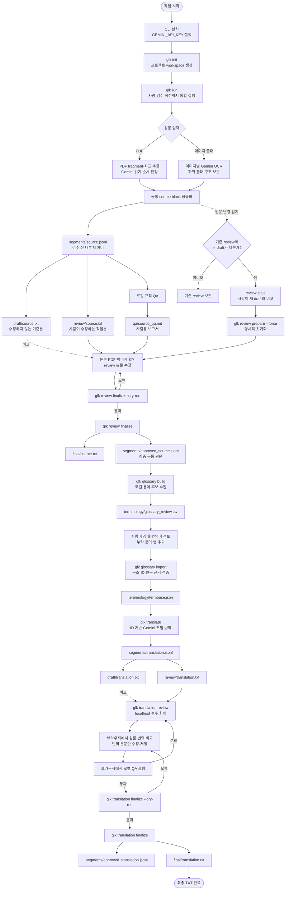

# 전체 작업 흐름

이 문서는 프로젝트 생성부터 검수 완료 원문, termbase, 초벌 번역과 최종 번역 승인을 만드는 실제 작업 순서의 단일 기준입니다. CLI 순서, 사람의 판단 지점, 주요 출력이나 상태가 바뀌면 코드와 함께 이 문서를 갱신합니다.

## 전체 흐름도



## 1. 프로젝트 생성

```bash
glk init "Primal Rulebook" --project-id primal
glk status --project primal
```

- 프로젝트 이름은 화면과 manifest에서 읽는 이름입니다.
- `project_id`는 `workspaces/<project_id>/` 경로와 CLI에서 계속 사용하는 식별자입니다.
- `project_id`를 생략하면 이름을 Windows/macOS에서 사용할 수 있는 형태로 정규화합니다.
- 다른 workspace 루트를 쓰면 이후 모든 명령에도 `--workspace-root PATH`를 지정합니다.

## 2. 원문 획득과 검수 준비

가장 간단한 시작 방법은 대화형 통합 명령입니다.

```bash
glk run --project primal
```

PDF와 이미지 폴더 중 하나를 선택하고 파일 또는 폴더 경로를 입력합니다. `glk run`은 원문 획득, block 정규화, draft/review 생성과 로컬 QA까지 실행합니다.

스크립트나 CI에서는 입력을 명시합니다.

```bash
# PDF 전체 페이지
glk run --project primal --input-type pdf --file rulebook.pdf

# PDF 일부 페이지만 선택
glk run --project primal --input-type pdf --file rulebook.pdf --pages 1,3-5

# 이미지 루트 폴더와 모든 하위 폴더
glk run --project cards --input-type images --folder card_images/
```

원본을 프로젝트에 한 번 등록한 뒤에는 입력 경로를 생략하고 다시 실행할 수 있습니다.

```bash
glk run --project primal
```

`extract`, `ocr`, `segment`, `qa`는 문제를 진단하거나 한 단계만 다시 실행할 때 사용합니다. `glk run`도 같은 application service를 호출합니다.

```bash
glk extract --project primal --file rulebook.pdf
glk ocr --project cards --folder card_images/
glk segment --project primal
glk qa --project primal
```

## 3. 이미지 OCR prompt

이미지 루트의 `ocr_prompt.txt`를 공통 지침으로 사용합니다. 특정 이미지에만 추가 지침이 필요하면 원본 옆에 `파일명.jpg.prompt.txt`를 둡니다.

```text
card_images/
├── ocr_prompt.txt
├── characters/
│   ├── card-001.jpg
│   └── card-001.jpg.prompt.txt
└── items/
    └── card-002.png
```

아이콘은 참조 이미지를 매 요청마다 보내지 않고 공통 prompt에 시각적 특징과 출력 token을 설명합니다.

```text
방패 모양 안에 숫자가 있는 방어 아이콘은 {DEF}로 출력한다.
붉은 하트 모양 체력 아이콘은 {HP}로 출력한다.
설명할 수 없는 아이콘은 임의로 추측하지 말고 [ICON: description]으로 표시한다.
```

각 요청에는 OCR 대상 이미지 한 장만 전달됩니다. 결과는 이미지별 TXT와 통합 TXT로 생성됩니다.

```text
[characters/card-001.txt]
Gain 2 {HP}.

======================
```

## 4. 로컬 QA와 사람 원문 검수

`glk run`이 끝나면 다음 세 파일을 사용합니다.

| 파일 | 역할 | 수정 여부 |
|---|---|---:|
| `draft/source.txt` | 자동 추출 결과의 비교 기준 | 수정하지 않음 |
| `review/source.txt` | 사람이 원본을 보며 고치는 작업본 | 본문만 수정 |
| `qa/source_qa.md` | 의심 위치, block ID와 근거 | 읽기 전용 |

QA는 LLM을 호출하거나 원문을 자동 수정하지 않습니다. 현재 검사 범위는 다음과 같습니다.

- `[ILLEGIBLE]`, 미확정 `[ICON: ...]`, replacement character
- `{HP}` 같은 token의 괄호 손상과 허용되지 않은 token
- 숫자와 같은 문자열에 섞인 `O/0`, `I/l/1` 혼동 후보
- identifier 형식·중복과 source hash 불일치
- OCR provider가 남긴 warning과 불확실한 legibility

검토 TXT의 marker는 수정하지 않습니다.

```text
[[GLK_REVIEW version=1]]

[PAGE 7]
[BLOCK pdf-p0007-b0012-xxxxxxxxxx]
Increase your HP by 10.
[[GLK_END pdf-p0007-b0012-xxxxxxxxxx]]
```

이미지 block은 `[PAGE]` 대신 `[SOURCE source/images/...]`를 사용합니다. 실제 문장은 일반 편집기로 바로 고치고 저장합니다.

## 5. 최종 원문 승인

먼저 파일을 쓰지 않는 검사를 실행합니다.

```bash
glk review finalize --project primal --dry-run
```

marker, block 순서, 빈 본문, 미해결 OCR 표시, token 구조와 stale 상태가 통과하면 최종화합니다.

```bash
glk review finalize --project primal
```

`{HP}` 같은 token 변경을 의도했다면 원본을 확인한 뒤에만 다음 옵션을 사용합니다.

```bash
glk review finalize --project primal --allow-token-changes
```

최종 결과는 `final/source.txt`와 `segments/approved_source.jsonl`입니다. 후속 단계는 hash까지 유효한 `approved_source.jsonl`만 입력으로 허용합니다.

원문 획득 결과가 바뀐 상태에서 `glk segment`를 다시 실행하면 새 draft만 만들고 기존 review를 stale로 표시합니다. 비교를 마치고 작업본을 새 draft로 초기화할 때만 다음 명령을 사용합니다.

```bash
glk review prepare --project primal --force
```

## 6. 용어 후보 검토

최종 원문이 승인된 뒤 후보 TSV를 생성합니다.

```bash
glk glossary build --project primal
```

제목·고유명사와 반복되는 1~4단어 표현을 로컬 규칙으로 수집합니다. 기존 TSV가 있으면 사람의 편집을 보존하고, 승인 원문이나 설정이 달라지면 stale로 표시합니다. 다음 옵션은 편집 내용을 버리고 새 후보로 초기화하므로 비교·백업 후에만 사용합니다.

```bash
glk glossary build --project primal --force
```

TSV에서 모든 자동 후보를 `approved`, `keep`, `rejected` 중 하나로 확정하고, 자동 후보에 없는 용어는 `candidate_id`와 근거 필드를 비운 행으로 추가합니다. 정확한 컬럼과 상태값은 [용어집 검토 사양](glossary.md)을 따릅니다.

검토가 끝나면 termbase로 가져옵니다. 상대 경로는 먼저 project workspace 내부에서 찾습니다.

```bash
glk glossary import \
  --project primal \
  --file terminology/glossary_review.tsv
```

import는 다음 작업을 수행합니다.

- 고정 컬럼, status, category, 번역어와 중복 검사
- 자동 후보 candidate ID 누락·변조 검사
- 수동 용어의 안정적인 ID 생성
- 승인 원문에서 variants, 빈도, block ID, 위치와 예문 재계산
- 검증된 근거를 `glossary_review.tsv`에 다시 기록
- `terminology/termbase.json`과 `state/glossary_import.json` 원자적 생성

`review` 상태가 하나라도 남거나 자동 후보 행이 삭제되면 import를 차단합니다. 원문에 아직 없는 확장판 용어를 의도적으로 선등록할 때만 다음 옵션을 사용합니다.

```bash
glk glossary import \
  --project primal \
  --file terminology/glossary_review.tsv \
  --allow-missing-terms
```

이 항목은 `origin: manual`, `source_verified: false`로 기록되고 경고가 출력됩니다.

## 7. 초벌 번역

최종 원문과 termbase가 모두 `current`일 때만 번역을 시작합니다. 먼저 API를 호출하거나 파일을 쓰지 않고 청크 계획을 확인할 수 있습니다.

```bash
glk translate --project primal --dry-run
```

기본 프로젝트 번역 지침을 사용해 실행합니다.

```bash
glk translate --project primal
```

처음 실제 실행할 때 기본 지침을 workspace의 `translation_prompt.txt`에 기록합니다. 처음부터 게임별 지침을 사용하려면 UTF-8 prompt를 지정합니다. 지정한 내용은 검증 후 같은 프로젝트 파일로 등록됩니다.

```bash
glk translate \
  --project primal \
  --prompt prompts/primal_translation.txt \
  --model gemini-2.5-flash
```

prompt는 문체와 표현 지침만 담당하며 전체 시스템 prompt를 교체하지 않습니다. 최종 prompt는 다음 우선순위로 조립됩니다.

| 우선순위 | 규칙 | 변경 방법 |
|---:|---|---|
| 1 | block ID, 순서, 숫자, `{TOKEN}`, `[TOKEN]`, HTML 보존 | 변경 불가 |
| 2 | current termbase의 `approved`, `keep` | TSV 검토 후 glossary import |
| 3 | 프로젝트 `translation_prompt.txt` | 파일 또는 `--prompt` |
| 4 | 프로그램 기본 문체 | 프로젝트 지침이 없을 때 사용 |

프로젝트 prompt가 termbase와 충돌해도 termbase가 우선합니다. Gemini 응답이 다른 용어를 사용하거나 숫자·token·ID를 변경하면 해당 청크를 한 번 더 요청하고, 반복 실패하면 성공 결과로 저장하지 않습니다.

번역은 source block을 중간에 자르지 않고 순서대로 청크화합니다. 기본 상한은 원문 10,000자이며 필요하면 조정합니다.

```bash
glk translate --project primal --max-characters 8000
```

각 청크가 검증을 통과할 때마다 `segments/translation.jsonl`과 `state/translation.json`에 저장합니다. 중간 실패 후에는 완료된 청크를 재사용합니다.

```bash
glk translate --project primal --resume
```

승인 원문, termbase, project prompt, 모델, hard rule 버전이나 청크 설정이 달라지면 기존 결과를 섞지 않고 stale로 처리합니다. 비교를 마친 뒤 전체 초벌 번역을 다시 시작할 때만 `--force`를 사용합니다.

완료되면 다음 파일이 생성됩니다.

| 파일 | 역할 |
|---|---|
| `segments/translation.jsonl` | source block ID와 연결된 내부 번역 데이터 |
| `draft/translation.txt` | 자동 번역 기준본 |
| `review/translation.txt` | 사람이 원문과 번역을 함께 보며 수정할 작업본 |
| `translation_prompt.txt` | 실제 사용한 프로젝트 문체·표현 지침 |

재번역으로 draft가 달라져도 기존 `review/translation.txt`는 덮어쓰지 않고 `stale`로 보존합니다. 사람이 새 draft와 기존 검토본을 비교하기 전에는 자동 초기화하지 않습니다.

## 8. 번역문 검수, QA와 최종 승인

가장 간단한 검수 방법은 로컬 HTML 화면입니다.

```bash
glk translation review --project primal
```

사용 가능한 localhost 포트를 골라 기본 브라우저를 자동으로 엽니다. 화면에서 다음 작업을 할 수 있습니다.

- block별 원문과 번역을 나란히 비교
- 원문·번역·block ID 검색
- 오류·경고·수정됨 필터와 block 이동
- 번역문만 수정하고 `review/translation.txt`에 안전하게 저장
- 저장 후 로컬 QA 실행과 오류 확인
- 오류가 0개인 결과의 최종 승인

서버는 `127.0.0.1`에만 바인딩되고 원문·번역을 외부로 전송하거나 Gemini를 호출하지 않습니다. 요청별 임의 세션 token, localhost Host·Origin 검사, 동시 편집 hash 검사를 적용합니다. 터미널에서 `Ctrl+C`를 누르면 종료됩니다.

브라우저를 자동으로 열지 않거나 고정 포트를 쓰려면 다음처럼 실행합니다.

```bash
glk translation review --project primal --no-open --port 8765
```

일반 편집기를 선호하면 기존 TXT 방식도 그대로 사용할 수 있습니다. `review/translation.txt`에서 각 block의 `[TRANSLATION]` 아래 본문만 수정합니다. `[PAGE]`, `[SOURCE]`, `[BLOCK]`, `[ORIGINAL]`, `[TRANSLATION]`, `[[GLK_END ...]]` marker와 `[ORIGINAL]` 본문은 변경하지 않습니다.

```text
[BLOCK pdf-p0001-b0001-...]
[ORIGINAL]
Each Hunter gains 2 Stamina.
[TRANSLATION]
각 사냥꾼은 스태미나 2를 얻습니다.
[[GLK_END pdf-p0001-b0001-...]]
```

TXT를 직접 수정했을 때는 CLI로 로컬 QA와 최종 승인을 실행합니다.

```bash
glk translation qa --project primal
```

다음 오류는 최종 승인을 차단합니다.

- marker, block ID·순서·위치 또는 `[ORIGINAL]` 본문 변경
- block 누락·추가와 빈 번역
- 숫자, `{TOKEN}`, `[TOKEN]`, HTML/rich-text 태그 변경
- termbase의 `approved` 번역어 누락 또는 `keep` 용어 변경
- Unicode replacement character와 `[ILLEGIBLE]` 잔존

원문과 번역이 완전히 같거나 한국어 대상 번역에 한글이 없는 경우는 사람이 판단할 수 있도록 warning으로 표시하며 자동으로 승인을 차단하지 않습니다. 결과는 `qa/translation_qa.json`과 `qa/translation_qa.md`에 기록됩니다.

```bash
glk translation finalize --project primal --dry-run
glk translation finalize --project primal
```

오류가 0개일 때만 다음 최종 파일이 생성됩니다.

| 파일 | 역할 |
|---|---|
| `segments/approved_translation.jsonl` | 초벌 번역을 보존하고 실제 사람 수정만 `corrected_translation`에 저장한 최종 데이터 |
| `final/translation.txt` | 사람 검수를 통과한 최종 번역 TXT |
| `state/translation_review.json` | review·QA·최종 파일 hash와 `qa_failed`, `qa_passed`, `approved` 상태 |

재번역으로 review가 stale이 되면 기존 사람 수정은 자동으로 덮어쓰지 않습니다. 새 draft와 비교를 마친 뒤 정말 현재 draft로 초기화할 때만 다음 명령을 사용합니다.

```bash
glk translation prepare --project primal --force
```

## 9. 상태와 재실행

```bash
glk status --project primal
```

| 출력 | 의미 |
|---|---|
| `Source acquired` | PDF 또는 이미지 원문 획득 완료 여부 |
| `Review source` | 공통 source block과 검토 TXT 준비 여부 |
| `Source QA` | QA 상태와 issue 수 |
| `Human review` | `pending`, `stale`, `approved` 등의 검토 상태 |
| `Final source` | 현재 hash 기준 최종 승인 유효 여부 |
| `Glossary review` | `not_ready`, `not_built`, `current`, `stale`와 후보 수 |
| `Termbase` | `not_ready`, `not_built`, `current`, `stale`와 entry 수 |
| `Translation` | `not_ready`, `not_run`, `partial`, `current`, `stale`와 block 수 |
| `Translation review` | `not_ready`, `pending`, `stale`, `qa_failed`, `qa_passed`, `approved` |
| `Final translation` | 현재 hash 기준 최종 번역 승인 유효 여부 |

입력, 모델, prompt와 결과 내용이 같으면 단계별 캐시를 재사용합니다. 실행 시간이나 캐시 적중 수처럼 결과에 영향을 주지 않는 메타데이터는 다음 단계의 입력 변경으로 취급하지 않습니다. `--force`는 해당 단계의 결과를 의도적으로 다시 만들 때만 사용합니다.

## 10. 주요 출력 구조

```text
workspaces/<project_id>/
├── project.json
├── source/
│   ├── original.pdf                  # PDF 프로젝트
│   ├── pages/
│   ├── fragments/
│   ├── layouts/
│   ├── extracted.txt
│   ├── images/                       # 이미지 프로젝트
│   ├── ocr_prompt.txt
│   └── ocr/
│       ├── results/
│       ├── individual/
│       ├── combined.txt
│       └── run_summary.json
├── segments/
│   ├── source.jsonl                  # 검수 전 공통 block
│   ├── approved_source.jsonl         # 승인된 최종 공통 원문
│   ├── translation.jsonl             # ID로 연결된 초벌 번역
│   └── approved_translation.jsonl    # 사람 검수 완료 번역
├── draft/
│   ├── source.txt
│   └── translation.txt
├── review/
│   ├── source.txt
│   └── translation.txt
├── final/
│   ├── source.txt
│   └── translation.txt
├── translation_prompt.txt
├── qa/
│   ├── source_qa.json
│   ├── source_qa.md
│   ├── translation_qa.json
│   └── translation_qa.md
├── terminology/
│   ├── glossary_review.tsv
│   └── termbase.json
└── state/
    ├── segmentation.json
    ├── source_qa.json
    ├── source_review.json
    ├── glossary_build.json
    ├── glossary_import.json
    ├── translation.json
    └── translation_review.json
```

## 용어 기준

| 용어 | 의미 | 대표 파일 |
|---|---|---|
| 원문 획득 결과 | PDF 추출 또는 이미지 OCR 직후의 provider별 결과 | `source/layouts/`, `source/ocr/results/` |
| 검수용 중간 원문 | QA와 사람 검수를 위해 같은 block 형식으로 정규화한 데이터 | `segments/source.jsonl` |
| 자동 생성 기준본 | 원문 변경 비교에 사용하는 수정 금지 TXT | `draft/source.txt` |
| 검토 작업본 | 사람이 원본과 비교하며 수정하는 TXT | `review/source.txt` |
| 최종 원문 TXT | 검토 작업본의 구조 검증을 통과한 TXT | `final/source.txt` |
| 최종 공통 원문 | raw/corrected text와 원본 위치를 보존하는 후속 단계 기준 데이터 | `segments/approved_source.jsonl` |
| 초벌 번역 | 모델 출력과 원문·prompt·termbase hash를 보존하는 검수 입력 | `segments/translation.jsonl` |
| 최종 번역 | 초벌 번역과 실제 사람 수정을 분리해 보존하는 승인 데이터 | `segments/approved_translation.jsonl` |

`segments/source.jsonl`은 최종 원문이 아닙니다. 사람이 검수를 마치고 `glk review finalize`를 통과한 `segments/approved_source.jsonl`만 최종 공통 원문으로 부릅니다.

## 문서 갱신 규칙

- 사용 순서·명령·출력·사람 판단 지점 변경: 이 문서와 Mermaid 갱신
- 데이터 모델·계층·hash 정책 변경: [아키텍처](../reference/architecture.md) 갱신
- TSV·termbase 계약 변경: [용어집 검토 사양](glossary.md) 갱신
- 구현 우선순위 변경: [로드맵](../project/roadmap.md) 갱신
- 작업을 마치거나 다른 환경으로 이동: [인수인계](../project/handoff.md) 갱신
