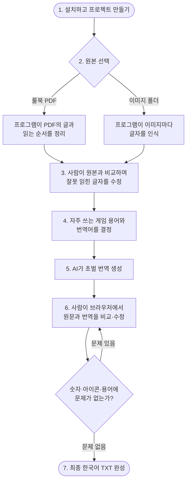

# Game Localization Kit

Game Localization Kit(GLK)은 PDF 룰북이나 이미지 폴더에서 원문을 가져오고, 사람이 원문과 번역을 검수한 뒤 최종 한국어 TXT를 만드는 크로스 플랫폼 CLI입니다.

Windows와 macOS에서 같은 `glk` 명령을 사용합니다.

쉽게 말하면 이 프로그램은 다음 일을 도와줍니다.

```text
PDF 또는 이미지에서 글자를 읽음
→ 잘못 읽었을 가능성이 있는 부분을 알려줌
→ 사람이 원본을 보면서 글자를 바로잡음
→ 자주 나오는 게임 용어의 번역을 정함
→ AI가 초벌 번역을 만듦
→ 사람이 화면에서 번역을 다듬음
→ 최종 한국어 TXT를 만듦
```

AI가 읽은 원문과 초벌 번역을 그대로 최종 결과로 사용하지 않습니다. 원문을 한 번, 번역을 한 번 사람이 확인하도록 구성되어 있습니다.

## 한눈에 보는 전체 흐름



### 프로그램과 사용자가 나누어 하는 일

| 단계 | 프로그램이 하는 일 | 사용자가 하는 일 |
|---|---|---|
| 프로젝트 준비 | 작업 파일을 보관할 전용 폴더 생성 | 프로젝트 이름 지정 |
| 원문 읽기 | PDF 순서 정리 또는 이미지 글자 인식 | PDF 또는 이미지 폴더 선택 |
| 원문 확인 | 의심되는 숫자·아이콘·글자 위치 표시 | 원본과 비교해 잘못 읽힌 문장 수정 |
| 용어 정리 | 반복되는 이름과 게임 용어 후보 수집 | 사용할 한국어 번역어 결정 |
| 초벌 번역 | 정해진 용어를 반영해 AI 번역 생성 | 번역 문체 지침이 필요하면 작성 |
| 번역 확인 | 숫자·아이콘·용어가 유지됐는지 검사 | 브라우저에서 어색한 번역 수정 |
| 완료 | 검사를 통과한 최종 TXT 생성 | 최종 승인 |

사용자가 직접 판단해야 하는 핵심은 세 가지입니다.

1. 프로그램이 원문을 제대로 읽었는지 확인합니다.
2. 게임 용어를 어떤 한국어로 번역할지 정합니다.
3. AI 초벌 번역을 읽고 자연스럽게 수정합니다.

설치 후 실제로 입력할 명령은 아래 단계에서 순서대로 설명합니다. 더 세밀한 내부 파일 규칙이 필요할 때만 [상세 작업 흐름](docs/WORKFLOW.md)을 확인하면 됩니다.

## 준비물

- Python 3.10 이상
- Gemini API 키
- 원문 PDF 하나 또는 OCR할 이미지 폴더
- 원문과 번역을 검수할 일반 텍스트 편집기
- 번역 검수 화면을 사용할 웹 브라우저

지원하는 대표 이미지 형식은 PNG, JPG, JPEG와 WebP입니다.

## 설치

모든 활성 코드와 문서는 `source/`에 있습니다. 아래 명령도 `source/`에서 실행합니다.

### macOS/Linux

```bash
cd game-localization-kit/source
python3 -m venv .venv
source .venv/bin/activate
python -m pip install --upgrade pip
pip install -e .
```

### Windows PowerShell

```powershell
cd game-localization-kit\source
py -m venv .venv
.venv\Scripts\Activate.ps1
python -m pip install --upgrade pip
pip install -e .
```

설치 확인:

```bash
glk --help
glk version
```

정상적으로 설치되면 `glk 0.1.0`과 사용 가능한 명령 목록이 표시됩니다.

### `glk: command not found`가 표시될 때

대부분 가상환경이 활성화되지 않은 경우입니다.

macOS/Linux:

```bash
cd game-localization-kit/source
source .venv/bin/activate
glk --help
```

Windows PowerShell:

```powershell
cd game-localization-kit\source
.venv\Scripts\Activate.ps1
glk --help
```

그래도 실행되지 않으면 가상환경을 활성화한 상태에서 `pip install -e .`를 다시 실행합니다.

## Gemini API 키 설정

`source/`에 `.env` 파일을 만들고 다음 한 줄을 입력합니다.

```dotenv
GEMINI_API_KEY=your_api_key_here
```

셸이나 CI에 이미 설정한 `GEMINI_API_KEY`가 `.env`보다 우선합니다.

API 키는 다음 위치에 넣지 않습니다.

- JSON 설정 파일
- README와 기타 문서
- prompt 파일
- 로그
- Git에 추적되는 파일

`.env`는 Git에서 제외됩니다. 키가 Git 이력이나 공개 저장소에 노출됐다면 파일에서 지우는 것만으로 충분하지 않으므로 해당 키를 폐기하고 새 키를 발급해야 합니다.

## 가장 빠른 실행 예시

다음 예시는 `primal`이라는 PDF 프로젝트를 만들고 최종 번역까지 진행합니다.

```bash
glk init "Primal Rulebook" --project-id primal
glk run --project primal --input-type pdf --file rulebook.pdf

# 원문 검수 후
glk review finalize --project primal --dry-run
glk review finalize --project primal

# 용어 TSV 검토 후
glk glossary build --project primal
glk glossary import \
  --project primal \
  --file terminology/glossary_review.tsv

# 번역 생성 및 브라우저 검수
glk translate --project primal --dry-run
glk translate --project primal
glk translation review --project primal
```

브라우저 검수 화면에서 QA 오류를 모두 해결하고 최종 승인을 누르면 다음 파일이 만들어집니다.

```text
workspaces/primal/final/translation.txt
```

## 1. 프로젝트 만들기

```bash
glk init "Primal Rulebook" --project-id primal
```

- `Primal Rulebook`: 화면과 manifest에 표시되는 사람이 읽는 프로젝트 이름
- `primal`: 폴더명과 이후 CLI에서 계속 사용하는 고정 프로젝트 ID

프로젝트 ID를 생략하면 이름을 Windows와 macOS에서 사용할 수 있는 형태로 정규화합니다.

```bash
glk init "Primal Rulebook"
```

원문과 번역 언어를 명시할 수도 있습니다.

```bash
glk init "Primal Rulebook" \
  --project-id primal \
  --source-language en \
  --target-language ko
```

생성 위치:

```text
source/workspaces/primal/
```

현재 상태 확인:

```bash
glk status --project primal
```

## 2. 원문 가져오기

원문 입력은 두 가지입니다.

1. PDF 파일
2. 이미지와 하위 폴더를 포함하는 이미지 루트 폴더

### 대화형 실행

```bash
glk run --project primal
```

CLI가 PDF와 이미지 폴더 중 하나를 선택하도록 요청하고, 이어서 파일 또는 폴더 경로를 입력받습니다.

### PDF 실행

```bash
glk run \
  --project primal \
  --input-type pdf \
  --file rulebook.pdf
```

페이지 범위는 선택 사항입니다. 생략하면 전체 PDF를 처리합니다.

```bash
glk run \
  --project primal \
  --input-type pdf \
  --file rulebook.pdf \
  --pages 1,3-8,12
```

PDF 처리 방식:

1. PDF 텍스트 레이어에서 원문 fragment와 좌표를 추출합니다.
2. 페이지가 1단, 2단, 3단인지 사용자가 미리 지정하지 않습니다.
3. Gemini에는 페이지 이미지와 fragment ID·텍스트·좌표를 전달합니다.
4. Gemini는 원문을 다시 작성하지 않고 읽기 순서와 block 묶음을 판정합니다.
5. 프로그램이 원래 fragment를 이용해 문단과 문장을 재조립합니다.
6. fragment 누락·중복·알 수 없는 ID가 있으면 해당 결과를 성공으로 저장하지 않습니다.

즉, 다단 페이지의 읽기 순서와 시각적 줄바꿈을 복원하면서도 최종 원문은 PDF에서 추출한 문자열을 기준으로 유지합니다.

현재 텍스트 레이어가 전혀 없는 스캔 PDF의 자동 OCR fallback은 아직 구현 전입니다. 이런 파일은 페이지를 이미지로 준비해 이미지 OCR 흐름을 사용하는 편이 안전합니다.

### 이미지 폴더 OCR

먼저 별도 프로젝트를 만듭니다.

```bash
glk init "Card Images" --project-id cards
```

이미지 폴더 구조 예시:

```text
card_images/
├── ocr_prompt.txt
├── characters/
│   ├── card-001.jpg
│   └── card-001.jpg.prompt.txt
└── items/
    └── card-002.png
```

- `ocr_prompt.txt`: 모든 이미지에 적용할 공통 지침
- `card-001.jpg.prompt.txt`: 특정 이미지에만 추가할 지침
- 하위 폴더는 재귀적으로 탐색하며 출력에서도 구조를 보존

실행:

```bash
glk run \
  --project cards \
  --input-type images \
  --folder card_images/
```

공통 prompt 파일을 직접 지정할 수도 있습니다.

```bash
glk run \
  --project cards \
  --input-type images \
  --folder card_images/ \
  --prompt prompts/card_ocr.txt
```

아이콘은 참조 이미지를 매 요청마다 반복 전송하지 않습니다. `ocr_prompt.txt`에 아이콘 모양과 출력 token을 글로 설명합니다.

```text
방패 모양 안에 숫자가 있는 방어 아이콘은 {DEF}로 출력한다.
붉은 하트 모양 체력 아이콘은 {HP}로 출력한다.
설명과 일치하지 않거나 확신할 수 없는 아이콘은
[ICON: description]으로 표시한다.
```

각 Gemini 요청에는 OCR 대상 이미지 한 장만 전달됩니다. 결과는 이미지별 TXT와 하나의 통합 TXT로 생성됩니다.

```text
[characters/card-001.txt]
Gain 2 {HP}.

======================
```

### `glk run`이 자동으로 수행하는 작업

`glk run`은 원문 검수 직전까지 다음 단계를 묶어서 실행합니다.

1. PDF 추출·레이아웃 복원 또는 이미지 OCR
2. PDF와 이미지 결과를 같은 SourceBlock 구조로 정규화
3. 자동 기준본과 사람 검토본 생성
4. LLM을 호출하지 않는 로컬 원문 QA

한 단계만 다시 실행하거나 문제를 진단할 때는 `extract`, `ocr`, `segment`, `qa` 명령을 개별적으로 사용할 수 있습니다.

## 3. 원문 QA와 사람 검수

`glk run`이 완료되면 다음 파일을 확인합니다.

| 파일 | 역할 | 수정 |
|---|---|---:|
| `draft/source.txt` | 자동 추출 결과의 비교 기준 | 수정하지 않음 |
| `review/source.txt` | 사람이 PDF·이미지와 비교해 고치는 작업본 | 본문만 수정 |
| `qa/source_qa.md` | 의심 위치, block ID와 검사 근거 | 읽기 전용 |

로컬 QA는 다음 항목을 찾습니다.

- `[ILLEGIBLE]`과 미확정 `[ICON: ...]`
- 손상되거나 허용되지 않은 `{TOKEN}`
- 숫자 주변의 `O/0`, `I/l/1` OCR 혼동 후보
- block ID 중복과 source hash 불일치
- OCR provider가 남긴 판독 경고

QA는 문제 위치만 알려주며 원문을 자동 수정하지 않습니다. 실제 PDF 또는 이미지를 보고 `review/source.txt`를 직접 고칩니다.

검토 파일 예시:

```text
[[GLK_REVIEW version=1]]

[PAGE 7]
[BLOCK pdf-p0007-b0012-xxxxxxxxxx]
Increase your HP by 10.
[[GLK_END pdf-p0007-b0012-xxxxxxxxxx]]
```

다음 marker는 수정하지 않습니다.

- `[PAGE ...]`
- `[SOURCE ...]`
- `[BLOCK ...]`
- `[[GLK_END ...]]`

marker 사이의 실제 원문만 수정합니다.

## 4. 최종 원문 승인

먼저 결과 파일을 쓰지 않는 검사를 실행합니다.

```bash
glk review finalize --project primal --dry-run
```

검사 항목:

- marker와 block 순서
- 비어 있는 본문
- 미해결 OCR 표시
- `{HP}` 같은 보호 token 구조와 개수
- 현재 draft와 review의 stale 여부

통과하면 최종 승인합니다.

```bash
glk review finalize --project primal
```

생성 파일:

```text
final/source.txt
segments/approved_source.jsonl
```

후속 용어와 번역 단계는 현재 hash가 유효한 `approved_source.jsonl`만 사용합니다.

보호 token 변경이 정말 의도된 경우에만 다음 옵션을 사용합니다.

```bash
glk review finalize \
  --project primal \
  --allow-token-changes
```

## 5. 용어집 만들기

승인된 원문에서 용어 후보를 수집합니다. 이 단계는 Gemini를 호출하지 않습니다.

```bash
glk glossary build --project primal
```

생성 파일:

```text
workspaces/primal/terminology/glossary_review.tsv
```

Excel, Numbers, LibreOffice 또는 일반 텍스트 편집기로 TSV를 열고 `status`, `translation`, `category`, `note`를 검토합니다.

| status | 의미 |
|---|---|
| `review` | 아직 검토하지 않음 |
| `approved` | 지정한 번역어를 일관되게 사용 |
| `keep` | 번역하지 않고 원문 표기를 유지 |
| `rejected` | 용어집에서 제외 |

`review` 상태가 하나라도 남아 있으면 import할 수 없습니다. `approved`에는 번역어가 필요합니다.

자동 후보에 없는 용어는 TSV 마지막에 직접 추가할 수 있습니다. 이때 `candidate_id`, 출현 횟수, 위치와 예문은 비워둡니다. import 과정이 승인 원문에서 근거를 다시 계산합니다.

검토가 끝나면 termbase를 만듭니다.

```bash
glk glossary import \
  --project primal \
  --file terminology/glossary_review.tsv
```

생성 파일:

```text
workspaces/primal/terminology/termbase.json
```

기존 TSV가 있을 때 `glk glossary build`를 다시 실행해도 사람의 편집을 자동으로 덮어쓰지 않습니다. `--force`는 기존 편집을 버리고 새 후보로 초기화하므로 백업과 비교 후에만 사용합니다.

## 6. 초벌 번역

승인 원문과 termbase가 모두 현재 상태일 때 번역할 수 있습니다.

API 호출 없이 처리 계획 확인:

```bash
glk translate --project primal --dry-run
```

실제 번역:

```bash
glk translate --project primal
```

게임별 문체와 표현 규칙을 지정하려면 UTF-8 prompt 파일을 사용합니다.

```bash
glk translate \
  --project primal \
  --prompt prompts/primal_translation.txt
```

번역 지침 예시:

```text
한국어 보드게임 룰북 문체로 번역한다.
명령문은 간결한 해요체 대신 설명서 문체를 사용한다.
능력명은 용어집 표기를 우선한다.
불필요한 의역이나 원문에 없는 설명을 추가하지 않는다.
```

최종 prompt 우선순위:

1. ID, 순서, 숫자, token과 HTML 보존 규칙
2. 검토가 끝난 termbase
3. 프로젝트 `translation_prompt.txt`
4. 프로그램 기본 문체

프로젝트 prompt와 termbase가 충돌하면 termbase가 우선합니다.

번역 중단 후 완료된 청크부터 이어서 실행:

```bash
glk translate --project primal --resume
```

생성 파일:

| 파일 | 역할 |
|---|---|
| `segments/translation.jsonl` | block ID로 원문과 연결된 초벌 번역 데이터 |
| `draft/translation.txt` | 자동 번역 기준본 |
| `review/translation.txt` | 사람이 수정하는 번역 작업본 |
| `translation_prompt.txt` | 실제 프로젝트에 등록된 번역 지침 |

## 7. 번역 검수

권장 방법은 로컬 HTML 검수 화면입니다.

```bash
glk translation review --project primal
```

기본 브라우저가 열리며 다음 작업을 할 수 있습니다.

- block별 원문과 번역 나란히 비교
- 원문·번역·block ID 검색
- 오류·경고·수정된 block 필터
- 번역 본문 수정과 안전 저장
- 로컬 QA 실행
- QA 오류가 없는 번역 최종 승인

검수 서버는 `127.0.0.1`에만 열립니다. 브라우저 검수 중에는 Gemini를 호출하거나 원문과 번역을 외부로 전송하지 않습니다. 종료하려면 서버를 실행한 터미널에서 `Ctrl+C`를 누릅니다.

브라우저를 자동으로 열지 않으려면:

```bash
glk translation review \
  --project primal \
  --no-open \
  --port 8765
```

일반 편집기를 사용하려면 `review/translation.txt`의 `[TRANSLATION]` 본문만 수정합니다. `[ORIGINAL]` 본문과 marker는 변경하지 않습니다.

```text
[BLOCK pdf-p0001-b0001-...]
[ORIGINAL]
Each Hunter gains 2 Stamina.
[TRANSLATION]
각 사냥꾼은 스태미나 2를 얻습니다.
[[GLK_END pdf-p0001-b0001-...]]
```

TXT를 직접 수정한 경우 로컬 QA와 최종 승인을 실행합니다.

```bash
glk translation qa --project primal
glk translation finalize --project primal --dry-run
glk translation finalize --project primal
```

최종 승인을 차단하는 대표 오류:

- block ID, 순서, marker 또는 원문 변경
- block 누락·추가와 빈 번역
- 숫자, `{TOKEN}`, `[TOKEN]`, HTML 태그 변경
- `approved` 용어 번역 누락
- `keep` 용어 변경
- `[ILLEGIBLE]` 같은 미해결 표시

## 8. 최종 결과

가장 중요한 최종 파일:

```text
workspaces/<project_id>/final/translation.txt
```

함께 생성되는 파일:

```text
segments/approved_translation.jsonl
qa/translation_qa.json
qa/translation_qa.md
state/translation_review.json
```

`approved_translation.jsonl`에는 Gemini 초벌 번역과 사람이 수정한 번역을 분리해서 보존합니다.

## 프로젝트 workspace 구조

```text
workspaces/<project_id>/
├── project.json
├── source/
│   ├── original.pdf
│   ├── pages/
│   ├── fragments/
│   ├── layouts/
│   ├── extracted.txt
│   ├── images/
│   └── ocr/
├── segments/
│   ├── source.jsonl
│   ├── approved_source.jsonl
│   ├── translation.jsonl
│   └── approved_translation.jsonl
├── draft/
│   ├── source.txt
│   └── translation.txt
├── review/
│   ├── source.txt
│   └── translation.txt
├── final/
│   ├── source.txt
│   └── translation.txt
├── terminology/
│   ├── glossary_review.tsv
│   └── termbase.json
├── qa/
│   ├── source_qa.json
│   ├── source_qa.md
│   ├── translation_qa.json
│   └── translation_qa.md
├── state/
└── translation_prompt.txt
```

### `draft`, `review`, `final`의 차이

| 폴더 | 의미 | 사람이 수정 |
|---|---|---:|
| `draft/` | 프로그램이 만든 비교 기준본 | 하지 않음 |
| `review/` | 사람이 확인하고 수정하는 작업본 | 본문만 수정 |
| `final/` | 검증과 승인을 통과한 최종 TXT | 직접 수정하지 않음 |

최종 승인 후 `final/`을 직접 수정하면 저장된 hash와 달라져 `stale` 상태가 됩니다. 수정이 필요하면 `review/`에서 고친 뒤 QA와 finalize를 다시 실행합니다.

## 상태 확인과 안전한 재실행

언제든 다음 명령으로 전체 상태를 확인할 수 있습니다.

```bash
glk status --project primal
```

주요 상태:

| 상태 | 의미 |
|---|---|
| `not_ready` | 이전 필수 단계가 완료되지 않음 |
| `not_built` / `not_run` | 아직 실행하지 않음 |
| `pending` | 사람 검토 대기 |
| `partial` | 일부 청크만 완료 |
| `current` | 현재 입력과 결과 hash가 일치 |
| `stale` | 입력 또는 사람이 편집한 파일이 기준과 달라짐 |
| `qa_failed` | QA 오류가 남아 있음 |
| `qa_passed` | QA를 통과했지만 최종 승인 전 |
| `approved` | 현재 hash 기준 최종 승인 완료 |

같은 입력, 모델과 prompt로 다시 실행하면 유효한 캐시를 재사용합니다.

`--force`는 다음 경우에만 사용합니다.

- 새 결과로 완전히 다시 생성하려는 경우
- 기존 사람이 편집한 파일을 비교하거나 백업한 경우
- stale 원인을 이해하고 초기화하려는 경우

`--force`를 습관적으로 사용하면 glossary TSV나 review 파일의 사람 편집을 초기화할 수 있습니다.

## 주요 명령 요약

| 명령 | 용도 |
|---|---|
| `glk init` | 프로젝트 workspace 생성 |
| `glk run` | 원문 획득부터 원문 QA까지 통합 실행 |
| `glk extract` | PDF 추출·레이아웃 복원만 실행 |
| `glk ocr` | 이미지 폴더 OCR만 실행 |
| `glk segment` | 공통 SourceBlock과 검토 TXT 생성 |
| `glk qa` | 원문 로컬 QA 실행 |
| `glk review finalize` | 사람 검토 원문 승인 |
| `glk glossary build` | 검토용 용어 후보 TSV 생성 |
| `glk glossary import` | TSV 검증 후 termbase 생성 |
| `glk translate` | Gemini 초벌 번역 |
| `glk translation review` | 로컬 HTML 번역 검수 화면 |
| `glk translation qa` | 번역 로컬 QA |
| `glk translation finalize` | 최종 번역 승인 |
| `glk status` | 프로젝트 전체 상태 확인 |

각 명령의 전체 옵션은 `--help`로 확인합니다.

```bash
glk run --help
glk glossary import --help
glk translation review --help
```

## 자주 발생하는 문제

### API 키를 찾지 못함

현재 터미널 위치가 `source/`인지, `source/.env`에 `GEMINI_API_KEY`가 있는지 확인합니다.

```bash
pwd
glk run --project primal
```

### PDF 결과의 일부 문단 순서가 이상함

`qa/source_qa.md`, `draft/source.txt`, 원본 PDF를 비교합니다. 잘못된 문장은 `review/source.txt`에서 수정합니다. PDF fragment 누락이나 구조 오류로 실행 자체가 실패했다면 `--verbose`로 다시 실행해 해당 페이지를 확인합니다.

```bash
glk run --project primal --verbose
```

### 이미지 OCR에서 아이콘이 잘못 표시됨

이미지를 prompt에 첨부하는 대신 `ocr_prompt.txt`의 시각적 설명을 더 구체화합니다. 특정 이미지에만 적용할 규칙은 `이미지파일명.prompt.txt`에 작성합니다.

### glossary import가 차단됨

다음을 확인합니다.

- `review` 상태가 남아 있는가
- `approved` 행의 번역어가 비어 있는가
- 자동 생성된 `candidate_id`를 삭제하거나 수정했는가
- 같은 용어를 대소문자·단수·복수 형태로 중복 추가했는가

### 번역이 중간에 실패함

완료된 청크는 보존됩니다.

```bash
glk translate --project primal --resume
```

같은 오류가 반복되면 API 키, 모델명, 네트워크 상태와 QA 오류 메시지를 확인합니다.

### `stale` 상태가 표시됨

승인 이후 원문, termbase, prompt, draft, review 또는 final 파일 중 하나가 변경됐다는 뜻입니다. 기존 사람 편집을 바로 삭제하지 말고 `glk status`와 이전 기준본을 비교합니다.

### 브라우저 검수 화면이 열리지 않음

자동 실행을 끄고 표시된 localhost 주소를 직접 엽니다.

```bash
glk translation review \
  --project primal \
  --no-open \
  --port 8765
```

## AI 사용 범위와 데이터 처리

Gemini를 사용하는 단계:

- PDF 페이지의 fragment 읽기 순서와 block 묶음 판정
- 이미지 한 장씩 OCR
- 승인 원문 기반 초벌 번역

Gemini를 사용하지 않는 단계:

- 원문 QA
- 용어 후보 생성과 termbase import 검증
- 번역 QA
- localhost HTML 검수
- 파일 hash, marker, 숫자와 token 검증

검수 브라우저는 로컬 컴퓨터의 `127.0.0.1`에서만 동작합니다. 외부 CDN, 외부 script 또는 별도 웹 API를 사용하지 않습니다.

## 현재 제한사항

- 텍스트 레이어가 없는 스캔 PDF 자동 OCR fallback
- 텍스트 PDF와 스캔 페이지가 섞인 hybrid PDF 자동 판정
- 표와 자유 배치 컴포넌트의 완전 자동 복원
- QA 실패 segment만 선택적으로 재번역
- 설치형 실행 파일과 데스크톱 GUI

향후 기능이 추가되면 이 제한사항과 전체 흐름도를 함께 갱신합니다.

## 문서 안내

| 문서 | 용도 |
|---|---|
| [전체 작업 흐름](docs/WORKFLOW.md) | 파일 형식, 단계별 세부 규칙과 재실행 정책 |
| [용어집 검토 사양](docs/GLOSSARY.md) | TSV 컬럼, status, 수동 용어와 import 검증 |
| [아키텍처](docs/ARCHITECTURE.md) | 코드 계층, 데이터 모델, 캐시와 승인 구조 |

신규 사용자는 `source/`의 README, 코드와 문서만 사용하면 됩니다.
