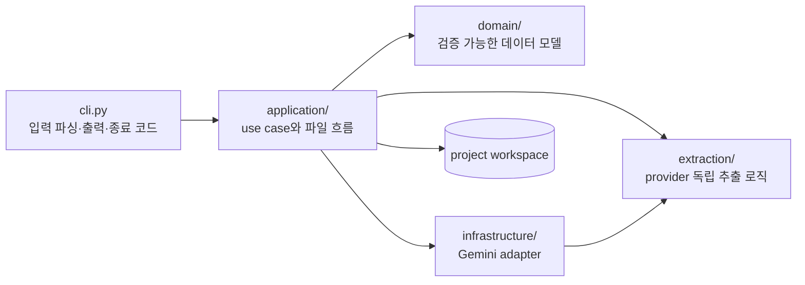

# 아키텍처

이 문서는 현재 구현된 코드 계층, 핵심 데이터 모델, 캐시와 승인 경계를 설명하는 개발자 기준 문서입니다. 사용자 실행 순서는 [전체 작업 흐름](../guides/workflow.md), 아직 구현하지 않은 기능은 [로드맵](../project/roadmap.md)을 따릅니다.

## 설계 원칙

1. 번역 전에 사람이 확인한 원문을 확정합니다.
2. PDF와 이미지 OCR의 provider별 결과를 같은 source block으로 변환합니다.
3. LLM은 OCR과 레이아웃 의미 판단에 사용하고, 구조·hash·token 검사는 로컬 코드가 담당합니다.
4. 자동 생성 기준본과 사람 작업본을 분리하고 사람의 편집을 자동으로 덮어쓰지 않습니다.
5. 모든 후속 데이터는 안정적인 block ID로 원본 파일·페이지·좌표까지 역추적할 수 있어야 합니다.
6. 최종 승인 파일과 저장된 hash가 모두 일치할 때만 후속 단계를 실행합니다.
7. CLI와 향후 GUI는 같은 application service를 사용합니다.

## 코드 계층



| 계층 | 책임 | 현재 주요 모듈 |
|---|---|---|
| CLI | 인자, 대화형 입력, 사람이 읽는 출력, 종료 코드 | `src/glk/cli.py` |
| Application | 프로젝트 단위 use case, 캐시, 원자적 출력, 단계 연결 | `extraction_service`, `image_ocr_service`, `segmentation_service`, `source_qa_service`, `source_review_service`, `glossary_service`, `translation_service`, `translation_review_service` |
| Domain | 외부 SDK와 파일 포맷에 독립적인 모델·검증 | `project.py`, `source_block.py`, `source_qa.py`, `translation_segment.py`, `translation_qa.py`, `approved_translation.py` |
| Extraction | PDF layout과 이미지 OCR 결과 처리 계약 | `layout.py`, `image_ocr.py` |
| Infrastructure | 외부 모델 adapter와 로컬 검수 서버 | `gemini_layout.py`, `gemini_ocr.py`, `gemini_translation.py`, `translation_review_server.py` |

CLI의 통합 명령과 개별 명령은 application service를 공유합니다. 예를 들어 `glk run`은 별도 추출 구현을 갖지 않고 PDF의 `extract_project_pdf()` 또는 이미지의 `ocr_project_images()`를 호출한 뒤 segmentation과 QA service를 연결합니다.

## 프로젝트 manifest

`workspaces/<project_id>/project.json`은 프로젝트의 고정 식별 정보와 등록된 원문 위치를 보존합니다.

| 필드 | 의미 |
|---|---|
| `schema_version` | manifest 호환성 버전 |
| `project_id` | 플랫폼에 안전한 workspace 식별자 |
| `name` | 사람이 읽는 프로젝트 이름 |
| `profile` | 게임별 설정 프로필 |
| `source_language` / `target_language` | 언어 코드 |
| `source_file` | workspace 내부에 등록된 PDF 또는 `source/images` |
| `created_at` | UTC 생성 시각 |

외부 절대 경로나 `..`가 포함된 원문 경로는 manifest에 저장하지 않습니다. 원문을 workspace 안으로 등록한 뒤 상대 경로만 기록합니다.

## 공통 SourceBlock

PDF fragment와 이미지 OCR block은 `segments/source.jsonl`에서 `SourceBlock`으로 통일됩니다.

| 필드 | 역할 |
|---|---|
| `id` | 원본 위치와 block 순서에서 만든 안정적 ID |
| `source_type` | `pdf` 또는 `image` |
| `source_file`, `page` | 원본 파일과 PDF 페이지 |
| `source_order`, `block_order` | 문서와 원본 내부 읽기 순서 |
| `block_type` | heading, paragraph 등 block 유형 |
| `raw_text` | 자동 획득 원문, 이후에도 보존 |
| `corrected_text` | 사람이 고친 경우에만 저장 |
| `bbox` | provider와 무관한 0~1000 정규화 좌표 |
| `legibility`, `warnings` | OCR 판독 상태와 provider 경고 |
| `source_refs` | PDF fragment ID 등 원본 내부 참조 |
| `source_hash` | `raw_text` 변경 감지용 SHA-256 |
| `status` | `raw`, `flagged`, `corrected`, `approved` |

`effective_text`는 `corrected_text`가 있으면 그 값을, 없으면 `raw_text`를 사용합니다. 사람 수정 때문에 block ID가 바뀌지 않으므로 QA, 용어, 번역과 원본 위치를 계속 연결할 수 있습니다.

## 검수 파일과 승인 gate

```text
segments/source.jsonl
├── draft/source.txt       # 자동 생성 기준본
└── review/source.txt      # 사람이 수정
        ↓ glk review finalize
final/source.txt
segments/approved_source.jsonl
```

review TXT는 `[PAGE]` 또는 `[SOURCE]`, `[BLOCK]`, `[[GLK_END ...]]` marker로 SourceBlock과 연결됩니다. 최종화는 다음을 확인합니다.

- block ID, marker와 순서가 유지되는가
- 본문이 비어 있거나 미해결 OCR 표시가 남았는가
- 보호 token 구조와 개수가 의도치 않게 바뀌었는가
- review가 현재 draft 기준으로 stale하지 않은가

승인된 JSONL은 `raw_text`를 유지하고 실제 변경만 `corrected_text`에 저장합니다. `glk status`는 review TXT, final TXT와 approved JSONL의 현재 hash가 승인 state의 hash와 모두 일치할 때만 승인 상태로 판정합니다.

## 로컬 QA

원문 QA는 결정적인 로컬 규칙만 사용하며 모든 issue의 `auto_fixable`은 현재 `false`입니다. issue는 안정적인 ID, block ID, severity, code, evidence, 원본 위치와 bbox를 가집니다.

프로그램용 `qa/source_qa.json`과 사람용 `qa/source_qa.md`를 함께 생성합니다. 의미 판단이 필요한 항목을 임의 수정하지 않고, 사람이 원본을 확인할 위치만 제공합니다.

## 캐시와 stale 판정

각 단계는 결과에 영향을 주는 입력과 설정의 hash를 `state/*.json`에 기록합니다.

| 단계 | 주요 입력 기준 | state |
|---|---|---|
| PDF 추출 | 원본 PDF, fragment, 페이지, 모델, prompt version | `source/document.json`과 페이지 layout |
| 이미지 OCR | 이미지 bytes, 공통·개별 prompt, 모델, prompt version | `source/ocr/run_summary.json`과 결과 JSON |
| Segmentation | 실제 획득 결과 JSON과 schema version | `state/segmentation.json` |
| 원문 QA | source JSONL, 허용 token prompt, QA version | `state/source_qa.json` |
| 사람 승인 | draft/review/final/approved 파일 hash | `state/source_review.json` |
| 용어 후보 | approved JSONL, 후보 생성 파라미터 | `state/glossary_build.json` |
| Termbase import | approved JSONL, 정규화된 검토 TSV, termbase hash | `state/glossary_import.json` |
| 초벌 번역 | approved JSONL, termbase, project prompt, 모델, hard rule·청크 설정 | `state/translation.json` |
| 번역 승인 | translation JSONL, draft/review, termbase, QA/final 파일 hash | `state/translation_review.json` |

실행 시각, 캐시 적중 건수처럼 내용에 영향을 주지 않는 메타데이터는 다음 단계 입력 hash에서 제외합니다. 캐시 불일치는 자동 결과에는 재생성 근거가 되지만, 사람이 편집한 review와 glossary TSV는 덮어쓰지 않고 stale로 표시합니다.

파일 확정은 가능한 단계에서 임시 파일 기록, `flush`/`fsync`, `os.replace` 방식의 원자적 교체를 사용합니다.

## 외부 모델 사용 경계

- PDF: Gemini에는 원문 재작성이 아니라 fragment ID의 읽기 순서와 block 묶음을 요청합니다. 응답 후 코드는 fragment 누락·중복을 검증하고 원문을 재조립합니다.
- 이미지: OCR 대상 이미지 한 장과 텍스트 prompt를 요청마다 전달합니다. 아이콘 참조 이미지를 모든 요청에 반복 첨부하지 않습니다.
- 원문·번역 QA와 용어 후보 생성: 추가 API 호출 없이 로컬 규칙으로 수행합니다.
- LLM 응답이 구조 검증에 실패하면 로컬 추정 결과로 조용히 대체하지 않고 실패 또는 검토 상태를 남깁니다.

## Termbase 승인 구조

`glk glossary import`는 현재 glossary build 파라미터로 자동 후보를 다시 생성하고 TSV의 자동 candidate ID 집합과 비교합니다. 행을 삭제하는 대신 `rejected`로 남겨야 하며, ID가 비어 있는 행만 새 수동 용어로 판정합니다.

수동 용어는 승인 원문에서 대소문자와 보수적인 단수·복수 변형을 검색해 ID, 빈도, block ID, 위치와 예문을 다시 계산합니다. 명시적인 `--allow-missing-terms` 없이는 근거가 없는 용어를 허용하지 않습니다.

```text
terminology/glossary_review.tsv
        ↓ 구조·ID·원문 근거 검증
terminology/termbase.json
state/glossary_import.json
```

termbase entry는 source term, translation, category, status, note, variants, occurrences, block IDs, locations, example, origin과 source 검증 여부를 보존합니다. `approved`와 `keep`만 번역 prompt의 활성 용어가 되고 `rejected`는 검토 결정 이력으로 유지됩니다.

## 번역 segment와 prompt compiler

`TranslationSegment`는 승인 SourceBlock과 번역문을 `source_block_id`로 연결합니다. source/translation text와 각각의 hash, 원본 위치, 모델, project prompt hash와 termbase hash를 저장합니다.

```text
approved SourceBlock
        + current termbase
        + project instructions
        ↓ prompt compiler
hard rules → relevant termbase entries → project instructions → input blocks
        ↓ Gemini JSON response
ID·순서·숫자·token·HTML·용어 검증
        ↓
segments/translation.jsonl
```

프로젝트 prompt는 hard rules와 termbase를 대체하지 않고 지정된 영역에만 삽입합니다. 전체 termbase 대신 현재 청크의 source term 또는 variants가 발견된 활성 항목만 전달합니다.

응답은 요청 ID와 정확히 일대일이어야 합니다. 숫자, curly/square token, HTML tag와 용어 검증에 실패하면 검증 결과를 붙여 한 번 재요청하고, 다시 실패하면 해당 청크를 저장하지 않습니다. API 또는 검증 실패 전까지 완료된 청크는 원자적으로 보존해 `--resume`에서 재사용합니다.

## 번역 검수와 승인 gate

```text
segments/translation.jsonl
├── draft/translation.txt
└── review/translation.txt
        ↑ glk translation review
        │ localhost HTML 편집·저장
        ↓ marker·원문·숫자·token·태그·용어 검사
qa/translation_qa.json
qa/translation_qa.md
        ↓ error 0개
segments/approved_translation.jsonl
final/translation.txt
```

번역 review parser는 machine draft의 block 순서와 원문을 기준으로 `[PAGE]`·`[SOURCE]`, `[BLOCK]`, `[ORIGINAL]`, `[TRANSLATION]`, end marker를 대조합니다. 사람은 번역 본문만 수정할 수 있으며 원문이나 구조가 바뀌면 최종화를 차단합니다.

보존 항목과 termbase 검사는 모델 응답 검증과 사람 review QA가 같은 domain 규칙을 사용합니다. `ApprovedTranslationSegment`는 모델의 `draft_translation`을 그대로 유지하고 실제 변경이 있을 때만 `corrected_translation`을 저장합니다. 최종 번역은 두 필드 중 수정본을 우선하는 effective translation입니다.

`glk status`는 review, QA JSON/Markdown, approved JSONL과 final TXT의 현재 hash가 승인 state와 모두 일치할 때만 최종 번역을 `approved`로 판정합니다. 승인 뒤 review나 최종 파일을 편집하면 즉시 `stale`이 됩니다.

## 로컬 HTML 검수 경계

`glk translation review`는 Python 표준 라이브러리의 localhost HTTP 서버와 package 내부 HTML/CSS/JS를 사용합니다. 브라우저는 block ID별 번역문만 제출하고 application service가 보호 marker와 원문을 다시 조립하므로 클라이언트가 source나 파일 경로를 임의로 수정할 수 없습니다.

- `127.0.0.1`에만 bind하고 외부 interface 노출을 허용하지 않음
- 임의 session token과 Host·Origin 검사로 다른 웹페이지의 요청 차단
- 현재 review SHA-256을 요구해 외부 편집과 동시 저장 충돌 차단
- API 요청 크기, block ID 집합과 reserved marker 검증
- 외부 CDN, font, script와 네트워크 API를 사용하지 않음

저장·QA·최종화는 기존 `translation_review_service`를 호출하며 UI가 workspace 파일을 직접 다루지 않습니다. TXT 기반 CLI 흐름도 같은 application service를 사용하므로 두 검수 방식의 승인 규칙은 동일합니다.

## 크로스 플랫폼 기준

- 경로 처리는 `pathlib.Path`를 사용합니다.
- project ID는 Windows 예약 이름과 경로에 부적합한 문자를 차단합니다.
- workspace에 플랫폼 절대 경로를 저장하지 않습니다.
- review TXT의 Windows CRLF와 UTF-8 입력을 처리합니다.
- 셸 종속 실행 로직 대신 Python console script `glk`를 진입점으로 사용합니다.

## 확장 경계

다음 단계도 기존 경계를 유지합니다.

- 선택 재번역: 승인·locked 번역은 제외하고 QA 실패 segment만 새 revision으로 생성
- 의미·문체 QA: 결정적 로컬 QA와 분리된 선택적 LLM 보조 단계
- GUI: workspace 파일을 직접 조작하지 않고 application service 호출

구현 우선순위와 완료 조건은 [로드맵](../project/roadmap.md)에만 기록합니다.
